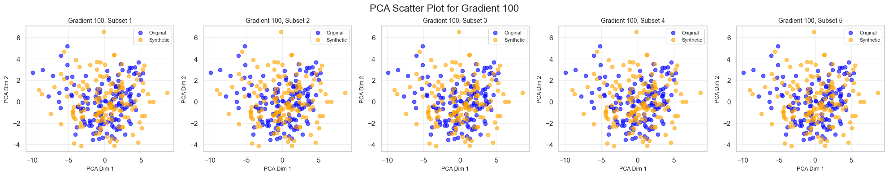
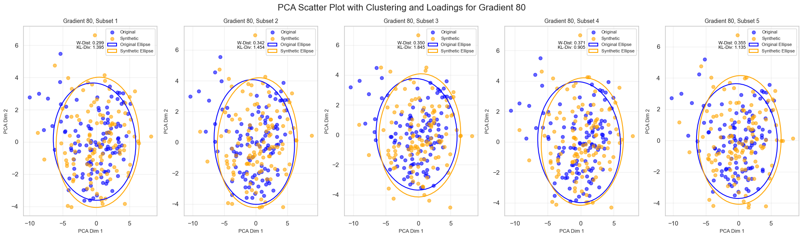

### **本工作思路图**

![杉木力学模型.drawio.png](data:image/png;base64,iVBORw0KGgoAAAANSUhEUgAAAzwAAASJCAYAAAAdVhmmAAAAAXNSR0IArs4c6QAAro90RVh0bXhmaWxlACUzQ214ZmlsZSUyMGhvc3QlM0QlMjJFbGVjdHJvbiUyMiUyMG1vZGlmaWVkJTNEJTIyMjAyNC0xMS0xMlQwNyUzQTIzJTNBMTQuMjU5WiUyMiUyMGFnZW50JTNEJTIyTW96aWxsYSUyRjUuMCUyMChXaW5kb3dzJTIwTlQlMjAxMC4wJTNCJTIwV2luNjQlM0IlMjB4NjQpJTIwQXBwbGVXZWJLaXQlMkY1MzcuMzYlMjAoS0hUTUwlMkMlMjBsaWtlJTIwR2Vja28pJTIwZHJhdy5pbyUyRjIzLjEuNSUyMENocm9tZSUyRjEyMC4wLjYwOTkuMTA5JTIwRWxlY3Ryb24lMkYyOC4xLjAlMjBTYWZhcmklMkY1MzcuMzYlMjIlMjBldGFnJTNEJTIyVGxFUTVOX2o5dlpXMEU2OVlkN1UlMjIlMjB2ZXJzaW9uJTNEJTIyMjMuMS41JTIyJTIwdHlwZSUzRCUyMmRldmljZSUyMiUyMHNjYWxlJTNEJTIyMSUyMiUyMGJvcmRlciUzRCUyMjAlMjIlM0UlMEElMjAlMjAlM0NkaWFncmFtJTIwbmFtZSUzRCUyMiVFNyVBQyVBQyUyMDElMjAlRTklQTElQjUlMjIlMjBpZCUzRCUyMmpFZGJfLVU3eDBCYmVTenJJVWdCJTIyJTNFJTBBJTIwJTIwJTIwJTIwJTNDbXhHcmFwaE1vZGVsJTIwZHglM0QlMjIxOTA3JTIyJTIwZHklM0QlMjIxODE0JTIyJTIwZ3JpZCUzRCUyMjElMjIlMjBncmlkU2l6ZSUzRCUyMjEwJTIyJTIwZ3VpZGVzJTNEJTIyMSUyMiUyMHRvb2x0aXBzJTNEJTIyMSUyMiUyMGNvbm5lY3QlM0QlMjIxJTIyJTIwYXJyb3dzJTNEJTIyMSUyMiUyMGZvbGQlM0QlMjIxJTIyJTIwcGFnZSUzRCUyMjElMjIlMjBwYWdlU2NhbGUlM0QlMjIxJTIyJTIwcGFnZVdpZHRoJTNEJTIyODI3JTIyJTIwcGFnZUhlaWdodCUzRCUyMjExNjklMjIlMjBtYXRoJTNEJTIyMCUyMiUyMHNoYWRvdyUzRCUyMjAlMjIlM0UlMEElMjAlMjAlMjAlMjAlMjAlMjAlM0Nyb290JTNFJTBBJTIwJTIwJTIwJTIwJTIwJTIwJTIwJTIwJTNDbXhDZWxsJTIwaWQlM0QlMjIwJTIyJTIwJTJGJTNFJTBBJTIwJTIwJTIwJTIwJTIwJTIwJTIwJTIwJTNDbXhDZWxsJTIwaWQlM0QlMjIxJTIyJTIwcGFyZW50JTNEJTIyMCUyMiUyMCUyRiUzRSUwQSUyMCUyMCUyMCUyMCUyMCUyMCUyMCUyMCUzQ214Q2VsbCUyMGlkJTNEJTIySFJ4M2p5bWFZOFBFdHBFVXdQUm8tODYlMjIlMjB2YWx1ZSUzRCUyMiUyMiUyMHN0eWxlJTNEJTIyd2hpdGVTcGFjZSUzRHdyYXAlM0JodG1sJTNEMSUzQiUyMiUyMHBhcmVudCUzRCUyMjElMjIlMjB2ZXJ0ZXglM0QlMjIxJTIyJTNFJTBBJTIwJTIwJTIwJTIwJTIwJTIwJTIwJTIwJTIwJTIwJTNDbXhHZW9tZXRyeSUyMHglM0QlMjItODI3JTIyJTIweSUzRCUyMi0xMTYwJTIyJTIwd2lkdGglM0QlMjI4MjclMjIlMjBoZWlnaHQlM0QlMjIxMTYwJTIyJTIwYXMlM0QlMjJnZW9tZXRyeSUyMiUyMCUyRiUzRSUwQSUyMCUyMCUyMCUyMCUyMCUyMCUyMCUyMCUzQyUyRm14Q2VsbCUzRSUwQSUyMCUyMCUyMCUyMCUyMCUyMCUyMCUyMCUzQ214Q2VsbCUyMGlkJTNEJTIySFJ4M2p5bWFZOFBFdHBFVXdQUm8tMSUyMiUyMHZhbHVlJTNEJTIyJTIyJTIwc3R5bGUlM0QlMjJ3aGl0ZVNwYWNlJTNEd3JhcCUzQmh0bWwlM0QxJTNCJTIyJTIwcGFyZW50JTNEJTIyMSUyMiUyMHZlcnRleCUzRCUyMjElMjIlM0UlMEElMjAlMjAlMjAlMjAlMjAlMjAlMjAlMjAlMjAlMjAlM0NteEdlb21ldHJ5JTIweCUzRCUyMi03OTIlMjIlMjB5JTNEJTIyLTExMTUlMjIlMjB3aWR0aCUzRCUyMjc2MCUyMiUyMGhlaWdodCUzRCUyMjMwMCUyMiUyMGFzJTNEJTIyZ2VvbWV0cnklMjIlMjAlMkYlM0UlMEElMjAlMjAlMjAlMjAlMjAlMjAlMjAlMjAlM0MlMkZteENlbGwlM0UlMEElMjAlMjAlMjAlMjAlMjAlMjAlMjAlMjAlM0NteENlbGwlMjBpZCUzRCUyMkhSeDNqeW1hWThQRXRwRVV3UFJvLTIlMjIlMjB2YWx1ZSUzRCUyMiUyMiUyMHN0eWxlJTNEJTIyd2hpdGVTcGFjZSUzRHdyYXAlM0JodG1sJTNEMSUzQiUyMiUyMHBhcmVudCUzRCUyMjElMjIlMjB2ZXJ0ZXglM0QlMjIxJTIyJTNFJTBBJTIwJTIwJTIwJTIwJTIwJTIwJTIwJTIwJTIwJTIwJTNDbXhHZW9tZXRyeSUyMHglM0QlMjItNzk1JTIyJTIweSUzRCUyMi03NzUlMjIlMjB3aWR0aCUzRCUyMjc2MCUyMiUyMGhlaWdodCUzRCUyMjIzMCUyMiUyMGFzJTNEJTIyZ2VvbWV0cnklMjIlMjAlMkYlM0UlMEElMjAlMjAlMjAlMjAlMjAlMjAlMjAlMjAlM0MlMkZteENlbGwlM0UlMEElMjAlMjAlMjAlMjAlMjAlMjAlMjAlMjAlM0NteENlbGwlMjBpZCUzRCUyMkhSeDNqeW1hWThQRXRwRVV3UFJvLTgwJTIyJTIwc3R5bGUlM0QlMjJlZGdlU3R5bGUlM0RvcnRob2dvbmFsRWRnZVN0eWxlJTNCcm91bmRlZCUzRDAlM0JvcnRob2dvbmFsTG9vcCUzRDElM0JqZXR0eVNpemUlM0RhdXRvJTNCaHRtbCUzRDElM0JleGl0WCUzRDElM0JleGl0WSUzRDAuNSUzQmV4aXREeCUzRDAlM0JleGl0RHklM0QwJTNCZW50cnlYJTNEMCUzQmVudHJ5WSUzRDAuNSUzQmVudHJ5RHglM0QwJTNCZW50cnlEeSUzRDAlM0IlMjIlMjBwYXJlbnQlM0QlMjIxJTIyJTIwc291cmNlJTNEJTIySFJ4M2p5bWFZOFBFdHBFVXdQUm8tMzQlMjIlMjB0YXJnZXQlM0QlMjJIUngzanltYVk4UEV0cEVVd1BSby02MCUyMiUyMGVkZ2UlM0QlMjIxJTIyJTNFJTBBJTIwJTIwJTIwJTIwJTIwJTIwJTIwJTIwJTIwJTIwJTNDbXhHZW9tZXRyeSUyMHJlbGF0aXZlJTNEJTIyMSUyMiUyMGFzJTNEJTIyZ2VvbWV0cnklMjIlMjAlMkYlM0UlMEElMjAlMjAlMjAlMjAlMjAlMjAlMjAlMjAlM0MlMkZteENlbGwlM0UlMEElMjAlMjAlMjAlMjAlMjAlMjAlMjAlMjAlM0NteENlbGwlMjBpZCUzRCUyMkhSeDNqeW1hWThQRXRwRVV3UFJvLTM0JTIyJTIwdmFsdWUlM0QlMjIlMjIlMjBzdHlsZSUzRCUyMnJvdW5kZWQlM0QwJTNCd2hpdGVTcGFjZSUzRHdyYXAlM0JodG1sJTNEMSUzQiUyMiUyMHBhcmVudCUzRCUyMjElMjIlMjB2ZXJ0ZXglM0QlMjIxJTIyJTNFJTBBJTIwJTIwJTIwJTIwJTIwJTIwJTIwJTIwJTIwJTIwJTNDbXhHZW9tZXRyeSUyMHglM0QlMjItNzYwJTIyJTIweSUzRCUyMi0xMTA1JTIyJTIwd2lkdGglM0QlMjIzMTAlMjIlMjBoZWlnaHQlM0QlMjIyODAlMjIlMjBhcyUzRCUyMmdlb21ldHJ5JTIyJTIwJTJGJTNFJTBBJTIwJTIwJTIwJTIwJTIwJTIwJTIwJTIwJTNDJTJGbXhDZWxsJTNFJTBBJTIwJTIwJTIwJTIwJTIwJTIwJTIwJTIwJTNDbXhDZWxsJTIwaWQlM0QlMjJIUngzanltYVk4UEV0cEVVd1BSby03JTIyJTIwc3R5bGUlM0QlMjJlZGdlU3R5bGUlM0RvcnRob2dvbmFsRWRnZVN0eWxlJTNCcm91bmRlZCUzRDAlM0JvcnRob2dvbmFsTG9vcCUzRDElM0JqZXR0eVNpemUlM0RhdXRvJTNCaHRtbCUzRDElM0JleGl0WCUzRDElM0JleGl0WSUzRDAuNSUzQmV4aXREeCUzRDAlM0JleGl0RHklM0QwJTNCZW50cnlYJTNEMCUzQmVudHJ5WSUzRDAuNSUzQmVudHJ5RHglM0QwJTNCZW50cnlEeSUzRDAlM0IlMjIlMjBwYXJlbnQlM0QlMjIxJTIyJTIwc291cmNlJTNEJTIySFJ4M2p5bWFZOFBFdHBFVXdQUm8tNCUyMiUyMHRhcmdldCUzRCUyMkhSeDNqeW1hWThQRXRwRVV3UFJvLTUlMjIlMjBlZGdlJTNEJTIyMSUyMiUzRSUwQSUyMCUyMCUyMCUyMCUyMCUyMCUyMCUyMCUyMCUyMCUzQ214R2VvbWV0cnklMjByZWxhdGl2ZSUzRCUyMjElMjIlMjBhcyUzRCUyMmdlb21ldHJ5JTIyJTNFJTBBJTIwJTIwJTIwJTIwJTIwJTIwJTIwJTIwJTIwJTIwJTIwJTIwJTNDQXJyYXklMjBhcyUzRCUyMnBvaW50cyUyMiUzRSUwQSUyMCUyMCUyMCUyMCUyMCUyMCUyMCUyMCUyMCUyMCUyMCUyMCUyMCUyMCUzQ214UG9pbnQlMjB4JTNEJTIyLTYwMCUyMiUyMHklM0QlMjItOTc1JTIyJTIwJTJGJTNFJTBBJTIwJTIwJTIwJTIwJTIwJTIwJTIwJTIwJTIwJTIwJTIwJTIwJTIwJTIwJTNDbXhQb2ludCUyMHglM0QlMjItNjAwJTIyJTIweSUzRCUyMi0xMDc1JTIyJTIwJTJGJTNFJTBBJTIwJTIwJTIwJTIwJTIwJTIwJTIwJTIwJTIwJTIwJTIwJTIwJTNDJTJGQXJyYXklM0UlMEElMjAlMjAlMjAlMjAlMjAlMjAlMjAlMjAlMjAlMjAlM0MlMkZteEdlb21ldHJ5JTNFJTBBJTIwJTIwJTIwJTIwJTIwJTIwJTIwJTIwJTNDJTJGbXhDZWxsJTNFJTBBJTIwJTIwJTIwJTIwJTIwJTIwJTIwJTIwJTNDbXhDZWxsJTIwaWQlM0QlMjJIUngzanltYVk4UEV0cEVVd1BSby05JTIyJTIwc3R5bGUlM0QlMjJlZGdlU3R5bGUlM0RvcnRob2dvbmFsRWRnZVN0eWxlJTNCcm91bmRlZCUzRDAlM0JvcnRob2dvbmFsTG9vcCUzRDElM0JqZXR0eVNpemUlM0RhdXRvJTNCaHRtbCUzRDElM0JleGl0WCUzRDElM0JleGl0WSUzRDAuNSUzQmV4aXREeCUzRDAlM0JleGl0RHklM0QwJTNCZW50cnlYJTNEMCUzQmVudHJ5WSUzRDAuNSUzQmVudHJ5RHglM0QwJTNCZW50cnlEeSUzRDAlM0IlMjIlMjBwYXJlbnQlM0QlMjIxJTIyJTIwc291cmNlJTNEJTIySFJ4M2p5bWFZOFBFdHBFVXdQUm8tNCUyMiUyMHRhcmdldCUzRCUyMkhSeDNqeW1hWThQRXRwRVV3UFJvLTYlMjIlMjBlZGdlJTNEJTIyMSUyMiUzRSUwQSUyMCUyMCUyMCUyMCUyMCUyMCUyMCUyMCUyMCUyMCUzQ214R2VvbWV0cnklMjByZWxhdGl2ZSUzRCUyMjElMjIlMjBhcyUzRCUyMmdlb21ldHJ5JTIyJTNFJTBBJTIwJTIwJTIwJTIwJTIwJTIwJTIwJTIwJTIwJTIwJTIwJTIwJTNDQXJyYXklMjBhcyUzRCUyMnBvaW50cyUyMiUzRSUwQSUyMCUyMCUyMCUyMCUyMCUyMCUyMCUyMCUyMCUyMCUyMCUyMCUyMCUyMCUzQ214UG9pbnQlMjB4JTNEJTIyLTYwMCUyMiUyMHklM0QlMjItOTc1JTIyJTIwJTJGJTNFJTBBJTIwJTIwJTIwJTIwJTIwJTIwJTIwJTIwJTIwJTIwJTIwJTIwJTIwJTIwJTNDbXhQb2ludCUyMHglM0QlMjItNjAwJTIyJTIweSUzRCUyMi04NzUlMjIlMjAlMkYlM0UlMEElMjAlMjAlMjAlMjAlMjAlMjAlMjAlMjAlMjAlMjAlMjAlMjAlM0MlMkZBcnJheSUzRSUwQSUyMCUyMCUyMCUyMCUyMCUyMCUyMCUyMCUyMCUyMCUzQyUyRm14R2VvbWV0cnklM0UlMEElMjAlMjAlMjAlMjAlMjAlMjAlMjAlMjAlM0MlMkZteENlbGwlM0UlMEElMjAlMjAlMjAlMjAlMjAlMjAlMjAlMjAlM0NteENlbGwlMjBpZCUzRCUyMkhSeDNqeW1hWThQRXRwRVV3UFJvLTQlMjIlMjB2YWx1ZSUzRCUyMiVFOCVBNyVBMyVFNSU4OSU5NiVFNyU4OSVCOSVFNiU4MCVBNyUyMiUyMHN0eWxlJTNEJTIycm91bmRlZCUzRDAlM0J3aGl0ZVNwYWNlJTNEd3JhcCUzQmh0bWwlM0QxJTNCJTIyJTIwcGFyZW50JTNEJTIyMSUyMiUyMHZlcnRleCUzRCUyMjElMjIlM0UlMEElMjAlMjAlMjAlMjAlMjAlMjAlMjAlMjAlMjAlMjAlM0NteEdlb21ldHJ5JTIweCUzRCUyMi03NDAlMjIlMjB5JTNEJTIyLTk5MCUyMiUyMHdpZHRoJTNEJTIyMTEwJTIyJTIwaGVpZ2h0JTNEJTIyMzAlMjIlMjBhcyUzRCUyMmdlb21ldHJ5JTIyJTIwJTJGJTNFJTBBJTIwJTIwJTIwJTIwJTIwJTIwJTIwJTIwJTNDJTJGbXhDZWxsJTNFJTBBJTIwJTIwJTIwJTIwJTIwJTIwJTIwJTIwJTNDbXhDZWxsJTIwaWQlM0QlMjJIUngzanltYVk4UEV0cEVVd1BSby0xMCUyMiUyMHN0eWxlJTNEJTIyZWRnZVN0eWxlJTNEb3J0aG9nb25hbEVkZ2VTdHlsZSUzQnJvdW5kZWQlM0QwJTNCb3J0aG9nb25hbExvb3AlM0QxJTNCamV0dHlTaXplJTNEYXV0byUzQmh0bWwlM0QxJTNCZXhpdFglM0QwLjUlM0JleGl0WSUzRDElM0JleGl0RHglM0QwJTNCZXhpdER5JTNEMCUzQmVudHJ5WCUzRDAuNSUzQmVudHJ5WSUzRDAlM0JlbnRyeUR4JTNEMCUzQmVudHJ5RHklM0QwJTNCJTIyJTIwcGFyZW50JTNEJTIyMSUyMiUyMHNvdXJjZSUzRCUyMkhSeDNqeW1hWThQRXRwRVV3UFJvLTUlMjIlMjB0YXJnZXQlM0QlMjJIUngzanltYVk4UEV0cEVVd1BSby02JTIyJTIwZWRnZSUzRCUyMjElMjIlM0UlMEElMjAlMjAlMjAlMjAlMjAlMjAlMjAlMjAlMjAlMjAlM0NteEdlb21ldHJ5JTIwcmVsYXRpdmUlM0QlMjIxJTIyJTIwYXMlM0QlMjJnZW9tZXRyeSUyMiUyMCUyRiUzRSUwQSUyMCUyMCUyMCUyMCUyMCUyMCUyMCUyMCUzQyUyRm14Q2VsbCUzRSUwQSUyMCUyMCUyMCUyMCUyMCUyMCUyMCUyMCUzQ214Q2VsbCUyMGlkJTNEJTIySFJ4M2p5bWFZOFBFdHBFVXdQUm8tNSUyMiUyMHZhbHVlJTNEJTIyJUU3JTg5JUE5JUU3JTkwJTg2JUU3JTg5JUI5JUU2JTgwJUE3JTIyJTIwc3R5bGUlM0QlMjJyb3VuZGVkJTNEMCUzQndoaXRlU3BhY2UlM0R3cmFwJTNCaHRtbCUzRDElM0IlMjIlMjBwYXJlbnQlM0QlMjIxJTIyJTIwdmVydGV4JTNEJTIyMSUyMiUzRSUwQSUyMCUyMCUyMCUyMCUyMCUyMCUyMCUyMCUyMCUyMCUzQ214R2VvbWV0cnklMjB4JTNEJTIyLTU2OSUyMiUyMHklM0QlMjItMTA5MCUyMiUyMHdpZHRoJTNEJTIyMTEwJTIyJTIwaGVpZ2h0JTNEJTIyMzAlMjIlMjBhcyUzRCUyMmdlb21ldHJ5JTIyJTIwJTJGJTNFJTBBJTIwJTIwJTIwJTIwJTIwJTIwJTIwJTIwJTNDJTJGbXhDZWxsJTNFJTBBJTIwJTIwJTIwJTIwJTIwJTIwJTIwJTIwJTNDbXhDZWxsJTIwaWQlM0QlMjJIUngzanltYVk4UEV0cEVVd1BSby02JTIyJTIwdmFsdWUlM0QlMjIlRTUlOEElOUIlRTUlQUQlQTYlRTclODklQjklRTYlODAlQTclMjIlMjBzdHlsZSUzRCUyMnJvdW5kZWQlM0QwJTNCd2hpdGVTcGFjZSUzRHdyYXAlM0JodG1sJTNEMSUzQiUyMiUyMHBhcmVudCUzRCUyMjElMjIlMjB2ZXJ0ZXglM0QlMjIxJTIyJTNFJTBBJTIwJTIwJTIwJTIwJTIwJTIwJTIwJTIwJTIwJTIwJTNDbXhHZW9tZXRyeSUyMHglM0QlMjItNTcwJTIyJTIweSUzRCUyMi04OTAlMjIlMjB3aWR0aCUzRCUyMjExMCUyMiUyMGhlaWdodCUzRCUyMjMwJTIyJTIwYXMlM0QlMjJnZW9tZXRyeSUyMiUyMCUyRiUzRSUwQSUyMCUyMCUyMCUyMCUyMCUyMCUyMCUyMCUzQyUyRm14Q2VsbCUzRSUwQSUyMCUyMCUyMCUyMCUyMCUyMCUyMCUyMCUzQ214Q2VsbCUyMGlkJTNEJTIySFJ4M2p5bWFZOFBFdHBFVXdQUm8tMTElMjIlMjB2YWx1ZSUzRCUyMiVFOCVBNyVBMyVFNSU4OSU5NiVFNyU4OSVCOSVFNiU4MCVBNyVFNCVCQiU4RSVFNSVCRSVBRSVFOCVBNyU4MiVFNyVCQiU5MyVFNiU5RSU4NCVFNCVCOCU4QSVFNSVCRCVCMSVFNSU5MyU4RCVFNiU5QyVBOCVFNiU5RCU5MCVFNyU5QSU4NCVFNyU4OSVBOSVFNyU5MCU4NiVFNSU5MiU4QyVFNSU4QSU5QiVFNSVBRCVBNiVFOCVBMSVBOCVFNyU4RSVCMCUyMiUyMHN0eWxlJTNEJTIydGV4dCUzQnN0cm9rZUNvbG9yJTNEbm9uZSUzQmZpbGxDb2xvciUzRG5vbmUlM0JhbGlnbiUzRGxlZnQlM0J2ZXJ0aWNhbEFsaWduJTNEbWlkZGxlJTNCc3BhY2luZ0xlZnQlM0Q0JTNCc3BhY2luZ1JpZ2h0JTNENCUzQm92ZXJmbG93JTNEaGlkZGVuJTNCcG9pbnRzJTNEJTVCJTVCMCUyQzAuNSU1RCUyQyU1QjElMkMwLjUlNUQlNUQlM0Jwb3J0Q29uc3RyYWludCUzRGVhc3R3ZXN0JTNCcm90YXRhYmxlJTNEMCUzQndoaXRlU3BhY2UlM0R3cmFwJTNCaHRtbCUzRDElM0IlMjIlMjBwYXJlbnQlM0QlMjIxJTIyJTIwdmVydGV4JTNEJTIyMSUyMiUzRSUwQSUyMCUyMCUyMCUyMCUyMCUyMCUyMCUyMCUyMCUyMCUzQ214R2VvbWV0cnklMjB4JTNEJTIyLTc2MCUyMiUyMHklM0QlMjItMTAyNSUyMiUyMHdpZHRoJTNEJTIyMTUwJTIyJTIwaGVpZ2h0JTNEJTIyMzAlMjIlMjBhcyUzRCUyMmdlb21ldHJ5JTIyJTIwJTJGJTNFJTBBJTIwJTIwJTIwJTIwJTIwJTIwJTIwJTIwJTNDJTJGbXhDZWxsJTNFJTBBJTIwJTIwJTIwJTIwJTIwJTIwJTIwJTIwJTNDbXhDZWxsJTIwaWQlM0QlMjJIUngzanltYVk4UEV0cEVVd1BSby0xMiUyMiUyMHZhbHVlJTNEJTIyJUU3JTg5JUE5JUU3JTkwJTg2JUU3JTg5JUI5JUU2JTgwJUE3JUU1JUE2JTgyJUU1JUFGJTg2JUU1JUJBJUE2JUU1JTkyJThDJUU2JTk0JUI2JUU3JUJDJUE5JUU3JThFJTg3JUU0JUI4JThFJUU2JTlDJUE4JUU2JTlEJTkwJUU3JTlBJTg0JUU1JThBJTlCJUU1JUFEJUE2JUU2JTgwJUE3JUU4JTgzJUJEJUU3JTlCJUI0JUU2JThFJUE1JUU3JTlCJUI4JUU1JTg1JUIzJUVGJUJDJTlCJTIyJTIwc3R5bGUlM0QlMjJ0ZXh0JTNCc3Ryb2tlQ29sb3IlM0Rub25lJTNCZmlsbENvbG9yJTNEbm9uZSUzQmFsaWduJTNEbGVmdCUzQnZlcnRpY2FsQWxpZ24lM0RtaWRkbGUlM0JzcGFjaW5nTGVmdCUzRDQlM0JzcGFjaW5nUmlnaHQlM0Q0JTNCb3ZlcmZsb3clM0RoaWRkZW4lM0Jwb2ludHMlM0QlNUIlNUIwJTJDMC41JTVEJTJDJTVCMSUyQzAuNSU1RCU1RCUzQnBvcnRDb25zdHJhaW50JTNEZWFzdHdlc3QlM0Jyb3RhdGFibGUlM0QwJTNCd2hpdGVTcGFjZSUzRHdyYXAlM0JodG1sJTNEMSUzQiUyMiUyMHBhcmVudCUzRCUyMjElMjIlMjB2ZXJ0ZXglM0QlMjIxJTIyJTNFJTBBJTIwJTIwJTIwJTIwJTIwJTIwJTIwJTIwJTIwJTIwJTNDbXhHZW9tZXRyeSUyMHglM0QlMjItNTYwJTIyJTIweSUzRCUyMi0xMDE1JTIyJTIwd2lkdGglM0QlMjI5MCUyMiUyMGhlaWdodCUzRCUyMjgwJTIyJTIwYXMlM0QlMjJnZW9tZXRyeSUyMiUyMCUyRiUzRSUwQSUyMCUyMCUyMCUyMCUyMCUyMCUyMCUyMCUzQyUyRm14Q2VsbCUzRSUwQSUyMCUyMCUyMCUyMCUyMCUyMCUyMCUyMCUzQ214Q2VsbCUyMGlkJTNEJTIySFJ4M2p5bWFZOFBFdHBFVXdQUm8tMTMlMjIlMjB2YWx1ZSUzRCUyMiVFNSU4QSU5QiVFNSVBRCVBNiVFNyU4OSVCOSVFNiU4MCVBNyVFNSU4RiU4RCVFNiU5OCVBMCVFNCVCQSU4NiVFNiU5QyVBOCVFNiU5RCU5MCVFNSU5QyVBOCVFNSVBNCU5NiVFNSU4QSU5QiVFNCVCRCU5QyVFNyU5NCVBOCVFNCVCOCU4QiVFNyU5QSU4NCVFOCVBMSVBOCVFNyU4RSVCMCVFRiVCQyU4QyVFNSU4RiU5NyVFNSU4OCVCMCVFNSVCRSVBRSVFOCVBNyU4MiVFOCVBNyVBMyVFNSU4OSU5NiVFNyVCQiU5MyVFNiU5RSU4NCVFNSU5MiU4QyVFNSVBRSU4RiVFOCVBNyU4MiVFNyU4OSVBOSVFNyU5MCU4NiVFNiU4MCVBNyVFOCVCNCVBOCVFNyU5QSU4NCVFNyVCQiVCQyVFNSU5MCU4OCVFNSVCRCVCMSVFNSU5MyU4RCVFMyU4MCU4MiUyMiUyMHN0eWxlJTNEJTIydGV4dCUzQnN0cm9rZUNvbG9yJTNEbm9uZSUzQmZpbGxDb2xvciUzRG5vbmUlM0JhbGlnbiUzRGxlZnQlM0J2ZXJ0aWNhbEFsaWduJTNEbWlkZGxlJTNCc3BhY2luZ0xlZnQlM0Q0JTNCc3BhY2luZ1JpZ2h0JTNENCUzQm92ZXJmbG93JTNEaGlkZGVuJTNCcG9pbnRzJTNEJTVCJTVCMCUyQzAuNSU1RCUyQyU1QjElMkMwLjUlNUQlNUQlM0Jwb3J0Q29uc3RyYWludCUzRGVhc3R3ZXN0JTNCcm90YXRhYmxlJTNEMCUzQndoaXRlU3BhY2UlM0R3cmFwJTNCaHRtbCUzRDElM0IlMjIlMjBwYXJlbnQlM0QlMjIxJTIyJTIwdmVydGV4JTNEJTIyMSUyMiUzRSUwQSUyMCUyMCUyMCUyMCUyMCUyMCUyMCUyMCUyMCUyMCUzQ214R2VvbWV0cnklMjB4JTNEJTIyLTcxOSUyMiUyMHklM0QlMjItODYwJTIyJTIwd2lkdGglM0QlMjIyNjAlMjIlMjBoZWlnaHQlM0QlMjIzMCUyMiUyMGFzJTNEJTIyZ2VvbWV0cnklMjIlMjAlMkYlM0UlMEElMjAlMjAlMjAlMjAlMjAlMjAlMjAlMjAlM0MlMkZteENlbGwlM0UlMEElMjAlMjAlMjAlMjAlMjAlMjAlMjAlMjAlM0NteENlbGwlMjBpZCUzRCUyMkhSeDNqeW1hWThQRXRwRVV3UFJvLTQyJTIyJTIwdmFsdWUlM0QlMjIlMjIlMjBzdHlsZSUzRCUyMnJvdW5kZWQlM0QwJTNCd2hpdGVTcGFjZSUzRHdyYXAlM0JodG1sJTNEMSUzQiUyMiUyMHBhcmVudCUzRCUyMjElMjIlMjB2ZXJ0ZXglM0QlMjIxJTIyJTNFJTBBJTIwJTIwJTIwJTIwJTIwJTIwJTIwJTIwJTIwJTIwJTNDbXhHZW9tZXRyeSUyMHglM0QlMjItMzYyJTIyJTIweSUzRCUyMi03NjcuNSUyMiUyMHdpZHRoJTNEJTIyMzEwJTIyJTIwaGVpZ2h0JTNEJTIyMjEwJTIyJTIwYXMlM0QlMjJnZW9tZXRyeSUyMiUyMCUyRiUzRSUwQSUyMCUyMCUyMCUyMCUyMCUyMCUyMCUyMCUzQyUyRm14Q2VsbCUzRSUwQSUyMCUyMCUyMCUyMCUyMCUyMCUyMCUyMCUzQ214Q2VsbCUyMGlkJTNEJTIySFJ4M2p5bWFZOFBFdHBFVXdQUm8tNDMlMjIlMjB2YWx1ZSUzRCUyMiVFNyVBMCU5NCVFNyVBOSVCNiVFNiU4NCU4RiVFNCVCOSU4OSUyMiUyMHN0eWxlJTNEJTIydGV4dCUzQnN0cm9rZUNvbG9yJTNEbm9uZSUzQmZpbGxDb2xvciUzRG5vbmUlM0JhbGlnbiUzRGxlZnQlM0J2ZXJ0aWNhbEFsaWduJTNEbWlkZGxlJTNCc3BhY2luZ0xlZnQlM0Q0JTNCc3BhY2luZ1JpZ2h0JTNENCUzQm92ZXJmbG93JTNEaGlkZGVuJTNCcG9pbnRzJTNEJTVCJTVCMCUyQzAuNSU1RCUyQyU1QjElMkMwLjUlNUQlNUQlM0Jwb3J0Q29uc3RyYWludCUzRGVhc3R3ZXN0JTNCcm90YXRhYmxlJTNEMCUzQndoaXRlU3BhY2UlM0R3cmFwJTNCaHRtbCUzRDElM0IlMjIlMjBwYXJlbnQlM0QlMjIxJTIyJTIwdmVydGV4JTNEJTIyMSUyMiUzRSUwQSUyMCUyMCUyMCUyMCUyMCUyMCUyMCUyMCUyMCUyMCUzQ214R2VvbWV0cnklMjB4JTNEJTIyLTM2MiUyMiUyMHklM0QlMjItNzY3LjUlMjIlMjB3aWR0aCUzRCUyMjMwJTIyJTIwaGVpZ2h0JTNEJTIyMjE1JTIyJTIwYXMlM0QlMjJnZW9tZXRyeSUyMiUyMCUyRiUzRSUwQSUyMCUyMCUyMCUyMCUyMCUyMCUyMCUyMCUzQyUyRm14Q2VsbCUzRSUwQSUyMCUyMCUyMCUyMCUyMCUyMCUyMCUyMCUzQ214Q2VsbCUyMGlkJTNEJTIySFJ4M2p5bWFZOFBFdHBFVXdQUm8tNDQlMjIlMjB2YWx1ZSUzRCUyMiVFNiU4RiVBRCVFNyVBNCVCQSVFOCVBNyVBMyVFNSU4OSU5NiVFNiU5RSU4NCVFOSU4MCVBMCVFNCVCOCU4RSVFNyU4OSVBOSVFNyU5MCU4NiVFNSU4QSU5QiVFNSVBRCVBNiVFNyU4OSVCOSVFNiU4MCVBNyVFNCVCOSU4QiVFOSU5NyVCNCVFNyU5QSU4NCVFNSVBNCU4RCVFNiU5RCU4MiVFNSU4NSVCMyVFNyVCMyVCQiVFRiVCQyU4QyVFNiU4RiVBRCVFNyVBNCVCQSVFNSVCRCVCMSVFNSU5MyU4RCVFNiU5QyVBOCVFNiU5RCU5MCVFNyU4OSVBOSVFNyU5MCU4NiVFNSU5MiU4QyVFNSU4QSU5QiVFNSVBRCVBNiVFNyU4OSVCOSVFNiU4MCVBNyVFNyU5QSU4NCVFNSU4NSVCMyVFOSU5NCVBRSVFNSU5QiVBMCVFNyVCNCVBMCVFRiVCQyU4QyVFNiU4RSVBOCVFNSU4QSVBOCVFNiU5QyVBOCVFNiU5RCU5MCVFNyVBNyU5MSVFNSVBRCVBNiVFNyVBMCU5NCVFNyVBOSVCNiVFNCVCOCU4RSVFNSVCQSU5NCVFNyU5NCVBOCVFRiVCQyU4QyVFNiU4RiU5MCVFNCVCRSU5QiVFNiU5NCVCOSVFOCU4OSVBRiVFOCU4MiVCMiVFNyVBNyU4RCVFNCVCRSU5RCVFNiU4RCVBRSVFRiVCQyU4QyVFNiU4RiU5MCVFNCVCRSU5QiVFNSU4QSVBMCVFNSVCNyVBNSVFOSU4MCU4OSVFNiU5RCU5MCVFNCVCRSU5RCVFNiU4RCVBRSUyMiUyMHN0eWxlJTNEJTIycm91bmRlZCUzRDAlM0J3aGl0ZVNwYWNlJTNEd3JhcCUzQmh0bWwlM0QxJTNCJTIyJTIwcGFyZW50JTNEJTIyMSUyMiUyMHZlcnRleCUzRCUyMjElMjIlM0UlMEElMjAlMjAlMjAlMjAlMjAlMjAlMjAlMjAlMjAlMjAlM0NteEdlb21ldHJ5JTIweCUzRCUyMi0zMzUuNzUlMjIlMjB5JTNEJTIyLTc1MCUyMiUyMHdpZHRoJTNEJTIyMjc3LjUlMjIlMjBoZWlnaHQlM0QlMjI1NSUyMiUyMGFzJTNEJTIyZ2VvbWV0cnklMjIlMjAlMkYlM0UlMEElMjAlMjAlMjAlMjAlMjAlMjAlMjAlMjAlM0MlMkZteENlbGwlM0UlMEElMjAlMjAlMjAlMjAlMjAlMjAlMjAlMjAlM0NteENlbGwlMjBpZCUzRCUyMkhSeDNqeW1hWThQRXRwRVV3UFJvLTQ1JTIyJTIwdmFsdWUlM0QlMjIlMjIlMjBzdHlsZSUzRCUyMnJvdW5kZWQlM0QwJTNCd2hpdGVTcGFjZSUzRHdyYXAlM0JodG1sJTNEMSUzQiUyMiUyMHBhcmVudCUzRCUyMjElMjIlMjB2ZXJ0ZXglM0QlMjIxJTIyJTNFJTBBJTIwJTIwJTIwJTIwJTIwJTIwJTIwJTIwJTIwJTIwJTNDbXhHZW9tZXRyeSUyMHglM0QlMjItNzc0JTIyJTIweSUzRCUyMi03NTUlMjIlMjB3aWR0aCUzRCUyMjQwMCUyMiUyMGhlaWdodCUzRCUyMjE4NSUyMiUyMGFzJTNEJTIyZ2VvbWV0cnklMjIlMjAlMkYlM0UlMEElMjAlMjAlMjAlMjAlMjAlMjAlMjAlMjAlM0MlMkZteENlbGwlM0UlMEElMjAlMjAlMjAlMjAlMjAlMjAlMjAlMjAlM0NteENlbGwlMjBpZCUzRCUyMkhSeDNqeW1hWThQRXRwRVV3UFJvLTQ2JTIyJTIwc3R5bGUlM0QlMjJlZGdlU3R5bGUlM0RvcnRob2dvbmFsRWRnZVN0eWxlJTNCcm91bmRlZCUzRDAlM0JvcnRob2dvbmFsTG9vcCUzRDElM0JqZXR0eVNpemUlM0RhdXRvJTNCaHRtbCUzRDElM0JleGl0WCUzRDElM0JleGl0WSUzRDAuNSUzQmV4aXREeCUzRDAlM0JleGl0RHklM0QwJTNCZW50cnlYJTNEMCUzQmVudHJ5WSUzRDAuNSUzQmVudHJ5RHglM0QwJTNCZW50cnlEeSUzRDAlM0IlMjIlMjBwYXJlbnQlM0QlMjIxJTIyJTIwc291cmNlJTNEJTIySFJ4M2p5bWFZOFBFdHBFVXdQUm8tNDglMjIlMjB0YXJnZXQlM0QlMjJIUngzanltYVk4UEV0cEVVd1BSby00OSUyMiUyMGVkZ2UlM0QlMjIxJTIyJTNFJTBBJTIwJTIwJTIwJTIwJTIwJTIwJTIwJTIwJTIwJTIwJTNDbXhHZW9tZXRyeSUyMHJlbGF0aXZlJTNEJTIyMSUyMiUyMGFzJTNEJTIyZ2VvbWV0cnklMjIlMjAlMkYlM0UlMEElMjAlMjAlMjAlMjAlMjAlMjAlMjAlMjAlM0MlMkZteENlbGwlM0UlMEElMjAlMjAlMjAlMjAlMjAlMjAlMjAlMjAlM0NteENlbGwlMjBpZCUzRCUyMkhSeDNqeW1hWThQRXRwRVV3UFJvLTQ3JTIyJTIwdmFsdWUlM0QlMjIlMjIlMjBzdHlsZSUzRCUyMmVkZ2VTdHlsZSUzRG9ydGhvZ29uYWxFZGdlU3R5bGUlM0Jyb3VuZGVkJTNEMCUzQm9ydGhvZ29uYWxMb29wJTNEMSUzQmpldHR5U2l6ZSUzRGF1dG8lM0JodG1sJTNEMSUzQiUyMiUyMHBhcmVudCUzRCUyMjElMjIlMjBzb3VyY2UlM0QlMjJIUngzanltYVk4UEV0cEVVd1BSby00OCUyMiUyMHRhcmdldCUzRCUyMkhSeDNqeW1hWThQRXRwRVV3UFJvLTUwJTIyJTIwZWRnZSUzRCUyMjElMjIlM0UlMEElMjAlMjAlMjAlMjAlMjAlMjAlMjAlMjAlMjAlMjAlM0NteEdlb21ldHJ5JTIwcmVsYXRpdmUlM0QlMjIxJTIyJTIwYXMlM0QlMjJnZW9tZXRyeSUyMiUyMCUyRiUzRSUwQSUyMCUyMCUyMCUyMCUyMCUyMCUyMCUyMCUzQyUyRm14Q2VsbCUzRSUwQSUyMCUyMCUyMCUyMCUyMCUyMCUyMCUyMCUzQ214Q2VsbCUyMGlkJTNEJTIySFJ4M2p5bWFZOFBFdHBFVXdQUm8tNDglMjIlMjB2YWx1ZSUzRCUyMiVFOCVBNyVBMyVFNSU4OSU5NiVFNyU4OSVCOSVFNiU4MCVBNyUyMiUyMHN0eWxlJTNEJTIycm91bmRlZCUzRDAlM0J3aGl0ZVNwYWNlJTNEd3JhcCUzQmh0bWwlM0QxJTNCJTIyJTIwcGFyZW50JTNEJTIyMSUyMiUyMHZlcnRleCUzRCUyMjElMjIlM0UlMEElMjAlMjAlMjAlMjAlMjAlMjAlMjAlMjAlMjAlMjAlM0NteEdlb21ldHJ5JTIweCUzRCUyMi03NjEuNSUyMiUyMHklM0QlMjItNzMwJTIyJTIwd2lkdGglM0QlMjIxMTAlMjIlMjBoZWlnaHQlM0QlMjIzMCUyMiUyMGFzJTNEJTIyZ2VvbWV0cnklMjIlMjAlMkYlM0UlMEElMjAlMjAlMjAlMjAlMjAlMjAlMjAlMjAlM0MlMkZteENlbGwlM0UlMEElMjAlMjAlMjAlMjAlMjAlMjAlMjAlMjAlM0NteENlbGwlMjBpZCUzRCUyMkhSeDNqeW1hWThQRXRwRVV3UFJvLTg5JTIyJTIwc3R5bGUlM0QlMjJlZGdlU3R5bGUlM0RvcnRob2dvbmFsRWRnZVN0eWxlJTNCcm91bmRlZCUzRDAlM0JvcnRob2dvbmFsTG9vcCUzRDElM0JqZXR0eVNpemUlM0RhdXRvJTNCaHRtbCUzRDElM0JleGl0WCUzRDElM0JleGl0WSUzRDAuNSUzQmV4aXREeCUzRDAlM0JleGl0RHklM0QwJTNCZW50cnlYJTNEMCUzQmVudHJ5WSUzRDAuNSUzQmVudHJ5RHglM0QwJTNCZW50cnlEeSUzRDAlM0JzdGFydEFycm93JTNEY2xhc3NpYyUzQnN0YXJ0RmlsbCUzRDElM0IlMjIlMjBwYXJlbnQlM0QlMjIxJTIyJTIwc291cmNlJTNEJTIySFJ4M2p5bWFZOFBFdHBFVXdQUm8tNDklMjIlMjB0YXJnZXQlM0QlMjJIUngzanltYVk4UEV0cEVVd1BSby04NyUyMiUyMGVkZ2UlM0QlMjIxJTIyJTNFJTBBJTIwJTIwJTIwJTIwJTIwJTIwJTIwJTIwJTIwJTIwJTNDbXhHZW9tZXRyeSUyMHJlbGF0aXZlJTNEJTIyMSUyMiUyMGFzJTNEJTIyZ2VvbWV0cnklMjIlMjAlMkYlM0UlMEElMjAlMjAlMjAlMjAlMjAlMjAlMjAlMjAlM0MlMkZteENlbGwlM0UlMEElMjAlMjAlMjAlMjAlMjAlMjAlMjAlMjAlM0NteENlbGwlMjBpZCUzRCUyMkhSeDNqeW1hWThQRXRwRVV3UFJvLTQ5JTIyJTIwdmFsdWUlM0QlMjIlRTclODklQTklRTclOTAlODYlRTclODklQjklRTYlODAlQTclMjIlMjBzdHlsZSUzRCUyMnJvdW5kZWQlM0QwJTNCd2hpdGVTcGFjZSUzRHdyYXAlM0JodG1sJTNEMSUzQiUyMiUyMHBhcmVudCUzRCUyMjElMjIlMjB2ZXJ0ZXglM0QlMjIxJTIyJTNFJTBBJTIwJTIwJTIwJTIwJTIwJTIwJTIwJTIwJTIwJTIwJTNDbXhHZW9tZXRyeSUyMHglM0QlMjItNTg2LjUlMjIlMjB5JTNEJTIyLTczMCUyMiUyMHdpZHRoJTNEJTIyMTEwJTIyJTIwaGVpZ2h0JTNEJTIyMzAlMjIlMjBhcyUzRCUyMmdlb21ldHJ5JTIyJTIwJTJGJTNFJTBBJTIwJTIwJTIwJTIwJTIwJTIwJTIwJTIwJTNDJTJGbXhDZWxsJTNFJTBBJTIwJTIwJTIwJTIwJTIwJTIwJTIwJTIwJTNDbXhDZWxsJTIwaWQlM0QlMjJIUngzanltYVk4UEV0cEVVd1BSby05MCUyMiUyMHN0eWxlJTNEJTIyZWRnZVN0eWxlJTNEb3J0aG9nb25hbEVkZ2VTdHlsZSUzQnJvdW5kZWQlM0QwJTNCb3J0aG9nb25hbExvb3AlM0QxJTNCamV0dHlTaXplJTNEYXV0byUzQmh0bWwlM0QxJTNCZXhpdFglM0QxJTNCZXhpdFklM0QwLjUlM0JleGl0RHglM0QwJTNCZXhpdER5JTNEMCUzQmVudHJ5WCUzRDAlM0JlbnRyeVklM0QwLjUlM0JlbnRyeUR4JTNEMCUzQmVudHJ5RHklM0QwJTNCc3RhcnRBcnJvdyUzRGNsYXNzaWMlM0JzdGFydEZpbGwlM0QxJTNCJTIyJTIwcGFyZW50JTNEJTIyMSUyMiUyMHNvdXJjZSUzRCUyMkhSeDNqeW1hWThQRXRwRVV3UFJvLTUwJTIyJTIwdGFyZ2V0JTNEJTIySFJ4M2p5bWFZOFBFdHBFVXdQUm8tODclMjIlMjBlZGdlJTNEJTIyMSUyMiUzRSUwQSUyMCUyMCUyMCUyMCUyMCUyMCUyMCUyMCUyMCUyMCUzQ214R2VvbWV0cnklMjByZWxhdGl2ZSUzRCUyMjElMjIlMjBhcyUzRCUyMmdlb21ldHJ5JTIyJTIwJTJGJTNFJTBBJTIwJTIwJTIwJTIwJTIwJTIwJTIwJTIwJTNDJTJGbXhDZWxsJTNFJTBBJTIwJTIwJTIwJTIwJTIwJTIwJTIwJTIwJTNDbXhDZWxsJTIwaWQlM0QlMjJIUngzanltYVk4UEV0cEVVd1BSby01MCUyMiUyMHZhbHVlJTNEJTIyJUU1JThBJTlCJUU1JUFEJUE2JUU3JTg5JUI5JUU2JTgwJUE3JTIyJTIwc3R5bGUlM0QlMjJyb3VuZGVkJTNEMCUzQndoaXRlU3BhY2UlM0R3cmFwJTNCaHRtbCUzRDElM0IlMjIlMjBwYXJlbnQlM0QlMjIxJTIyJTIwdmVydGV4JTNEJTIyMSUyMiUzRSUwQSUyMCUyMCUyMCUyMCUyMCUyMCUyMCUyMCUyMCUyMCUzQ214R2VvbWV0cnklMjB4JTNEJTIyLTU4Ni41JTIyJTIweSUzRCUyMi02OTUlMjIlMjB3aWR0aCUzRCUyMjExMCUyMiUyMGhlaWdodCUzRCUyMjMwJTIyJTIwYXMlM0QlMjJnZW9tZXRyeSUyMiUyMCUyRiUzRSUwQSUyMCUyMCUyMCUyMCUyMCUyMCUyMCUyMCUzQyUyRm14Q2VsbCUzRSUwQSUyMCUyMCUyMCUyMCUyMCUyMCUyMCUyMCUzQ214Q2VsbCUyMGlkJTNEJTIySFJ4M2p5bWFZOFBFdHBFVXdQUm8tNTElMjIlMjBzdHlsZSUzRCUyMmVkZ2VTdHlsZSUzRG9ydGhvZ29uYWxFZGdlU3R5bGUlM0Jyb3VuZGVkJTNEMCUzQm9ydGhvZ29uYWxMb29wJTNEMSUzQmpldHR5U2l6ZSUzRGF1dG8lM0JodG1sJTNEMSUzQmV4aXRYJTNEMSUzQmV4aXRZJTNEMC41JTNCZXhpdER4JTNEMCUzQmV4aXREeSUzRDAlM0JlbnRyeVglM0QwJTNCZW50cnlZJTNEMC41JTNCZW50cnlEeCUzRDAlM0JlbnRyeUR5JTNEMCUzQiUyMiUyMHBhcmVudCUzRCUyMjElMjIlMjBzb3VyY2UlM0QlMjJIUngzanltYVk4UEV0cEVVd1BSby01MiUyMiUyMHRhcmdldCUzRCUyMkhSeDNqeW1hWThQRXRwRVV3UFJvLTUwJTIyJTIwZWRnZSUzRCUyMjElMjIlM0UlMEElMjAlMjAlMjAlMjAlMjAlMjAlMjAlMjAlMjAlMjAlM0NteEdlb21ldHJ5JTIwcmVsYXRpdmUlM0QlMjIxJTIyJTIwYXMlM0QlMjJnZW9tZXRyeSUyMiUyMCUyRiUzRSUwQSUyMCUyMCUyMCUyMCUyMCUyMCUyMCUyMCUzQyUyRm14Q2VsbCUzRSUwQSUyMCUyMCUyMCUyMCUyMCUyMCUyMCUyMCUzQ214Q2VsbCUyMGlkJTNEJTIySFJ4M2p5bWFZOFBFdHBFVXdQUm8tNTIlMjIlMjB2YWx1ZSUzRCUyMiVFOCVBNyVBMyVFNSU4OSU5NiVFNyU4OSVCOSVFNiU4MCVBNyUyMiUyMHN0eWxlJTNEJTIycm91bmRlZCUzRDAlM0J3aGl0ZVNwYWNlJTNEd3JhcCUzQmh0bWwlM0QxJTNCJTIyJTIwcGFyZW50JTNEJTIyMSUyMiUyMHZlcnRleCUzRCUyMjElMjIlM0UlMEElMjAlMjAlMjAlMjAlMjAlMjAlMjAlMjAlMjAlMjAlM0NteEdlb21ldHJ5JTIweCUzRCUyMi03NjEuNSUyMiUyMHklM0QlMjItNjk1JTIyJTIwd2lkdGglM0QlMjIxMTAlMjIlMjBoZWlnaHQlM0QlMjIzMCUyMiUyMGFzJTNEJTIyZ2VvbWV0cnklMjIlMjAlMkYlM0UlMEElMjAlMjAlMjAlMjAlMjAlMjAlMjAlMjAlM0MlMkZteENlbGwlM0UlMEElMjAlMjAlMjAlMjAlMjAlMjAlMjAlMjAlM0NteENlbGwlMjBpZCUzRCUyMkhSeDNqeW1hWThQRXRwRVV3UFJvLTUzJTIyJTIwc3R5bGUlM0QlMjJlZGdlU3R5bGUlM0RvcnRob2dvbmFsRWRnZVN0eWxlJTNCcm91bmRlZCUzRDAlM0JvcnRob2dvbmFsTG9vcCUzRDElM0JqZXR0eVNpemUlM0RhdXRvJTNCaHRtbCUzRDElM0JleGl0WCUzRDElM0JleGl0WSUzRDAuNSUzQmV4aXREeCUzRDAlM0JleGl0RHklM0QwJTNCZW50cnlYJTNEMCUzQmVudHJ5WSUzRDAuNSUzQmVudHJ5RHglM0QwJTNCZW50cnlEeSUzRDAlM0IlMjIlMjBwYXJlbnQlM0QlMjIxJTIyJTIwc291cmNlJTNEJTIySFJ4M2p5bWFZOFBFdHBFVXdQUm8tNTQlMjIlMjB0YXJnZXQlM0QlMjJIUngzanltYVk4UEV0cEVVd1BSby01NSUyMiUyMGVkZ2UlM0QlMjIxJTIyJTNFJTBBJTIwJTIwJTIwJTIwJTIwJTIwJTIwJTIwJTIwJTIwJTNDbXhHZW9tZXRyeSUyMHJlbGF0aXZlJTNEJTIyMSUyMiUyMGFzJTNEJTIyZ2VvbWV0cnklMjIlMjAlMkYlM0UlMEElMjAlMjAlMjAlMjAlMjAlMjAlMjAlMjAlM0MlMkZteENlbGwlM0UlMEElMjAlMjAlMjAlMjAlMjAlMjAlMjAlMjAlM0NteENlbGwlMjBpZCUzRCUyMkhSeDNqeW1hWThQRXRwRVV3UFJvLTU0JTIyJTIwdmFsdWUlM0QlMjIlRTclODklQTklRTclOTAlODYlRTclODklQjklRTYlODAlQTclMjIlMjBzdHlsZSUzRCUyMnJvdW5kZWQlM0QwJTNCd2hpdGVTcGFjZSUzRHdyYXAlM0JodG1sJTNEMSUzQiUyMiUyMHBhcmVudCUzRCUyMjElMjIlMjB2ZXJ0ZXglM0QlMjIxJTIyJTNFJTBBJTIwJTIwJTIwJTIwJTIwJTIwJTIwJTIwJTIwJTIwJTNDbXhHZW9tZXRyeSUyMHglM0QlMjItNzYxLjUlMjIlMjB5JTNEJTIyLTY2MCUyMiUyMHdpZHRoJTNEJTIyMTEwJTIyJTIwaGVpZ2h0JTNEJTIyMzAlMjIlMjBhcyUzRCUyMmdlb21ldHJ5JTIyJTIwJTJGJTNFJTBBJTIwJTIwJTIwJTIwJTIwJTIwJTIwJTIwJTNDJTJGbXhDZWxsJTNFJTBBJTIwJTIwJTIwJTIwJTIwJTIwJTIwJTIwJTNDbXhDZWxsJTIwaWQlM0QlMjJIUngzanltYVk4UEV0cEVVd1BSby05MSUyMiUyMHN0eWxlJTNEJTIyZWRnZVN0eWxlJTNEb3J0aG9nb25hbEVkZ2VTdHlsZSUzQnJvdW5kZWQlM0QwJTNCb3J0aG9nb25hbExvb3AlM0QxJTNCamV0dHlTaXplJTNEYXV0byUzQmh0bWwlM0QxJTNCZXhpdFglM0QxJTNCZXhpdFklM0QwLjUlM0JleGl0RHglM0QwJTNCZXhpdER5JTNEMCUzQmVudHJ5WCUzRDAlM0JlbnRyeVklM0QwLjUlM0JlbnRyeUR4JTNEMCUzQmVudHJ5RHklM0QwJTNCc3RhcnRBcnJvdyUzRGNsYXNzaWMlM0JzdGFydEZpbGwlM0QxJTNCJTIyJTIwcGFyZW50JTNEJTIyMSUyMiUyMHNvdXJjZSUzRCUyMkhSeDNqeW1hWThQRXRwRVV3UFJvLTU1JTIyJTIwdGFyZ2V0JTNEJTIySFJ4M2p5bWFZOFBFdHBFVXdQUm8tODclMjIlMjBlZGdlJTNEJTIyMSUyMiUzRSUwQSUyMCUyMCUyMCUyMCUyMCUyMCUyMCUyMCUyMCUyMCUzQ214R2VvbWV0cnklMjByZWxhdGl2ZSUzRCUyMjElMjIlMjBhcyUzRCUyMmdlb21ldHJ5JTIyJTIwJTJGJTNFJTBBJTIwJTIwJTIwJTIwJTIwJTIwJTIwJTIwJTNDJTJGbXhDZWxsJTNFJTBBJTIwJTIwJTIwJTIwJTIwJTIwJTIwJTIwJTNDbXhDZWxsJTIwaWQlM0QlMjJIUngzanltYVk4UEV0cEVVd1BSby01NSUyMiUyMHZhbHVlJTNEJTIyJUU1JThBJTlCJUU1JUFEJUE2JUU3JTg5JUI5JUU2JTgwJUE3JTIyJTIwc3R5bGUlM0QlMjJyb3VuZGVkJTNEMCUzQndoaXRlU3BhY2UlM0R3cmFwJTNCaHRtbCUzRDElM0IlMjIlMjBwYXJlbnQlM0QlMjIxJTIyJTIwdmVydGV4JTNEJTIyMSUyMiUzRSUwQSUyMCUyMCUyMCUyMCUyMCUyMCUyMCUyMCUyMCUyMCUzQ214R2VvbWV0cnklMjB4JTNEJTIyLTU4Ni41JTIyJTIweSUzRCUyMi02NjAlMjIlMjB3aWR0aCUzRCUyMjExMCUyMiUyMGhlaWdodCUzRCUyMjMwJTIyJTIwYXMlM0QlMjJnZW9tZXRyeSUyMiUyMCUyRiUzRSUwQSUyMCUyMCUyMCUyMCUyMCUyMCUyMCUyMCUzQyUyRm14Q2VsbCUzRSUwQSUyMCUyMCUyMCUyMCUyMCUyMCUyMCUyMCUzQ214Q2VsbCUyMGlkJTNEJTIySFJ4M2p5bWFZOFBFdHBFVXdQUm8tNTYlMjIlMjBzdHlsZSUzRCUyMmVkZ2VTdHlsZSUzRG9ydGhvZ29uYWxFZGdlU3R5bGUlM0Jyb3VuZGVkJTNEMCUzQm9ydGhvZ29uYWxMb29wJTNEMSUzQmpldHR5U2l6ZSUzRGF1dG8lM0JodG1sJTNEMSUzQmV4aXRYJTNEMSUzQmV4aXRZJTNEMC41JTNCZXhpdER4JTNEMCUzQmV4aXREeSUzRDAlM0JlbnRyeVglM0QwJTNCZW50cnlZJTNEMC41JTNCZW50cnlEeCUzRDAlM0JlbnRyeUR5JTNEMCUzQiUyMiUyMHBhcmVudCUzRCUyMjElMjIlMjBzb3VyY2UlM0QlMjJIUngzanltYVk4UEV0cEVVd1BSby01NyUyMiUyMHRhcmdldCUzRCUyMkhSeDNqeW1hWThQRXRwRVV3UFJvLTU4JTIyJTIwZWRnZSUzRCUyMjElMjIlM0UlMEElMjAlMjAlMjAlMjAlMjAlMjAlMjAlMjAlMjAlMjAlM0NteEdlb21ldHJ5JTIwcmVsYXRpdmUlM0QlMjIxJTIyJTIwYXMlM0QlMjJnZW9tZXRyeSUyMiUyMCUyRiUzRSUwQSUyMCUyMCUyMCUyMCUyMCUyMCUyMCUyMCUzQyUyRm14Q2VsbCUzRSUwQSUyMCUyMCUyMCUyMCUyMCUyMCUyMCUyMCUzQ214Q2VsbCUyMGlkJTNEJTIySFJ4M2p5bWFZOFBFdHBFVXdQUm8tNTclMjIlMjB2YWx1ZSUzRCUyMiVFOCVBNyVBMyVFNSU4OSU5NiUyQiVFNyU4OSVBOSVFNyU5MCU4NiVFNyU4OSVCOSVFNiU4MCVBNyUyMiUyMHN0eWxlJTNEJTIycm91bmRlZCUzRDAlM0J3aGl0ZVNwYWNlJTNEd3JhcCUzQmh0bWwlM0QxJTNCJTIyJTIwcGFyZW50JTNEJTIyMSUyMiUyMHZlcnRleCUzRCUyMjElMjIlM0UlMEElMjAlMjAlMjAlMjAlMjAlMjAlMjAlMjAlMjAlMjAlM0NteEdlb21ldHJ5JTIweCUzRCUyMi03NjEuNSUyMiUyMHklM0QlMjItNjI1JTIyJTIwd2lkdGglM0QlMjIxMTAlMjIlMjBoZWlnaHQlM0QlMjIzMCUyMiUyMGFzJTNEJTIyZ2VvbWV0cnklMjIlMjAlMkYlM0UlMEElMjAlMjAlMjAlMjAlMjAlMjAlMjAlMjAlM0MlMkZteENlbGwlM0UlMEElMjAlMjAlMjAlMjAlMjAlMjAlMjAlMjAlM0NteENlbGwlMjBpZCUzRCUyMkhSeDNqeW1hWThQRXRwRVV3UFJvLTkyJTIyJTIwc3R5bGUlM0QlMjJlZGdlU3R5bGUlM0RvcnRob2dvbmFsRWRnZVN0eWxlJTNCcm91bmRlZCUzRDAlM0JvcnRob2dvbmFsTG9vcCUzRDElM0JqZXR0eVNpemUlM0RhdXRvJTNCaHRtbCUzRDElM0JleGl0WCUzRDElM0JleGl0WSUzRDAuNSUzQmV4aXREeCUzRDAlM0JleGl0RHklM0QwJTNCZW50cnlYJTNEMCUzQmVudHJ5WSUzRDAuNSUzQmVudHJ5RHglM0QwJTNCZW50cnlEeSUzRDAlM0JzdGFydEFycm93JTNEY2xhc3NpYyUzQnN0YXJ0RmlsbCUzRDElM0IlMjIlMjBwYXJlbnQlM0QlMjIxJTIyJTIwc291cmNlJTNEJTIySFJ4M2p5bWFZOFBFdHBFVXdQUm8tNTglMjIlMjB0YXJnZXQlM0QlMjJIUngzanltYVk4UEV0cEVVd1BSby04NyUyMiUyMGVkZ2UlM0QlMjIxJTIyJTNFJTBBJTIwJTIwJTIwJTIwJTIwJTIwJTIwJTIwJTIwJTIwJTNDbXhHZW9tZXRyeSUyMHJlbGF0aXZlJTNEJTIyMSUyMiUyMGFzJTNEJTIyZ2VvbWV0cnklMjIlMjAlMkYlM0UlMEElMjAlMjAlMjAlMjAlMjAlMjAlMjAlMjAlM0MlMkZteENlbGwlM0UlMEElMjAlMjAlMjAlMjAlMjAlMjAlMjAlMjAlM0NteENlbGwlMjBpZCUzRCUyMkhSeDNqeW1hWThQRXRwRVV3UFJvLTU4JTIyJTIwdmFsdWUlM0QlMjIlRTUlOEElOUIlRTUlQUQlQTYlRTclODklQjklRTYlODAlQTclMjIlMjBzdHlsZSUzRCUyMnJvdW5kZWQlM0QwJTNCd2hpdGVTcGFjZSUzRHdyYXAlM0JodG1sJTNEMSUzQiUyMiUyMHBhcmVudCUzRCUyMjElMjIlMjB2ZXJ0ZXglM0QlMjIxJTIyJTNFJTBBJTIwJTIwJTIwJTIwJTIwJTIwJTIwJTIwJTIwJTIwJTNDbXhHZW9tZXRyeSUyMHglM0QlMjItNTg2LjUlMjIlMjB5JTNEJTIyLTYyNSUyMiUyMHdpZHRoJTNEJTIyMTEwJTIyJTIwaGVpZ2h0JTNEJTIyMzAlMjIlMjBhcyUzRCUyMmdlb21ldHJ5JTIyJTIwJTJGJTNFJTBBJTIwJTIwJTIwJTIwJTIwJTIwJTIwJTIwJTNDJTJGbXhDZWxsJTNFJTBBJTIwJTIwJTIwJTIwJTIwJTIwJTIwJTIwJTNDbXhDZWxsJTIwaWQlM0QlMjJIUngzanltYVk4UEV0cEVVd1BSby01OSUyMiUyMHZhbHVlJTNEJTIyJUU2JTlDJUJBJUU1JTk5JUE4JUU1JUFEJUE2JUU0JUI5JUEwJUU2JUE4JUExJUU1JTlFJThCJUU0JUI4JThFJUU2JUE4JUExJUU1JTlFJThCJUU4JUE3JUEzJUU5JTg3JThBJTIyJTIwc3R5bGUlM0QlMjJ0ZXh0JTNCc3Ryb2tlQ29sb3IlM0Rub25lJTNCZmlsbENvbG9yJTNEbm9uZSUzQmFsaWduJTNEbGVmdCUzQnZlcnRpY2FsQWxpZ24lM0RtaWRkbGUlM0JzcGFjaW5nTGVmdCUzRDQlM0JzcGFjaW5nUmlnaHQlM0Q0JTNCb3ZlcmZsb3clM0RoaWRkZW4lM0Jwb2ludHMlM0QlNUIlNUIwJTJDMC41JTVEJTJDJTVCMSUyQzAuNSU1RCU1RCUzQnBvcnRDb25zdHJhaW50JTNEZWFzdHdlc3QlM0Jyb3RhdGFibGUlM0QwJTNCd2hpdGVTcGFjZSUzRHdyYXAlM0JodG1sJTNEMSUzQiUyMiUyMHBhcmVudCUzRCUyMjElMjIlMjB2ZXJ0ZXglM0QlMjIxJTIyJTNFJTBBJTIwJTIwJTIwJTIwJTIwJTIwJTIwJTIwJTIwJTIwJTNDbXhHZW9tZXRyeSUyMHglM0QlMjItNzc0JTIyJTIweSUzRCUyMi03NTUlMjIlMjB3aWR0aCUzRCUyMjE0MiUyMiUyMGhlaWdodCUzRCUyMjIyLjUlMjIlMjBhcyUzRCUyMmdlb21ldHJ5JTIyJTIwJTJGJTNFJTBBJTIwJTIwJTIwJTIwJTIwJTIwJTIwJTIwJTNDJTJGbXhDZWxsJTNFJTBBJTIwJTIwJTIwJTIwJTIwJTIwJTIwJTIwJTNDbXhDZWxsJTIwaWQlM0QlMjJIUngzanltYVk4UEV0cEVVd1BSby02MCUyMiUyMHZhbHVlJTNEJTIyJTIyJTIwc3R5bGUlM0QlMjJyb3VuZGVkJTNEMCUzQndoaXRlU3BhY2UlM0R3cmFwJTNCaHRtbCUzRDElM0IlMjIlMjBwYXJlbnQlM0QlMjIxJTIyJTIwdmVydGV4JTNEJTIyMSUyMiUzRSUwQSUyMCUyMCUyMCUyMCUyMCUyMCUyMCUyMCUyMCUyMCUzQ214R2VvbWV0cnklMjB4JTNEJTIyLTQwMCUyMiUyMHklM0QlMjItMTEwNSUyMiUyMHdpZHRoJTNEJTIyMzUwJTIyJTIwaGVpZ2h0JTNEJTIyMjgwJTIyJTIwYXMlM0QlMjJnZW9tZXRyeSUyMiUyMCUyRiUzRSUwQSUyMCUyMCUyMCUyMCUyMCUyMCUyMCUyMCUzQyUyRm14Q2VsbCUzRSUwQSUyMCUyMCUyMCUyMCUyMCUyMCUyMCUyMCUzQ214Q2VsbCUyMGlkJTNEJTIySFJ4M2p5bWFZOFBFdHBFVXdQUm8tNjElMjIlMjB2YWx1ZSUzRCUyMkNUR0FOJUU2JTk1JUIwJUU2JThEJUFFJUU1JUEyJTlFJUU1JUJDJUJBJTIyJTIwc3R5bGUlM0QlMjJ0ZXh0JTNCc3Ryb2tlQ29sb3IlM0Rub25lJTNCZmlsbENvbG9yJTNEbm9uZSUzQmFsaWduJTNEbGVmdCUzQnZlcnRpY2FsQWxpZ24lM0RtaWRkbGUlM0JzcGFjaW5nTGVmdCUzRDQlM0JzcGFjaW5nUmlnaHQlM0Q0JTNCb3ZlcmZsb3clM0RoaWRkZW4lM0Jwb2ludHMlM0QlNUIlNUIwJTJDMC41JTVEJTJDJTVCMSUyQzAuNSU1RCU1RCUzQnBvcnRDb25zdHJhaW50JTNEZWFzdHdlc3QlM0Jyb3RhdGFibGUlM0QwJTNCd2hpdGVTcGFjZSUzRHdyYXAlM0JodG1sJTNEMSUzQiUyMiUyMHBhcmVudCUzRCUyMjElMjIlMjB2ZXJ0ZXglM0QlMjIxJTIyJTNFJTBBJTIwJTIwJTIwJTIwJTIwJTIwJTIwJTIwJTIwJTIwJTNDbXhHZW9tZXRyeSUyMHglM0QlMjItNDAwJTIyJTIweSUzRCUyMi0xMTA1JTIyJTIwd2lkdGglM0QlMjIxNjAlMjIlMjBoZWlnaHQlM0QlMjIyMCUyMiUyMGFzJTNEJTIyZ2VvbWV0cnklMjIlMjAlMkYlM0UlMEElMjAlMjAlMjAlMjAlMjAlMjAlMjAlMjAlM0MlMkZteENlbGwlM0UlMEElMjAlMjAlMjAlMjAlMjAlMjAlMjAlMjAlM0NteENlbGwlMjBpZCUzRCUyMkhSeDNqeW1hWThQRXRwRVV3UFJvLTY0JTIyJTIwc3R5bGUlM0QlMjJlZGdlU3R5bGUlM0RvcnRob2dvbmFsRWRnZVN0eWxlJTNCcm91bmRlZCUzRDAlM0JvcnRob2dvbmFsTG9vcCUzRDElM0JqZXR0eVNpemUlM0RhdXRvJTNCaHRtbCUzRDElM0JleGl0WCUzRDElM0JleGl0WSUzRDAuMjUlM0JleGl0RHglM0QwJTNCZXhpdER5JTNEMCUzQmVudHJ5WCUzRDAlM0JlbnRyeVklM0QwLjI1JTNCZW50cnlEeCUzRDAlM0JlbnRyeUR5JTNEMCUzQiUyMiUyMHBhcmVudCUzRCUyMjElMjIlMjBzb3VyY2UlM0QlMjJIUngzanltYVk4UEV0cEVVd1BSby02MiUyMiUyMHRhcmdldCUzRCUyMkhSeDNqeW1hWThQRXRwRVV3UFJvLTYzJTIyJTIwZWRnZSUzRCUyMjElMjIlM0UlMEElMjAlMjAlMjAlMjAlMjAlMjAlMjAlMjAlMjAlMjAlM0NteEdlb21ldHJ5JTIwcmVsYXRpdmUlM0QlMjIxJTIyJTIwYXMlM0QlMjJnZW9tZXRyeSUyMiUyMCUyRiUzRSUwQSUyMCUyMCUyMCUyMCUyMCUyMCUyMCUyMCUzQyUyRm14Q2VsbCUzRSUwQSUyMCUyMCUyMCUyMCUyMCUyMCUyMCUyMCUzQ214Q2VsbCUyMGlkJTNEJTIySFJ4M2p5bWFZOFBFdHBFVXdQUm8tNjUlMjIlMjB2YWx1ZSUzRCUyMiUyNmx0JTNCZm9udCUyMHN0eWxlJTNEJTI2cXVvdCUzQmZvbnQtc2l6ZSUzQSUyMDhweCUzQiUyNnF1b3QlM0IlMjZndCUzQiVFNiVBMiVBRiVFNSVCQSVBNkNUR0FOJTI2bHQlM0IlMkZmb250JTI2Z3QlM0IlMjIlMjBzdHlsZSUzRCUyMmVkZ2VMYWJlbCUzQmh0bWwlM0QxJTNCYWxpZ24lM0RjZW50ZXIlM0J2ZXJ0aWNhbEFsaWduJTNEbWlkZGxlJTNCcmVzaXphYmxlJTNEMCUzQnBvaW50cyUzRCU1QiU1RCUzQiUyMiUyMHBhcmVudCUzRCUyMkhSeDNqeW1hWThQRXRwRVV3UFJvLTY0JTIyJTIwdmVydGV4JTNEJTIyMSUyMiUyMGNvbm5lY3RhYmxlJTNEJTIyMCUyMiUzRSUwQSUyMCUyMCUyMCUyMCUyMCUyMCUyMCUyMCUyMCUyMCUzQ214R2VvbWV0cnklMjB4JTNEJTIyLTAuMTglMjIlMjByZWxhdGl2ZSUzRCUyMjElMjIlMjBhcyUzRCUyMmdlb21ldHJ5JTIyJTNFJTBBJTIwJTIwJTIwJTIwJTIwJTIwJTIwJTIwJTIwJTIwJTIwJTIwJTNDbXhQb2ludCUyMHglM0QlMjI4JTIyJTIweSUzRCUyMi0xMCUyMiUyMGFzJTNEJTIyb2Zmc2V0JTIyJTIwJTJGJTNFJTBBJTIwJTIwJTIwJTIwJTIwJTIwJTIwJTIwJTIwJTIwJTNDJTJGbXhHZW9tZXRyeSUzRSUwQSUyMCUyMCUyMCUyMCUyMCUyMCUyMCUyMCUzQyUyRm14Q2VsbCUzRSUwQSUyMCUyMCUyMCUyMCUyMCUyMCUyMCUyMCUzQ214Q2VsbCUyMGlkJTNEJTIySFJ4M2p5bWFZOFBFdHBFVXdQUm8tNjglMjIlMjBzdHlsZSUzRCUyMmVkZ2VTdHlsZSUzRG9ydGhvZ29uYWxFZGdlU3R5bGUlM0Jyb3VuZGVkJTNEMCUzQm9ydGhvZ29uYWxMb29wJTNEMSUzQmpldHR5U2l6ZSUzRGF1dG8lM0JodG1sJTNEMSUzQmV4aXRYJTNEMC41JTNCZXhpdFklM0QxJTNCZXhpdER4JTNEMCUzQmV4aXREeSUzRDAlM0JlbnRyeVglM0QwLjUlM0JlbnRyeVklM0QwJTNCZW50cnlEeCUzRDAlM0JlbnRyeUR5JTNEMCUzQiUyMiUyMHBhcmVudCUzRCUyMjElMjIlMjBzb3VyY2UlM0QlMjJIUngzanltYVk4UEV0cEVVd1BSby02MiUyMiUyMHRhcmdldCUzRCUyMkhSeDNqeW1hWThQRXRwRVV3UFJvLTY3JTIyJTIwZWRnZSUzRCUyMjElMjIlM0UlMEElMjAlMjAlMjAlMjAlMjAlMjAlMjAlMjAlMjAlMjAlM0NteEdlb21ldHJ5JTIwcmVsYXRpdmUlM0QlMjIxJTIyJTIwYXMlM0QlMjJnZW9tZXRyeSUyMiUyMCUyRiUzRSUwQSUyMCUyMCUyMCUyMCUyMCUyMCUyMCUyMCUzQyUyRm14Q2VsbCUzRSUwQSUyMCUyMCUyMCUyMCUyMCUyMCUyMCUyMCUzQ214Q2VsbCUyMGlkJTNEJTIySFJ4M2p5bWFZOFBFdHBFVXdQUm8tNzUlMjIlMjBzdHlsZSUzRCUyMmVkZ2VTdHlsZSUzRG9ydGhvZ29uYWxFZGdlU3R5bGUlM0Jyb3VuZGVkJTNEMCUzQm9ydGhvZ29uYWxMb29wJTNEMSUzQmpldHR5U2l6ZSUzRGF1dG8lM0JodG1sJTNEMSUzQmV4aXRYJTNEMC41JTNCZXhpdFklM0QwJTNCZXhpdER4JTNEMCUzQmV4aXREeSUzRDAlM0JlbnRyeVglM0QwJTNCZW50cnlZJTNEMC41JTNCZW50cnlEeCUzRDAlM0JlbnRyeUR5JTNEMCUzQiUyMiUyMHBhcmVudCUzRCUyMjElMjIlMjBzb3VyY2UlM0QlMjJIUngzanltYVk4UEV0cEVVd1BSby02MiUyMiUyMHRhcmdldCUzRCUyMkhSeDNqeW1hWThQRXRwRVV3UFJvLTczJTIyJTIwZWRnZSUzRCUyMjElMjIlM0UlMEElMjAlMjAlMjAlMjAlMjAlMjAlMjAlMjAlMjAlMjAlM0NteEdlb21ldHJ5JTIwcmVsYXRpdmUlM0QlMjIxJTIyJTIwYXMlM0QlMjJnZW9tZXRyeSUyMiUyMCUyRiUzRSUwQSUyMCUyMCUyMCUyMCUyMCUyMCUyMCUyMCUzQyUyRm14Q2VsbCUzRSUwQSUyMCUyMCUyMCUyMCUyMCUyMCUyMCUyMCUzQ214Q2VsbCUyMGlkJTNEJTIySFJ4M2p5bWFZOFBFdHBFVXdQUm8tNzklMjIlMjBzdHlsZSUzRCUyMmVkZ2VTdHlsZSUzRG9ydGhvZ29uYWxFZGdlU3R5bGUlM0Jyb3VuZGVkJTNEMCUzQm9ydGhvZ29uYWxMb29wJTNEMSUzQmpldHR5U2l6ZSUzRGF1dG8lM0JodG1sJTNEMSUzQmV4aXRYJTNEMCUzQmV4aXRZJTNEMC41JTNCZXhpdER4JTNEMCUzQmV4aXREeSUzRDAlM0JlbnRyeVglM0QwLjUlM0JlbnRyeVklM0QxJTNCZW50cnlEeCUzRDAlM0JlbnRyeUR5JTNEMCUzQiUyMiUyMHBhcmVudCUzRCUyMjElMjIlMjBzb3VyY2UlM0QlMjJIUngzanltYVk4UEV0cEVVd1BSby02MiUyMiUyMHRhcmdldCUzRCUyMkhSeDNqeW1hWThQRXRwRVV3UFJvLTc2JTIyJTIwZWRnZSUzRCUyMjElMjIlM0UlMEElMjAlMjAlMjAlMjAlMjAlMjAlMjAlMjAlMjAlMjAlM0NteEdlb21ldHJ5JTIwcmVsYXRpdmUlM0QlMjIxJTIyJTIwYXMlM0QlMjJnZW9tZXRyeSUyMiUzRSUwQSUyMCUyMCUyMCUyMCUyMCUyMCUyMCUyMCUyMCUyMCUyMCUyMCUzQ0FycmF5JTIwYXMlM0QlMjJwb2ludHMlMjIlM0UlMEElMjAlMjAlMjAlMjAlMjAlMjAlMjAlMjAlMjAlMjAlMjAlMjAlMjAlMjAlM0NteFBvaW50JTIweCUzRCUyMi0zOTAlMjIlMjB5JTNEJTIyLTEwMDAlMjIlMjAlMkYlM0UlMEElMjAlMjAlMjAlMjAlMjAlMjAlMjAlMjAlMjAlMjAlMjAlMjAlMjAlMjAlM0NteFBvaW50JTIweCUzRCUyMi0zOTAlMjIlMjB5JTNEJTIyLTgzNSUyMiUyMCUyRiUzRSUwQSUyMCUyMCUyMCUyMCUyMCUyMCUyMCUyMCUyMCUyMCUyMCUyMCUyMCUyMCUzQ214UG9pbnQlMjB4JTNEJTIyLTIxNSUyMiUyMHklM0QlMjItODM1JTIyJTIwJTJGJTNFJTBBJTIwJTIwJTIwJTIwJTIwJTIwJTIwJTIwJTIwJTIwJTIwJTIwJTNDJTJGQXJyYXklM0UlMEElMjAlMjAlMjAlMjAlMjAlMjAlMjAlMjAlMjAlMjAlM0MlMkZteEdlb21ldHJ5JTNFJTBBJTIwJTIwJTIwJTIwJTIwJTIwJTIwJTIwJTNDJTJGbXhDZWxsJTNFJTBBJTIwJTIwJTIwJTIwJTIwJTIwJTIwJTIwJTNDbXhDZWxsJTIwaWQlM0QlMjJIUngzanltYVk4UEV0cEVVd1BSby04MSUyMiUyMHZhbHVlJTNEJTIyJUU4JUFFJUFEJUU3JUJCJTgzJUU0JUI4JThFJUU5JUFBJThDJUU4JUFGJTgxJUU3JTlBJTg0JUU1JUFFJThDJUU1JTg1JUE4JUU1JTg4JTg2JUU3JUE2JUJCJTIyJTIwc3R5bGUlM0QlMjJlZGdlTGFiZWwlM0JodG1sJTNEMSUzQmFsaWduJTNEY2VudGVyJTNCdmVydGljYWxBbGlnbiUzRG1pZGRsZSUzQnJlc2l6YWJsZSUzRDAlM0Jwb2ludHMlM0QlNUIlNUQlM0IlMjIlMjBwYXJlbnQlM0QlMjJIUngzanltYVk4UEV0cEVVd1BSby03OSUyMiUyMHZlcnRleCUzRCUyMjElMjIlMjBjb25uZWN0YWJsZSUzRCUyMjAlMjIlM0UlMEElMjAlMjAlMjAlMjAlMjAlMjAlMjAlMjAlMjAlMjAlM0NteEdlb21ldHJ5JTIweCUzRCUyMjAuOTI2NSUyMiUyMHklM0QlMjIxJTIyJTIwcmVsYXRpdmUlM0QlMjIxJTIyJTIwYXMlM0QlMjJnZW9tZXRyeSUyMiUzRSUwQSUyMCUyMCUyMCUyMCUyMCUyMCUyMCUyMCUyMCUyMCUyMCUyMCUzQ214UG9pbnQlMjB4JTNEJTIyLTg3JTIyJTIweSUzRCUyMjElMjIlMjBhcyUzRCUyMm9mZnNldCUyMiUyMCUyRiUzRSUwQSUyMCUyMCUyMCUyMCUyMCUyMCUyMCUyMCUyMCUyMCUzQyUyRm14R2VvbWV0cnklM0UlMEElMjAlMjAlMjAlMjAlMjAlMjAlMjAlMjAlM0MlMkZteENlbGwlM0UlMEElMjAlMjAlMjAlMjAlMjAlMjAlMjAlMjAlM0NteENlbGwlMjBpZCUzRCUyMkhSeDNqeW1hWThQRXRwRVV3UFJvLTYyJTIyJTIwdmFsdWUlM0QlMjIlRTclOUMlOUYlRTUlQUUlOUUlRTYlOTUlQjAlRTYlOEQlQUUlMjIlMjBzdHlsZSUzRCUyMnJvdW5kZWQlM0QwJTNCd2hpdGVTcGFjZSUzRHdyYXAlM0JodG1sJTNEMSUzQiUyMiUyMHBhcmVudCUzRCUyMjElMjIlMjB2ZXJ0ZXglM0QlMjIxJTIyJTNFJTBBJTIwJTIwJTIwJTIwJTIwJTIwJTIwJTIwJTIwJTIwJTNDbXhHZW9tZXRyeSUyMHglM0QlMjItMzcwJTIyJTIweSUzRCUyMi0xMDE1JTIyJTIwd2lkdGglM0QlMjIxMTAlMjIlMjBoZWlnaHQlM0QlMjIzMCUyMiUyMGFzJTNEJTIyZ2VvbWV0cnklMjIlMjAlMkYlM0UlMEElMjAlMjAlMjAlMjAlMjAlMjAlMjAlMjAlM0MlMkZteENlbGwlM0UlMEElMjAlMjAlMjAlMjAlMjAlMjAlMjAlMjAlM0NteENlbGwlMjBpZCUzRCUyMkhSeDNqeW1hWThQRXRwRVV3UFJvLTY5JTIyJTIwc3R5bGUlM0QlMjJlZGdlU3R5bGUlM0RvcnRob2dvbmFsRWRnZVN0eWxlJTNCcm91bmRlZCUzRDAlM0JvcnRob2dvbmFsTG9vcCUzRDElM0JqZXR0eVNpemUlM0RhdXRvJTNCaHRtbCUzRDElM0JleGl0WCUzRDAuNSUzQmV4aXRZJTNEMSUzQmV4aXREeCUzRDAlM0JleGl0RHklM0QwJTNCJTIyJTIwcGFyZW50JTNEJTIyMSUyMiUyMHNvdXJjZSUzRCUyMkhSeDNqeW1hWThQRXRwRVV3UFJvLTYzJTIyJTIwZWRnZSUzRCUyMjElMjIlM0UlMEElMjAlMjAlMjAlMjAlMjAlMjAlMjAlMjAlMjAlMjAlM0NteEdlb21ldHJ5JTIwcmVsYXRpdmUlM0QlMjIxJTIyJTIwYXMlM0QlMjJnZW9tZXRyeSUyMiUzRSUwQSUyMCUyMCUyMCUyMCUyMCUyMCUyMCUyMCUyMCUyMCUyMCUyMCUzQ214UG9pbnQlMjB4JTNEJTIyLTMxNSUyMiUyMHklM0QlMjItOTY1JTIyJTIwYXMlM0QlMjJ0YXJnZXRQb2ludCUyMiUyMCUyRiUzRSUwQSUyMCUyMCUyMCUyMCUyMCUyMCUyMCUyMCUyMCUyMCUyMCUyMCUzQ0FycmF5JTIwYXMlM0QlMjJwb2ludHMlMjIlM0UlMEElMjAlMjAlMjAlMjAlMjAlMjAlMjAlMjAlMjAlMjAlMjAlMjAlMjAlMjAlM0NteFBvaW50JTIweCUzRCUyMi0xMTUlMjIlMjB5JTNEJTIyLTk2NSUyMiUyMCUyRiUzRSUwQSUyMCUyMCUyMCUyMCUyMCUyMCUyMCUyMCUyMCUyMCUyMCUyMCUyMCUyMCUzQ214UG9pbnQlMjB4JTNEJTIyLTMxNSUyMiUyMHklM0QlMjItOTY1JTIyJTIwJTJGJTNFJTBBJTIwJTIwJTIwJTIwJTIwJTIwJTIwJTIwJTIwJTIwJTIwJTIwJTNDJTJGQXJyYXklM0UlMEElMjAlMjAlMjAlMjAlMjAlMjAlMjAlMjAlMjAlMjAlM0MlMkZteEdlb21ldHJ5JTNFJTBBJTIwJTIwJTIwJTIwJTIwJTIwJTIwJTIwJTNDJTJGbXhDZWxsJTNFJTBBJTIwJTIwJTIwJTIwJTIwJTIwJTIwJTIwJTNDbXhDZWxsJTIwaWQlM0QlMjJIUngzanltYVk4UEV0cEVVd1BSby03MSUyMiUyMHN0eWxlJTNEJTIyZWRnZVN0eWxlJTNEb3J0aG9nb25hbEVkZ2VTdHlsZSUzQnJvdW5kZWQlM0QwJTNCb3J0aG9nb25hbExvb3AlM0QxJTNCamV0dHlTaXplJTNEYXV0byUzQmh0bWwlM0QxJTNCZXhpdFglM0QwLjUlM0JleGl0WSUzRDElM0JleGl0RHglM0QwJTNCZXhpdER5JTNEMCUzQiUyMiUyMHBhcmVudCUzRCUyMjElMjIlMjBzb3VyY2UlM0QlMjJIUngzanltYVk4UEV0cEVVd1BSby02MyUyMiUyMHRhcmdldCUzRCUyMkhSeDNqeW1hWThQRXRwRVV3UFJvLTcwJTIyJTIwZWRnZSUzRCUyMjElMjIlM0UlMEElMjAlMjAlMjAlMjAlMjAlMjAlMjAlMjAlMjAlMjAlM0NteEdlb21ldHJ5JTIwcmVsYXRpdmUlM0QlMjIxJTIyJTIwYXMlM0QlMjJnZW9tZXRyeSUyMiUyMCUyRiUzRSUwQSUyMCUyMCUyMCUyMCUyMCUyMCUyMCUyMCUzQyUyRm14Q2VsbCUzRSUwQSUyMCUyMCUyMCUyMCUyMCUyMCUyMCUyMCUzQ214Q2VsbCUyMGlkJTNEJTIySFJ4M2p5bWFZOFBFdHBFVXdQUm8tNzIlMjIlMjB2YWx1ZSUzRCUyMiUyNmx0JTNCZm9udCUyMHN0eWxlJTNEJTI2cXVvdCUzQmZvbnQtc2l6ZSUzQSUyMDhweCUzQiUyNnF1b3QlM0IlMjZndCUzQiVFNyVCQSVBRiVFNSU5MCU4OCVFNiU4OCU5MCVFNiU5NSVCMCVFNiU4RCVBRSUyNmx0JTNCJTJGZm9udCUyNmd0JTNCJTIyJTIwc3R5bGUlM0QlMjJlZGdlTGFiZWwlM0JodG1sJTNEMSUzQmFsaWduJTNEY2VudGVyJTNCdmVydGljYWxBbGlnbiUzRG1pZGRsZSUzQnJlc2l6YWJsZSUzRDAlM0Jwb2ludHMlM0QlNUIlNUQlM0IlMjIlMjBwYXJlbnQlM0QlMjJIUngzanltYVk4UEV0cEVVd1BSby03MSUyMiUyMHZlcnRleCUzRCUyMjElMjIlMjBjb25uZWN0YWJsZSUzRCUyMjAlMjIlM0UlMEElMjAlMjAlMjAlMjAlMjAlMjAlMjAlMjAlMjAlMjAlM0NteEdlb21ldHJ5JTIweCUzRCUyMjAuMjg3MyUyMiUyMHJlbGF0aXZlJTNEJTIyMSUyMiUyMGFzJTNEJTIyZ2VvbWV0cnklMjIlM0UlMEElMjAlMjAlMjAlMjAlMjAlMjAlMjAlMjAlMjAlMjAlMjAlMjAlM0NteFBvaW50JTIwYXMlM0QlMjJvZmZzZXQlMjIlMjAlMkYlM0UlMEElMjAlMjAlMjAlMjAlMjAlMjAlMjAlMjAlMjAlMjAlM0MlMkZteEdlb21ldHJ5JTNFJTBBJTIwJTIwJTIwJTIwJTIwJTIwJTIwJTIwJTNDJTJGbXhDZWxsJTNFJTBBJTIwJTIwJTIwJTIwJTIwJTIwJTIwJTIwJTNDbXhDZWxsJTIwaWQlM0QlMjJIUngzanltYVk4UEV0cEVVd1BSby03NCUyMiUyMHN0eWxlJTNEJTIyZWRnZVN0eWxlJTNEb3J0aG9nb25hbEVkZ2VTdHlsZSUzQnJvdW5kZWQlM0QwJTNCb3J0aG9nb25hbExvb3AlM0QxJTNCamV0dHlTaXplJTNEYXV0byUzQmh0bWwlM0QxJTNCZXhpdFglM0QwLjUlM0JleGl0WSUzRDAlM0JleGl0RHglM0QwJTNCZXhpdER5JTNEMCUzQmVudHJ5WCUzRDElM0JlbnRyeVklM0QwLjUlM0JlbnRyeUR4JTNEMCUzQmVudHJ5RHklM0QwJTNCJTIyJTIwcGFyZW50JTNEJTIyMSUyMiUyMHNvdXJjZSUzRCUyMkhSeDNqeW1hWThQRXRwRVV3UFJvLTYzJTIyJTIwdGFyZ2V0JTNEJTIySFJ4M2p5bWFZOFBFdHBFVXdQUm8tNzMlMjIlMjBlZGdlJTNEJTIyMSUyMiUzRSUwQSUyMCUyMCUyMCUyMCUyMCUyMCUyMCUyMCUyMCUyMCUzQ214R2VvbWV0cnklMjByZWxhdGl2ZSUzRCUyMjElMjIlMjBhcyUzRCUyMmdlb21ldHJ5JTIyJTIwJTJGJTNFJTBBJTIwJTIwJTIwJTIwJTIwJTIwJTIwJTIwJTNDJTJGbXhDZWxsJTNFJTBBJTIwJTIwJTIwJTIwJTIwJTIwJTIwJTIwJTNDbXhDZWxsJTIwaWQlM0QlMjJIUngzanltYVk4UEV0cEVVd1BSby05OSUyMiUyMHZhbHVlJTNEJTIyJUU5JUFBJThDJUU4JUFGJTgxJTIyJTIwc3R5bGUlM0QlMjJlZGdlTGFiZWwlM0JodG1sJTNEMSUzQmFsaWduJTNEY2VudGVyJTNCdmVydGljYWxBbGlnbiUzRG1pZGRsZSUzQnJlc2l6YWJsZSUzRDAlM0Jwb2ludHMlM0QlNUIlNUQlM0IlMjIlMjBwYXJlbnQlM0QlMjJIUngzanltYVk4UEV0cEVVd1BSby03NCUyMiUyMHZlcnRleCUzRCUyMjElMjIlMjBjb25uZWN0YWJsZSUzRCUyMjAlMjIlM0UlMEElMjAlMjAlMjAlMjAlMjAlMjAlMjAlMjAlMjAlMjAlM0NteEdlb21ldHJ5JTIweCUzRCUyMi0wLjQ1JTIyJTIwcmVsYXRpdmUlM0QlMjIxJTIyJTIwYXMlM0QlMjJnZW9tZXRyeSUyMiUzRSUwQSUyMCUyMCUyMCUyMCUyMCUyMCUyMCUyMCUyMCUyMCUyMCUyMCUzQ214UG9pbnQlMjBhcyUzRCUyMm9mZnNldCUyMiUyMCUyRiUzRSUwQSUyMCUyMCUyMCUyMCUyMCUyMCUyMCUyMCUyMCUyMCUzQyUyRm14R2VvbWV0cnklM0UlMEElMjAlMjAlMjAlMjAlMjAlMjAlMjAlMjAlM0MlMkZteENlbGwlM0UlMEElMjAlMjAlMjAlMjAlMjAlMjAlMjAlMjAlM0NteENlbGwlMjBpZCUzRCUyMkhSeDNqeW1hWThQRXRwRVV3UFJvLTEwMCUyMiUyMHN0eWxlJTNEJTIyZWRnZVN0eWxlJTNEb3J0aG9nb25hbEVkZ2VTdHlsZSUzQnJvdW5kZWQlM0QwJTNCb3J0aG9nb25hbExvb3AlM0QxJTNCamV0dHlTaXplJTNEYXV0byUzQmh0bWwlM0QxJTNCZXhpdFglM0QwJTNCZXhpdFklM0QwLjc1JTNCZXhpdER4JTNEMCUzQmV4aXREeSUzRDAlM0JlbnRyeVglM0QxJTNCZW50cnlZJTNEMC43NSUzQmVudHJ5RHglM0QwJTNCZW50cnlEeSUzRDAlM0IlMjIlMjBwYXJlbnQlM0QlMjIxJTIyJTIwc291cmNlJTNEJTIySFJ4M2p5bWFZOFBFdHBFVXdQUm8tNjMlMjIlMjB0YXJnZXQlM0QlMjJIUngzanltYVk4UEV0cEVVd1BSby02MiUyMiUyMGVkZ2UlM0QlMjIxJTIyJTNFJTBBJTIwJTIwJTIwJTIwJTIwJTIwJTIwJTIwJTIwJTIwJTNDbXhHZW9tZXRyeSUyMHJlbGF0aXZlJTNEJTIyMSUyMiUyMGFzJTNEJTIyZ2VvbWV0cnklMjIlMjAlMkYlM0UlMEElMjAlMjAlMjAlMjAlMjAlMjAlMjAlMjAlM0MlMkZteENlbGwlM0UlMEElMjAlMjAlMjAlMjAlMjAlMjAlMjAlMjAlM0NteENlbGwlMjBpZCUzRCUyMkhSeDNqeW1hWThQRXRwRVV3UFJvLTYzJTIyJTIwdmFsdWUlM0QlMjIlRTUlOTAlODglRTYlODglOTAlRTYlOTUlQjAlRTYlOEQlQUUlMjIlMjBzdHlsZSUzRCUyMnJvdW5kZWQlM0QwJTNCd2hpdGVTcGFjZSUzRHdyYXAlM0JodG1sJTNEMSUzQiUyMiUyMHBhcmVudCUzRCUyMjElMjIlMjB2ZXJ0ZXglM0QlMjIxJTIyJTNFJTBBJTIwJTIwJTIwJTIwJTIwJTIwJTIwJTIwJTIwJTIwJTNDbXhHZW9tZXRyeSUyMHglM0QlMjItMTcwJTIyJTIweSUzRCUyMi0xMDE1JTIyJTIwd2lkdGglM0QlMjIxMTAlMjIlMjBoZWlnaHQlM0QlMjIzMCUyMiUyMGFzJTNEJTIyZ2VvbWV0cnklMjIlMjAlMkYlM0UlMEElMjAlMjAlMjAlMjAlMjAlMjAlMjAlMjAlM0MlMkZteENlbGwlM0UlMEElMjAlMjAlMjAlMjAlMjAlMjAlMjAlMjAlM0NteENlbGwlMjBpZCUzRCUyMkhSeDNqeW1hWThQRXRwRVV3UFJvLTc4JTIyJTIwc3R5bGUlM0QlMjJlZGdlU3R5bGUlM0RvcnRob2dvbmFsRWRnZVN0eWxlJTNCcm91bmRlZCUzRDAlM0JvcnRob2dvbmFsTG9vcCUzRDElM0JqZXR0eVNpemUlM0RhdXRvJTNCaHRtbCUzRDElM0JleGl0WCUzRDAuNSUzQmV4aXRZJTNEMSUzQmV4aXREeCUzRDAlM0JleGl0RHklM0QwJTNCZW50cnlYJTNEMCUzQmVudHJ5WSUzRDAuNSUzQmVudHJ5RHglM0QwJTNCZW50cnlEeSUzRDAlM0IlMjIlMjBwYXJlbnQlM0QlMjIxJTIyJTIwc291cmNlJTNEJTIySFJ4M2p5bWFZOFBFdHBFVXdQUm8tNjclMjIlMjB0YXJnZXQlM0QlMjJIUngzanltYVk4UEV0cEVVd1BSby03NiUyMiUyMGVkZ2UlM0QlMjIxJTIyJTNFJTBBJTIwJTIwJTIwJTIwJTIwJTIwJTIwJTIwJTIwJTIwJTNDbXhHZW9tZXRyeSUyMHJlbGF0aXZlJTNEJTIyMSUyMiUyMGFzJTNEJTIyZ2VvbWV0cnklMjIlMjAlMkYlM0UlMEElMjAlMjAlMjAlMjAlMjAlMjAlMjAlMjAlM0MlMkZteENlbGwlM0UlMEElMjAlMjAlMjAlMjAlMjAlMjAlMjAlMjAlM0NteENlbGwlMjBpZCUzRCUyMkhSeDNqeW1hWThQRXRwRVV3UFJvLTgzJTIyJTIwdmFsdWUlM0QlMjIlRTglQUUlQUQlRTclQkIlODMlMjIlMjBzdHlsZSUzRCUyMmVkZ2VMYWJlbCUzQmh0bWwlM0QxJTNCYWxpZ24lM0RjZW50ZXIlM0J2ZXJ0aWNhbEFsaWduJTNEbWlkZGxlJTNCcmVzaXphYmxlJTNEMCUzQnBvaW50cyUzRCU1QiU1RCUzQiUyMiUyMHBhcmVudCUzRCUyMkhSeDNqeW1hWThQRXRwRVV3UFJvLTc4JTIyJTIwdmVydGV4JTNEJTIyMSUyMiUyMGNvbm5lY3RhYmxlJTNEJTIyMCUyMiUzRSUwQSUyMCUyMCUyMCUyMCUyMCUyMCUyMCUyMCUyMCUyMCUzQ214R2VvbWV0cnklMjB4JTNEJTIyLTAuNTcxNCUyMiUyMHJlbGF0aXZlJTNEJTIyMSUyMiUyMGFzJTNEJTIyZ2VvbWV0cnklMjIlM0UlMEElMjAlMjAlMjAlMjAlMjAlMjAlMjAlMjAlMjAlMjAlMjAlMjAlM0NteFBvaW50JTIwYXMlM0QlMjJvZmZzZXQlMjIlMjAlMkYlM0UlMEElMjAlMjAlMjAlMjAlMjAlMjAlMjAlMjAlMjAlMjAlM0MlMkZteEdlb21ldHJ5JTNFJTBBJTIwJTIwJTIwJTIwJTIwJTIwJTIwJTIwJTNDJTJGbXhDZWxsJTNFJTBBJTIwJTIwJTIwJTIwJTIwJTIwJTIwJTIwJTNDbXhDZWxsJTIwaWQlM0QlMjJIUngzanltYVk4UEV0cEVVd1BSby02NyUyMiUyMHZhbHVlJTNEJTIyJUU3JTlDJTlGJUU1JUFFJTlFJUU2JTk1JUIwJUU2JThEJUFFJUU1JUEyJTlFJUU1JUJDJUJBJTIyJTIwc3R5bGUlM0QlMjJyb3VuZGVkJTNEMCUzQndoaXRlU3BhY2UlM0R3cmFwJTNCaHRtbCUzRDElM0IlMjIlMjBwYXJlbnQlM0QlMjIxJTIyJTIwdmVydGV4JTNEJTIyMSUyMiUzRSUwQSUyMCUyMCUyMCUyMCUyMCUyMCUyMCUyMCUyMCUyMCUzQ214R2VvbWV0cnklMjB4JTNEJTIyLTM3MCUyMiUyMHklM0QlMjItOTMwJTIyJTIwd2lkdGglM0QlMjIxMTAlMjIlMjBoZWlnaHQlM0QlMjIzMCUyMiUyMGFzJTNEJTIyZ2VvbWV0cnklMjIlMjAlMkYlM0UlMEElMjAlMjAlMjAlMjAlMjAlMjAlMjAlMjAlM0MlMkZteENlbGwlM0UlMEElMjAlMjAlMjAlMjAlMjAlMjAlMjAlMjAlM0NteENlbGwlMjBpZCUzRCUyMkhSeDNqeW1hWThQRXRwRVV3UFJvLTc3JTIyJTIwc3R5bGUlM0QlMjJlZGdlU3R5bGUlM0RvcnRob2dvbmFsRWRnZVN0eWxlJTNCcm91bmRlZCUzRDAlM0JvcnRob2dvbmFsTG9vcCUzRDElM0JqZXR0eVNpemUlM0RhdXRvJTNCaHRtbCUzRDElM0JleGl0WCUzRDAuNSUzQmV4aXRZJTNEMSUzQmV4aXREeCUzRDAlM0JleGl0RHklM0QwJTNCZW50cnlYJTNEMSUzQmVudHJ5WSUzRDAuNSUzQmVudHJ5RHglM0QwJTNCZW50cnlEeSUzRDAlM0IlMjIlMjBwYXJlbnQlM0QlMjIxJTIyJTIwc291cmNlJTNEJTIySFJ4M2p5bWFZOFBFdHBFVXdQUm8tNzAlMjIlMjB0YXJnZXQlM0QlMjJIUngzanltYVk4UEV0cEVVd1BSby03NiUyMiUyMGVkZ2UlM0QlMjIxJTIyJTNFJTBBJTIwJTIwJTIwJTIwJTIwJTIwJTIwJTIwJTIwJTIwJTNDbXhHZW9tZXRyeSUyMHJlbGF0aXZlJTNEJTIyMSUyMiUyMGFzJTNEJTIyZ2VvbWV0cnklMjIlMjAlMkYlM0UlMEElMjAlMjAlMjAlMjAlMjAlMjAlMjAlMjAlM0MlMkZteENlbGwlM0UlMEElMjAlMjAlMjAlMjAlMjAlMjAlMjAlMjAlM0NteENlbGwlMjBpZCUzRCUyMkhSeDNqeW1hWThQRXRwRVV3UFJvLTgyJTIyJTIwdmFsdWUlM0QlMjIlRTglQUUlQUQlRTclQkIlODMlMjIlMjBzdHlsZSUzRCUyMmVkZ2VMYWJlbCUzQmh0bWwlM0QxJTNCYWxpZ24lM0RjZW50ZXIlM0J2ZXJ0aWNhbEFsaWduJTNEbWlkZGxlJTNCcmVzaXphYmxlJTNEMCUzQnBvaW50cyUzRCU1QiU1RCUzQiUyMiUyMHBhcmVudCUzRCUyMkhSeDNqeW1hWThQRXRwRVV3UFJvLTc3JTIyJTIwdmVydGV4JTNEJTIyMSUyMiUyMGNvbm5lY3RhYmxlJTNEJTIyMCUyMiUzRSUwQSUyMCUyMCUyMCUyMCUyMCUyMCUyMCUyMCUyMCUyMCUzQ214R2VvbWV0cnklMjB4JTNEJTIyLTAuNTcxNCUyMiUyMHklM0QlMjIxJTIyJTIwcmVsYXRpdmUlM0QlMjIxJTIyJTIwYXMlM0QlMjJnZW9tZXRyeSUyMiUzRSUwQSUyMCUyMCUyMCUyMCUyMCUyMCUyMCUyMCUyMCUyMCUyMCUyMCUzQ214UG9pbnQlMjBhcyUzRCUyMm9mZnNldCUyMiUyMCUyRiUzRSUwQSUyMCUyMCUyMCUyMCUyMCUyMCUyMCUyMCUyMCUyMCUzQyUyRm14R2VvbWV0cnklM0UlMEElMjAlMjAlMjAlMjAlMjAlMjAlMjAlMjAlM0MlMkZteENlbGwlM0UlMEElMjAlMjAlMjAlMjAlMjAlMjAlMjAlMjAlM0NteENlbGwlMjBpZCUzRCUyMkhSeDNqeW1hWThQRXRwRVV3UFJvLTcwJTIyJTIwdmFsdWUlM0QlMjIlRTclQkElQUYlRTUlOTAlODglRTYlODglOTAlRTYlOTUlQjAlRTYlOEQlQUUlMjIlMjBzdHlsZSUzRCUyMnJvdW5kZWQlM0QwJTNCd2hpdGVTcGFjZSUzRHdyYXAlM0JodG1sJTNEMSUzQiUyMiUyMHBhcmVudCUzRCUyMjElMjIlMjB2ZXJ0ZXglM0QlMjIxJTIyJTNFJTBBJTIwJTIwJTIwJTIwJTIwJTIwJTIwJTIwJTIwJTIwJTNDbXhHZW9tZXRyeSUyMHglM0QlMjItMTcwJTIyJTIweSUzRCUyMi05MzAlMjIlMjB3aWR0aCUzRCUyMjExMCUyMiUyMGhlaWdodCUzRCUyMjMwJTIyJTIwYXMlM0QlMjJnZW9tZXRyeSUyMiUyMCUyRiUzRSUwQSUyMCUyMCUyMCUyMCUyMCUyMCUyMCUyMCUzQyUyRm14Q2VsbCUzRSUwQSUyMCUyMCUyMCUyMCUyMCUyMCUyMCUyMCUzQ214Q2VsbCUyMGlkJTNEJTIySFJ4M2p5bWFZOFBFdHBFVXdQUm8tNzMlMjIlMjB2YWx1ZSUzRCUyMiVFNSU4OCU4NiVFNSVCOCU4MyVFNCVCOCU4RSVFNyVCQiU5RiVFOCVBRSVBMSVFNyU4OSVCOSVFNiU4MCVBNyVFNiVBRiU5NCVFOCVCRSU4MyUyNmx0JTNCYnIlMjZndCUzQiVFRiVCQyU4OEtTJTJDVyVFOCVCNyU5RCVFNyVBNiVCQiVFRiVCQyU4Q1BDQSVFNSU4RiVBRiVFOCVBNyU4NiVFNSU4QyU5NiVFRiVCQyU4QyVFNyU5QSVBRSVFNSVCMCU5NCVFOSU4MCU4QSVFNyU5QiVCOCVFNSU4NSVCMyVFNyVCMyVCQiVFNiU5NSVCMCVFRiVCQyU4QyVFNSU5RCU4NyVFNSU4MCVCQyVFNiVBMCU4NyVFNSU4NyU4NiVFNSVCNyVBRS4uLiVFRiVCQyU4OSUyMiUyMHN0eWxlJTNEJTIycm91bmRlZCUzRDAlM0J3aGl0ZVNwYWNlJTNEd3JhcCUzQmh0bWwlM0QxJTNCJTIyJTIwcGFyZW50JTNEJTIyMSUyMiUyMHZlcnRleCUzRCUyMjElMjIlM0UlMEElMjAlMjAlMjAlMjAlMjAlMjAlMjAlMjAlMjAlMjAlM0NteEdlb21ldHJ5JTIweCUzRCUyMi0yOTUlMjIlMjB5JTNEJTIyLTEwODUlMjIlMjB3aWR0aCUzRCUyMjE2MCUyMiUyMGhlaWdodCUzRCUyMjYwJTIyJTIwYXMlM0QlMjJnZW9tZXRyeSUyMiUyMCUyRiUzRSUwQSUyMCUyMCUyMCUyMCUyMCUyMCUyMCUyMCUzQyUyRm14Q2VsbCUzRSUwQSUyMCUyMCUyMCUyMCUyMCUyMCUyMCUyMCUzQ214Q2VsbCUyMGlkJTNEJTIySFJ4M2p5bWFZOFBFdHBFVXdQUm8tNzYlMjIlMjB2YWx1ZSUzRCUyMiVFNiU5QyVCQSVFNSU5OSVBOCVFNSVBRCVBNiVFNCVCOSVBMCVFNSU5QiU5RSVFNSVCRCU5MiVFNiVBOCVBMSVFNSU5RSU4QiUyMiUyMHN0eWxlJTNEJTIycm91bmRlZCUzRDAlM0J3aGl0ZVNwYWNlJTNEd3JhcCUzQmh0bWwlM0QxJTNCJTIyJTIwcGFyZW50JTNEJTIyMSUyMiUyMHZlcnRleCUzRCUyMjElMjIlM0UlMEElMjAlMjAlMjAlMjAlMjAlMjAlMjAlMjAlMjAlMjAlM0NteEdlb21ldHJ5JTIweCUzRCUyMi0yNzAlMjIlMjB5JTNEJTIyLTg5MCUyMiUyMHdpZHRoJTNEJTIyMTEwJTIyJTIwaGVpZ2h0JTNEJTIyMzAlMjIlMjBhcyUzRCUyMmdlb21ldHJ5JTIyJTIwJTJGJTNFJTBBJTIwJTIwJTIwJTIwJTIwJTIwJTIwJTIwJTNDJTJGbXhDZWxsJTNFJTBBJTIwJTIwJTIwJTIwJTIwJTIwJTIwJTIwJTNDbXhDZWxsJTIwaWQlM0QlMjJIUngzanltYVk4UEV0cEVVd1BSby04NCUyMiUyMHZhbHVlJTNEJTIyJUU2JTlDJUE4JUU2JTlEJTkwJUU3JUE3JTkxJUU1JUFEJUE2JUU3JUEwJTk0JUU3JUE5JUI2JUU3JTlBJTg0JUU2JTk2JUIwJUU4JThDJTgzJUU1JUJDJThGJUU2JThFJUEyJUU3JUI0JUEyJUVGJUJDJThDJUU1JTgwJTlGJUU1JThBJUE5JUU2JTk1JUIwJUU2JThEJUFFJUU5JUE5JUIxJUU1JThBJUE4JUU3JTlBJTg0JUU2JTk2JUI5JUU2JUIzJTk1JUVGJUJDJThDJUU1JThGJUFGJUU0JUJCJUE1JUU2JThFJUE4JUU4JUJGJTlCJUU2JTlDJUE4JUU2JTlEJTkwJUU1JUFEJUE2JUU3JUE3JTkxJUU0JUJCJThFJUU1JUFFJTlBJUU2JTgwJUE3JUU1JTg4JTg2JUU2JTlFJTkwJUU1JTkwJTkxJUU1JUFFJTlBJUU5JTg3JThGJUU5JUEyJTg0JUU2JUI1JThCJUU3JTlBJTg0JUU4JUJEJUFDJUU1JTlFJThCJUVGJUJDJThDJUU2JThFJUE4JUU1JThBJUE4JUU2JTlDJUE4JUU2JTlEJTkwJUU4JUE3JUEzJUU1JTg5JTk2JUU1JUFEJUE2JUUzJTgwJTgxJUU3JTg5JUE5JUU3JTkwJTg2JUU1JUFEJUE2JUU1JTkyJThDJUU1JThBJTlCJUU1JUFEJUE2JUU2JTgwJUE3JUU4JTgzJUJEJUU3JUEwJTk0JUU3JUE5JUI2JUU3JTlBJTg0JUU2JUI3JUIxJUU1JUJBJUE2JUU2JTk1JUI0JUU1JTkwJTg4JUUzJTgwJTgyJTIyJTIwc3R5bGUlM0QlMjJyb3VuZGVkJTNEMCUzQndoaXRlU3BhY2UlM0R3cmFwJTNCaHRtbCUzRDElM0IlMjIlMjBwYXJlbnQlM0QlMjIxJTIyJTIwdmVydGV4JTNEJTIyMSUyMiUzRSUwQSUyMCUyMCUyMCUyMCUyMCUyMCUyMCUyMCUyMCUyMCUzQ214R2VvbWV0cnklMjB4JTNEJTIyLTMzNS43NSUyMiUyMHklM0QlMjItNjkwJTIyJTIwd2lkdGglM0QlMjIyNzcuNSUyMiUyMGhlaWdodCUzRCUyMjU1JTIyJTIwYXMlM0QlMjJnZW9tZXRyeSUyMiUyMCUyRiUzRSUwQSUyMCUyMCUyMCUyMCUyMCUyMCUyMCUyMCUzQyUyRm14Q2VsbCUzRSUwQSUyMCUyMCUyMCUyMCUyMCUyMCUyMCUyMCUzQ214Q2VsbCUyMGlkJTNEJTIySFJ4M2p5bWFZOFBFdHBFVXdQUm8tODUlMjIlMjB2YWx1ZSUzRCUyMiVFOSU4MCU5QSVFOCVCRiU4NyVFNyU5NCU5RiVFNiU4OCU5MCVFNCVCOCU4RSVFNyU5QyU5RiVFNSVBRSU5RSVFNiU5NSVCMCVFNiU4RCVBRSVFNSU4OCU4NiVFNSVCOCU4MyVFNyU5QiVCOCVFNCVCQyVCQyVFNyU5QSU4NCVFNSU5MCU4OCVFNiU4OCU5MCVFNiU5NSVCMCVFNiU4RCVBRSVFRiVCQyU4QyVFNyU4OSVCOSVFNSU4OCVBQiVFNiU5OCVBRiVFNSU5QyVBOCVFNiU5NSVCMCVFNiU4RCVBRSVFOSU4NyU4NyVFOSU5QiU4NiVFNiU4OCU5MCVFNiU5QyVBQyVFOSVBQiU5OCVFNiU5OCU4MiVFNyU5QSU4NCVFOSVBMiU4NiVFNSU5RiU5RiVFRiVCQyU4QyVFOCU4MyVCRCVFNSVBNCU5RiVFNiU5OCVCRSVFOCU5MSU5NyVFOSU5OSU4RCVFNCVCRCU4RSVFNSVBRSU5RSVFOSU5OSU4NSVFNSVBRSU5RSVFOSVBQSU4QyVFNiU4OCU5NiVFNiU5NSVCMCVFNiU4RCVBRSVFOSU4NyU4NyVFOSU5QiU4NiVFNiU4OSU4MCVFOSU5QyU4MCVFNyU5QSU4NCVFOCVCNSU4NCVFNiVCQSU5MCVFMyU4MCU4MiUyMiUyMHN0eWxlJTNEJTIycm91bmRlZCUzRDAlM0J3aGl0ZVNwYWNlJTNEd3JhcCUzQmh0bWwlM0QxJTNCJTIyJTIwcGFyZW50JTNEJTIyMSUyMiUyMHZlcnRleCUzRCUyMjElMjIlM0UlMEElMjAlMjAlMjAlMjAlMjAlMjAlMjAlMjAlMjAlMjAlM0NteEdlb21ldHJ5JTIweCUzRCUyMi0zMzUuNzUlMjIlMjB5JTNEJTIyLTYzMCUyMiUyMHdpZHRoJTNEJTIyMjc3LjUlMjIlMjBoZWlnaHQlM0QlMjI1NSUyMiUyMGFzJTNEJTIyZ2VvbWV0cnklMjIlMjAlMkYlM0UlMEElMjAlMjAlMjAlMjAlMjAlMjAlMjAlMjAlM0MlMkZteENlbGwlM0UlMEElMjAlMjAlMjAlMjAlMjAlMjAlMjAlMjAlM0NteENlbGwlMjBpZCUzRCUyMkhSeDNqeW1hWThQRXRwRVV3UFJvLTg3JTIyJTIwdmFsdWUlM0QlMjIlRTYlOUMlQkElRTUlOTklQTglRTUlQUQlQTYlRTQlQjklQTAlRTYlQTglQTElRTUlOUUlOEIlMjIlMjBzdHlsZSUzRCUyMnJvdW5kZWQlM0QwJTNCd2hpdGVTcGFjZSUzRHdyYXAlM0JodG1sJTNEMSUzQiUyMiUyMHBhcmVudCUzRCUyMjElMjIlMjB2ZXJ0ZXglM0QlMjIxJTIyJTNFJTBBJTIwJTIwJTIwJTIwJTIwJTIwJTIwJTIwJTIwJTIwJTNDbXhHZW9tZXRyeSUyMHglM0QlMjItNDI0JTIyJTIweSUzRCUyMi02OTAlMjIlMjB3aWR0aCUzRCUyMjQwJTIyJTIwaGVpZ2h0JTNEJTIyNDUlMjIlMjBhcyUzRCUyMmdlb21ldHJ5JTIyJTIwJTJGJTNFJTBBJTIwJTIwJTIwJTIwJTIwJTIwJTIwJTIwJTNDJTJGbXhDZWxsJTNFJTBBJTIwJTIwJTIwJTIwJTIwJTIwJTIwJTIwJTNDbXhDZWxsJTIwaWQlM0QlMjJIUngzanltYVk4UEV0cEVVd1BSby05NCUyMiUyMHZhbHVlJTNEJTIyJTIyJTIwc3R5bGUlM0QlMjJlbmRBcnJvdyUzRGNsYXNzaWMlM0JodG1sJTNEMSUzQnJvdW5kZWQlM0QwJTNCJTIyJTIwcGFyZW50JTNEJTIyMSUyMiUyMGVkZ2UlM0QlMjIxJTIyJTNFJTBBJTIwJTIwJTIwJTIwJTIwJTIwJTIwJTIwJTIwJTIwJTNDbXhHZW9tZXRyeSUyMHJlbGF0aXZlJTNEJTIyMSUyMiUyMGFzJTNEJTIyZ2VvbWV0cnklMjIlM0UlMEElMjAlMjAlMjAlMjAlMjAlMjAlMjAlMjAlMjAlMjAlMjAlMjAlM0NteFBvaW50JTIweCUzRCUyMi00OTglMjIlMjB5JTNEJTIyLTc0MC4xNCUyMiUyMGFzJTNEJTIyc291cmNlUG9pbnQlMjIlMjAlMkYlM0UlMEElMjAlMjAlMjAlMjAlMjAlMjAlMjAlMjAlMjAlMjAlMjAlMjAlM0NteFBvaW50JTIweCUzRCUyMi0zOTglMjIlMjB5JTNEJTIyLTc0MC4xNCUyMiUyMGFzJTNEJTIydGFyZ2V0UG9pbnQlMjIlMjAlMkYlM0UlMEElMjAlMjAlMjAlMjAlMjAlMjAlMjAlMjAlMjAlMjAlM0MlMkZteEdlb21ldHJ5JTNFJTBBJTIwJTIwJTIwJTIwJTIwJTIwJTIwJTIwJTNDJTJGbXhDZWxsJTNFJTBBJTIwJTIwJTIwJTIwJTIwJTIwJTIwJTIwJTNDbXhDZWxsJTIwaWQlM0QlMjJIUngzanltYVk4UEV0cEVVd1BSby05NSUyMiUyMHZhbHVlJTNEJTIyJUU1JUJCJUJBJUU2JUE4JUExJTIyJTIwc3R5bGUlM0QlMjJlZGdlTGFiZWwlM0JyZXNpemFibGUlM0QwJTNCaHRtbCUzRDElM0IlM0JhbGlnbiUzRGNlbnRlciUzQnZlcnRpY2FsQWxpZ24lM0RtaWRkbGUlM0IlMjIlMjBwYXJlbnQlM0QlMjJIUngzanltYVk4UEV0cEVVd1BSby05NCUyMiUyMGNvbm5lY3RhYmxlJTNEJTIyMCUyMiUyMHZlcnRleCUzRCUyMjElMjIlM0UlMEElMjAlMjAlMjAlMjAlMjAlMjAlMjAlMjAlMjAlMjAlM0NteEdlb21ldHJ5JTIwcmVsYXRpdmUlM0QlMjIxJTIyJTIwYXMlM0QlMjJnZW9tZXRyeSUyMiUyMCUyRiUzRSUwQSUyMCUyMCUyMCUyMCUyMCUyMCUyMCUyMCUzQyUyRm14Q2VsbCUzRSUwQSUyMCUyMCUyMCUyMCUyMCUyMCUyMCUyMCUzQ214Q2VsbCUyMGlkJTNEJTIySFJ4M2p5bWFZOFBFdHBFVXdQUm8tOTYlMjIlMjB2YWx1ZSUzRCUyMiUyMiUyMHN0eWxlJTNEJTIyZW5kQXJyb3clM0Rub25lJTNCaHRtbCUzRDElM0Jyb3VuZGVkJTNEMCUzQnN0YXJ0QXJyb3clM0RjbGFzc2ljJTNCc3RhcnRGaWxsJTNEMSUzQmVuZEZpbGwlM0QwJTNCJTIyJTIwcGFyZW50JTNEJTIyMSUyMiUyMGVkZ2UlM0QlMjIxJTIyJTNFJTBBJTIwJTIwJTIwJTIwJTIwJTIwJTIwJTIwJTIwJTIwJTNDbXhHZW9tZXRyeSUyMHJlbGF0aXZlJTNEJTIyMSUyMiUyMGFzJTNEJTIyZ2VvbWV0cnklMjIlM0UlMEElMjAlMjAlMjAlMjAlMjAlMjAlMjAlMjAlMjAlMjAlMjAlMjAlM0NteFBvaW50JTIweCUzRCUyMi00OTclMjIlMjB5JTNEJTIyLTU4MCUyMiUyMGFzJTNEJTIyc291cmNlUG9pbnQlMjIlMjAlMkYlM0UlMEElMjAlMjAlMjAlMjAlMjAlMjAlMjAlMjAlMjAlMjAlMjAlMjAlM0NteFBvaW50JTIweCUzRCUyMi0zOTclMjIlMjB5JTNEJTIyLTU4MCUyMiUyMGFzJTNEJTIydGFyZ2V0UG9pbnQlMjIlMjAlMkYlM0UlMEElMjAlMjAlMjAlMjAlMjAlMjAlMjAlMjAlMjAlMjAlM0MlMkZteEdlb21ldHJ5JTNFJTBBJTIwJTIwJTIwJTIwJTIwJTIwJTIwJTIwJTNDJTJGbXhDZWxsJTNFJTBBJTIwJTIwJTIwJTIwJTIwJTIwJTIwJTIwJTNDbXhDZWxsJTIwaWQlM0QlMjJIUngzanltYVk4UEV0cEVVd1BSby05NyUyMiUyMHZhbHVlJTNEJTIyJUU4JUE3JUEzJUU5JTg3JThBJTIyJTIwc3R5bGUlM0QlMjJlZGdlTGFiZWwlM0JyZXNpemFibGUlM0QwJTNCaHRtbCUzRDElM0IlM0JhbGlnbiUzRGNlbnRlciUzQnZlcnRpY2FsQWxpZ24lM0RtaWRkbGUlM0IlMjIlMjBwYXJlbnQlM0QlMjJIUngzanltYVk4UEV0cEVVd1BSby05NiUyMiUyMGNvbm5lY3RhYmxlJTNEJTIyMCUyMiUyMHZlcnRleCUzRCUyMjElMjIlM0UlMEElMjAlMjAlMjAlMjAlMjAlMjAlMjAlMjAlMjAlMjAlM0NteEdlb21ldHJ5JTIwcmVsYXRpdmUlM0QlMjIxJTIyJTIwYXMlM0QlMjJnZW9tZXRyeSUyMiUyMCUyRiUzRSUwQSUyMCUyMCUyMCUyMCUyMCUyMCUyMCUyMCUzQyUyRm14Q2VsbCUzRSUwQSUyMCUyMCUyMCUyMCUyMCUyMCUyMCUyMCUzQ214Q2VsbCUyMGlkJTNEJTIySFJ4M2p5bWFZOFBFdHBFVXdQUm8tMTAxJTIyJTIwdmFsdWUlM0QlMjIlMjZsdCUzQmZvbnQlMjBzdHlsZSUzRCUyNnF1b3QlM0Jmb250LXNpemUlM0ElMjA4cHglM0IlMjZxdW90JTNCJTI2Z3QlM0IlRTklQUElOEMlRTglQUYlODElRTYlOUMlODAlRTUlQjAlOEYlRTYlOTUlQjAlRTYlOEQlQUUlRTklODclODclRTklOUIlODYlRTklODclOEYlMjZsdCUzQiUyRmZvbnQlMjZndCUzQiUyMiUyMHN0eWxlJTNEJTIyZWRnZUxhYmVsJTNCaHRtbCUzRDElM0JhbGlnbiUzRGNlbnRlciUzQnZlcnRpY2FsQWxpZ24lM0RtaWRkbGUlM0JyZXNpemFibGUlM0QwJTNCcG9pbnRzJTNEJTVCJTVEJTNCJTIyJTIwcGFyZW50JTNEJTIyMSUyMiUyMHZlcnRleCUzRCUyMjElMjIlMjBjb25uZWN0YWJsZSUzRCUyMjAlMjIlM0UlMEElMjAlMjAlMjAlMjAlMjAlMjAlMjAlMjAlMjAlMjAlM0NteEdlb21ldHJ5JTIweCUzRCUyMi0yMTQuOTk3MjU0OTAxOTYwNjclMjIlMjB5JTNEJTIyLTk4NSUyMiUyMGFzJTNEJTIyZ2VvbWV0cnklMjIlMjAlMkYlM0UlMEElMjAlMjAlMjAlMjAlMjAlMjAlMjAlMjAlM0MlMkZteENlbGwlM0UlMEElMjAlMjAlMjAlMjAlMjAlMjAlMjAlMjAlM0NteENlbGwlMjBpZCUzRCUyMnQxZlp3SXJxTVc4N1podnYxUEtvLTElMjIlMjB2YWx1ZSUzRCUyMiUyNmx0JTNCaDElMjZndCUzQiVFNSVCQyU5NSVFOCVBOCU4MCUyNmx0JTNCJTJGaDElMjZndCUzQiUyNmx0JTNCcCUyNmd0JTNCMS4lRTglQTclQTMlRTUlODklOTYlRTYlOUUlODQlRTklODAlQTAlRTUlQUYlQjklRTclODklQTklRTclOTAlODYlRTUlOTIlOEMlRTUlOEElOUIlRTUlQUQlQTYlRTclODklQjklRTYlODAlQTclRTclOUElODQlRTUlQkQlQjElRTUlOTMlOEQlMjZsdCUzQiUyRnAlMjZndCUzQiUyNmx0JTNCcCUyNmd0JTNCMi4lRTclODklQTklRTclOTAlODYlRTUlOTIlOEMlRTUlOEElOUIlRTUlQUQlQTYlRTclODklQjklRTYlODAlQTclRTUlQUYlQjklRTQlQkElOEUlRTUlOEElQTAlRTUlQjclQTUlRTclOUElODQlRTYlODQlOEYlRTQlQjklODklRUYlQkMlOEMlRTglQTclQTMlRTUlODklOTYlRTYlOUUlODQlRTklODAlQTAlRTUlQUYlQjklRTQlQkElOEUlRTglODIlQjIlRTclQTclOEQlRTclOUElODQlRTYlODQlOEYlRTQlQjklODklMjZsdCUzQiUyRnAlMjZndCUzQiUyNmx0JTNCcCUyNmd0JTNCMy4lRTYlOUMlQkElRTUlOTklQTglRTUlQUQlQTYlRTQlQjklQTAlRTclOUElODQlRTUlQTQlQTclRTglODMlOEMlRTYlOTklQUYlRUYlQkMlOEMlRTYlOUMlQkElRTUlOTklQTglRTUlQUQlQTYlRTQlQjklQTAlRTUlOUMlQTglRTUlOUIlOUUlRTUlQkQlOTIlRTYlQTglQTElRTUlOUUlOEIlRTQlQjglOEElRTclOUElODQlRTUlODUlQjclRTQlQkQlOTMlRTUlQkElOTQlRTclOTQlQTglRUYlQkMlOEMlRTclOUIlQjglRTUlODUlQjMlRTclQTAlOTQlRTclQTklQjYlRUYlQkMlOEMlRTYlOUMlQkElRTUlOTklQTglRTUlQUQlQTYlRTQlQjklQTAlRTUlOUMlQTglRTYlOUMlQTglRTYlOUQlOTAlRTclQTclOTElRTUlQUQlQTYlRTQlQjglOEElRTclOUElODQlRTUlODUlQjclRTQlQkQlOTMlRTUlQkElOTQlRTclOTQlQTglRUYlQkMlOEMlRTclOUIlQjglRTUlODUlQjMlRTclQTAlOTQlRTclQTklQjYlMjZsdCUzQiUyRnAlMjZndCUzQiUyNmx0JTNCcCUyNmd0JTNCNC4lRTYlOUMlQUMlRTYlOTYlODclRTUlQjclQTUlRTQlQkQlOUMlRTUlOUYlQkElRTYlOUMlQUMlRTQlQkIlOEIlRTclQkIlOEQlMjZsdCUzQiUyRnAlMjZndCUzQiUyNmx0JTNCaDElMjBzdHlsZSUzRCUyNnF1b3QlM0Jib3JkZXItY29sb3IlM0ElMjB2YXIoLS1ib3JkZXItY29sb3IpJTNCJTI2cXVvdCUzQiUyNmd0JTNCJUU4JUFGJTk1JUU5JUFBJThDJUU0JUI4JThFJUU2JTk2JUI5JUU2JUIzJTk1JTI2bHQlM0IlMkZoMSUyNmd0JTNCJTI2bHQlM0JwJTIwc3R5bGUlM0QlMjZxdW90JTNCYm9yZGVyLWNvbG9yJTNBJTIwdmFyKC0tYm9yZGVyLWNvbG9yKSUzQiUyNnF1b3QlM0IlMjZndCUzQjEuJUU4JUE3JUEzJUU1JTg5JTk2JUU3JTg5JUI5JUU1JUJFJTgxJUU5JTg3JTg3JUU5JTlCJTg2JUU4JUFGJTk1JUU5JUFBJThDJUU0JUJCJThCJUU3JUJCJThEJTI2bHQlM0IlMkZwJTI2Z3QlM0IlMjZsdCUzQnAlMjBzdHlsZSUzRCUyNnF1b3QlM0Jib3JkZXItY29sb3IlM0ElMjB2YXIoLS1ib3JkZXItY29sb3IpJTNCJTI2cXVvdCUzQiUyNmd0JTNCMi4lRTclODklQTklRTclOTAlODYlRTQlQjglOEUlRTUlOEElOUIlRTUlQUQlQTYlRTYlODAlQTclRTglODMlQkQlRTklODclODclRTklOUIlODYlRTglQUYlOTUlRTklQUElOEMlRTQlQkIlOEIlRTclQkIlOEQlMjZsdCUzQiUyRnAlMjZndCUzQiUyNmx0JTNCcCUyMHN0eWxlJTNEJTI2cXVvdCUzQmJvcmRlci1jb2xvciUzQSUyMHZhcigtLWJvcmRlci1jb2xvciklM0IlMjZxdW90JTNCJTI2Z3QlM0IyLiVFNiU5NSVCMCVFNiU4RCVBRSVFNSVBMiU5RSVFNSVCQyVCQSVFOCVBRiU5NSVFOSVBQSU4QyVFNCVCQiU4QiVFNyVCQiU4RCVFRiVCQyU4OENUR0FOJUU2JUEyJUFGJUU1JUJBJUE2JUU4JUFFJUJFJUU4JUFFJUExJUU4JUFGJTk1JUU5JUFBJThDJUVGJUJDJTg5JTI2bHQlM0IlMkZwJTI2Z3QlM0IlMjZsdCUzQnAlMjBzdHlsZSUzRCUyNnF1b3QlM0Jib3JkZXItY29sb3IlM0ElMjB2YXIoLS1ib3JkZXItY29sb3IpJTNCJTI2cXVvdCUzQiUyNmd0JTNCMy4lRTYlOUMlQkElRTUlOTklQTglRTUlQUQlQTYlRTQlQjklQTAlRTglQUYlOTUlRTklQUElOEMlRTQlQkIlOEIlRTclQkIlOEQlRUYlQkMlODglRTYlOUMlQkElRTUlOTklQTglRTUlQUQlQTYlRTQlQjklQTAlRTUlQkIlQkElRTYlQTglQTElMkIlRTglQTclQTMlRTklODclOEElRUYlQkMlODklMjZsdCUzQiUyRnAlMjZndCUzQiUyNmx0JTNCcCUyMHN0eWxlJTNEJTI2cXVvdCUzQmJvcmRlci1jb2xvciUzQSUyMHZhcigtLWJvcmRlci1jb2xvciklM0IlMjZxdW90JTNCJTI2Z3QlM0IzLiVFNiVBOCVBMSVFNSU5RSU4QiVFOSVBQSU4QyVFOCVBRiU4MSVFOCVBRiU5NSVFOSVBQSU4QyVFOCVBRSVCRSVFOCVBRSVBMSVFRiVCQyU4OENUR0FOJUU1JTkwJTg4JUU2JTg4JTkwJUU2JTk1JUIwJUU2JThEJUFFJUU5JUFBJThDJUU4JUFGJTgxJTJCJUU2JTlDJUJBJUU1JTk5JUE4JUU1JUFEJUE2JUU0JUI5JUEwJUU4JUFGJTg0JUU0JUJDJUIwJUU2JThDJTg3JUU2JUEwJTg3JUVGJUJDJTg5JTI2bHQlM0IlMkZwJTI2Z3QlM0IlMjZsdCUzQmgxJTIwc3R5bGUlM0QlMjZxdW90JTNCYm9yZGVyLWNvbG9yJTNBJTIwdmFyKC0tYm9yZGVyLWNvbG9yKSUzQiUyNnF1b3QlM0IlMjZndCUzQiVFNyVCQiU5MyVFNiU5RSU5QyVFNCVCOCU4RSVFOCVBRSVBOCVFOCVBRSVCQSUyNmx0JTNCJTJGaDElMjZndCUzQiUyNmx0JTNCcCUyMHN0eWxlJTNEJTI2cXVvdCUzQmJvcmRlci1jb2xvciUzQSUyMHZhcigtLWJvcmRlci1jb2xvciklM0IlMjZxdW90JTNCJTI2Z3QlM0IxLkNUR0FOJUU1JTkwJTg4JUU2JTg4JTkwJUU2JTk1JUIwJUU2JThEJUFFJUU2JTlDJTg5JUU2JTk1JTg4JUU2JTgwJUE3JUU3JUJCJTkzJUU2JTlFJTlDJTI2bHQlM0IlMkZwJTI2Z3QlM0IlMjZsdCUzQnAlMjBzdHlsZSUzRCUyNnF1b3QlM0Jib3JkZXItY29sb3IlM0ElMjB2YXIoLS1ib3JkZXItY29sb3IpJTNCJTI2cXVvdCUzQiUyNmd0JTNCMi4lRTYlOUMlQkElRTUlOTklQTglRTUlQUQlQTYlRTQlQjklQTAlRTYlQTglQTElRTUlOUUlOEIlRTYlQUYlOTQlRTUlQUYlQjklMjZsdCUzQiUyRnAlMjZndCUzQiUyNmx0JTNCcCUyMHN0eWxlJTNEJTI2cXVvdCUzQmJvcmRlci1jb2xvciUzQSUyMHZhcigtLWJvcmRlci1jb2xvciklM0IlMjZxdW90JTNCJTI2Z3QlM0IzLiVFNiU5QyVCQSVFNSU5OSVBOCVFNSVBRCVBNiVFNCVCOSVBMCVFNiVBOCVBMSVFNSU5RSU4QiVFOCVBNyVBMyVFOSU4NyU4QSUyNmx0JTNCJTJGcCUyNmd0JTNCJTI2bHQlM0JwJTIwc3R5bGUlM0QlMjZxdW90JTNCYm9yZGVyLWNvbG9yJTNBJTIwdmFyKC0tYm9yZGVyLWNvbG9yKSUzQiUyNnF1b3QlM0IlMjZndCUzQjQuJUU2JTlDJTgwJUU1JUIwJThGJUU4JUFGJTk1JUU5JUFBJThDJUU2JTk1JUIwJUU2JThEJUFFJUU5JTg3JTg3JUU5JTlCJTg2JUU5JTg3JThGJUU4JUFFJUE4JUU4JUFFJUJBJUVGJUJDJTg4JUU2JThGJUFEJUU3JUE0JUJBQ1RHQU4lRTklOTklOEQlRTQlQkQlOEUlRTglQUYlOTUlRTklQUElOEMlRTklODclOEYlRUYlQkMlODklMjZsdCUzQiUyRnAlMjZndCUzQiUyNmx0JTNCcCUyMHN0eWxlJTNEJTI2cXVvdCUzQmJvcmRlci1jb2xvciUzQSUyMHZhcigtLWJvcmRlci1jb2xvciklM0IlMjZxdW90JTNCJTI2Z3QlM0I1LiVFNiVBOCVBMSVFNSU5RSU4QiVFOCVBNyVBMyVFOSU4NyU4QSVFOCVBRSVBOCVFOCVBRSVCQSVFRiVCQyU4OCVFNiU4RiVBRCVFNyVBNCVCQSVFNyU4OSVCOSVFNSVCRSU4MSVFNSU4NSVCMyVFNyVCMyVCQiVFRiVCQyU4OSUyNmx0JTNCJTJGcCUyNmd0JTNCJTIyJTIwc3R5bGUlM0QlMjJ0ZXh0JTNCaHRtbCUzRDElM0JzcGFjaW5nJTNENSUzQnNwYWNpbmdUb3AlM0QtMjAlM0J3aGl0ZVNwYWNlJTNEd3JhcCUzQm92ZXJmbG93JTNEaGlkZGVuJTNCcm91bmRlZCUzRDAlM0IlMjIlMjB2ZXJ0ZXglM0QlMjIxJTIyJTIwcGFyZW50JTNEJTIyMSUyMiUzRSUwQSUyMCUyMCUyMCUyMCUyMCUyMCUyMCUyMCUyMCUyMCUzQ214R2VvbWV0cnklMjB4JTNEJTIyLTgwMCUyMiUyMHklM0QlMjItNTQ1JTIyJTIwd2lkdGglM0QlMjI3NzAlMjIlMjBoZWlnaHQlM0QlMjI1MjUlMjIlMjBhcyUzRCUyMmdlb21ldHJ5JTIyJTIwJTJGJTNFJTBBJTIwJTIwJTIwJTIwJTIwJTIwJTIwJTIwJTNDJTJGbXhDZWxsJTNFJTBBJTIwJTIwJTIwJTIwJTIwJTIwJTNDJTJGcm9vdCUzRSUwQSUyMCUyMCUyMCUyMCUzQyUyRm14R3JhcGhNb2RlbCUzRSUwQSUyMCUyMCUzQyUyRmRpYWdyYW0lM0UlMEElM0MlMkZteGZpbGUlM0UlMEFVu1XGAAAgAElEQVR4Xuy9CfxWRfU/PqlpIm5p4Iprimlo7iVkYiJRLkGpuZXiDuKGkrKJiaW4hYCSGinmVygJs1D0l+XSyyUlN9TKyDQzzC0FKk35/9/z7Tzf+Qz3Pnee+8x95t657/t68QI+nzNn5rzPuXPv+56ZMx9SSi1XvIgAESACRIAIEAEiQASIABEgAhEi8CEQnuXLyXki9C1NIgJEgAgQASJABIgAESACtUbgQx/6kCLhqXUI0HgiQASIABEgAkSACBABIhAvAiQ88fqWlhEBIkAEiAARIAJEgAgQgdojQMJT+xAgAESACBABIkAEiAARIAJEIF4ESHji9S0tIwJEgAgQASJABIgAESACtUeAhKf2IUAAiAARIAJEgAgQASJABIhAvAiQ8MTrW1pGBIgAESACRIAIEAEiQARqjwAJT+1DgAAQASJABIgAESACRIAIEIF4ESDhide3tIwIEAEiQASIABEgAkSACNQeARKe2ocAASACRIAIEAEiQASIABEgAvEiQMITr29pGREgAkSACBABIkAEiAARqD0CJDy1DwECQASIABEgAkSACBABIkAE4kWAhCde39IyIkAEiAARIAJEgAgQASJQewRIeGofAgSACBABIkAEiAARIAJEgAjEiwAJT7y+pWVEgAgQASJABIgAESACRKD2CJDw1D4ECAARIAJEgAgQASJABIgAEYgXARKeeH1Ly4gAESACRIAIEAEiQASIQO0RIOGpfQgQACJABIgAESACRIAIEAEiEC8CJDzx+paWEQEiQASIABEgAkSACBCB2iNAwlP7ECAARIAIEAEiQASIABEgAkQgXgRIeOL1LS0jAkSACBABIkAEiAARIAK1R4CEp/YhQACIABEgAkSACBABIkAEiEC8CJDwxOtbWkYEiAARIAJEgAgQASJABGqPAAlP7UOAABABIkAEiAARIAJEgAgQgXgRIOGJ17e0jAgQASJABIgAESACRIAI1B4BEp7ahwABIAJEgAgQASJABIgAESAC8SJAwhOvb2kZESACRIAIEAEiQASIABGoPQIkPLUPAQJABIgAESACRIAIEAEiQATiRYCEJ17f0jIiQASIABEgAkSACBABIlB7BEh4ah8CBIAIEAEiQASIABEgAkSACMSLAAlPvL6lZUSACBABIkAEiAARIAJEoPYIkPDUPgQIABEgAkSACBABIkAEiAARiBcBEp54fUvLiAARIAJEgAgQASJABIhA7REg4al9CBAAIkAEiAARIAJEgAgQASIQLwIkPPH6lpYRASJABIgAESACRIAIEIHaI0DCU/sQIABEgAgQASJABIgAESACRCBeBEh44vUtLSMCRIAIEAEiQASIABEgArVHgISn9iFAAIgAESACRIAIEAEiQASIQLwIkPDE61taRgSIABEgAkSACBABIkAEao8ACU/tQ4AAEAEiQASIABEgAkSACBCBeBEg4YnXt7SMCBABIkAEiAARIAJEgAjUHgESntqHAAEgAkSACBABIkAEiAARIALxIkDCE69vaRkRIAJEgAgQASJABIgAEag9AiQ8tQ8BAkAEiAARIAJEgAgQASJABOJFoHSEBwPiRQSIABEgAkSACBABIkAEiEA8CCxfvjyYMaUkPCEBCeYJdkwEiAARIAJEgAgQASJABCJEAIQj5Ps9CU+EQUWTiAARIAJEgAgQASJABIhAWRAg4bE8ERqQsgQGx0EEiAARIAJEgAgQASJABGJAIPT7PTM8MUQRbSACRIAIEAEiQASIABEgAiVFgISHGZ6ShiaHRQSIABEgAkSACBABIkAE2keAhIeEp/0oogYiQASIABEgAkSACBABIlBSBEh4SHhKGpocFhEgAkSACBABIkAEiAARaB8BEh4SnvajiBqIABEgAkSACBABIkAEiEBJESDhIeEpaWhyWESACBABIkAEiAARIAJEoH0ESHhKRnjgEF5EgAgQgdgQCHngmy8sOT/7QpJ6iAARIALuCPh4fpDwlJDw+HCsexhRkggQASJQLAKhHzS+rIvFDl94UA8RIAJEoGgEfM27vvTktZfn8JSMcOV1JNsRASJABNIQCP2g8eWZWOzwhQf1EAEiQASKRsDXvOtLT157SXhIePLGDtsRASJQEQRCP2h8wRSLHb7woB4iQASIQNEI+Jp3fenJay8JDwlP3thhOyJABCqCQOgHjS+Yqm7H7373O/Xcc8+pAQMGqEsvvVSdcsop6s4771Sbb765huiee+5RY8eO7QIX2sybN0+dccYZ6lvf+pYaN25cIpwPPPCA2muvvdSvf/1r9cILL6gjjjhC/fOf/9Tt+vXrp///+uuv67/Rx84776x/N336dK3vxBNPVGPGjFHHHXecmj9/fpc+9t9/f/XDH/5Qrbfeer5cST1EgAhUBAFf864vPXlhI+Eh4ckbO2xHBIhARRAI/aDxBVOWHXjZ79u3b6O7m266qcuLv7zcm+PBi/4VV1yhVl99dQVyceihh6onnnhCi+y4445q1qxZatttt+1iAvoZNmzYCr8DIcHvTHIAneeff76aMmWKJgz4XY8ePdRDDz2kunfvrv8NEoKfg/iAtJiXSXgwzkGDBq0wHvTbv3//LoRn8ODBXQiN7QMhSPg5iNC0adPUMccco2bMmKFGjhyp8ZDfjR49Wk2cOJGEx1cgUw8RqBACWfOuqym+9Lj2Z8uR8JDw5I0dtiMCRKAiCIR+0PiCqZkdNgmxsxsyBhCIESNGqMmTJ3chDkKWTCKAn4FMmAQGesePH98gRCArckkGRogWfm4SHmRzjjzyyBXgmDt3rrr66qu7ZFZAxECGoBMXsiwgREmkDb/HuJEhkgzQYYcdpjbddFO19dZbq7333ltniUCW7rvvPrVkyRK1++67N8iVSXiY4fEVrdRDBOJAwNfzw5eevKiS8JDw5I0dtiMCRKAiCIR+0PiCKc2OZuTGzK4IAbEJT1p7+flRRx3VIAcgMNdff706/PDD1cUXX9zI3EA3yMk777yjM0RCqOwMD+Ruvvlmdfvtt6u1115bZ5fmzJmj7r//fv3vZcuWKTOj4pLhMfGVJW3I8GDZHLI2IDuLFy9WPXv2VNtvv71e8gbyhL+FgMmSNsnwYEy4Bg4c2GU8vnxJPUSACFQDAV/PD1968qJGwkPCkzd22I4IEIGKIBD6QeMLpjQ70rI2Sf0mybbSHtkeXMjsmEvJhPBsueWW+veLFi3Se2VMwtOtWze9zGzIkCF6SVufPn00EVm6dKl65ZVX1KhRo9Rrr72mCdWECRMay+xkD4+5pE2Il8iJrSbhMffo2FggIyTEp3fv3npJm7mUzbTTl/+ohwgQgeoh4Ov54UtPXgRJeEh48sYO2xEBIlARBEI/aHzB1Izw2JmctD7TCI/ZXjb3y+Z9cy8QlrMNHTpUL4cDuTALDYAAgfAgKyLFAdZff/3GHp4bb7xRLyvr1atXl+wLMkh33XWXAvEA4ZGiA7BB9hXtueeeaq211lKTJk1KNE32Ii1YsKBL+2bY23uCQHKSltxBh7lMz5c/qYcIEIHyI+Dr+eFLT17ESHhIePLGDtsRASJQEQRCP2h8wRQiwyMkBgTGLmoAu8wKZqYsyNDMmTPVSSed1GXpm+wBEtIk2Ah5wv9RgMCsonbBBRfo7ItJtrIyPFIIIYnAgBxddNFF6rzzzutSpQ19YskbCieYGR6z8psvX1IPESAC1UDA1/PDl568qJHwkPDkjR22IwJEoCIIhH7Q+IKp1T08yNTYFcaSMjxpe3gwbpPESAEBs3S0/XtkeMyS0MjKvPTSS3qvD5aN2WWlJTODvrAEDZdUjcO/ZQ/P0UcfrW1BZunMM8/sAqlZTc4kJ0nL0qRAgbl8TfpAkQRmeHxFK/UQgTgQ8PX88KUnL6okPCQ8eWOH7YgAEagIAqEfNL5gylOlbeONN+5ytk2rVdpQ5hrLucxlambpaJAKKTiAIgFCeISsoMz1BhtsoDMmWK4mS+dkP48URJBldCgmkER4sBQOe3tQdU2yMIKruTRNqs0h84Q/NjlCG7MUt0mqhHDhZ0KWUPzAzCz58iX1EAEiUA0EfD0/fOnJixoJDwlP3thhOyJABCqCQOgHjS+Ysuywz+HBUrCkgzyTylJjjPbeHTtzYpeoNknN1KlT9X4ek/AIccDSNiltbfeBMWIJG4iVFBIQAiVnA6FoAUpJS0EEOwsj45w9e7a69dZbG+cDuWZ4kpas2ft5uIfHVxRTDxGoFgJZ866rNb70uPZny5HwkPDkjR22IwJEoCIIhH7Q+IKp6naAMJmEBLgknfUj+3/kHJ7LL79cEx4sQ0O5aPuA0rQDSdOKEEiGB7pAnkCYQNgwPrtQA8aIJX8gbSeccIIvV1IPESACFUHA17zrS09e2Eh4SHjyxg7bRYYAJgNe1URg+fLlTQce+kHjC9VY7PCFB/UQASJABIpGwNe860tPXntJeEh48sYO20WGQOjJKDI4O2aOi99cZDo24DY6isWONiBgUyJABIhARxHwNe/60pPXeBIeEp68scN2kSEQejKKDM6OmePiNxeZjg24jY5isaMNCNiUCBABItBRBHzNu7705DWehIeEJ2/ssF1kCISejCKDs2PmuPjNRaZjA26jo1jsaAMCNiUCRIAIdBQBX/OuLz15jSfhIeHJGztsFxkCoSejyODsmDkufnOR6diA2+goFjvagIBNiQARIAIdRcDXvOtLT17jSXhIePLGDttFhkDoySgyODtmjovfXGQ6NuA2OorFjjYgKH1T+IgXEQiJQFYRl5Bjq2LfvuZdX3ryYkjCQ8KTN3bYLjIEQk9GkcHZMXNc/OYi07EBt9FRLHa0AUHpm9JHpXdR1ANk/Pl3ry9MfenJayEJDwlP3thhu8gQCD0ZRQZnx8xx8ZuLTMcG3EZHsdjRBgSlb0ofld5FUQ+Q8effvb4w9aUnr4UkPCQ8eWOH7SJDIPRkFBmcHTPHxW8uMh0bcBsdxWJHGxCUvmkIH73++utq9OjRauLEieq5555T99xzjxo7dmxTrHC4q4vc7373OzVv3jx1xhlnZGJvjmO99dbT8mnt8XOM9aCDDlpBLw6A7d+/v9prr72cfocDZu3DaKXv66+/Xk2YMEGtvvrqDV1J8hj7tGnT9OG2Iptkjz2gpENv0w7CzQTQg0CI+PMw7FKr8IWpLz15wSLhIeHJGztsFxkCoScjwGk+iPFCkPSwxqnvePmYPn16wwMXXHCBGjdu3AoewQnys2bNUttuu63+XdKLhI+XhZCh4OI3F5mQNrj2HYsdrvZWUa7TPpL54KijjtIEwf5/GobNSIXZBsTohRdeUEcccUSmOzCX4DJlZTz9+vVbQUfaGJJ+LsRpyZIlmgzh6tu3b+KYHnjgAY2FPYeKXthjE6Q8hCepjRCt888/X02ZMkUJ8csEz5NAp+PP07BLrcYXpr705AWLhIeEJ2/ssF1kCIScjORh3qNHj8aDOOnlwYTc/HJqfq0VArPzzjur8ePHq6FDh+pm+Epb1MtCyFBw8ZuLTEgbXPuOxQ5Xe6so10kfpZEJvIgPHz5c4aXb/NiR9FEkCWN8QJEMEeaTI488sqkrTjzxRC0PQiFZpjQyAkU33XSTJj9phCGJ8GCOM3XaY0zL8Bx66KFqyJAh6pRTTmlkwe68887chAdjA5maPXt2l49Ohx12mMbolltuWQErc6xFx3Qn469oW8qi3xemvvTkxYWEh4Qnb+ywXcUQuOyyy9QJJ5yg1lxzzcSRh5yMhLBsueWW+kEMsmJncWTQ5tdLWWpivwyIrGR4XnvttUJfFkKGgovfXGRC2uDadyx2uNpbRblO+QgfPPAyf/bZZydmX0AmQCqQ+bGzM3hpx1zjkrVxzQTJh5b1119fEy1kNzDv5Ml0NMtEYxmevdwtKUuNOfG2227TIbTTTjupxx9/XE2aNCkxpEDABg4cmLmkzcYtbWlct27ddD/Lli1jhqeKN3FB78WdmhvSICfhKcixEcQ4TYgMATyE3n//fXXOOefoPzbxCTkZ2V9R8SKz/fbb66+SWFe+5557qldffVV7RL5ktpLhefTRR3W7ol4WXF6cigonF7+5yBQ1Pp96Y7HDJyZl09UpH7nuE8FL+ssvv6wgj70pZjYYGaJLL71UzzNpS69c+hFyNX/+fO0OfJQB8TGX5JrLyyAjH3SQHUIGZsCAAamuRJb6U5/6lDr22GP1eEF4MJelZaygc4899lDvvfeeev7559Xhhx+uLr744sYSszSignlMbMBg5s6dq+644w515plnqhEjRugsluwrkuwU5uaHHnpI/05wEDlgjytrP5XPGO5U/Pkcc9l1+cLUl568eJHwkPDkjR22qxgCeHCPGTNG4YwC/MHmVJP4hJyM5KUCxATL2vAAxUuIbECWzI8QFvNhjywOZPGQty/87oYbblAPP/yw/tJb1MtCyFBw8ZuLTEgbXPuOxQ5Xe6so10kfpWV2BTdZOib/l6zQE088kQqtufwqab+g3RDzjpApWYaLbIlNHqSdqT9tn2JW0QLRZRIJk7zh4xaW84KcAKN2ihbIxxzYZpJC2dskH5LMJXO2nEtxCF+x3sn48zXmsuvxhakvPXnxIuEh4ckbO2xXQQTw1RFf4XDha6dJfNZaay39/05f5jr2OXPmqEWLFjWWm8iD/5FHHlGDBg3S+3DwN9blt5LhMdfxF/Gy0GnMzP5cHiIuMiFtcO07Fjtc7a2iXAgfJREHew+gZB/WWWcddcABB2hCYmd4XCu3mQRKsjgLFixYoeqb6LP3z6A9+m+V8GA+RFYHpAkfgdL2FgkJe/HFFxtZJnzsScsIISPVu3fvzCVtZjzaWXn0if1LqJYnBSRclwP6jPMQ8edz/GXU5QtTX3ryYkTCQ8KTN3bYrgAE9tlnH/WrX/2qAM3/p3KllVZSH3zwQeMHq666qho8eLDebBqC8MhAzIc5vlzKywCWUsyYMUNnpK655ppEwmM/iJM28Bb5spBUPrZQJxrKXR4iLjKdGm87/cRiRzsYlL1tCB8lVVKzCY9ZoUwIRxrhwVyTtodQ8McL/kknnaRuvvlmnUExCYUQDpAgVERDxkfKZpvZj1YIj4xfstxmURZ80Elanpemv52y1HaZbZsk4v8zZ87sgo1ZErvo+A0Rf0XbFFq/L0x96cmLBwkPCU/e2GG7AhAoekIoY4YHMNrlUvG1UaosYZkbLpAyqbpmZ3iaVVLC10tzKRzWv/t+WSggFJxVusSMi4xzhwEFY7EjIISFd91pH+FF35wXzA8oSWfZmESo3QxPUkYIhEAKFWD/IcaA+UwIDwoZSLEVISSjRo3S2RXZS5S1pE3sMm3v1avXCvuR8hIeYAhMcUYQyAsyN0LUbHIpywrNIwAw/ltvvbXLkQCFB95/O+h0/HXKrpD9+MLUl568WJDwkPDkjR22KwCBIieEK6+8Uj90y7iHR6CUL49CUMyKR1iXbm4wlvX4aGuetZN2ro5JrOS8DnlRavdloYBQcFbpEjMuMs4dBhSMxY6AEBbedSd9lFaJrdlZPEmEp0+fPurggw/W2Nj7fpoBZuqS+Qib+LGnR5bnymb+pINRzT1FUn3Snqfs/tPIkI8MDwobvPTSS+rZZ5/VcyrmXzszBZvfffddvS9SzkKTfUmCO/Zg9uzZU9111126gEMnM+CdjL/Cb6aSdOALU1968sJCwkPCkzd22K4ABIqcEMpcpc0mPHJoHpazTZ48We/ZkVO/5bwLPGyTHqauhMd0X7svCwWEgrNKl5hxkXHuMKBgLHYEhLDwrjvlI2QWhg0b1vjYYRcYMIsJpBntUqXNbCvLYuVn+++/vz4sGZcQA8yzWA5nHzRqtpV5K23PkGuGB/2aFeJsmyXDs99++zWtAod2J598si5iI/Ot2Jhms5nxwQcq2VNkzskyNsznnarU1qn4K/xGKlEHvjD1pScvNCQ8JDx5Y4ftCkCgyAmhzOfw2ITHXtImm3OTvr5mVV4yXwLsFwlfLwtSpamAkMhU6RIzLjKZHZVAIBY7SgBlYUOgjwqDloodEGD8OYDUoogvTH3paXH4DXESHhKevLHDdgUgEHJCCNl3AVDWRqWL31xkqgBYLHZUAeu8Y6SP8iLHdj4QYPz5QLGrDl+Y+tKT10ISHhKevLHDdgUgEHJCCNl3AVDWRqWL31xkqgBYLHZUAeu8Y6SP8iLHdj4QYPz5QJGExz+KCRpDB2vo/jsCMjspLQIh4y9k36V1SAUG5uI3F5kKmKpisaMKWOcdY5V9ZC5xhf3YjI+KaH379l0BjqQ9QrKPyN6/kxfLotvZ9mb1J0uK5aBoqZZ56KGHKvswV/OAVeg1z1vD/80CNFn9tvL7KsdfK3Z2UtYXpr705LWdGR4LudAOyetItosDgZDxF7LvOLwXxgoXv7nIhBl9a73GYkdrVldLOo+PbKKAvXa4zI3udqljezN9UgGTpGptUkbZlMfPoO+qq67S55HhHB4c2ony0bvvvrs+SwcHhdqXPYZmnrIJgItX0wiJrUtsEp1Jex0Fi4033rilAgJppbfN0tryb+nfPqsHP29WDtwFC1eZPPHnqruucr4w9aUnrx9IeEh48sYO2xWAQMgJIWTfBUBZG5UufnORqQJgsdhRBazzjjGPj+xiIjbhwf9ffvllXe4Zh1ja/5fCJVOnTl2hBDJkUUFMCAtevG+//Xa1/fbbN1788bNFixbpc3BwHo4r4RGMksgEdN5///2NMefBUwgPiJ+UdrZJXFq1OjvLJAeCYhzmuTpZ4zIJT1IG7JBDDtHEEIewStbGPGsI+u1qeEn/TzpLKWtsSb/PE395+qlTG1+Y+tKTF3sSHhKevLHDdgUgEHJCCNl3AVDWRqWL31xkqgBYLHZUAeu8Y2zVR0mHY5qExyYOacvGkrJCsEFe9EGWcOHFGuQBmZwpU6boAzWFcKE6JIjR/PnztWzakjbzkE0zc2FmWiTLYh/U2QquSYQH7YXE4TDmpBLY5uGnUj5abJQS0mbGKilTZY4fbeyy0jKGXXfdNZPw2Fkik/DAHozlqKOOSsyitYIXZFuNv1b111HeF6a+9OT1AQkPCU/e2GG7AhAIOSGE7LsAKGuj0sVvLjJVACwWO6qAdd4xtuqjpHOzhLwgMzNz5ky9HEpe3DEu/B+l6l2Wicn5Xchq4MJ5OWPGjNHnzQwdOlQfrjl8+HB1/vnn638jw4PDQ3F4Jl7ybcKCl3UzG4GxvPrqq5okbb755o2MDn6OseN8myVLluR6mU8iPObPMF7zrLI0n5kYIPty/fXXqwkTJuhsmRAo7FWSLJJpc9KSNpOEytK/tAxP0lk8QnjQJ85SSsrMdSr+8vZTp3at3tNp2PjSkxd7Eh4Snryxw3YFIBByQgjZdwFQ1kali99cZKoAWCx2VAHrvGNsxUc2eZA+zYyDHO5pEh7IJS2vSjrc0lwChnaSrZDMDDIUNgEwX/JdCI+cE5aGWdKeGhd80/bwiL6kTE6SXtOeJMztJYXNCI+dxcrK8ED3O++8ozbccEOdjcIlPgGpnDVrlj5Y2tfVSvz56jN2Pb4w9aUnL94kPCQ8eWOH7QpAIOSEELLvAqCsjUoXv7nIVAGwWOyoAtZ5x9iKj5oRHrxYg5Qg42Lu30kaV1Z1NCE3aIssDDIZQgKQZRASJJvtUagAldlAtpChOfjgg7t0ay5ps8djLnHLi6G0S1vSJr/HeF0yPM2WrEGXK+GRzEyfPn101grX0qVL9Z9BgwYpVGsbMmSIMvf1IMsFPH/5y19qwiP7rTbYYIMVMnft4oX2rcSfj/7qoMMXpr705MWchIeEJ2/ssF0BCIScEEL2XQCUtVHp4jcXmSoAFosdVcA67xhb8VEzwoP+kbGxyYy5PMte5obCA0lZHrxkz549W2casIwNGQUpk9yzZ09dwAAkyCQ8QoKaZXh69eqlX+KnT5/eFK60LFUWxlmEJ43o2UvYbFJkZ4Za3cNjYiKY9ejRQ914441q4MCBmvyYldtEBiQJ5BXLC0FkUSRCfJi0dC4Ln6TftxJ/efTXsY0vTH3pyesDEh4Snryxw3YFIBByQkDfvKqJwPLly5sOPGRc+UQ0Fjt8YlI2Xa36yM4uwB67AIFdhc3+vRCDtI3vQgDWWmutxt4VyVagP3nxdiE8Jt7m5vtu3bo1qpQ999xzev8OCiUsW7ZM7xsyK6PZlePSfJhFeNAurUqblJ9OqhZn603ygYwpiYjYJFAyTcARpFOWrokOu0y1XaUNclIpzyS58KfsK3KN81bjz1VvneV8YepLT15fkPCQ8OSNHbYrAIHQE0IBJpVCZd1xjcX+WOwoxU2RcxCXXXaZOuGEE9Saa66ZqKFVHyW9UCdVXJNCBXJ+jp2VMPfJJBGKNJ1m6ei0JW1pRQfMF3dkLMaNG9cFE2R2UBzh8ssvbxCetKxWEpguhEdIj3k4qhRzaLbUzy7tnRYOSVXm7D0+6Bt+QRGFpPN5XAiP6bO0LJ5LyDaLP2T4vve976mzzjrLRRVl/otAq/d0GnC+9OR1DAkPCU/e2GG7AhAIPSEUYFIpVNYd11jsj8WOUtwUOQeBTMb777+vzjnnHP3HJj55fIRMCJZB+dq8jhdsZFkOOuiglqwUEmVWf7MP9RSFJ554orrooot0hTFzaZbZobSFrJwhJEvpcNaPVElraZAdELaLJdiHugrhwVBMwmi3M4sr2IeTCoEVc8xlf0kHl7qanRR/IDqXXHKJuvjii9Uqq6yis2683BHIc08nafelx33kXSVJeEh48sYO2xWAQOgJoQCTSqGy7rjGYn8sdpTipsg5CLy4o6wzllHiD17cTeKTx0eumQzXId92220KZ+r4IlCu/VIuPAJm/AnRwYGo+mX3Qx/SmbbTTz89/EArNII89zQJj4ODfQHr0FWiSOj+846b7eJAgPFXjB/rjmss9sdiR6HxrZgAACAASURBVDFR3jmtWLoEkoILWQqT+GCfTNaess6NlD3VDQHMEW+//bbO6AjRwdI+XCiQgHOIeLWGgK9515ee1kb/f9LM8FjIhXZIXkeyXRwIMP6K8WPdcY3F/ljsKCbK82ndZ5991K9+9auWG6+00krqgw8+aLRbddVV1eDBg9Utt9xCwtMymmzgCwHMEYcddpiaM2eOevfddxtq7Xh17e9zn/ucLqld58vXvOtLT15fkPCQ8OSNHbYrAIHQE0IBJpVCZd1xjcX+WOwoxU3x30HkwZQZnjJ5sDNjwZ4bOcMIPZZ1L5LvDE+e+6MzHulcL74w8KUnr+UkPCQ8eWOH7QpAIPSEUIBJpVBZd1xjsT8WO0pxU+QkPFdeeaUus+xzD09SmeIkjJqVTxZ52VCP82COOOIINX/+fP0rKRywYMEC9cILL+jfyWWXl047W8fcvJ9WWtpljLZtZsW0F198URdcGDBgQKPM9Z133qnJBi45H6idGEJRgOuvv75Lie7x48c3ziiydZsHjtqHsJqyUuzBJEMoEGD6QeTTDm81q9g9+uijWtz0VZbd5hyRtIfnwgsvXKFsdjOdnHP8HeYaGksSHhKerPmDv+8gAqEnhA6a2tGu6o5rLPbHYkdHgz+js1Yx9VGlza7QlTZEs9Q0iAyIAdqaB44mtTWrvklpZjnTJanMctp5OvbBpmaGA/3apZ2TSJD03+xwUrsKGmzEQZ4PPfSQ6t69u/43XvrtLEveOLIJj/1/W29S1bRmGZ5Wsj92uXCzTHkrJbxlzEnxLMQH+3pWXnnllqq0tXp/5PVJmdv5wsCXnrxYkfCQ8OSNHbYrAIHQE0IBJpVCZd1xjcX+WOwoxU3x30G0iqmPc3jsF/ekDI9JTOxyx1kEyXxBl7523nlnnTHp06ePPhwTMqjYZZ+fc/bZZ+tS23apaVNPWgbIHJdZZtn8edb5N2lkcO7cuerqq69uZKyg0yx33UpM2QTHPtNIdAkRw5hwYY9Wmu1Spvu8885TJrkzSWvaGOXQUWCelA2Sdi72NovnPOfwtHp/tOKHqsj6wsCXnry4kfCQ8OSNHbYrAIHQE0IBJpVCZd1xjcX+WOwoxU2Rk/Bkjd3FRy6ER/oRsrPXXnupsWPHJnZvZ3FMIekLZapBbvbcc0/16quv6j9y9o950CUyWC5L2sw+krJG9kDlTJ6kbM7MmTNXyFzdfPPN6vbbb1drr722PsMHm/DlzBssE8OyQhC2rGyXPQ6b3ICcPP/8843lbSIvS/OAG0gIMmQgPElL31rNGCU50cyECUZ5DiB1ib+sGDZ/71tfK32XRdYXBr705MWFhIeEJ2/ssF0BCISeEAowqRQq645rLPbHYkcpborAhOfII49sCoPsB0laJma/YINMgDSAGCCLM27cOCWZBXnBR+Zmww03VLvvvrvewyOXLBXDeJCVue6669SMGTNSMzwgXklkxt4XZJOuNHvNQ07RRl78hwwZope0ISO1ePFitXTpUvXKK6+oUaNG6dLK5h6cVuNJ8IMuHMaJA1qnTJmizj///MbZRUJ4YBeI1wEHHJCZ4ZHDVe+++249vjfffFNhr86kSZMSh2hmbGQpGwThv6TLJVvke47wra9VX5VB3hcGvvTkxYSEh4Qnb+ywXQEIhJ4QCjCpFCrrjmss9sdiRyluisCEB/thHnnkkUaWxcQkaeM/vvYPHz5cv5Tjwgu1vLAPHTq0yyGjeHnG4aN33XWXPoD01FNPbZAc9IuXePyNAgA4OPWaa67RZOK4447ThAcXdCft4UHbLLImtthkRn4u+1bQN7I1Zj+y/6hXr16avB1zzDFq3rx5OsMi9oDwNCNYWfGVtGfHzpLJOFBAAYRrjTXWcMrwwB5k0l5++WX1hS98QS1ZsqRRdMAlE2b6nhmeLE925ve+5l1fevJaTcJDwpM3dtiuAARCTwgFmFQKlXXHNRb7Y7GjFDdFCQgPyIi9NEv2c9jL12QfCTIy5gs7qprZ2Q7zxVqWtAm5ErKAKm54Md9kk03Ue++9p1/qsYek1SVtQhQ23njj1CV3gNrch2RXewM5kOwIZNM265tZkP79+6ukbJNLbDUrUgC8nnjiCa1GiKTrHh7YAFKGsuVCJnEwrZAY6ARRwx6qLbfcsgsRsjN0SXYww+PiXf8yvuZdX3ryWkjCQ8KTN3bYrgAEQk8IBZhUCpV1xzUW+2OxoxQ3RUDCY1ZRw8s3sjZYUiWZAfPlH8M0ZZANsV/YTTIE+STCI+TAzjIgE9S3b1/dtxAeZFbSihbYJEMIGggIriQSklYUwIwDKdM8e/bsFZZ0ydIvyGN/ES4bo1ZiSvDbeuutdebGLOENUmHv1TEJT9YeHhCeXXbZRS8LRAbLJKRSEnzXXXdt+Bz+NLM6zPC04snOyPqad33pyWs1CQ8JT97YYbsCEAg9IRRgUilU1h3XWOyPxY5S3BSBCE/SMiXZ0J+0BCwp25F1jgz0LVy4UOEFG/tgZs2apbBETIoR2IUD8palNvcOmZmMrMxL2pIyLAdDBkoIoGSbpKS2ZImwHM8mPGnnAiXFmhAwkBshO8ioybhtzFvJ8AAHsyw1yKNko0yyKeMF+TEzdCQ8ZZod/ncsvuZdX3ryIkTCQ8KTN3bYrgAEQk8IBZhUCpV1xzUW+2OxoxQ3RSDCY56zghf/Qw89VFdOwws8CAqyLebSJTt7g2EnEQYpRY3KayNGjNDWYfN7FvmAXKsHjzarHIcXdthonhcky94kMyNZD4wT+4ZsAmOX4QYRBGkANiBrWBYmFdtAMFo5r8aFGNmktJUMj0l44Ndbb721Qc5MwiM+/MhHPqKLRYifmmXD0kp9m/eT7znCt74y3fuuY/GFgS89ruO25Uh4SHjyxg7bFYBA6AmhAJNKobLuuMZifyx2lOKmCER4QGxQKQ0vtkmZCgxLzqKxz10xz6hJ289hbvrPOi9HMkqtZHiwN8UmNLY/TUKEvSqoUoYsE7I3IC24zGyWED9UksP+FpAEyG+77bZaNunQVTO7JIUCsIQMhCPPlUSyZB8VcEcZ7/nz53c5B8juR/xlj8f0m51ds3UkFaxoxR7fc4Rvfa3YUhZZXxj40pMXFxIeEp68scN2BSAQekIowKRSqKw7rrHYH4sdpbgpAhGeMtnOscSHgO85wre+KiLuCwNfevJiSMJDwpM3dtiuAARCTwgFmFQKlXXHNRb7Y7GjFDcFCU+Z3MCxeELA9xzhW58nMzuqxhcGvvTkNZ6Eh4Qnb+ywXQEIhJ4QCjCpFCrrjmss9sdiRyluChKeMrmBY/GEgO85wrc+T2Z2VI0vDHzpyWs8CQ8JT97YYbsCEAg9IRRgUilU1h3XWOyPxY5S3BQkPIW5QfbkTJ06tbEZv1mhg8IGUkPFvucI3/qq6BJfGPjSkxdDEh4Snryxw3YFIBB6QijApFKorDuusdgfix2luClIeLy7wd7436yDrM37dluX6mreDaqgQt9zhG99FYSUZamLclro4Ardf1G4Um81EGD8FeOnuuMai/2x2FFMlOfT6htT3/ryWVWeVuYhq+2MqpXS0+30U/W2jD//HvSFqS89eS1khocZnryxw3YFIBB6QijApFKorDuusdgfix2luCmY4fHuBjlvZ/r06U11u5wnk6TAPMPI++AjUeg6R8iywyeeeELtuOOOjTLgyNINHz5cH/4qZcFNsgmYcHYU2tmXqScSOLUZrphm2exLT1Y/ab8n4SHhyRs7bFcAAqEnhAJMKoXKuuMai/2x2FGKm4KEp3A3tHumjD1A+0DQwg2oYAetzhHmGUzrrbeePh+qT58+6o477lATJ05U+BmutAwbzhjCeVIuB9xWEE4SniKd1mqw+h5L6P5920N91UKA8VeMv+qOayz2x2JHMVGeT6tvTH3ry2dVmFbmAZtZI7APVc2Sl5fuSy+9VJ1yyimNF3GXdnWSaSX+rr32WvWFL3xBzZgxQ2M6bdo0hYNijzjiCIUM0IgRI9TkyZMbmZ4kHEl43KOrFd+4a3WXZIbHwiq0Q9xdR8kYEWD8FePVuuMai/2x2FFMlOfT6htT3/ryWRW2VVH7bYrSGxYtv727xp9kdrA8bdasWeqdd95RL774ov63XFii1rNnT/XlL39ZnXzyyUpIKuTmzZunzjjjDEXC4+4/V9+4a2xNkoSHhKe1iKF0oQiEnhAKNS6g8rrjGov9sdgR8FZYoWvfmPrWVyasXMeCZVELFy7s8vJstr3pppt0FqHVy15+1Wr7Osi7xp+93yrLJ1hOiAzQyJEjNTEyCc+RRx6poc2TtauCT1wxzbLFl56sftJ+T8JDwpM3dtiuAARCTwgFmFQKlXXHNRb7Y7GjFDfFfwfhG1Pf+sqEVdZY5CW6X79+XQiNryyA+dK9+uqrZw2nlr/PE38oBgGCunjxYl2QAFkeEJsFCxaoF154QfuyGeHhHh63UMvjGzfNblIkPCQ8bpFCqY4gEHpC6IiRATqpO66x2B+LHQFugdQufWPqW1+ZsMoaS1qRgjTCY1cEM8/awR4SVAqbMmVKY78Oq7RleaC1imLAs2/fvuqCCy7Qe3dwgbw88sgjatCgQTqLg79RrU0IT//+/dVrr72mFi1axCVt2e7oIhF6biDhIeFpMWQpXiQCoSeEIm0LqbvuuMZifyx2hLwX7L59Y+pbX5mwchmLa2lqvGSPHTvWRaWW4f4dN6hc488kj/g3MjkgO/fcc48mPyg7veGGG2pSg0sOlUU1tkMOOYR7eNzcQcLTDCfXYM2BtVOT0P07DZJC0SLA+CvGtXXHNRb7Y7GjmCjPp9U3pr715bMqvlZm9ic+6/xZlCf+kjJwt912m+rdu3ejQhsybrJvx/y3r+WK/hDwrykPpkmj8KUnr4XM8FjIhXZIXkeyXRwIMP6K8WPdcY3F/ljsKCbK82n1jalvffmsYqu6ItBK/EkZcRwEiypsBx988Aqw2YeJZpUef+CBB6I7k6cVTMue0PiQUmr58uXLS3F/+AI2rzGh+887braLAwHGXzF+rDuusdgfix3FRHk+rb4x9a0vn1VsVVcEGH/+Pe8LU1968lrIDA8zPHljh+0KQCD0hFCASaVQWXdcY7E/FjtKcVP8dxC+MYU+XkQgJAJl+YAfEgOfffuaI3zpyWsbCQ8JT97YYbsCEAg9IRRgUilU1h3XWOyPxY5S3BQFEZ4y2caxEIF2EeCc01rlu2Z4h8aShIeEp935gO09IhB6QvBoSqlU1R3XWOyPxY4y3RzEtEze4FjKhgDvDxKewmIydHCF7r8wYKm4Eggw/opxU91xjcX+WOwoJsrzaSWm+XBjq3ogwPuDhKewSA8dXM36Rx320aNHq4kTJ+qDwKQu+/z58xt42BU97DYmcKirf+mll6pTTjmlcbBY0sFlaWUPURrx+uuvVxMmTFDmqcvNyiTid7hwcjCupDGYY7ziiiv0wVu9evXqMlazLGNSMKSdRXDiiScq6MR407BxtTfN/qTxNPMD5KELJyyj9r55uYzX580QOv592lImXXXHNRb7Y7GD90aZEOBYiEA6ApxzSHgKuz9CB1ez/s1yhDfddJMmDSZh6Natmxo/frwaOnRoo3Y7gLJJhoBntsXJvajxvmTJEoWTfHHhBOCkS8oe2i/8QpbkAC0ckGVfrRAeOZgLh3D16NFDPfTQQ3psOIV4991316qlD7tU41133aXlTTInJxWPHDlSE540XFwJTyvnErgQHps8muOFrTiA7Kijjiq05GTo+C/sxg6suO64xmJ/LHYEvh26dE9M2/PG3/72N/Xuu++qDTbYQC1YsEDttttu6ve//71+ZuLDqHnde++9aocddljh5+2NgK2LRID3BwlPYfEVOrjS+peMxkknndQl02G/FEvG5rnnnkskLKj3PnnyZDVr1ixNBqZNm6b/tuXNU5ibEQBkJYYMGaJ1SPbpzjvv1CcGpxEe83dpGR6TIECfTXhAzMaNG6fjwMyC4P/I4Oyzzz7q9ttvb9gGEjZw4EBtLwjPsmXLGuMFUQSZmD59emJcgUDiAiHBhSwaslogl3ZGBr9PqoPvQnjSMjzI6AHbfv36NTJjRd0AoeO/KLtC6607rrHYH4sdoe8Hs39i2p438G6A5+i6666r8Kxce+211eOPP66fyzvvvLP+kPnTn/5UrbzyyloOl6zIGDZsmH5Wf+9731PPPPOM/jd+dv/99+tnpVxYYXHJJZfg/BB13XXX6RUJPXv21GfHbLrpploMbfBzPC/h05/97Gd6LHhu/etf/1LXXnutOvLII/U4ebkjwPuDhMc9WlqUDB1caf0jmyAv+GISsjyLFi1SyIDgb/y+GVGRDAxO7xWiI38LSbnnnnt0FsUkK0mEB9kXnASMa6eddtIT7KRJkxLRlmwUfmnrAhEYPny4Ov/887tkpcxThu3sDQgOLhABjB/jXX/99fXEDkIIInL44Yc3JTxz5szRkzseCHZWLI3gweaZM2eqMWPGqLPPPnuFMSfZJ4C4EJ60DM8777yjSRYyehgDyJssCWwxvDPFQ8d/5gArKlB3XGOxPxY7ynQbEdP83vjDH/6gP2CCwJx55pk6ywNiMXjwYP3hbcCAAQpZHZCdX/ziF/q5vtpqq+l/43e77LKL/pCHZePbbbedevbZZzVpOu2009RKK62kPx7id9tuu60mS1dddZV+tm6yySYKmSX0hX5XWWUVNWXKFL1C5IQTTlAbbrihmj17tiY9IEogPvby+fxW16sl7w8SnsIiPnRwpfUvL8xY0gQysN9+++kJyyQ4NiiYoORl/tFHH21kXSQrJBmeY489Vv385z/Xy6UwKYFAgPjYBEv0g3Dsscce6r333lPPP/+8ngAvvvhiPeEhhd7KHh7ZhzR27NgVMkL4WjRixAg9oWPClUvI1qhRo9SNN97YmJBB6Lp3764nXTt7ZWZ4YC++QmHvk+x5Aj74+pR0ScYG+l9++eXGHiAhOCCbGD+upD1Q+HnSfiv8XLJTL774YuYeHlniJ30VcROEjv8ibCqDzrrjGov9sdhRhntCxkBM2/MGCAuWsn36059WTz31lP4gBvICkoEMDDIv+LD34x//WO27776aHM2dO1fhOYhn5c0336w/OoIU2ZdJePA8hq7jjjtuBTn8Ds9QEB1ceIfAe8oHH3ygn5lHH320+u53v9tliXl7VtenNe8PEp7Coj10cDUjPPiqbxYoQOYEWQpMcHLJl/+kjJDIYLJ78sknu5ACWeuLdnKZL9ZJe4XwtQgv4a0ULcAEii9ImAAxVtmsj4yJnbUQ8oDxmPuJYPf222+vli5dqjMudhEHjAvL1uSLkmSvJLMle3juvvtu/SCw1zknBZdJWIRkJmVtzAeEqScrw2PKJukAiTSJVVE3QOj4L8qu0Hrrjmss9sdiR+j7weyfmOb3xptvvqmuvPJKdeCBB6qXXnpJkxY8k/EMBOHBfh28M+DjKEgRLmRu8OzEEm/s3cVqByxjgx+yCM/TTz+tl8o99thj6rzzztMfGLEcDpmc//znP3qlBfrB7/DcxTMXy77XWGMN/XNzT21+q+vVkvcHCU9hER86uFrJ8Lz66quNpWwmIOYSsrSXd3tJG176hSThhR7L5NIyHmZWQpZhgVykZYQkQyKk6ZhjjlEXXnihziiBrMEOfGkSIoIxY9IGyUnaD4PfgyghZY4JF/tv5BLCZhIe2Ap9sncJkzsmZNmzg31NIHf4ub0nB78D2cDkLb9Ddg37fqQ4Ax4amNiRhcpDeNIqypm+a5bJ83kzhI5/n7aUSVfdcY3F/lB2JL2Mlim+OZZ0BLDvpagLS9rwHPrYxz6ml5bjQ+Y111yjn+XYlwsCgmcoiA+Izec+9zm9pO2OO+7QHxjxzMIyteOPP17vrQGBwjK1U089VWeCzOcZfodVHFjuttZaa+n9PHiG4nn4ox/9SH/EhG68f3z+85/Xqz/wXMTyt+985zvqr3/9q17e5vKBsVW8eH+0ilh55F3uD1/zri89edFD//issNzF6LydtNKuDIAkYZG0JOryyy/XL/7IcOCFHJdZ7jlpIz4mI9m8by77kr0wsofH3tuSVFyg1bLUprws4cKYUUAB5MXcO4RJFyQI1dgwacuGfiEgUmjArFoG/ZigccF2TObADcvtcGEJXNpkm1Tm2rQZD43NNttMp/+R0cL4sWcI/Zhy5hI7M+6yMjxJv0/Ct5VS2K3EvciGjv88Y65Cm7rjGov9oewI1W8V7q0yj7ETfsMzAWQEGR48F1GhDVXb3n77bU1ksJLh61//unrrrbc0ucF+m4MOOkgTJFxojw+WW2yxhSYlIDuyhNz+gIe9ulOnTtXHRGDFAfYAQc8bb7yhs0y4Fi5cqPcNbbTRRnppHXRhb9BFF12ks1FFEZ6yvEOWOR7LNjbX+8NVLss+X3qy+kn7PQmPhUyzDA9IyQEHHKBfuvFVBRMZyi8nnd2CyQUTk5lClg3vSYTHXNImxMPcA2SfgyMTZSvn8Nj7W8yyzph0UbhA9gFBv+wFMgsSYGLec889dZU17E+CjVJgQfRD3sw8QV5KVCMbI78z983gSxXS/Ga2yCZ5JtnA1zI7A4bM18Ybb6wOOeSQLnuOYIsL4bGXLKKdWYEuCaO8N16zG5IPDt+o+kvJ+x9ZZzSGftD4sjKUHaH69YVbXfV0wm94LoDsbLPNNpqISNECPNN/85vfKGSBsI8GpAgFCHBhz+7777+v98giA1P1qxM4Vx2jMo7f1W+uclk2+tKT1Q8JjyNCaQ6xN6zb1bqSzrdJy/A0O/QzbdN9uxkeqXAmh36mFQDApkiREcIje5RA1DD2Pn366K9XWEsM0meWjTb3EwmhQsUa2c8DwoP0OzI22P8kfaUd/CkZJTw8srIrzQ5RzSI8JsFLWuZn4+cYTi2LhZ4QWh5wRRrUHddY7A9lR6h+K3J7lXaY9Jsf16BS6ZprrpmqjDj7wbnTWlz95iqXNX5ferL6IeFxRCjNIeZXG9lrY5d7RhfNyIyZ4ZFsgn2GjU14zKV0tqwQAKkYl2Yi2mFPENLoSG83e3mXPTjYUwPCgz06WG8shQnQh0n2pOIc1g6LfsjYh4KaRRyS9jhlLWlLIzz2UkPZa9OsaISNE2zFPiZggw2m+ANChkwVCNk//vEP9YlPfKJRCc4xlHKJhZ4Qcg26Ao3qjmss9oeyI1S/Fbi1Sj1E+q199yA7hXP1sKz9nHPOSSQ+xLl9nENocPWbq1yWDb70ZPVDwuOIUGiHOA6TYpEiwPgrxrF1xzUW+0PZEarfYu6G+mil3/z4Gsvs8aETFeZQkMgmPsTZD86d1uLqN1e5rPH70pPVDwmPI0KhHeI4TIpFigDjrxjH1h3XWOwPZUeofou5G+qjlX7z4+tHHnlEZ3mwdxfV47DP1CQ+xNkPzp3W4uo3V7ms8fvSk9UPCY8jQqEd4jhMikWKAOOvGMfWHddY7A9lR6h+i7kb6qMVfkMxHl7tI/D9739f/eUvf9GHmeIC8UHhBRxzgaJDLLbTPsad1uA6r7nKZY3fl56sfkh4HBFq1SF2MYNm3diFDZJk086RMSu2SclK15+Z/UghAlRWSysCkHQuDfbGJJ3zs+OOO+qy1jIm2VPzt7/9rcvPs+C3i0AkyZtY22OXMZtlsm0dzfC39/zgINa0CnxSaCHLpjy/bzX+8vRRxzZ1xzUW+0PZEarftHvVnMfreD+72kzC44pUtlwS4QH5+cY3vkHCkw1fKSVc5zVXuSwjfenJ6oeExxGhNIeYVcSaHQxqVhVr5YVbZFshPEkb/ZN+Bt3y8x49eujqaCA8WQTM1GWSDXnYmmcFPfroo40y0eZBp0mV6pIOM3UhPLAjifTgfB+c9YNqcUK85OBUF7fLeKQAA1L1KJltl/w2f4+vW0VcoSeEImwqg8664xqL/aHsCNUv7h3Mt2mHUNv3VlJBGPkY1K9fv0ZRHbMd5nkckjlgwIBGNU2cK4fnBC6cDYfCLnYbOQetWYGYtIOrOzUnhPRbp2zsRD9VW9KGe2bmzJn63nE9d0jeLbBfCTEtbXl/+DvWIfT9iP558KgxYzQjPJjgUUcff4M44JKqbPh3s7LI8uCy20jX9kMDldVwmvKkSZNWmM/wO5w1s++++zZ+J5kWk3jgl/JzlIPGgwvV2vAgA1lJIiNoIw8pm/D07dt3hbHYGR7zy2MSHmllt7PIVx4C0yrhTCM8ODkbfkfVNpzFBEJEwtOJx6y/PkJPtP4syacpFvtD2RGq3zRvN8vw5JkroQ/PNJyXhsqc+DeebWn9mM+GtI90aXN9vgjO16psfstnRfhWVSpagJjF8Ro4NuPWW29tHH2RhaIZ0/aH47rfH77uI196snyZ9nsSHguZVggPDspcsGCBTufiwt+LFy/Wh43ii1kSQUhyhJlhGD58uF5zLJkKkccNiEPKJk+e3CgtjfNi8FCSpW0oCw1SY76Qy8PIJkIoMbn99tvrseIlHoeDojQzLskAtZLhkfG6Eh7044KPlOIGzmJvs2A3s09phM5sb5b6JuHJO42Uv13oiTY0QrHYH8qOUP1K3Njl9+14MlcWuGbLzXPWkjJIc+fOVVdffbUu0y8X5kuQITm+AP3ieSHPQHtczPCEvvPb778qZaklkwmLzbMEkzI9rlnTZqt56nR/+Jr/fOnJG9UkPG0Snueff14vpQKhAAESwmOnUWVJ3AYbbJCaZpUvc3bWRG7ghx9+WOFgTzlLxyY8kAPpwXI1uYTwSHYK45QveULMzMwP/o2vOfhb9uxgPJDFw86+8LsbbrhBPxjth55JAAWPZhkeIVrSR9L+qGYTVdbDtVkWydaLscO3wJsZnrzTS3nahZ5oQyMRi/2h7AjVr0l40rLLdiZdCM+uu+7a5SOZHYN29ubmm29Wt99+u1p77bX1C+OcOXP0l3L8G9W5Ro8e3TiPzSXDEzrmORqxSgAAIABJREFU0X9ov5UBAx9jKPvBo/LuJOfwmTbLs918P0jKXKZtBxBddb4/fN1HvvTkjWkSng4QHnkgYakALvx9/PHHd+lZZDCx2Jka3MwLFy7UL+CyT8VetiAkafbs2ZqwCOnBw+ozn/mM3oCPzA8eYosWLdJL25AdEgKCNbqyXA9/g1S1muGRr5BY743+W1nSlkSEXApCCJFE+tpcZ97KwaMySSZleLA/CC8aIHy4uKSt+VRTdFGMpDhptuxG9mF169atUUUoTb7dPVrmob15J+Si2oV+0PiyK5Qdofo1CY8cVp2EZdreUXP/jrQzl2HjZyKDORRL2vr06aM/3OED3iuvvKIwB2JJtLmnMY3wpBXC8eX/VvWE9lur462qfEic5VmPVSsooJR0ye/kWZ/0DDDnf5Pg49mB1SJ1vj98+deXnrz3CQlPBwiPvKQhI2Ne5oNHsg9YVgbCgQcMrt69ezdeuM2N+eayBbtam/lSaK6vlolBbnp5OGGp3IwZMzQhkmyGTXjsLyZ2Nga/R194QGLfETbPDh48uLEJtlmGJ6naHPRlLc3A75GudqmaBnxBNJ988snGkj9Z6yvtkwgPsDnuuOP0so0xY8Y0cOIenq43TtFFMdAbspRLlizRhB5X2pJIcw+aSXgQ92iL+zApfpO+8NnEWV4sW1mymrSRPO+Enbdd6AdN3nHb7ULZEapfk/C4Znhk7hw2bFiXSplpRF+eEb169dLzNcoM415DxUt8KMMzCM8jc0mxfGjCUui0vaYYh7lk2FcMtKIntN9aGWuVZauGs72iA3FqPt/xYRgX3tF4f/jLlIaOExKeNglP2h4e8wVfsinmkir7S/W1116rCcKNN96oCQ8Ih0kE8DAaP358lwyPvaRNsj9mZkX0SeZHXvbwEJP9Qljmhgv9m32YL4BZS8nQXggdXiaxJA4PQ3wxRHakGeFJIy42XkllsZMeEnZaG1iLD8zMmP0imkR49ttvP3X33XfrbrC8rSiiI3aEnhDyPnQlG1dUUQy8cJkEx/RxswwPvuzhyxxiBw+1iRMnKqlAJVnQpP0RSRlT874C4TFfAKHDXPIjsSt42l/V8+Kct11V4yov4cEhib/61a/ywpXYLuQ5I63s4ZHB29XZmhURaPbRCXM5LnwsMIvd4B7ERzL7mWFXt/TqhBaVxRL3LZrdcfHQOLd6f5j3gnz4ldUciPMpU6boP/LeUvf7w5d/fenJG+AkPC0QHrw8PfHEE0o2siHlby4zM1+IJA268cYbN5ZamS/w8jAyf4+hmF8TkEaVUqL2Ddcsw2M+8MyHEX4uL4eyVweVx1AkATc3xowvfEJQ5Cse2pln7SS9YAphM18mXZa02cUYTHc0q0QEuawlbzJ+kLtTTz21scwP7eyvn9BnTprwMSrh4eF9+OGHK6zfBeFBuWopx5r3pmvWLvSEkNcmmxD7LooBUi5E2lyyaca0uXcNPr7tttu0OTvttFNiOV6xVYiv/SVPCnpIf0l7Jcz9b5KNRd/4Oh6a5Ji+rGpc5SU8vu31ra/V+6zZcks7Ll03ZGMMmOdw2R+TJDOD3+E5JM8m+eAjH8OOPvpoTfTxge7MM8/sYlbSXtRW7W5XPrTf2h1/VdqHxrmV+8N+lzKXYeL9B/eCud8naXl83e4PX/71pSfvfUHC0wLhaaUsNZYfSFZBukjaNG+v+zerqqGdvDQlER7zi3fSw8X+6my/HNpkQ+SxFwbjwsb9pEIAzYiIXaWt2Tk8acQD43Q5SLQZ4cH4UV1GNt/KyzLKVIK8IWMmYzMf+vLyC91Si99cv07CkzzVmHFbRFEMFOwAicADyS6qYY8ID6M99thDvffee/qDBAjrpz71Kb0sB1/sXNZvy/Ih6c/ekwZd8qFASD7ID+IG+rEGHH9ExvUsiLwTeVa70A+arPG5/t7VDlc53/266mtFrpX9iGlLyKBD5r6kCqDmRy/Mi3KAs3wEwvxpLh0WwoPVCPgotPXWW+uqn0kFc+z+WrG9XVnfcdDueGJtHxrnVgiP/V5kvkeY72Oi88ADD1Tf+c53Gh+F63h/+PKvLz157yMSHkfCYwNskxd5KDVbs9ysSpjot880kCwFMkum7rQMDzI25uZWe3mXvOzZS9qkLGnSfgNzDEmBZo7LJjxmxghtJZWMl0MhJPLV0E5Lp2FpfsF02R8hvsmq4ia22SRUyJdUoXPVk+emDD0h5Bmz+LXoohjSj4zRLFJhZ1eR2cTLF+4TZOayihakncFgLn1IyliaMWvGhdzHGGuRGUFXf1U1rmz7XO1wlasSfnYlKnNeSqpOJfcLvljLnkrzI495/9hzr+x3w0c1xDWWb0rFNszXcr9gTx0+7OGyS1tXIcOTVX3MNT7qLuf7fmsVz1aWtJkHjMpHY8Q43kmeeeYZ3TWW++NdSubuut4f4gdf/vWlp9X4MO3gwaMGeqEdkteRbBcHAlWOv6KLYpj68ZKVdvq8EGVk48yiBWkRgocdLlnmaFY6TCM8yPBg2R7KzOPFEW3xUUKu0Ju18xKFst9FrveHq5yrvb71ufYLOfu4AryIgcDLhyKT+MiLmyxRS/s4IzpF3s7+mBluyU7KXks5h+fyyy/XRUTkQ4ddCCTtQNJWbG9XNs1vIDqXXHKJzvb/8pe/VFhazis/AiHvD4y6lQxPUlyaHznN+wkfClDVtm73R1HPj9BxwgyP5dnQDsk/5bBlDAhUNf7MSoR48fFdFMM8H0o2T5v705KyL+ba7KwMD2In6eC6NMKDF0XoRFVFWXZqZ3Czqgx2Ml6rGld5H7y+7fWtr5O+r3Nftt+E6GDlwQcffKCzwFKUoc44tWs77492EQzT3tVvrnJZVvjSk9VP2u9JeEh48sYO2xWAQOgJoV2TiiqKIeOyCYiQHimpa1YEbJXwmMsWJEOTtocHX71tQkPC0270ZLd3vT9c5bJ7/F8J3/pc+6VcewiI30yig5/h4wY+WCC7s/vuu7fXCVvz/qhoDLjOa65yWTD40pPVDwmPI0KhHeI4TIpFikDV48/cw1VEUYy00rrtZnjsQ3NhB5Yy4DIrWJkHPNqH/yaFpMses06EctXjSjBytcNVzhV73/pc+6VcewjAb/h48YMf/ECttNJKmujgwr832WQTdeyxx7bXAVtrBFD0ImTZdrohHwKu85qrXNYofOnJ6oeExxGh0A5xHCbFIkWg6vFXdFEMm/AkZWXM0rnYw4OzlAYMGJAaMTi/Cocn4sXIriiVVbSgWRhySZv/m9T1/nCVcx2hb32u/VKuPQSE8OBg7ZVXXpmEpz04U1uT8BQEbMFqXec1V7ms4frSk9UPCY8jQqEd4jhMikWKAOOvGMfWHddY7He1w1XONdp863Ptl3LtIdBsSdsaa6yh9+9wSVt7GKM174/2MQyhwdVvrnJZNvjSk9UPCY8jQr4dAn28qolAiBS97/irJvL+R113XGOx39UOVznXSPOtz7VfyrWHgO03Fi1oD89mL5IhnpfFWFMfra7zmqtcFnK+9GT1Q8LjiJBvh/jW52gGxdpEIJTfQvXbJlylb153XGOx39UOVznXwPWtz7VfyrWHQJrfhPigBD2yPCxLXQzO7Wll66IRcJ3XXOWyxutLT1Y/JDyOCPl2iG99jmZQrE0EQvktVL9twpXY3C5akCQke3D+9re/6TMxsk5lt4sTNDvrwzxMVHC1ixM0s9s+gDZJ1uyjCAx96YwlrlztcJVzxde3Ptd+KdceAll+48Gj7eErrbNw9tMLtfhGwNVvrnJZ4/OlJ6sfEh5HhHw7xLc+RzMo1iYCofwWqt824dLN5WDQLF04xd08OFQORzQPfDN1mIcnmoQHh3/KwaJSqEDamXL4GQ5rTLtQSQ1X2kGmdjvzVPsyFSZohnuV48q0y9UOV7msWOULnStC5ZRzjYN3331Xgfygetuaa66pVlllFfWb3/xGZ3422mgj9e9//1tXbdxmm23U22+/rc/wMS+0gQwOH/7Pf/7T+BX07LjjjlqnXOjr7rvvVnvvvbfq3r27/jGWg0Ev+sBhxuuuu656+eWX9d4YzJW4/vCHP+i/N9xwQ92XXBgziq7gEFizb/z7+eefV9ir9MlPflLbhvHhjDT8Db0f+9jHGnpgv8v4kzztinM5o6S+o3L1m6tcFpK+9GT1k/Z79I9NJsvLsv6yDID4xCK0PXkDo+7tQvktVL8+/G1WNLMzL2a5arMv8+dJpaVFJwjLvHnz1EknnaRwNg7O25k2bVqXktGiF4TkgAMO0CfRP/roo+r+++9X06dP11XYzjjjjC5ZpDTCIpmgo446qnGwaBJGGH8WUZIzfWxS5gNzVx1VjivTRlc7XOXqhp+rvbHIucbB3//+d/XYY49pwvHVr35VgZTcfPPNmuwceuihusLbj3/8Y4Xzt3B+z7/+9S/10EMPqU033VSToh122EFhzrjrrrs0YZELmWtUiDQz10nzHMjJLbfcopYuXaoJylZbbaVeeOEFtd122+k+VlttNYUPP7Dn6aef1sRLSNS9996rhg0bpv7yl7+oN954Q/3jH//QenbZZRet669//avaY4891HPPPaemTp2qfw57MR9BB2S++MUvqpdeekndcMMNWrdckDvwwAMzM++uOMcSV7HY4eo3V7ksXHzpyeqHhMcRId8O8a3P0QyKtYlAKL+F6rdNuHRzkJOFCxfqpWnNLvNsmryEp0+fPurggw/WLwE4LR2XkCyQoyOOOELNnz9fybk5+Nnll1+uv4Ka5+qgHQjJIYccog8SHTt2rH5xGT16tJo4caLWO3z4cH3OBA43lYNO5QUm7VwgH3j61FHluCoL4fHpD+rqHAIuHzCXLVum5wvcJ5/4xCfUfffdp772ta9pEgFic9hhh6kPf/jDOrMj2Z077rhDZ0tkLsDy1ocffljPE3K9+OKLmmxA5v3331dz585Vn/3sZ9U111yjidSTTz6pvvzlL+tszpVXXql++9vf6gwO2mAs0P+LX/xCf1TBXIeM0Z///GctA6KCCwTo3HPP1XPv4sWL1aBBg9R1112nDj/8cE3SPve5z2nChPkPBA5/MFacQwQdyPRgTCB7IHn4uVzIOn3pS19qZJmavUh2zqPsyScCLveHr+eHLz157WeGx0LOt0N868vraLZrDYFQfgvVb2voJEu7ZnjSlq4hC4MHNrI3+JIqJKp///56SZqZ4cHyi6233lo/sEFuoDOJjOBhjt8DV3PpnGSJpB/0BcKDDcy4hBRhOQoIHPoX4mN+rW22h8gHpr50VDmuykB4fPmhjHpiiY12sMVHDmSCQXyQvcHysTfffFOr3H777fWSMJCHU089VWEpLS5kbyCLbAxIzjPPPKOXpoEYyfXee+/puWennXbSS+ZAXkCkQD5OPvlkddttt6m+ffuqzTffXP3oRz/SS8qgA3MMMjynn366nvdAeEC8QLZAcHC2GJar4dptt910pgb9ggz16NFDz3UYNwgLskQgW7///e/Vz372M72MzSY8IHmPP/64zg6Zy/WwDG7ttdfW42+2LLgd7MvelveHv7LjobEk4SHhKft8E2R8oW7MUP36ANl8+U/az2NmY9CfXUCg1SVt0DFnzhx1/PHHa11Y4jZy5Ei9VAPkZebMmTrrg6+s+FKK/vESYS5BkwyQEB8z44S2OKMDLzL4AmrvF0ojbiaWZVjOhvFUOa5IeHzcnek6YomNdlBC5heZ5z/96U9q3333VVtssYXOviA7gqVu+BnIAuYRITyvvvqqzobgwwtIAYgJyAqyQrIPB2NaZ511NGHChxN8QMFHGPngAkKCOQxLZ0Ggnn32WZ2xhj5knHr27KneeusthYw2Ms6bbbaZ1vfxj39c/fGPf9Qmg9Bgmd0vf/lL/X/YIEt4YQeuwYMHayLz05/+VBMeLF/D3x/5yEe6LGkDicISuttvv10vC4Yc7MsqJtMO9mVvy/vD3/MjNJYkPCQ8ZZ9vgowv1I0Zql8fILea7YD8K6+8oiZNmqRfNvBQtjMvzfbwgKRIn3gJAZlBNgeXSbjwkoEvp0J48HvJCkl/eGHA/h5cY8aMUccdd5w666yz1K233qpfHqQtxupSTQ568BU1raiCD7xb0VHluCLhacXTrcvGEhutW/5/LUBSkOEB8cHLPUgDiAWKCoAoIKOCbAwICrIeyMhgzjGXtIEQCeGBDsh+6lOf0pmTXXfdVWdwkCVG1kfmHfRx1VVX6d8juwxiBL0gNCAkmG+QuQYJefDBB3VRAoxt1VVX1WQEF5a3feUrX9FjxT6d//f//p/uA2QGH3RAsJBdAnHDzzFGZJpA4qBHCitgrw/2IGFexQcjEC98SLL3ILWDcxXb8v4g4SksbkMHl+/+fetrFXhzPwImMvmqjq9HcsmyHfmKY7cx+2z2FV72UkA+bZN62ktgmnyr9vqSD+W3UP22i5ssKUMM4AENgpF0SZZHigVABi8PeNjvueeeetlG2pI2kAd8dZX4QjxLPOHhj302aV8iZUlbWobnzjvv1HpBukB8QHLkvsByFXlBwQsF7h183YVM2oXMDgosYE38hAkTdNYp5FXVuLIxc7XDVS6kT8rSN7FSukgBLlRmw4XlYchsIGsCMoLMyowZM/ReGPwbl014sKcHcxKyNFjqhiVlyDJ/+9vf1vc/yAaqqdnPUPwcF/bgQP6jH/2onoNQcAVz3ogRI3ShAcyZ2OuDjA8yPwcddJBud+2116qBAwfqORSEaMiQIQrnC2FfIj7OoPDA0UcfrUkTyBKyPJgHoQP7IEHaMAYUTcCSOMTDU089pckXyBFI2THHHNOoKFeWuO3UOHh/kPAUFmuhg8t3/771tQq8WUVKNoubEy6+bNt7H+SFEn/LF3Pp1y4LjDQ+vophnwUurEdOuuRF1yY88gUfEzBefE3S1KqtPuVD+S1Uv+1iZy4pgy4zpmTpV79+/RrxhIc0yAWIhvi9GZlGfOBlAJtx8eIhpEgIPOIGBQfMCy8IiEdUbcOenGYZHnMvj+iQPT22Xles2m3v2o+LXFXjyrbN1Q5XORfsYpchVkqXecYeHcwzWMYKYoELe3qwvAyEAqWiseTrJz/5yQohgXkGGRLMZfgYgg83IBRYEocsMQgDPpxgTsB89JnPfEZ985vf1AQKF4gG5jUsXUM7FC8A6ULhAcyVyNKgGhuyPihKgGyS7BVCWxRZQbYGv8c8irkSy+RAtECQMDaMA8vUkD3CewGe7fiAhOVryOLAdlwgTfiwAyKE7A8uPN/NYgyx3xOmfbw/SHgKi/fQweW7f9/6WgFeDkU0S/lKlkf2O0Cf+fU6ibAgLT558mT9tUjKAeNvTIqmvHk+SbMMD6rT4CsUdEg1LPPFtxUbi5IN5bdQ/baLI/yNKj9CDsz9LXYG0ezLrtIm2RVTJu0cHsSMLDHD11aUZkWM4sEMPSgXK+NpluHBV1QQ72YZG3M8rvtyYBsu+6NBu1jnaV/VuCLhyePt1trEEhutWV0uaSybgx/wB5f9/3KNtl6j4f1BwlNYxIcOLt/9+9bXCvBJG8eR5cGLKb4Y4W98+W5GVCQDg689IEkm4RGSglQ6vgBlLWnD1y2sg8aFqi9Y24wX1qTLLF3cis2+ZEP5LVS/7eKGOAGRxfILWS4pRMVeRpkWby7LJUUGX2BNQoPxC8myf47fmYRHSEhSfyYOrWZo7PvNLojQLsbttK9qXJHwtON1t7axxIabtZQiAq0hwPuDhKe1iGlBOnRw+e7ft74WoGycJ4LUNogGNl4idW2+cNr6zPK+WEMsy41kyZIQnmOPPVb9/Oc/12lzZIhAeEB87DNORD++iuNsAawVxrIApOovvvhiNWXKFL3umXt4/hepkPHSSmxVTbbuuMZiv6sdrnJVi+MixkusikCVOmNBgPeHv/eS0FjqLOr/v+R+ucvhQ50I4DIA4hOLkPYkFShA5gQkRtbrytdu/J2UERKf48A0rPc1MzzmWSkiZ+53SNorhCwQvpzbG7lJeEh4ipxfQt6HRdrlqjsW+13tcJVzxS9mOWIVs3dpW7sI8P4g4Wk3hlLbhw4u3/371tcK8FJtzczwYEOlLGUzdWUtIbMzPLJpXEgSskZYJmeecWLql30POBNFSvUiM5SWEbLPbGnFbh+y8FuICxVx5MC7EP3H2uc+++zTOKciVhub2RVyHvKJt6sdrnI+x1ZVXcSqqp7juDuBAO8PEp7C4ix0cPnu37e+VoBPyvDghGcUM8AhZlKKVzZVpx2kCDKEKjX2Hh78X5ay4e+dd955hepc9rkqLEvd3IMh46WV2KqSLE4Zx5kUUv61SmP3NdZY4srVDlc5X/hWWQ+xqrL3OPaiEeD9QcJTWIyFDi7f/fvW1wrwkpVBKUqcB4I9PHfffbc+XMw+JwUZmIsuukhNnTq1yzkocl5KEuExl7RJ0QJzD5B5fonIkvDUh/C4VClLO6zUjCM5W8f1ZzbCOGMDh/Kh7GuzimlmkQI7TuVjALKlUpyjKrEMPELOQ63MWVmyrna4ymX1V4ffE6s6eJk25kWA94e/50doLNE/9/AYd4Jvh/jW18pNa1eZEvIiL332C2mzDI+ZBbKzNlLJzT5DJ6kKVlVeEkP5LVS/rcSVq6xvwiNl1lFyWq6kn9njQxziMD+c4ZNVIjqJ9IwaNUoX2Bg6dGiXg02rcqYUCY9rxNZTLqY5p54epNVFIsD7g4SnsPgKHVy++/etrxXg5XBHZFdkr425VyeJ8Nhkxszw4GURJYftc0hswmMupbNl5SVRKsal2eN61kkreLQiG8pvofptBRtX2WaExy6QAX/jFPKkMuX4HU4N33fffRtdy9k+qCRo7htLOvMHB+PiQL5mhEcOKXWxzTxEtwpnSpHwuHi1vjIxzTn19SItLwoB3h8kPEXFVvClF76D27e+woCn4i4IhPJbqH7bdX8ewgBiPHz4cHX++ed3yZxgLCDGONMHB95iSZuZnZSlbQcddJAuhT5y5Eh9ojguWSKHg0iTDtG17RRivWDBAl25MCsDJNUEoacqZ0qR8LQb3XG3r+qcE7dXaF1ZEOD9QcJTWCyGDi7f/fvWVxjwVEzC4zEGQFiQ/dhggw30GUuyh8vsQkhSUlYGxOXhhx/W5cvTCA90gfSYSymT9gS98cYbarPNNtNFOkzZpINFMda0SoNm5UDILV26tBJnSlWJ8Fx22WXqhBNOUGuuuWZiNLrOp65yHkO+sqqaYfXOO++o733ve+qss86qrH0cOBFoBwHOJSQ87cRP07ahg8t3/771FQY8FZPweIoB2buFQgG48Pfxxx/fRbvI4IXKztSAiCxcuFCTCdk3Y2eQhCTNnj1bVwoUIpNEeP7+97+rLbbYQi/HzCI8NgRC3IYMGaLkjCnJMFXlTKkqEZ5u3bopVNU755xz9B+b+LjOp65ynkK+0mqSsMJ9eckll+i9a6ussopatmxZpW3k4IlAXgQ4l5Dw5I2dzHahg8t3/771ZQJIAS8IhPJbqH69gPZfJbKnyzzcFr8yl4vJ/h6cCzVo0CCFJWi4evfu3Sh/bhYKSFrSJmTI3EOWRHgwjh122EE99thjXZbO2UU8bAzw+5kzZ+plcrJkzpQxixaU+UypKhEeYD1mzBichK3/YLmiSXxc7w9XOZ9xX1VdJlZCdBDP+Dn+4AiD008/varmcdxEoC0EOJeQ8LQVQM0ahw4u3/371lcY8FTcBYFQfgvVry/3g3zgAFqQG7NogV3YQgpq3HjjjZrwYNmaXdJ8/PjxXTI8ssfGLk9tVgM09YlNc+fO1cvUkOkxiYs9vrRDcG1scMgusj1VqThYJcKDsa6//voK+7twwV8m8UFhC/w/66r6fZRln8/fA6u3335bZ3SE6OCewoWlqPIxwmef1EUEqoIA5xISnsJiNXRw+e7ft77CgKdiEp42YkBKmm+88caNpV8moUj6PbqTjAzObEK56X79+mmyZJOaZhkeGXbSOT0gJdgTguVxL7/8chcLpQCBXU5dhJL2+JgKqkZ42nBvx5uutNJK6oMPPmj0u+qqq6rBgwerW265hYTHszfwjDrssMPUnDlzFM6sksv2geduqY4IVAYBl48slTEmx0B9vcf60pPDBN1EZ62VwjMk+6tZ3k5aaVcGQHxiEdqeVrCn7P8hEMpvofpt1/dmZkd0JZWlhhwu2Q8jhAflpXGZ5z3ZGR6z6lpSoQNkBUaPHq2X4ODLNAjLsGHDlGyE/+Mf/9gwM+kgURuD2AiPz3mt3Xhp1p4ZniLRXVE3MzydxZu9VQuBqj6TfaLsCwNfevLaRsJjIefbIb715XU027WGQCi/heq3NXTcpPMcPCpFAp544oku5z2lZXjwciznQ2FUstwMxAoZHRAq/I1lcw8++GAX2bSznsxKbea5VbbVVTlTSr5sVYHwXHnllZq0cg+P2z3mQyprD8+FF16os6+8iEAdEYjpmZzXf74w8KWnHTuY4THQ8+0Q3/ryOprtWkMglN9C9dsaOtWSBjE5+OCD1bPPPlutgXscbVXiilXaPDrdUVVSbEjxAuzrWXnllVmlzRFLisWHQFXmziKR94WBLz15bWWGhxmevLETdbtQN2aofmN25jPPPKMOOeQQ9fTTT8dsZlPbqhJXPIen8yHaLDZ4Dk/n/cEey4VAVebOIlHzhYEvPXltJeHpAOHJ6xy2C4tAiCVAoSeEkIhnFRHIO7annnpKV2nDMrm6XrHElasdrnJ1jQfTbmLFKCAC6Qjw/mCVtsLuj9DBFbr/woCl4kogUOX4SyoEgOVk8+bN03sAZH/O1KlTFUpMg4S4XGYZaNFltksqmIDfS7nqz372s+q0005Te+65p5o+ffoKXT7wwAONA0nTdNlltV3GXSaZKsdVnpfzWOztRAwRq06gzD6qigDvDxKewmI3dHCF7r8wYKm4EghUOf6k4hoKCUi1NJzhceihh+rsSlqRAHHkN1xjAAAgAElEQVRMVobHJE8gIGnn5kihASE8KDt99tln6308p5xyiq7g1qxPs+ABzoFJI0GVCKj/DrLKcUXCU2ykxRIbxaJE7XVFgPcHCU9hsR86uEL3XxiwVFwJBKoaf0kEBJkZ7J0xszJJGZ+0pWZm6WlTv/wcpaw333zzRnam2UGiG264oTr55JNTCc/OO++ss1BJGSAzcPbff399oKpJmqoQWFWNKxtbVztc5argu6LHSKyKRpj6q4wA7w8SnsLiN3Rwhe6/MGCpuBIIxBR/KCW9cOFCtXTp0kZZW7O8tEl+bOekHSJqkifJ4CBr89xzz6l77rmncb4P9Mm5PMjsTJgwQYEoZS1pM8dhjrUSwdNkkLHElasdrnJV96uP8RMrHyhSR6wI8P4g4SkstkMHV+j+CwOWiiuBQFXjzzw/R4BGhgdkxDwnB7+TPTNJbUwn2YeLCkHCmTqyTC7JqbJ0DifHY5/Q7rvvrsW+9KUvOS1pE50uhMc+SLWsQVbVuGKGp/iIiiU2ikeKPRCBeiLga47wpSevF9A/z+Ex0AvtkLyOZLs4EKhq/MkhnMikYN8LyIKdcbE9lCfDA6IzZMiQRiYHy8sWLVrUJbODfpD9ueaaa9Qrr7yi+vTpo8477zx12GGHqVGjRiXu4clTRAH9kPB09r5zvT9c5To7+nL2RqzK6ReOigiUBQFfc4QvPXlxIeGxkAvtkLyOZLs4EKhq/KVlePr3798gPiKDAgLI+rhmeHr16tXYX4OsEXT27ds31eGQ2XLLLfVSusWLF6tPfvKTavLkyWqbbbZxXtImFec23njjFchUFSOtqnHFDE/x0RZLbBSPFHsgAvVEwNcc4UtPXi+Q8JDw5I0dtisAgdATQl6T0jI8Jjmxq7TlyfDIHp6kPT5SJW7bbbdVt912myZF06ZNU5/4xCd0tgflqV2qtAEDyRxh/LhQ6a3KV1XjioSn+KiLJTaKR4o9VAmBt99+W/3hD39Qu+yyix72fffdp1Ccpnv37l3MwIexn/70p2rAgAGpxWiWLFmifvOb3yjcK9AHHdCP1QUbbLCBWnfdddXLL7+sf4+PbbjQNy4UzPn3v//d6HOllVZSa6+9tsLfVbl8zRG+9OTFjYSHhCdv7LBdAQiEnhDymuSS4YHuvFXa7LZ/+ctfdKnpW265RaEMNR48eNAgcySXFDUAAbr++us1AXIhPFiON3PmTAUCJWWpQXySSE9VSlZXNa5IePLeke7tYokNd4spWQcE7rzzTrXRRhupl156ST399NNqwYIFarvttlPrrLOOXt4MogIigmdDjx491KuvvqqGDh2qVlttNQ0Pnh/Lli3T/37zzTfVz372M320AZ5h/fr1U9gjCrK0xhprqK222kqfLQf9m266qdaBvaq4t9A3VhesueaaWte9996rhg8fXqlKn77mCF968sYvCQ8JT97YYbsCEAg9IeQ1qVmGx9zL47NKG8YKfbK8zS4ZLYRn66231gQGS+OaVWlDVTcQJhCbsWPHdoECxAZ9mSWpk7JMefErul1V44qEp+jI8FeBqfiRsgci4IbA3//+d3XXXXfpTAr+7LTTTvrj2EEHHaSQrdlss83UG2+8oa666ipNYpD5QUbmBz/4gTr++OP1cQfz58/XRAbZGyE8Rx11lB7AW2+9pXCA9m9/+1udwdljjz00uendu7f6xS9+oYvlgPCsssoq6s9//rOWATHCBQJ07rnnkvC4udKrFAkPCY/XgKKy9hCo6oupEJ4RI0ao4447Tj8skHkZOHDgClXa8ECYPXt25pk3giSWwuELHEgHdOLCAwUX9usIORHCgocSiIsQni222ELNmjVLV2tLy/CAlNmExvakTYjwfyyZGzlypM4ElfmqalyR8BQfVbHERvFIsYeqIADyct1116mPfvSjes/nWmutpZe0feELX9Dnwn3605/WGRr8XrI4sA3nq/3rX/9S+Hj21FNPqSeffFLP7dCBow8GDx6skDmCHrTHGXLLly9XWEWADM/pp5+u9eP59NBDD6kPPvhAE5z99ttPPf/88xq+3XbbTWd7Vl111arAqckc7Gz38qUn7zhIeEh48sYO2xWAQOgJoQCTgqvEgwmZmVtvvTX4WEINIJa4crXDVS6UP8rUL7Eqkzc4Fh8I/Oc//9Efufbee2+9pA1LnkFgdt11V/3vU089VUEGhAV/y4WMDI5DACGZO3euXroGogNS9Kc//amxXwf7QrFn59lnn9UrApBFwke+nj176uwPKoNOnDhRZ5KwhO7jH/+4+uMf/6i7wbK3HXbYQa2//vo+TO2IDl9zhC89eY0m4SHhyRs7bFcAAqEnhAJMCq7yRz/6kcIfZJXqesUSV652uMrVNR5Mu4kVoyA2BEBqsBoAVTaxyuAjH/mIXtaMzAyyLkJAsG8H5EWuZ555Rq8mwJ6bG2+8US93A9FBlufuu+/WZAZ7R/E3lkejAuhrr72m9X3sYx9TkyZNUuPHj9f7eB588EFNptAe2RwQL1xY3vaVr3xlheIJZfaBrznCl568WJHwkPDkjR22KwCB0BNCASYFV4m126ja9j//8z/BxxJqALHElasdrnKh/FGmfolVmbzBsfhA4N1339UZGBAYLGkGqbn22mv1kjT8HL9HFgfLnrG/R67HH39ckxsUO8Bzo1u3bjozhCVqqPSJ/aLQhWIFkAOJwrK4M844Qz366KO6AAKWdaOSG5ZIoy+QI2R+sH8Il4wDy+eqcvmaI3zpyYsbCQ8JT97YYbsCEAg9IRRgUnCVWM52xx13NPb/BB9QgAHEEleudrjKBXBF6bokVqVzCQfUJgLIuqBwAYoPyP5K7B398Y9/rJefgaCAiCCLg/09cqHU9NFHH60JDZaxgeDg7xkzZqivfvWrusIaVgucdtppOuODpWsgMyhe8OEPf1gdfvjhmtCgYihkkfUZNGiQrvCG3+NCEQPsRyXhadPJOZqT8JDw5AgbNikKAb58+EcWDzU87G644Qb/yiuiMZa4crXDVa4i7it0mMSqUHipPEIEsCxOvzx/6EPaOvv/sZnsa47wpScvviQ8JDx5Y4ftCkAg9IRQgEnBVeLr3P3336++//3vBx9LqAHEEleudrjKhfJHmfolVmXyBsdCBMqHgK85wpeevAiR8JDw5I0dtisAgdATQgEmBVeJ8qQPP/ywXmpQ1yuWuHK1w1WurvFg2k2sGAVEIB0B3h/+zuoKjSUJDwkP57oSIRB6QigRFN6Ggmo6WGONTad1vWKJK1c7XOXqGg8kPPQ8EXBDgHMJCY9bpOSQCh1cofvPARmbRIQA48+/M3E46MKFC/XJ2HW9YokrVztc5eoaDyQ89DwRcEOAcwkJj1uk5JAKHVyh+88BGZtEhADjz78zr7rqKoWTtydPnuxfeUU0xhJXrna4ylXEfYUOk1gVCi+VVxwB3h8kPIWFcOjgCt1/YcBScSUQYPz5d9OVV16pS4FeccUV/pVXRGMsceVqh6tcRdzndZiXXXaZGjdunLrooot0eV3B6rvf/a4699xzdcncs846y2ufVEYEqoIA748VPeVrPvWlJ28scQ+PhVxoh+R1JNvFgQDjz78f8QB75ZVX1KWXXupfeUU0xhJXrna4ylXEfV6H+c477+gzQLp3765PgF+8eLE+SwSHMS5ZskS9/vrr+lBGXkSgjgjw/iDh6Vjch35Qhe6/Y0Czo1IiwPjz75ZLLrlEv8RdfPHF/pVXRGMsceVqh6tcRdznfZjI5OADwH/+8x9NbvCSt8oqq6iRI0eqb3/72977o0IiUCUEeH909Zav+dSXnryxxAwPMzx5Y4ftCkAg9IRQgEnBVeIFDi90WMJT1yuWuHK1w1WurvGA+wGnwP/73/9uQLDaaqvp0+mZ3alrVNBuQYD3BwlPR+6G0A+q0P13BGR2UloEGH/+XXPhhRfqFzvsTajrFUtcudrhKlfXeIDd+IqN5Z7vvfee+vCHP6z37TC7U+eIoO0mArw//g8NX/OpLz15I5UZHmZ48sYO2xWAQOgJoQCTgqucMGGCWr58uTr//PODjyXUAGKJK1c7XOVC+aMM/ZpfsZndKYNHOIYyIcD7g4Sn8HgM/aAK3X/hALODUiPA+PPvHlSkwhfssWPH+ldeEY2xxJWrHa5yFXFfYcOUvQrcu1MYxFRcYQR4f/yv83zNp7705A0pZniY4ckbO2xXAAKhJ4QCTAqucvTo0WqNNdZQ5513XvCxhBpALHHlaoerXCh/lKVffMU+5phj1IwZM7h3pyxO4ThKgwDvDxKeQoMx9IMqdP+FgkvlpUeA8effRd/85jfVuuuuq0aNGuVfeUU0xhJXrna4yrm6D/p4VRMBLGflVSwCvD+KxbdI7S73h6/51JeevHgww8MMT97YYbsCEAg9IRRgUnCVZ599tj5nBMt26nrFEleudrjKucaDb32u/VKuPQTot/bwc21NnF2RKpecq99c5bKs86Unq5+035PwkPDkjR22KwCB0BNCASYFV3nmmWeqTTfdVJ1xxhnBxxJqALHElasdrnKu/vCtz7VfyrWHAP3WHn6urYmzK1LlknP1m6tclnW+9GT1Q8LjiFBohzgOk2KRIsD48+/Y0047TW211VZqxIgR/pVXRGMsceVqh6ucq/t863Ptl3LtIUC/tYefa2vi7IpUueRc/eYql2WdLz1Z/ZDwOCIU2iGOw6RYpAgw/vw7dvjw4Wq77bZTw4YN86+8IhpjiStXO1zlXN3nW59rv5RrDwH6rT38XFsTZ1ekyiXn6jdXuSzrfOnJ6oeExxGh0A5xHCbFIkWA8effsSeffLLacccd1UknneRfeUU0xhJXrna4yrm6z7c+134p1x4C9Ft7+Lm2Js6uSJVLztVvrnJZ1vnSk9UPCY8jQqEd4jhMikWKAOPPv2NPOOEEtdtuu6njjz/ev/KKaIwlrlztcJVzdZ9vfa79Uq49BOi39vBzbU2cXZEql5yr31zlsqzzpSerHxIeR4RCO8RxmBSLFAHGn3/HDh06VO21117q2GOP9a+8IhpjiStXO1zlXN3nW59rv5RrDwH6rT38XFsTZ1ekyiXn6jdXuSzrfOnJ6oeExxGh0A5xHCbFIkWA8effsd/4xjfUPvvso77+9a/7V14RjbHElasdrnKu7vOtz+73hz/8odp88801MeflD4Gi/eZvpNXWRJyr6T9Xv7nKZaHgS09WPyQ8jgiFdojjMCkWKQKMP/+OPeqoo9T++++vjjzySP/KK6IxlrhytcNVztV9PvWB3LjG4k033aSOOOKILsP85z//qUus9+vXb4XfQfB3v/udeu6559SAAQPUpZdeqk455RR15513akKF65577lFjx47tohNt5s2bp/V+61vfUuPGjUuE5oEHHtCk7Ne//rV64YUXdP/2eF5//XX9c/Sx8847a53Tp0/X+k488UQ1ZswYddxxx6n58+d36QP3KLBZb731XN2SKefTb5md1VigUzgj1saPH6+Qtd92220biCNm+/fvn/nBAPE1c+bMluIMsY57BvrRj8RoJ+6zokPK1W+uclnj9aUnqx8SHkeEQjvEcZgUixQBxp9/xx5++OHqgAMOUF/72tf8K6+IxljiytUOVzlX9/nWZ/fbLMODF66+ffs6DVUICfT16NFDPfTQQ6p79+763yAhaf2YhOeKK65QgwYN6vJCic7Nl0ohPIMHD+5CaOxBynjwcxChadOmqWOOOUbNmDFDHwS8+uqr6yb43ejRo9XEiRNJeJw8XS6hou8PsdaMUxMBF8KD2L///vvVkCFD1K233qoQ5xJ/zdA0+7T7L/o+K9rLrn5zlcsary89Wf2Q8DgiFNohjsOkWKQIMP78O/bQQw/VD7lDDjnEv/KKaIwlrlztcJVzdZ9vfZIFsbMcMh4z22FmU5qNV8gMMi9JGaS5c+eqq6++uktmBRkXkCG8MOJCv8gESUYmicDga7dkgA477DB9qO/WW2+t9t57b50lAlm677771JIlS9Tuu+/e+OpuEh5meFwjrxpyvu+PNKuvvfZaBZKNLGCzTKSZGZUMJHQKyUnL9LhmXy+44AK15ZZbFnqfdWJ5q6vfXOWyotWXnqx+SHgcEQrtEMdhUixSBBh//h37la98RWd3QHrqesUSV652uMq5xoNvffLyb2Y5ZCx4QZOlaHixE8Kz66676sNzJ0+evEL2BW3t7M3NN9+sbr/9drX22mvrF705c+boL9z497Jly7pkVFwyPCZWZoYHY0XWBmRn8eLFqmfPnmr77bfXS95AnkwCJkvaJMODMeEaOHAgMzyuwVhCOd/3R5KJiDlcIAJ2RictwyPZURAUexmnkBszC5mUAU3LKskYi7zPina1q99c5bLG60tPVj8kPI4IhXaI4zApFikCjD//jv3yl7+sCxYcfPDB/pVXRGMsceVqh6ucq/t862slw2OO0dwvIz9P2+MDgo8lbX369NFEZOnSpeqVV15Ro0aNUq+99pq6/vrr1YQJE/SynjTCg5+bctJnK0vahPj07t1bL2kzSR5eMHHZNrj6JUvOt9+y+qvr7zuBs5nRAYHBnhrZRyaEBzEmSyMRa8hEIsM/a9asRNfI74QQJREe8+OE+aGgW7duejlnkfdZ0fHk6jdXuazx+tKT1Q8JjyNCoR3iOEyKRYoA48+/Yw888EB9Bg/28dT1iiWuXO1wlXONB9/6WsnwYIwgGMOGDdMvbrJZO20/juzB6dWrl84USfYFxTvuuusuhZdCEB55WYR+EBu8/O25555qrbXWUpMmTUqEBhka6F+wYEGX9s1wtPcENVs2lFSkwdVHSXK+/dbOWGJu2ymczfvGjMEkwpOn+IUdm2kZSRD0TtxnLnuM2okrV7+5ymWNxZeerH5IeBwRCu0Qx2FSLFIEGH/+HfvFL35Rvyxib0Fdr1jiytUOVznXePCtL0+Gx66G1myjdlo1K6k4Bbvxhdysooav3Mi+mFWwsjI8Ugghac8QXhYvuugidd5553Wp0oY+seQNS5PMDI/rXiVXn0HOt99a6btOsp3AOWmpZ1IxD3P/W6v3mXlPSewjI4psEe6XKVOm6D9Cpoq+z4qOIVe/ucpljdeXnqx+SHgcEQrtEMdhUixSBBh//h2L/QFYeoAHYV2vWOLK1Q5XOdd48K2vlQyP60Zq2ALSgssuKy2ZGfwO9wIus0qVLGk7+uij9ZIgZJHOPPPMLvDsuOOOjQyTSU6SlqUl2Sd9oEhCWlluZnhcI7Jccr7vjyTrzPvAjEXIppH/Vu4zm7yYZB+ZUtxT5n6fpKIJvu+zor3s6jdXuazx+tKT1Q8JjyNCoR3iOEyKRYoA48+/Y/fbbz+9b+Hzn/+8f+UV0RhLXLna4Srn6j6f+ppVl7LHIy9Q9tIW6EBpXXOJm7TFi9r555+vv0TLPgMsZ0NGRb54o5hAEuFBFhR7dlB1TbIwotdcmiabwfERAX9scoQ29tiTNn8LWULlraTzVVz90+wFZ/ny5e2qYfsMBHzeH3nANgmPvefG3jcm+u2MkV0aXbKhKHYgVQzxb9GPpdLf+c53Cr3P8mDRShtXv7nKZfXtS09WPyQ8jgiFdojjMCkWKQKMP/+OxVIEPKj22Wcf/8orojGWuHK1w1XO1X2+9aFfu4KULFlDSeikqlJoI2QJmRDzDBxb3l7KI5u8sQQIX6mxf0cqtplFC1BKGuV2cdlZGPmqPnv27C5kyzXDk7Rkzc5eMcPjGpHlkivi/kiy0IxrO9siB4+axLqVJW3mAaOyVA59oAz7M888o4czfPhwtf766zcO6S3yPjMPVi3K265+c5XLGqcvPVn9kPA4IhTaIY7DpFikCDD+/DsW54PgRfGzn/2sf+UV0RhLXLna4Srn6j6f+oToCIHACxQyMZLFMYmPvHDJEjXzJc8cu+gUeTv7g9+bp8QL4cKp83IOz+WXX67PzsE+HpSLRhbIPAsk7UDStCV3kuGBLpAn2Dt16lQ9Djl/yD4vBeNBNsrXZm2ffnONlTrKdQJnxA3iGPFmFySwD+eV+6SVJW1J8W1mdsz7EnG7aNGiFbKsRd5nRcSVq99c5bLG6EtPVj8kPI4IhXaI4zApFikCjD//jsXXuosvvrjLy5v/XsqtMZa4crXDVc7Va771ufZLufYQoN/aw8+1NXF2Rapccq5+c5XLss6Xnqx+SHgcEQrtEMdhUixSBBh//h376U9/Wu9XQMndul6xxJWrHa5yrvHgW59rv5RrDwH6rT38XFsTZ1ekyiXn6jdXuSzrfOnJ6oeExxGh0A5xHCbFIkWA8effsbvttpsuK4q/63rFEleudrjKucaDb32u/VKuPQTot/bwc21NnF2RKpecq99c5bKs86Unqx8SHkeEQjvEcZgUixQBxp9/x+Lcj+uuu06fOVLXK5a4crXDVc41Hnzrc+2Xcu0hQL+1h59ra+LsilS55Fz95iqXZZ0vPVn9kPA4IhTaIY7DpFikCDD+/DsWm6VvvPFGvWm6rlcsceVqh6ucazz41ufaL+XaQ4B+aw8/19bE2RWpcsm5+s1VLss6X3qy+iHhcUQotEMch0mxSBFg/Pl37A477KDPK8G5InW9YokrVztc5Vzjwbc+134p1x4C9Ft7+Lm2Js6uSJVLztVvrnJZ1vnSk9UPCY8jQqEd4jhMikWKAOPPv2O322479ZOf/ET17t3bv/KKaIwlrlztcJVzdZ9vfa79Uq49BOi39vBzbU2cXZEql5yr31zlsqzzpSerHxIeR4RCO8RxmBSLFAHGn3/HbrPNNurnP/+5+vjHP+5feUU0xhJXrna4yrm6z7c+134p1x4C9Ft7+Lm2Js6uSJVLztVvrnJZ1vnSk9UPCY8jQqEd4jhMikWKAOPPv2O32mordffddzdOkPffQ/k1xhJXrna4yrl6zrc+134p1x4C9Ft7+Lm2Js6uSJVLztVvrnJZ1vnSk9UPCY8jQqEd4jhMikWKAOPPv2NxYvy9996rNttsM//KK6IxlrhytcNVztV9vvW59ku59hCg39rDz7U1cXZFqlxyrn5zlcuyzpeerH5IeBwRCu0Qx2FSLFIEGH/+HbvpppuqBx98UG2yySb+lVdEYyxx5WqHq5yr+6CPVzURWL58eTUHXqFR8/6okLOsobrcH77mU1968qKN/jGTL3cxOm8nrbQrAyBlwaIV3CgbBwKh4z8OFJV644031Ec/+lFtzkYbbaQee+wxteGGG8ZiXst2xBJXrna4yrUMZIQNiFWETqVJ3hDg/aGULwx86cnrXBIeC7nQDsnrSLaLAwHGX/t+vOaaa9Spp56qRo0apc4991y9d+epp55S8+bNU2effbYaPny4Gj9+fPsdVUhDLHHlaoerXIVcWNhQiVVh0FJxBAjw/iDhKSyMQwdX6P4LA5aKK4EA48+Pm3r27KnefvtttfLKK6v33ntPZ3eWLFmi3nrrLfXMM88oVG6r0xVLXLna4SpXpxhIs5VYMQqIQDoCvD9IeAq7P0IHV+j+CwOWiiuBAOPPj5umTp2qszvvvPOO6t69uyY7K620kvr617+uvv/97/vppEJaYokrVztc5SrkwsKGSqwKg5aKI0CA9wcJT2FhHDq4QvdfGLBUXAkEGH/+3LT++uur119/vaEQ2P7pT3+qZbW2WOLK1Q5XOX/RVl1NxKq6vuPIi0eA9wcJT2FRFjq4QvdfGLBUXAkEGH/+3HTppZeqcePGqX/+859qlVVWUSeccIJC5qeOVyxx5WqHq1wdY8G2mVgxCohAOgK8P0h4Crs/QgdX6P4LA5aKK4EA48+fm95//3217rrr6mVtWM7217/+VWFvTx2vWOLK1Q5XuTrGAgkPvU4E3BHgXELC4x4tLUqGDq7Q/bcIF8UjQ4Dx59ehF1xwgfrWt76lTjvtNIWMT12vWOLK1Q5XubrGg2k3sWIUEAFmeJrFgK85wpeevPGK/nkOj4FeaIfkdSTbxYEA48+vH5ctW6aOPvpodd1116l11lnHr/IKaYslrlztcJWrkAsLGyqxKgxaKo4AAd4fzPAUFsahgyt0/4UBS8WVQCBU/KFfXtVEwOWg5FBx5RtRVztc5XyPj/o6gwDnq87gXEQvLvNVEf1SZ34EfM2nvvTktYQZHgu50A7J60i2iwOBUPEXqt84vBbOCle/ucqFs8StZ1c7XOXceq2uFJZz9u/fX+211166YuG0adPUyJEj1eqrr66Nsn/2wx/+UG2++eZaHtevf/1rdc8996ixY8eWCgT6t1TucB5MGf0W6z3i7BQHQV9+86XHYciJIiQ8JDx5Y4ftCkAg1IQQqt8CIKyVSle/ucqVHTxXO1zlym6vj/HJC13v3r0bhGfOnDma2Jg/e/HFF9W8efPUGWecoUB8jjzyyBW6P/HEE9UVV1zRIEw+xpdHB/2bB7XwbcrqtxjvEZ/e9uU3X3ry2kbCQ8KTN3bYrgAEQk0IofotAMJaqXT1m6tc2cFztcNVruz2+hyfmc1JIjx33XWXGjBggMLvcA0cOHCFjJDP8bSji/5tB71wbcvut5juEZ9e9uU3X3ry2kbCQ8KTN3bYrgAEQk0IofotAMJaqXT1m6tc2cFztcNVruz2tjM+LEfr27evkqwMCnjIkjab8GAJ27777qu7g/yQIUM0+ZGrLJkdGQ/9205khGtbNr/FfI/49LIvv/nSk9c2Eh4Snryxw3YFIBBqQgjVbwEQ1kqlq99c5coOnqsdrnJlt7fd8ZlfrEF4QHSOP/54vWTNXtKGvsaPH6+GDh2qevXqpcu4n3LKKXoI9t6fdsfVbnv6t10Ew7Qvo9/+P/a+BWaTosy63V11RcAYETCTBSVsILIii0RwhYgaFGaXoJCAguJyW0FgUISFBQRU8HdEUclwUW4KikACQojCQHRc0TgQQwCDwYQQgyFcvKxyFYk7/57W8/F8z1R1V/Vb3W9/73s6MYPfW1VdderpqlUMLZIAACAASURBVOfUc6lZ/UZKznCpeSvVTtexifCI8HSVHdXrAYFpLQjTem8PEM5Vk6nzllpu7OCljiO13NjHO2n/rDLnY3Q84QHBYYKDX/ziF9UBBxxQ3XPPPYu6MBZLj+Z3UsmYTv0xztusfiMlZ7jUvJVqp+vYRHhEeLrKjur1gMC0FoRpvbcHCOeqydR5Sy03dvBSx5FabuzjnbR/VOa23377apNNNqnuvPPOhaQElvAceuihtWVn9erV9St/9KMfLWRqC2V3m7Rfk9bX/E6K4HTqj3HeZvUbKTnDpeatVDtdxybCI8LTVXZUrwcEprUgTOu9PUA4V02mzltqubGDlzqO1HJjH++k/YMyd9BBB1Uf/OAHaxc2PIjXCbm0MVU138mU1HBrg0vbZpttVm233XYLRGjSvk1SX/M7CXrTqzvGeZvVb6TkLJeat1LtdB2bCI8IT1fZUb0eEJjWgjCt94YghKL1y1/+slbUYo+9HwTuN5deemn1yU9+sk6X++yzz9an2FDyeJ8I2rH3LbBdf+8I/+7bbCvfgygkNZk6b6nlkl46xUKp40gtN8WhDPJqyPH9999fJyBgTM6rXvWqaAwPvpuvfOUrFTK2rV27dlEMD4jPddddV39XnhwNMhjzkrb5xRrgx2vTbH/qU59auFuI6wXGzQcWLqxBto5158tZf6hQ03oWw4p9irkT+nrvfve763nEfOauT359825ddj1lYL9/P5NbQE5wt5PFOzbGtnkbWo7wvln9RkpiWWreSrXTdWwiPCI8XWVH9XpAYFoLwrTe25XwoF5I6TjppJOqlStX1u4522yzTd08NjTcL/LUU0/VMQp4kL0q9NCVxysEJEtQguzFjD2IQFaTqfOWWi7r5VMonDqO1HJTGMJUXhki++gIFV0cDBx//PHVNddcU383UKQ33HDD6sILL6zd3KiMpxxGDDHAtvkNER5+t1wPQO7wxMriW8eDg5eQW1/q+pOCRxOBCtW3fcbvNvuenTdb1xIkrm9YL0899dSa5IYem+EP5c4+++yaQPMyWvZ7KRMejnvWvpEUuUst0/a9Dd1O6vt8OREeh0ipie06Iao33wj0JX9f+MIXqv/4j/+oNtpooyDAfb23y2xC2aKiEaofO3EMlQWBwWMJjj3dbbLwIGgb6Xlxss3N/pZbbhHh6TKpheqkymlquULdUjOFEZhkvYLievrppy/0CN/7VltttfDdhggPLVus1GThueuuu6IHJh4GGwvFftm/sXxJwhM6kCFBQqwW+uGtWf4CWmvhQR9B+PomPE8++WT11a9+tfr4xz9eWJrU3KQIlFpPS7XTdTwiPCI8XWVH9XpAoK8FYYMNNqj+/Oc/V//5n/9Z/88Tn77emwJRKoHhaSMUjjaXN7yXZIZWGZxKMgsV+xUiPOjPjTfeWBfZYYcdqrvvvrs655xzgkP5xje+0eh6lzL+ScqkzltquUn6MkTd1HGklhuiz3pHPgKTrlcgNWeeeWa1atWq2uXLfuee8IR6x0MXXL56zDHH1G3RYpxq5YodppD42LUjRniQRty61aGvqLfvvvsG04bzfiXryos6ISvW7bffXn3xi1+sYgQOFiEQH0+QLF4gk3gmsfCA6Hzuc5+rLfN/93d/VyF9up5xIVBqPS3VTld0RHhEeLrKjur1gEBfCwI2ttNOO61at25d/T9sUJb49PXeLhDFSAjdKCxZ8coAf+MpKjb6K6+8so47YNpdtGNPgG0fQap23nnn6vnnn68eeOCB6sADD6w34pDi1GVspeukzltqudL9K91e6jhSy5Xu31Jsb4xYTbpeYQ3B2kA3LmuZ9YSHZVPmzsbxNNULWXGa2m8iPNZiQyI2KeEh6QJhwSFQyMU35AKHOEkQpBIubSQ6WJdrRfRFL6pd5j760Y+mTMVgZcb4fQw2+L++qBQGpdrpOn4RHhGerrKjej0g0OeCgLS0cE3Ag6BjS3w23njj+v+P4Qn5UluFINZHBvvCDe0Tn/jEesXQLh/7uz39xMkyLl/ECSneyUQIlmQphmd6UpL6faSWm95IxvPmsWLVdb3C93zRRRdVjzzySLXPPvvUqbg33XTTqEubnQmbsevBBx+sfwqtJaHZa1t/QnVAYGBpwZr1+OOP19ZiGz/oLTYphAdjRXIJH5dDAvOb3/ymXuNwuezWW29dPfbYY7XLn00S4y1CWDtZJrQW+/Ix6YasPfHEE7VFh0QHdfHAEoe+je0Z6/cxJE6lMCjVTtexi/CI8HSVHdXrAYG3v/3t1Q9+8IMeWv5Lk3/zN39T/e///u9C+y95yUtq94irr756FIQHmx9ve6cLCTrb5kaC32HJwclwKIOUPdHExh2zDPEEF5c00o8dG3PMIpR7klt6YlM3kNRypftXur3UcaSWK92/pdhe32vOJJh0Wa9ACqD0M8scFGmsC8uXL6/d0ryFx8b8+Mxn3t02dvFq2/oTIlVIBkG3Nru+ecKT49IGosdx2ndaQsIU47Bg02LTZOGxSQq4FtPCYzPQpVxKi+/yfe97XwUi96c//Wmhi36eJ5GZ0nV33333as2aNaWbXVLtlVpPS7XTFTwRHhGerrKjeksMga4npkMOM6Y42EQGPii5qX/0MYfbBmN4dtxxx0WkKnQ6qbTUQ856+rtSN8zUculvVsmhEei6XiH+Dgo8FHskHIHV1qZMJuE5+OCD60B8WHBCgfwYryUCVOibDkA8RkyQYlNfx9JJo+4kFh7el4R/bapqtGvXOBzSbLnlltVVV121ngXbEsOm+Y7FJ7XJyFK08LSNaR5+L7WelmqnK+YiPCI8XWVH9ZYQAl/60pfqzX3MMTxQRFasWFGdd955CwHChLhtg01xebOuctaSBNcOf4eECM84hTt1w0wtN85RqleTrldWwYeblM06ZgkPSNHRRx9dnX/++TU5sgkOMAtMjhJKS21nqWn9oasb3uGTCdj1LUR4Yvcd5RzSeMKDMXJ9w3p7+OGH16nHQ08OyUu18NB1OhTDc9ZZZ9V3qOkZFwKl1tNS7XRFR4RHhKer7KjeEkJg0qxHfQ8VCgMUD94DYt8Xu0g0VeFgudg9CznKQxvx6hsn337qBpJabuj+574vdRyp5XLfr/LDIDDpeuVduGx2RhIeuH7hfq4jjzyyVrJ9qmaMNGThCZGQlAOXGHJ+fet68SjjbBBjmJOEgONB/c0226zuZtvlsl3XwdB3SeKDuJ6//du/VZa2YT6xrLeUWk9LtZPVeVNYhEeEp6vsqN4SQmCSey36HiY22ocffnhR/I2/nTx2emgzJbWliPaEp8n/nCege+yxR31LfexJOdXsE7/UDSS1XJ99LdF26jhSy5Xok9ooj8Ck6xUJD4gOXNxs8hH73fsUz7kWnpz1xx/QxO4Gi1mX/SGQd9Pzd+eklLfrm710GXeQ3XPPPbW7H5IpxC4m9TPfth42fZe6h6f8d1SqxVLraal2uo5LhEeEp6vsqN4MITDthWiGoBx0KKnzllpu0M53eFnqOFLLdeiCqowAAc3vCCahQxc0bx1AG0GVUvNWqp2ukIjwiPB0lR3VmyEEpr0QzRCUgw4ldd5Syw3a+Q4vSx1HarkOXVCVESCg+R3BJHToguatA2gjqFJq3kq10xUSER4Rnq6yo3ozhMC0F6IZgnLQoaTOW2q5QTvf4WWp40gt16ELqjICBDS/I5iEDl3QvHUAbQRVSs1bqXa6QiLCI8LTVXZUb4YQmPZCNENQDjqU1HlLLTdo5zu8LHUcqeU6dEFVRoCA5ncEk9ChC5q3DqCNoEqpeSvVTldIRHhEeLrKjurNEALTXohmCMpBh5I6b6nlBu18h5eljiO1XIcuqMoIEND8jmASOnRB89YBtBFUKTVvpdrpCokIjwhPV9lRvRlCYNoL0QxBOehQUucttdygne/wstRxpJbr0AVVGQECmt8RTEKHLmjeOoA2giql5q1UO10hEeER4ekqO6o3QwhMeyGaISgHHUrqvKWWG7TzHV6WOo7Uch26oCojQEDzO4JJ6NAFzVsH0EZQpdS8lWqnKyQiPCI8XWVH9WYIgWkvRDME5aBDSZ231HKDdr7Dy1LHkVquQxdUZQQIaH5HMAkduqB56wDaCKqUmrdS7XSFRIRHhKer7KjeDCEw7YVohqAcdCip85ZabtDOd3hZ6jhSy3XogqqMAAHN7wgmoUMXNG8dQBtBlVLzVqqdrpCI8IjwdJUd1ZshBKa9EM0QlIMOJXXeUssN2vkOL0sdR2q5Dl1QlREgoPkdwSR06ILmrQNoI6hSat5KtdMVEhEeEZ6usqN6M4QAFgI9SxOBdevWtXZ82htNawcTC6SOI7Vc4mtVbGQIaL0a2YRkdCdlvcpoTkUHQKDUelqqna5DFuER4ekqO6onBITAEkFg2htNKZhSx5FarlS/1I4QKIHAk08+WR1yyCHV5ZdfXm200UYlmlQbQmBiBEqtp6Xa6TogER4Rnq6yo3pCQAgsEQSmvdGUgil1HKnlSvVL7QiBEgiceuqp1TnnnFOdeOKJ1dlnn12iSbUhBCZGoNR6WqqdrgMS4RHh6So7qicEhMASQWDaG00pmFLHkVquVL/UjhCYFAFYd1796ldXzz33XPXSl760+vWvfy0rz6Sgqn4RBEqtp6Xa6TooEZ4ZJjw//vGPq1/+8pfVQQcdFJUPlPn+979ffeITn6h+8YtfVJdeemn1yU9+snrZy15WPfvss9XHPvax6oMf/GD11re+daGNT3/609U73vGORX/75je/Wb32ta9d9DdU8G2ykVj5WEd/+9vf1uNYvXp19e53v7tC/Ve96lXRcYXax1h33XXX1m+lqX20i6cJ0y9+8YvV8uXLq2222WbRu4DnGWecUR122GFZv/kO2zmzeLb1K0Ue0IYt1zZe/P6BD3ygEVPiecEFF1Snn356K/4o8KlPfaqWyRBmTTj6xpv6Dzm2/cGp6q233lrdc889i5r58Ic/XGFO8U2Ueqwscqyl2g61M+2NptTYUseRWq5Uv9SOEJgUAVh3Pv/5z1d/+tOfqpe85CXVCSecICvPpKCqfhEESq2npdrpOigRHofctCek60SG6uUouJ70nHTSSdXKlSsXKecgL9/97nerp556qiY8eGIE4kc/+lFNfjzhIVkCEQsRpBgpCZEQtH3AAQfUCqr/PZdQYSxsb7/99quV7dDTRgBQJ5XwpJAF9sEq3THCWYrwsP9bbLFFlKDFiBZlBEQZD8gJNvGPfOQj6xFUkFhs8nDdiJFX3x7nCXLId7AvqYQW5Smf6AOIGJSLhx56aBHhRzn7ey7h4YHBV77ylfVEaQiSY186K+ta6jhSy5Vcb9WWEOiKgLXusA1ZebqiqXqlESi1npZqp+v4RHhmmPC0Kee5CqInOFZpa7LwgJSAREDppYJ7yy23RAlPm1WKU0Zl+Mgjj6yVarxnxYoVtRXIPikn9MSiTRHNsRjgvRtvvHHtk+0f36cQiQl91NbSxd+hvAOzNsLTJg8kE7Ty3XXXXVFCy/5ff/31i95bkvB4+XzjG99YXXPNNdVPf/rTRVYl/t1b1NCxtjHHCM9FF11UW+k22WSTBUKUS3g8OcO7jjnmmOrMM8+sLXwphK/rwu7rTXujGXocszLeUripnXEjcMopp1Rf+MIXauvOhhtuWB8qwsrz8Y9/vPrMZz4z7s6rdzOPQKn1tFQ7XQEX4ZkhwpNKYKisQqFNIRckM7TKwBqU4tKG/tx44401wjvssEN19913B5V//P6Nb3yjdhNLtUpZZdISHijEOK2HIg4L0rbbbtuqsNK1iX2gSKTiifLWYmCVWiteIAMgZOedd94ilzZvBWtShD0+tMaABHjCk9p/S74w1w8++GBNTjEftHTF5CTFShVzEWxT+O1Y6ca2zz771C6YmGMSEGuRgtUnZFGJEeC+CY8nXXRHtOS/yTWz68IuwvOiSulvS0mP2ukTAVh3sAaA6IDkPPbYY9Wmm25aPf/88zXxwRqljG19zoDabkOgFFEp1U5bf2O/i/DMEOHxkxyLY6H7Gss3Ka1U5KFwXnnllXU8D6wpIDxoJxaTASV65513rhftBx54oDrwwANrF7lVq1bVi3vMIpSipJOYhCw8uYSH7+M4mz4kurxtvvnm0RgitheyOkAxv+OOO+oYKVojQnFSMSLgY1esuxgsZoil8aTNjqdNHmg9giviVltttUCgmkiot6DkWnhADn/3u99VBx988HpxUSHCg06B9NiYspgLoScboe/Dxh+BKEFWMT8lLDwpssw+pchf10Ue9aa90UzSd1s3dRyp5Ur1S+0Iga4IwLKDfRSWnOOOO27hW/3yl79cwfIDrwNYevQIgWkhUGo9LdVOVxxEeGaY8ITcpEIB71542mJZ0C4fG+tiFfANNtigjv+AYop3MhGCJVmxGB66Z/nfPTnwMTywnJDwpCqs6BuIXFtQOseGUzg8+PeII45YBB3L4MTOWyLwnvvuu69WqG3SAhAGvB99D7nj4QUkT7/5zW9qkgkyAivM/vvvvxBzQtcy/P3hhx8OjqdNHtCXp59+uv6fjY8JKe5U0D2J6kJ4EC+G+cJj5yHm0nbttdcusjCS8ODvuUkRQhYe9AdxPbDC4GGMT65LW6q1sku8We6CP+2NJre/sfKp40gtV6pfakcIlEJAslsKSbVTCoFSMlmqna7jEuGZUcITy2TVpoS1EQC6f+HUCYp3LEMX3aRsIDgsQzGFlAo0+7fnnnuuF9BOdyuSLGvhAblC8gJk2Qo9sdictvGyLZtswbZvs7XR2vH444/X8R8gKHjoVgcF2iaCiFmMYhaeiy++uNp3332rZ555pvrhD39YY2+JB95Ft0BvxUuRB7gfbrnlltWaNWvWIzxDuLQBP8Q7gbTCAhay8JAsWvIWs/CgPRDTe++9d8EFDn+7/fbbF4hViPCAeB5++OG1S+Rpp51WXwJoXehyFttQzJWt37dlh++a9kaTg1lT2dRxpJYr1a9YO1ZOQwkw/N88+W06oGpKCML+2EMha3X28WQob9cI/H8mhPFjs+34/qYm+QAu2D+asl3yvf6bDWFt18z7779/IfNo0/zm9KFvObHtj0V2hxyz3jVuBErJZKl2uqIlwjOjhCemyFsXJJ+Wt0mIQBjw0JUN/+64446LsniFNuDctNR2A7UxLyAP6C9+Z8yDd2ljJjBu8kgz3LahphAeuzF6/GwsEwnJFVdcsZCW2ioRPusZFPU3v/nNtYXHZipri23BPPh+twXnp8gD2g1lRWsiyd5qlGvh8VnarLzYGLMmdz6LtyWoVKispci7/IUIzx577FHddtttdVPeMtlloQ3NZ4rcdXlXrM60N5pSY0kdR2q5Uv1qU6yxTth4wlCMIQ6HmH0w5mZs4+1SyQXJjM2WiO92++23r26++eZFa0/sYCRkhYyt9yAcsHDzaSP9LBdKLsNDLu47oeyZIfLmyYwlfk1z1ZQAZQhZwTvGJLtDjVnvGTcCpWSyVDtd0RLhmUHCEwuOx1Db3GdSXN6skusVep+COIfwhDbbpriZEOGhKx0sAdh4oWSEsndx2psUT7rQLVu2bCF43xKL0O9o1wfR77bbbjXxCo0vpAy3EZ7Q/DYRnhx5iBEen34cxAHWptB825TRk6SlbrLwcP48ppQXzPuxxx67EOuDto4++ugF61FIGQOpp5sgYs6uuuqqmvBYRRT1upwMU+mDL/51111XWZnqunjn1Jv2RpPT16ayqeNILVeqXyntWIISIjywTr/rXe+qE67ggZW7yZ2yTYmn8g5r8F577VVbKnEohDZ5GNC0Ntgx+X3Dp1znu7xbKUgMSMpll13WaCUNkTd8Z9Y911v4uZ/hwMgehLHfvr4dD9YD/H7UUUfVFuDYNQQp81q6zBhlt/QY1d7SQqCUTJZqpyt6IjwzRnhiih2GGbtI1G8E3h3KC1cshfKkFp6Q1QJuW7QuQVGkuxP65GN4Lrnkkuqss86qLMEIXZzqN3LEvYQ2vJBiGyIWjGliG7HMaSUIT2x+Y4QnVx5yLDwhsjiphcfLoiVaodNXSw6hyFFBokIJWabcwMLGLG6UKbhY2gyBtCLCosj03Jbw5Fx6asfildOm5BJdF/MSRKGPd5dsM3XDTC1Xsm++LVoWabmAKyoJjCc8iHV85zvfWTeB8kjjD/LDJ2T9aHNP5prPlP1YOxFfCHnGf/PBd7XZZptV733ve2sCYN2RrcXJxlT6tZ7WaptB0ZIYvKspg6K3XPGS6dD8MOsjvtHQfVyh7+78889f5FoMyzIeHDz8/Oc/r1PFo63QhdF9ykio7THI7tBj1vvGjUApmSzVTle0RHhmiPCETrS8O0HsThrrQtGmjHnCY9/h26eFB25CdgP3Aot6OHVEGQSwI2OW74c9VeRpPDc89gGkw2bwwns8IfHB8DlxFG2uY3ifjymxyq7Hhwo76jWlU0Y9WB8+97nPBU8zY0TMJzBok4ccwhMivqwPxYExADGZa7NkxSw8uBvHKkSh+Cy6a6bOrZcRf4Iduqi0LYmBdRn1GHiXpbb7n7ou8Kw37Y1m0v7njmMs47VKPwgPiA6SndBiYt3cMEbEIsI6DXJO6yn+HrL0xNzeiBVkFm7Hlmi0re3exTPkYgdZRkYxkAi6EWPNe+SRR+oYSh5K5bjcsc9YP0A+mM0Tfw/FCTFlPvBrIkf2+29zrRuDOxvGOxbZLfXNqp2lj0ApmSzVTldERXhmiPB0FQLVEwJCYLYRmPZGUwrd1HGklivVr1g7TQTC3xPGdP84sIm5q6VcohwiCfgbM0XinhccRjCjpY2Va+svD5NiLm02ThEHEyB4cH1tIiXELnZfV5sbNuqHyFVTuvoYRn3LQ0r7Y5HdlL6qzHwgUEomS7XTFXURHhGerrKjekJACCwRBKa90ZSCKXUcqeVK9auN8CBBAAjAnXfeWVtcvIXn0EMPrS07q1evrpvylonc1OjIuMj4RVq0mVkT7YNsoS+wxFpXLhIHJAmAyxjcfW1/LeGx8XuWXLCNvffee72Mj9aCHHPJa7PEhIhRyDLtCU+bRQy4tFnA+pYXtD8W2R1irHrH0kCglEyWaqcraiI8IjxdZUf1hIAQWCIITHujKQVT6jhSy5XqVxPhgXUDFzaDZOABaQi5tHkXSSaQYaIBxNlst912dRs+iYh9P4gN0rEzNT5jMkkw0A/e54VU/q95zWsW0tCTbKCPcKHNieHx8S8hEmJdbz3haUovH7qzzY7Zu9eGYu2spYgZNZHYhin3U2Ki+pYXEZ4hENY7chEotZ6Waie3/ywvwjNDhMfHptih2RNDvznYrGL21C60Ydk2vVsDf/MBqDb1cOj0zvtON8V2+GDZWNmYG4TPGhfLImfHyT4/+uij62X5avvwcjJ6peCJ9/nU3QyutwpTqC0oQqF7kCz+OVn12sZuT1QpfyFFpCkRQCzRA334fbyW7xP6EMvilOI21BZnhPelZDZsw6rv36e90ZQaX+o4UsuV6lesHcgYlGrEJtq1NRbDw3gbxMKsXbt20eW3ID5IwAHy1BQ/FsuMGFoTrSUIY7Brvv3v1CxtNiOm/y7Qhr0DyxMMkhBeO0BM21zafPwd6oW+W7YTIoxYG2HVit031rec2PbHIrtDjlnvGjcCpWSyVDtd0RLhmSHCw6GEFDDr42x9xVkWCQM23XTTepPFwg93B9wRg4dKpXcJsJsyNynvSx1KhmA3ZJtG2m6WseQAfjOPlUslPE2EJKawh7INxYLjQ0G4diO3F7e24clsYZgnnni2JVHwLiQ87SU+/i4lT3jshauhU9amu5xC7iEhEt1ErK0sNxH62B0eULCQ8QqKIoi9VRRD5C6UWQoKpo+raLp4NxaL0HWRLlFv2htNiTGgjdRxpJYr1a+2dmKZLSlvkK/jjz9+4UAF3yesNBdeeGHt5sakFjErhP8ObRIMrmOQS2Rhe8973rNed/2hU5v71/e+972a6NukBbDw4LEXlmJdhCsf/ubvRQslUEEyhFNOOaUxgQvegbHgoAfj9lk5mfzFJwJpIk4cb2qSk7b5nuT3scnuJGNR3dlAoJRMlmqnK6oiPDNGeCwhsGk7Q4QHPt60vtxyyy3rEZ6nnnpqwSLgFUooj29/+9urm266qd706Bpg746ggn7kkUcuOt30SiVPPtFGyFUDm9t5551XKwN078C/eNh/EKemtKfwj8eDTRIPNnjcsYKsSHDr8I/d+OxGGTo9pTKDNppcTew7PBlIwRPBxXRFAfnwGZhs++y/Jzyh/nkLD5QTkARgbOUjRnjs5avoQ4yEecLC9/70pz+tLPHj322mKhDqJp9/G+NA6xb6QpITsvQ0WXhwESzGTmUKbdkMdHD1AfHEYy+3bbp3qOsiXaLetDeaEmNAG6njSC1Xql9qRwiUQkCyWwpJtVMKgVIyWaqdruMS4ZkxwuNPsUKuE7TwgBAxsNWf6IHg4IHiB2USSi1O6qDogcCAKOByxibCg/d4Fyoo+giEhUUJ/+J3fxppFWuSCaZvtYQHJI2KP9O50koUO83j3TGnnXZafeKIFKj+YtIYhjiFbSM89g6jX/3qV9U//MM/rPdtUnHfaaedsvBExiNLDEBM4NNPTHbZZZfq8ccfr99HDHMsPJAHuLjg2WGHHaq77767Ouecc4JrCwkb3UlCrnKe4KFPdBmhqxpuZLd3d5Ck4LQYRMgSO1pamhY7G6Dt71byp7hNFh7cVwLiBTLj54uB3iA8Tz/9dAUiylNl/IssWDz57rowl6437Y2m1HhSx5FarlS/1I4QKIWAZLcUkmqnFAKlZLJUO13HJcIzQ4Qnlt3GWkhOOOGE2trCU3kofStWrKgtKN7/GsrvSSedVF1xxRULF7JBwYWrBaw/lnyELDy4dwKn5FBU0Rbv4mm6c8TGbFDhBdGgVYjvfN/73lcde+yxtbtHzFJgp5YWj9BdWHHO5QAAIABJREFURVCE7eWjKIN34tZwfzdOSKENuaukXPKK/uXgifuJSATofkjrmrX84L8xv/iXRAQYoSyJrMXG4gcF/oEHHqjJ7MqVKxfuw4gRyNDYmyw8nvCgHyA9NhYHVhn0H+48xD90p4ifX46XKXdDiyJ/4z1O1v2G5a0107rUhSw8xAsWRMgr/r8IT9ftqL1e6oaZWq79jSohBIZFQLI7LN56WzsCpWSyVDvtPQ6XEOGZIcJjh2IVVChqeKDAe8ITc8fCCT6sB1DgEPQNSw/cimwWH7YFRZrWFnuRHgiPv38B7fKkn/2lS1BTPMgNN9xQ3XvvvYtIFvpz22231a5dPtA1JO6WEJJ0hYJbfYpVGyDfZOGBMm8tME0fpX0/2ofC34Qn0tZedtlldRlYemglQ13OYSjNbKqFB+1AZtAPKPlw97PxLjHCQ6y8W5odu40/sC51JFqQS+sWZ/FHX/C0JSfougCyXihDlCfCIjyTojx5/dQNM7Xc5D1SC0KgLAKS3bJ4qrXJESglk6Xa6ToiEZ4ZIjyxmAQolrgVm65DtPBg6FBAmwLuoYzCooP4GD50Y7IKOtzeoJwy1ga/hSw8cLmiK5uFvu3+A2/hAQFAP2gBgBULLkxHH330ejE5DCIHKWO8DqxNiPsBSQEBs+59VvnlDeJw7UIfcYmezbaEMXgrB/p6zDHHLLjLxVzbcvEEASEpJImgWxasdJdffnlNiGgJgsUulhAgJalDyCWRfabMWMITivHxSQe8hQeWEfTTYsg2MSckSBgvnpjrHK0yIZJt5Yyy0BbzhTreEinC03WbKVcvdcNMLVeuZ2pJCJRBQLJbBke1Ug6BUjJZqp2uIxPhmSHCY4fiFdpQ0oKf//zntWsasrExkw4IgVcKbewElD4opHhAgqCsom24P+GBC5zN2OYtPOeee26thMNiBAKChxaeWFpmEA0mQ7BudN6qE1LurUUGSvqWW25ZXXXVVbUFg0kVMA5bji58ULihoOPh3RWIk2G6WL7fKuscA4Pdrcsg09P6TGGpePqMabCmkVjBwoIHhMzGM/nUsjELlE1yEEpzHSJIMfdDm1wglfB4/OnSZpMGWPmOpc8O3bjOeikpzUPt8m+QUxwaKIan63Yzeb3UDRMJVX7wgx9M/kK1IAQGRmD33XevL2zVIwTGgkDqutvW31LttL0n9rsIz5wQHjtMq6BTkbUJCXCyD8Uep+VQnmEdoksR66I8FWOWJxEAUcBvxx13XO2GhRu3QTJgVYELGtIv+8xoOKFHSlK8ywZ8U3mOER5r1YK1By541hrllVyr0PokAMAI/Vi2bFl96d4Pf/jDmkDQXa8taQGzplFJ99noENzOm9Y5Hzl40s2Mc8ZYHcwFki+sWrWqtlr5u5QQp4IHWe7akjrEiESI8Fh3QIuRLZtKeCwpsYSNSQhAwi+55JLqrLPOqmPCKH+INSKBBZHMJTyekFMGmN3NphWHXDPmh2mpbQwPsPUp15k5cNrpbqe90XTdoHy9WRlHKTzUjhAQAkKgbwRKrbul2uk6XhGeGSY8PM33dyyECA8tGSAWUAK333776oknnqjTE4Ok2LTONr6D99hYVy+mw4blyGYt82mFfXB7k4XHWoGg0DNpASwvVjkNBaHbe1FiCn3MCoC/+7TUsXt4SEBIjGJpsr07WiqeJHI+PssmnSAJgXsfXf5CynaKS1tbDE/ovie0C/c/3AoPYmvdwmJpqW2yDPb/4x//eJ2UAlhiLD4JhJ1HWOpIvlNd2midIw6Qf7hbwuIJt0CMnRn9rHwhS6G18EA+YmmpYdGDTNgb67su1JPWm/ZGM2n/WX9WxlEKD7UjBISAEOgbgVLrbql2uo5XhGeGCI9NLe3vzbFkwhIA1EGMzs0337yQmACQWHLCU/OXvvSldUYtKqj+0k6bdABuaFA+QYSgXPI3G6sTIjw+PsZaeHgaH7pkEn1uc2lDP2KpiO1Jf9OFdU1JC2gF825t/uOkks0kA6l4UrG2qcatSxsJbuzCzxAZZN+IKckDM+rFFhaUR2px3CCPmCHGUvl32zTR9iZz6w4Ha00T/rYP1qIXGmeqhYcxPMAemf7wP16SCILzhz/8oXr9619fk63Y4+WXMk4sUU8Wnq5bU7jetDfMsqNRa0JACAiB8SNQat0t1U5XxER4ZojwdBUC1RMCQmC2EZj2RlMK3VkZRyk81I4QEAJCoG8ESq27pdrpOl4RHhGerrKjekJACCwRBKa90ZSCaVbGUQoPtSMEhIAQ6BuBUutuqXa6jleER4Snq+yonhAQAksEgWlvNKVgmpVxlMJD7QgBISAE+kag1Lpbqp2u4xXhEeHpKjuqJwSEwBJBYNobTSmYZmUcpfBQO0JACAiBvhEote6WaqfreEV4RHi6yo7qCQEhsEQQmPZGUwqmWRlHKTzUjhAQAkKgbwRKrbul2uk6XhEeEZ6usqN6QkAILBEEpr3RlIJpVsZRCg+1IwSEgBDoG4FS626pdrqOV4QnQHi6gql6QkAICIGxIrBu3bqxdi25X9iw9AgBISAEhMCwCJTYP0R4ZGEZVmr1NiEgBISAEBACQkAICAEhMCACIjwiPAOKm14lBISAEBACQkAICAEhIASGRUCER4RnWInT24SAEBACQkAICAEhIASEwIAIiPCI8AwobnqVEBACQkAICAEhIASEgBAYFgERHhGeYSVObxMCQkAICAEhIASEgBAQAgMiIMIjwjOguOlVQkAICAEhIASEgBAQAkJgWAREeER4hpU4vU0ICAEhIASEgBAQAkJACAyIgAiPCM+A4qZXCQEhIASEgBAQAkJACAiBYREQ4RHhGVbi9DYhIASEgBAQAkJACAgBITAgAiI8AcIzIP56lRAQAkJACAgBISAEhIAQEAI9I7Bu3bqe3xBvHoTrRVVVrZtmJ6Y2er1YCAgBISAEhIAQEAJCQAgIgZlGQIRnpqdXgxMCQkAICAEhIASEgBAQAvONgAjPfM+/Ri8EhIAQEAJCQAgIASEgBGYaARGemZ5eDU4ICAEhIASEgBAQAkJACMw3AiI88z3/Gr0QEAJCQAgIASEgBISAEJhpBER4Znp6NTghIASEgBAQAkJACAgBITDfCIjwzPf8a/RCQAgIASEgBISAEBACQmCmERDhmenp1eCEgBAQAkJACAgBISAEhMB8IyDCM9/zr9ELASEgBISAEBACQkAICIGZRkCEZ6anV4MTAkJACAgBISAEhIAQEALzjYAIz3zPv0YvBISAEBACQkAICAEhIARmGgERnpmeXg1OCAgBISAEhIAQEAJCQAjMNwIiPPM9/xq9EBACQkAICAEhIASEgBCYaQREeGZ6ejU4ISAEhIAQEAJCQAgIASEw3wiI8Mz3/Gv0QkAICAEhIASEgBAQAkJgphEQ4Znp6dXghIAQEAJCQAgIASEgBITAfCMgwjPf86/RCwEhIASEgBAQAkJACAiBmUZAhGemp1eDEwJCQAgIASEgBISAEBAC842ACM98z79GLwSEgBAQAkJACAgBISAEZhoBEZ6Znl4NTggIASEgBISAEBACQkAIzDcCIjzzPf8avRAQAkJACAgBISAEhIAQmGkERHhmeno1OCEgBISAEBACQkAICAEhMN8IiPDM9/xr9EJACAgBISAEhIAQEAJCYKYREOGZ6enV4ISAEBACQkAICAEhIASEwHwjIMIz3/Ov0QsBISAEhIAQEAJCQAgIgZlGQIRnpqdXgxMCQkAICAEhIASEgBAQAvONgAjPfM+/Ri8EhIAQEAJCQAgIASEgBGYaARGemZ5eDU4ICAEhIASEgBAQAkJACMw3AiI88z3/Gr0QEAJCQAgIASEgBISAEJhpBER4Znp6NTghIASEgBAQAkJACAgBITDfCIjwzPf8a/RCQAgIASEgBISAEBACQmCmERDhmenp1eCEgBAQAkJACAgBISAEhMB8IyDCM9/zr9ELASEgBISAEBACQkAICIGZRkCEZ6anV4MTAkJACAgBISAEhIAQEALzjYAIz3zPv0YvBISAEBACQkAICAEhIARmGgERnpmeXg1OCAgBISAEhIAQEAJCQAjMNwIiPPM9/xq9EBACQkAICAEhIASEgBCYaQREeGZ6ejU4ISAEhIAQEAJCQAgIASEw3wiI8Mz3/Gv0QkAICAEhIASEgBAQAkJgphEYBeFBJ/QIASEgBISAEBACQkAICAEhMDsIrFu3bhSDGQ3hGQsgo5gVdUIICAEhIASEgBAQAkJACCxhBEAyxqLfi/AsYUFS14WAEBACQkAICAEhIASEwBgREOFxszImQMYoMOqTEBACQkAICAEhIASEgBBYSgiMSb+XhWcpSY76KgSEgBAQAkJACAgBISAElgACIjyy8CwBMVUXhYAQEAJCQAgIASEgBIRANwREeER4ukmOagkBISAEhIAQEAJCQAgIgSWAgAiPCM8SEFN1UQgIASEgBFIQ+OQnP5lSTGWEgBAQAksKgTPOOGOi/orwiPBMJECqLASEgBAQAuNBAJv6mWeeOZ4OqSdCQAgIgQkRwJo2aUppER4RngnFUNWFgBAQAkJgLAiMaVMfCybqhxAQAksbgRLrWok2SqGoLG2lkFQ7QkAICAEhMJcIjGlTn8sJ0KCFgBAojkCJda1EG6UGJsJTCkm1IwSEgBAQAnOJwJg29bmcAA1aCAiB4giUWNdKtFFqYCI8pZBUO0JACAgBITCXCIxpU5/LCdCghYAQKI5AiXWtRBulBibCUwpJtSMEhIAQEAJzicCYNvW5nAANWggIgeIIlFjXSrRRamAiPKWQVDtCQAgIASEwlwiMaVOfywnQoIWAECiOQIl1rUQbpQYmwlMKSbUjBISAEBACc4nAmDb1uZwADVoICIHiCJRY10q0UWpgIjylkFQ7QkAICAEhMJcIjGlTn8sJ0KCFgBAojkCJda1EG6UGJsJTCkm1IwSEgBAQAnOJwJg29bmcAA1aCAiB4giUWNdKtFFqYCI8pZBUO0JACAgBITCXCIxpU5/LCdCghYAQKI5AiXWtRBulBibCUwpJtSMEhIAQEAJzicCYNvW5nAANWggIgeIIlFjXSrRRamAzS3gwMD1CQAgIASEgBLogsG7duuRqY9rUkzutgkJACAiBBgRKrGsl2ig1STNNeHI2rFKAqh0hIASEgBBY2gjkbtK55Zc2Ouq9EBAC84BAiXWtRBulsBbhKYWk2hECQkAICIGZQCB3k84tPxMgaRBCQAjMNAIl1rUSbZQCWYSnFJJqRwgIASEgBGYCgdxNOrf8TICkQQgBITDTCJRY10q0UQpkEZ5SSKodISAEhIAQmAkEcjfp3PIzAZIGIQSEwEwjUGJdK9FGKZDnkvA8++yz1ec///nqIx/5SPWqV72q+uY3v1l94AMfWMD0U5/6VPWJT3yi/v8o+7GPfaz6yle+svD7j370o+qXv/zlojof/vCHqy9+8YvVy172surHP/5x9f3vf79u4xe/+EV16aWXVp/85Cfr39jeBz/4weqtb31r9dvf/rY66KCDqtWrVzfOqe2TbxNtXHDBBdUJJ5xQPfTQQ4veh77suuuu67WN/u63337V2rVr63oWDxTGO7773e/WY297+u4PxnfqqadWZ599dj1fIcze+MY3Vtdcc021zTbb1N1Fnw444IDqXe96V/XEE08smj/87su3jVG/CwEhMD8I5G7SueW7Ivn2t7+9+sEPftC1uuoJASEgBNZDYPfdd6/WrFmz3t9LrGsl2ig1ZSI8fyU8r33ta2sC4hX9EDlCWRAePCArlnCA1OAJkZ6TTjqpWrlyZXXYYYctKOYpE2nbojIPEoX2QAQsGbPtkYQ988wzC4Th/vvvXyBjbDdEePAbxojxtT0kPH31xxLSb3zjG3Wf7LxssMEG1RlnnFHjeu2111ann376IkLjCZn//23j0+9CQAjMFwK5m3Ru+a5ogvBgrYOCokcICAEhMCkCOEDBgbwIz6RIJtbvY7OItfnpT3+6Voj5wHKy1VZbVU2EJ8fCc9dddwUtKiEoYCkCycLDftm/sY4lJqG+bLvttlELD9qwFpJUwuOtXqH+g2DgAfnig/6X7M9vfvOb2tJ05JFHLrJCWZKJd9NChfFdeeWV1bJly6rNNtuswnzA8nb99ddXt99+e90OSOeqVatqa5EeISAEhIBHIHdPyi3fFXERnq7IqZ4QEAIhBER4BpaLPjaLpjZxwn/mmWcuKL1Q7mOEJwQFyuPZc889q2OOOaZui65UqZYR+077DhIfWjLwm7fwoC6UdyjyMYL17ne/uyYiaC9mAQLZwxOy8KDeO97xjgVC1iQSffYHrnqWoKIfwObBBx+siSr+xe/W5Q9lgM0//dM/VXvssUfddeuaaLEdWNT1OiEgBJYAArl7Um75rhCI8HRFTvWEgBAQ4XlRhRs6103zzpo+NoumNmm9ACnAf99yyy1RwpNi6aAQ2TiepnohK07Tp+gJD0kRlHyQklCMDscGK4Z14QJBYnxRk0sbCMPy5cuTXO/67A9wgdseYp5uvPHGmsAgLscTHOLnLXj8u43Z4dzE2tCyKARmBYGcWLxZGXOJceTuSbnlu/ZRhKcrcqonBISACM+cER6c9F900UXVI488Uu2zzz7VnXfeWW266aZJFh4Gy0P5hmUBD5MbtH1KDKJHooDUOrScoM7jjz9ex66gHfhwb7HFFtXWW29dPfbYY7Wlw8ba+LgjkACW8eSJ1g+btCCUqMGPj+QOSRL67A/e65M6wEJj46hYhn3EPHnLG35T7E6blOr3pYoA15d77rmnwmHHUUcdVb3nPe9ZNBxL+v0aYV1EcSiSGr+3VPFq63cugckt3/b+2O8iPF2RUz0hIAREeOaM8IBEgOAgOxmztFlrhj8RtRYDazWB4PgMaNbCYwUL5RBXwixuTZ+dzUBG1yvrJof+IDblgQceqAPNmlzaMFYbs8M+08Jj3xXre6ivljiAKPXZHyZcsBYekD+6stn+ES9rXbv11lur6667LujWl2tp03IpBMaOAN1teQBi1zO7zlnCE3Ib5Tin9Y0g1u7oo4+u3vCGN0wF8lwCk1u+66BEeLoip3pCQAiI8MwZ4YFbFFzAsMmD8CDDl7VuUEE4+OCDa1cqWGN8HAyUADzWlYyEAW35mJPYZ0aXKmtR8aQKda0Sg/5vueWW1VVXXbWQ6prtp7qhxeKHUi07UEb4fhCKvvqDcYVSUJ977rm1tQZpquGOiIcKHhW5J598sjrwwANrCx7IErLnycKjBX+WEeA6se+++66XSt+O+8ILL6wtQHxwUIB4RKa2H4OFZ5NNNqn+8Ic/VP/6r/9ar79DE59cApNbvqscivB0RU71hIAQEOGZM8KDCbenm8gCZu/JsYQHCgBOGc8///xFd/bAnQoP3T5CaamtYIXcyPg7XVHwDmZs80IZOrVFn1esWFEdfvjh0Tt8ckhYjoUnlia7j/7AwoN52HvvvWuShRie2267rQLRgvuOfTCGnXfeuXrJS15SuwAiBgkP7uPxZfF3lId7ox4hsNQRsAcDPn6P92nZAxGbuRFrYOgbmWaM29e//vXqox/9aPX73/++/p732muvQYlPLoHJLd9V3kh4XvziFy+KxYzdtYY5x+Oze4beb/eALnef+Tr2Hd6FMueqAJTF3nLeeefVMaXco3HwxusImDTIvjM3fs0nL7J6AdsNHQriOwkdcsbuektJbJRzlx/7Fko0FDvcjB3+xcpbXJvmmeWszpISzwxc/VyG/mb7gXbh6ZEaIuB1v7YsrTYUwL43J6GTnZuHH344ycsn9G1aeWi6W7HL937HHXcoLXXXBblLvT42i6Y2vTuHzUbGRRLKMtMhh1JBY5whCw/v4UklPG14+YtKUT60WNHVDb/TohFrO2VRa+pXjIDxclXULdUfT678ZuH7AgsYkhqAyPikC7LwtEmbfo8hABfSsT+I6ePatuGGG1bHH3/8el2mi5pVQvC9wMJjLxm2yuK0xv7Od76zvkiZD4kP1hkok30+uXtSbvmufQfhed3rXlddfvnldROM13rqqacWxXFOutbl3H1myYZfjy1R8J4UllDElEvWt3GZvGvNY+gJRgqx4H6Kvd7G8sbGwXfa78PuUdxbd9xxxygZS+1X6l1+7AtkALqM100sTvz+vXxQicchLjPWNsloiny1YWiJQ4icNhFWG7PY1E+QUXjyNF3u3nTYiz5aohKS0xTPmElcg31YBazzJb93paXuuhp3rNfHZpFCeLA4QEG2irqPoYF7iF2ouaBhqG0WntCmkQKRZ/D+pJWLDTOWoU27kPG0FicfsHTE0lL7vsQ+fJ/5zLvd9dmf7bffvj59xmlMKGV3bFENufelLNIp86My84cA1gi4fo31+dOf/lR/JzgJhzKMVPN046SFxyqPuIsKDy4LbrPw/OM//uNUho3EMn/84x+rP//5zwvvf/nLX17927/9W3X11Vf32qfcPSm3fNfOd7HwhA7h2pTZ3LvPYplCYZW55ppraqUTlvpDDz10kYs4SAq+LZzuh6zwXlHEGo64VCQcSrEAfOADH2iEGnve/vvvX8fj8j4+kJWYRczus/yuYifuMQtPGxGItRcaSMi93uoLTRYerBdIiIS5gfs+XcQ94Qm5lYf6wvdaohKy7jDWloTHEzTi9tOf/rSy88e/w90V/d14443Xc+tnv2Kk0usA1jsHhysg4SeffHJ1yimntOpNofADvN+TpK7fuq2XY+HJ/d5FeErMUEYbfWwWfbSZMSQVFQJCQAgMhgCVP7jFPv3009UPf/jD4IYNBY8nhEhewsQt6Kh3Oxqs84EXIQbv1a9+dfXcc8/Vv+K/X/nKV9aKyIc+9KHeu5a7f+SW7zqAGOHxWfUmOdwJpfZvu/vMK9ZUZnkJNQkP5Y2JfE477bTqxBNPXHSXHbEJKetN7lGoZw/tUl2PfJsgAtttt90CSdtll13qg0M8ofv62iw8OFAIEUIvA+x7agwd8aFVBt+zvzsvhCH6i4NePDvssEN19913V+ecc05QJFPurEN7cP0HsbUuhyCN/v0+ARMtUpRfrmMgtBgPD27QOR5igmi++c1vronF6tWro5+S77vvJyr67JRM6OQbTbHKkah6kg4MkLQK/7a50cUG4wlPye9dhKfratyxXh+bRR9tdhyeqgkBISAEekcgtKHH3EJIbg455JDqrLPOip5mTuKKMcmAcYL7uc99riY5QxId9jl3/8gt3xUbS3igtG600UYVrOA+BTmV/8985jNJp9XsD5RuJupJvfsMda21BSfzJAZUKD3hCZ2C+5gMlAGBhwsbvBRSlG+La2oSH5ZDv20GV2Y4peWHhAL/MmYHVgeMDbj5p8nC460ooTjf1NgXKNOYK3iigEDY/oVIFeJcn3/++TrTKxL7wNq7atWqWhnPdXdvW3O6Eh70G6THxjX7GEQmWYmFEZAU0P0tdCWId0eLrXdthKdprkrEQpKk9vG9v/e9760++9nPVmvWrFlPhkusayXa6Lpe+nroy9xdPFoKPLUjBISAEBgLAjxhjCUtsP0MWXOgYCL2B/874ogjpjYsWnc233zz2mVlCItOaGPMuYx7qE0dhAcuN9/+9rfrqxVwqo472XCaDqU3lvjGj68p0U7Ihanp7rPYZc945w033FDde++9C9YSkAM8jKmgMhgKhLcKrlU4Y8qlJUQpcRUkd5dddlltSbj++uvrIHjeWUcLETJ9MqaXcaGTxPCELE8hwuPnrElxR1m0y8cG8ttvHVlp4T4IOcE7rTs/6uYQHrwPbXjLRSmXNhBda7HyhKcpLgdjaSLITW6FbVZEOy9NF6CjHOQKiZe6WnZ4mIDvu6/vXRaegbe6PjaLPtocGBa9TggIASGQhIB1YYrdzYWGeOoMJZknwnBHQfwETzdtDMG0LDxQPhE/Oa0nd//ILd91XCA8r3/96+t5xKXTUKiaMrDZ+bOkwRIeYE0Sgn9JPnLuPouNJ2ThwVUCjNdBHCqUcLplwf0LbnBwjWoiPLa/+O+2E/gQefBJE2C1sXEozITKmDibCCdmOW0jDLG4o7b+0wUwdpcfSSf6D8IWi12yF4Zz/E1XaYS+fxJikKZQhjRPeKw1K9Wl7bDDDqtlwJJDb7GLXTDu5zo3JsofGpA8L1u2rDEjnD0osLhNGtODcSN2sa/vXYSn62rcsV4fm0UfbXYcnqoJASEgBITAEkIgd//ILd8VCh/Dg3buu+++6thjj60QzH3mmWcG3ZOagrXhEmQVyy53n4VIl73fybq0QRm0d7chWJwJAKw14oorrljItOktPDHC03YHFepB6bd3yZH4k3SBcB1zzDE1lnBzw4N2bdrkNisG59cThhhxsRaHJouZlxsQHDx0ZcO/PkNcyJrbNS11LE7F9qsk4YnJQ0oiha4WHo8xXS0ZbxSyoqbMWczFMWUtoAWwj+9dhCdlBgqW6WOz6KPNgkNWU0JACAgBITBSBHL3j9zyXYcdSloAhQyJKq677ro6toSxL1SEQymSvUubtTyAOOXcfYY4IXtXHd5LgsILbX0Mj1W4YWHyFgmQEpyoI4MaTvpzXdra8I3FzMAawVgdSyBDF5QjuQEeBuvjv5ssPBizvU/I9rHNMpTi8mZJq51PWnNtgpJcwkOik3JfXxsZDGVp80kLaOEhRnY8TAIBMglyCvmxLrh07fPWJ0s2adXcaaedFh0SeLnxBDU1EUYIX4zBure1pWK3fbHzX/p7RzZMuDYqhqdt1Sj0ex+bRR9tFhqumhECQkAICIERI5C7f+SW7zr0GOHxQfBWQfSxEHh3SCHj30BSoGBRYfTuVj7+IRYv42Nqmu7h8XjYk30kD0CWs0lOyH37oRgOSzo8OaGbHxM6IIlCyN0rRlxCwf1WmW+LwcolPHa8k1p48G4o54gNxN1ebW6uTRYe2y+6qPksdqF5tjFeeD9jkmzdAAAgAElEQVTuDmOyAu+yFpuX22+/feHiTzv/odioJre9UOwSvwGMD+Niimtexo7v07ojtqVUDxEvZpALydgk3zvuO1PSgq4rcod6fWwWfbTZYWiqIgSEgBAQAksMgdz9I7d8VzjsxaOhS2Rtu6F7QqzrTczl5+KLL65duFLvPgsp1NbCw+Byax0IES7vpsR4GirGsLi0Bao3BZEzsxowCmFDRdK7tNH6FMKr7QJMjBmZ35DW2iq8fqwxy4kNoG/LUuetD/Ydvv3Q3XkhmUQ9exde23iBP6xy/u4vtm3JCecAhDZk4fHzbeOreNcg2vVzbmWcLn9MRNEUn0j8QCxCyRgsPpYQoW2k9Yalz5I32y/ihhTskOGmpCF+Hjievr53ubR1XY071utjs+ijzY7DUzUhIASEgBBYQgjk7h+55btCQQvP7rvv3rUJ1RMCQkAILCAgwjOwMPSxWeS2CR9GBCnqWXoIYN4QUDqvj2R36c78vMvuWGcud//ILd913CI8XZFTPSEgBEIIiPAMLBd9bBa5bUJpxDPPivPA017kdZq3qg44lOwWEadBG9G8DQp31sty94/c8lmdMYVFeLoip3pLCYFY2u+lNIal0lcRnoFnqo/NIrdNKR8DT3qh12neRHgKidLgzUh2B4c8+YW5+0du+eSOuIIgPIceemj1hS98YeEuGxaxcRqhizz9O1MC4Vmn6aJGlvH3pPDvsQBtnyTA3otj6/qU14iNsPE4LOuD3Rln8eijjy7KpNaGfdudOKhvsfPxSAxg9xfBhjJ8xZIc5GZRC2HcFhgfyxKW089Q/FZKymhgyBge/HdbbBbnrC1hQmxuQ4k3cMks03mH7hMKtZXyHaBeSrnc74W4sn1eZhqKB8qRTxGethWh8O99bBa5bUr5KDypAzWneRPhGUjUir9Gslsc0mIN5u4fueW7dpSE52c/+1lt2WWmKqv0oG2b9csGmjddTBkK5O+D8PD0HsH8zC7XpiDaE3+fohdt2NTbuDuHiQaoIMcyyYUU6BTCEyM9J510UrVy5crKplVm35966qlawcaDrHOhh/3xhIckhHcF+btgQhaRFCuJvxQzRIIsqUFQPtNxI1MagvX5WAKDtOa4FJfy6cfaRshT+p7zDdk59e/2BC8kKzxM8Jf0xvrQJs+ol0p4mLjCEnr7vSPVdQjvEOkJyacIT44kFSjbx2aR26aUjwITOYUmNG8iPFMQuyKvlOwWgbGXRnL3j9zyXTvdZuE5++yzq1NPPbXabbfd6lNzPFQely9fXmfPAtHAw9/x36GTetvHJgXOX7oI5XDjjTdepAyzLfyGLF5QxpDdimQldHEp6lgCwMxfPg0x2/YWHms9CY0vdqdKm7Iae3+MwHiCY7N3NVl4QCz222+/CvfnYE4xt7fccssCSeT7fH+IgyV+KMu/416eGN52DCQwJDn33HNPZS+TBaHBg3TjhxxySHX55ZfXfcXjFXCPqScdKZi2ZakL4e/JC8bE9Nqh8rFsebHsdLE+lfxeQIzw2Itv8f/xDqTaPu2002rsSTBTsOTY8X09//zzuoen64LcpV4fm0Vum1I+uszc9Oto3kR4pi+F3Xog2e2G2xC1cveP3PJdx9Bm4XnyySdrxRZkhqfauFwRZMESHlxUetddd1W4TwYP/n3sscdqhZX33qT0kYQECuwxxxxTJ/7BRaH28Xfa2FTLKAfFfrvttqvfDUV5l112qdM446EFKMfCw/enEh5PSGLjpjIM3JhGuQkjvp9WGV5oaq0zIcKDebvxxhvrpnfYYYfq7rvvDpJH/A6FGxj5tM777LNPfYGqtbLELApop8mq5fuI/7/hhhtWF154YbV69epFEAAjuIdddtll1WabbVbh/4eeG264obr55ptrEkfXLC8zsdTWKXLpy9hvAfLWJT00SQb+xfdFUgP8YxY7348u34s/ULCWWM7Fvffeu4jw5MinCE8XiZqgTh+bRW6bUj4mmMApVtW8ifBMUfwmerVkdyL4eq2cu3/klu/a+TYLD+968e4sIcLzwAMP1K5XsASAAJHweAWUp9ubb755reSFFFSeKocujUSf7rjjjvoUGWSEijfeC2vT2rVrF4gWlHRafkgQ8C9jdtA+iFFIkcZvX//612tFnESOOFtCx/43WXj8Ra6heCdP3OycWle6K6+8skI8DywhjBkJxSChPsa1884716fumJ8DDzywdpFbtWpVjXuMIHnCg7ZAeiy56kp4vvrVr9ZEFBaec889t4JrHokULWcpFh6LqbXw5BDsmAWm7Xsi4QGRfuSRR6IEEtY3zFGIwGBOgbMnPNZSit9Kfy9o0x8oWNfD2J0+KfKJtuXS1iY9hX/vY7PIbVPKR+FJHag5zZsIz0CiVvw1kt3ikBZrMHf/yC3ftaM+S1tIiYWig4BsBmKHXNpAcFIIDxVanOjjwb9HHHHEou6zDKxL3rIARfO+++5beBcuk6S7E+Ih0E9eCkkCcueddy5Yo2CVAknKtfAwwBsYQOnPcWkLEaGUBA9UdOGGFgqCR7t87O+2bxtssEHtuoQ+4502Tgt1Y4THKugknddee22tvJP0WKLJGKc2OaT7Hd+L8nhXyDUsFsNj3cHoAhaK4fFzFlL02/ob+52EnP0G0W67ADSEtZWNkNta6e+F1krrpkYMSXr23HPPYAyPxyImnyI8XaWqY70+NovcNqV8dJy8KVfTvInwTFkEO79estsZut4r5u4fueW7DuBtb3tb9YpXvKK66aabok34m+cnITw2WN6+0J5qU/HD6TkICmI+8Gy77ba1IgaLjA/kp5sO+8og/RUrVizEI1x00UV1e57w2H7EYmCg3PMkHwrivvvuW1tY0JcmC08ss1lbIgP8DksOLWx+cux4QfBihIMWjIceeqhi1jr0O2YRgtUBj7fwMGmCVdCbguQR07Ns2bIoUeP70T+4oXFeQdCaYnhAajFW9BOJJfAePIg7OeussxZc2mIxMiQob37zmxdZq1K/HxvDQ6LQZPmgPKIe5hPyx36SjBLbEOHp43uhTEImTj755Prbt3Ics/BYjJrkU4QnVZoKletjs8htcwzKhz/1CKV3DKXeZECjdzVIPdVqCpwMpQqNlS8kDlnNjGHesjrcQ+GxYGDlIpZWNZQBJzXNbE661Ny0rj1MS2uTY5m31o7OYYHc/SO3fFdIYeGB0ggXNRv/EJJ3/g3kBG5hqTE8lhDQ+mKVO/8dXnzxxTWhuOKKKxYIiiUOCJK3Adc+4xiIEeN/4OaGB+3ZOtbC0+aqQwKAf+FGhbEjLoiuc02EJ6YY+vHHCIifV6xteOjKhn9tRjmQudA+nbN+WTLmCZtt286PJ41M0Yy/+wxw+JuNR6Jb2K9+9avq6quvXmiKugmteLD4IbbEu0Fi/mEpxBitDHNvQIMgZ4iVsparLkkL2DmLkZ3LGFlAeWLBsWNcVh/yepB1Myv5vaAta5G1MXKhhCGwXllrYtNaA/lEghPsRWvWrFmvaIl1rUQbXddLXw99edH/JYBYt27dulJtZrfTByC5bY5B+bALOT/ukLnbprzkYoR/vS+pTyeJTbLP1JjZE1+gwhjmrcAwJmpi2hj0nWYW4Eh2JxIRVc5EIHf/yC2f2Z2F4iQ8OGEPBYzTwoBvEgkEEPths2wxLbVXoPw+40/8rQJHxdRbBGhBYBYwZopru4eHsTpQKNlnWg54kk0LAIC45pprFhIjhA7fSMBsRrOUwz+fXMGTAh/XY39PcXmzRNETQm99KkV42Mcmy5W1TDXFNYGkQH9gTBL0jdg9PLlpqUOZxXy8DhI5gBxT4Y/dIxT6tnIIjx0TxgFyS+LKAwC8g1jRcmW/h5LfC+R5r732qs4777yFmDubdp2W1KY04E3yKQtP19W4Y70+NovcNseiNB555JGLTO/+fgUujLFAP5iA8WFgU2DWm1DmndKpMTtO/cTVpj1vEw8gsYEvf/nL1XHHHRcsPW0MuJj2lWYWCps96ZsX2W2a80SxUbGOCOTuH7nlO3arYgzPww8/vJCdCyfuNpDcWyly01JDybOKXexQjafIjEexMSL2AK6N8MCi4MkGvR3QNt6DpAOhO3OavA3sbyHLMvrINoHZ0UcfHbyglHX9RaKTEB5bt4SFJxTDYy0BMe8RYO/jjYA38LCWGfw37tz52te+VsHVENYy6Bggt56s5V48SosbSQ/mhEo8kiEcfvjhddIHn0bdp2lu+qY84Ym5FEJ/wn4KsoUkDewL3g3Ca10WSXiYaCPk5mn/Nsn3EvuGMOZUlzb0MxRbJsLTdTXuWK+PzSK3zWkrjd40CShh5WFQJ/7lSQOFNmRShcnc+k7T15anXX2lxvTWpY6ikF1t2vOW3eEOFd7//vdX8IVGelks8rjwzT7TxsC7mJROMws3F7qm2CBcKmKhjEo5aV3HJru33nprveli3HDt+da3vtVBalRlEgRy94/c8l37xhgeEB9YePA/KGWwjkAZ+8Mf/lC9/vWvDyo2fKePPeDe05QBKxSv4MfgY0RsXEaobe5f3qWNymjIhSkW68G+2Pd4whOL4cGeCAJplVmvtMewCXllxObWW0/sO3z7tPDsscce6633tn3ea4R4JVpcSAQgE/gbLYE8KAoRGt9n9o2ECNhA5kB2QD4wZ7Ztiz/TUqdePEoLpE324JV4Ei5a91KUfPaJ8m1jeCwhb/sWvTWOdxiVvqi36XvpSnhS5FOEp00CCv/ex2aR2+a0lUaewGAxgbLGhc4HoPqTIS5uVAqxQHExoIXn0EMPrb7zne/0mhqzsEgkNzfteUvu6IQFsXlhXjfaaKPqDW94wyLiM20M+k4zi5S2faZ1nXBqOlf380ai87Of/ayC/ztOPhkA3vklqtgJgdz9I7d8p05V1YKFZ/fdd+/ahOoJgdEiYEngJDE7ox3gCDsmwjPwpPSxWeS2OW2lMWQGtpeKcUp4Gh2yCLEMLvVCsKB1abOBmixXMjXmwCKz8Lppz9tQ4/7Sl75Un9rCdQWPJT4/+clP6r+B/A792JO2PtPMYlx9pXUdGjO+j7L7lre8pbbokOjgd/jLY7wf/ehHp9W9uX5v7v6RW74ruD4tddd2VE8ICAEhAAREeAaWgz42i9w2p604hyw88M2mK5udkraTD2/hYeBnn6kxQ5ldhhAjzBsCXef9AQbTIDzEve80s7Mqu8APmYpw0aB9Xvayl9UBwaWeD33oQ7X/vZ40BHL3j9zyab1Yv5QIT1fkVE8ICIEQAiI8A8tFH5tFbptjIDzeJxa3GjN1I2Jw8NDCEwvCBBniRVTWwoNYnj5TYw4sMguvm/a8DTXusVp4MP6+08zaG9f7SOs61Bz69wxl4Wna0KY19rG/N3f/yC3fdfxLhfCkZC3risE81kMshr1Mdh4x0Jj7QUCEpx9co632sVnktjltxZlWmb333ru66qqr6hie2267rYJfP7KF2AeBip/5zGeq888/f9EFVMxEEiI8obsHSqbGHFhk5o7wjDmGh5PBIOHSaWbZfl9pXcciu33F8Ijw5M9w7v6RWz6/R3+pAcIDazqsgnywH2y88cZ1Fi3/hDKbpWQdQzv27pvc/mI/4906NluYXStimbJYpikovK0/NitXLNGBj4+1JM0mYIiliPZ9aLuclOXbsGlyV/fvtGPwiQZQtol4+kQUTYkprCw09S8kb21zxX7y8tQ+5iuUCS/Wr9wsc4izxIW5yI5rL8n1GXf9+5ougg1loOtrvuBdoHt4UqS0UJk+NovcNqdNePzC5BdPL+xNFh5rBUq5XRrTOGlqzEKikN3MtOctu8MdKiBL27e//e3qTW960yiztHnC01ea2dgdEbMmu6WztInw5H90uftHbvn8Hr1AeKAMIWmBVZj8N2B/C91xEnu/VVhTFXi01XQZqH1XLFOWJ1c5CmpoLJ7w4B4vZNfiEyJzdn1pIjweT5KOmAKbio8nCzFi5NdBYh8iiDHCE8r61YS5xSs2ztj6nCLrfc5Xk36DjKL2QDlG2NqyFNq5uvbaa+uMuv7xl8bnEJ4+50uEJ0VCC5bpY7PIbXPaijMvS4MlxqdR5IKJf5vIjLXw0D3Op7vsKzWmTelZUDRam5r2vLV2sFCBMd/D4wlPX2lm5012S93DI8KT/xHm7h+55fN7tJjw7LzzzovuP2kjPLE7OGw/Yop0U1+5vyBhSdPFnL4Nr0CWJDzWAgESgGQvuGPHe0pY60hqGmgfP8t+H3zwwcE0zXxHm8LssU+x8ti+hC6Oxd1F/qFCz34jCU5IOWc9zO+mm266kDAGeGKeQ22jThcLT9/zhX55ayLmZf/9968uvfTS2rqBmMm2O52s/hX7JizBjBFIP7dNFlp+Xw899NDC5dul50uEp+tq3LFeH5tFbpvzojh3nKLRVtO8VfWCjWeaSQtGKyAj7thQ8ybCky8EuftHbvn8Hi0mPC9+8YsrugDhlybCY99liQVdd0AIQklnck7svbLo70nxloYUi1BJl7YmCw+9JXbbbbeFA8VUlzbiCVJgFeIu5DGXLOAdmDdYFCwBOfHEE+ssnrxwnGTXzlGIgDXFCaVYeLrKNOrlWHi6zJe9eBUuaJCH5cuXT0x4rKeNJ8NNFrMmt0Z/CS/w6XO+FMMzieR2qNvHZpHb5lDKRwd4VKUBAc2bCM9S/UCGkl0RnnwJyd0/csvn92gx4bn99tsXTuZxWh079eUJMWrTpctb42MXUTa5aPn+QyFDKvWbb765ji/aYIMN6gOYww47rI5r8ISoTwsPFej77ruveuyxx+pkPU0WHpIvq7DmEB4QDlxcigf1ePjEsccUVouhJ0htF6x69yiUR6bOVatW1djTlf3++++vPOHhpaG424weI3zfLrvsEhxDjPCkxje1yTsIT5/z1Rfh4bhI2EJZde3YafGjW6SfR8oQ7p7D/oBvhwcTfc2XCE+bdBb+vY/NIrfNoZSPwtDNfXOaNxGepfoRDCW7Ijz5EpK7f+SWz+/RC4QHN9JfcsklFW6d54XTUGJPPfXUmmzALdor7DaoOkRkrMKM+rEYUdtv6y7tE5bA8kAlfscdd1zkfkcCYF3gSrq0se9r166tMQolTeA4UPbKK6+sXve611W4BoIEoInwhMgILCwgV7Cq4EFW1BNOOKF2leJ425I0WAtPG5Hwc2jjeCAbl19+edTCA8vgTTfdVCFBEsZrk1jceeeddWKMiy66qLIWL0uIYgkyME7vQp8i533PF/pgCQ9IIDDYaaedJrbweMJD+eH3gO/SywItP7hcep999qkJKWWFxO+BBx5YdFjQ53y9973vrT772c9Wa9asWW+6SqxrJdpIkaOUMujLi/7PG2bdunXrUsr3UqYPQHLbHEr56AXAOW5U8ybCs1TFfyjZFeHJl5Dc/SO3fH6PXiA8r3/962sFDvJjCY9VrLxC3BQT0navW6ivXiHn++AuZC0KqAvF0ruU9eXSxuDurbfeunr5y19ev9sHpodI21133VVbGPBvLD6FCv1RRx1VW6yAP2MrYD2j1YrtU/kl4cG/+FsoGYQnnDkWHsjCypUr69cefvjhNRn+1a9+VV199dXrTR1IFeYI5Az4oD+QDVioMIcY/6677lpRJizxhXUCirm13LURszY5H2K+MC7ME+N1MMa+CQ/JviU8eC++ja222qqGBQQbbnWYDzwsC9KM+aSF8MYbb+x1vmThaZPSwr/3sVnktjmU8lEYurlvTvMmwrNUP4KhZFeEJ19CcveP3PL5PXqB8Jx88snV9773vVohIuHBrzYxQZM7ms/g5mOBoLy3Kf1IuYvrE6wMoz9In09LE92poOD5hAYhFy5LikpmabNYxwLTPQnB+5955pnaWgZCATcxWmtiSj5djx599NH1LEvehc/OAV0KQVTwDryzjUjY+mj76aefXrAwtbm0wfrG/sAFC2Rn2bJlNZnBmK2lkNjZ5Az4HVaz448/fpEYh9yzUuU8lhGwxHyhDzaGjO/qy8KD9mE1xBwBTx5EkGjhb/vuu291xRVX1IQHWPorQnxa6j7n65FHHlFa6lRBLVGuj80it82hlI8SeKmNFxDQvInwLNXvYSjZFeHJl5Dc/SO3fH6PFhMepKknKcGpPe++YvKBGOGxyhiU67Zg8Vg/rQJpExSgvFXWQsQllka+jfCAGIA8WctJU//svS5s21uW6EbmFW68Cw8SOuA+PPyP2bwsGYESa5Vb9A3kzsdJNV0rEUpWkGPhQYbXvfbaa8GNjXfueUXfEz+42MFqwwvKrVuVz+pHwsNAf1jQtttuu0XJLkJWxTHMF8ZtCXYfhMda9xBfx/m3FrJYWuotttiijq+jC2EoBTXlto/5EuHpuhp3rNfHZpHb5lDKR0eIVC2CgOZNhGepfhxDya4IT76E5O4fueXzexS28OB02JMYlAwRnlByAn/ynZK+Gu1bBT41uxfHHOpvWwxPSAlswpBKLU7SabGCmxaeUPpsS3hC2emsyxlckOgmZ9Nyg0CAvOBBkgQbP0S8cCk4SBED0GMJI3IsPHhfzCIWu4fHzh8JKxIWfOELX6jnFlYJEj78a9NY0yXLxyRZhX5M8wVLI0kp009jTCF3xy738ABjzPdmm21WJw8JZTwMySq/UVhp8dgrR2IWHpQpPV8iPF1X4471+tgsctscSvnoCJGqifBEZUCyuzQ/j6HmTYQnXz5y94/c8vk9eoHw8OJRKrqhW9m9yxOVca+M+VvlYwqfjwFiymibjQ2KW1tgPk6o8SBzmu2LtSB4MgEl1ae5bsKPfT333HOr1atX11YaunGF7mPB7zbLlu+bJWq0pFGBRmwI+otU0NbyxJN9uoqRdIVSbds5YBavEOGx1gKfHGASwsOMYfZeIpJauLzhgSIPPHFvDyxBoXuXrMyNZb4w/3/84x9r908QVcQnkZhhXKF7eDDHTXfdWNkDZshOCMsXLTVN7qAWY38oYa16fn4tQS09XyI8XVfjjvX62Cxy2xxK+egIkaqJ8IjwzNhXMNSaI8KTLzi5+0du+fwehQlP13ZUTwgIASEABJS0YGA56GOzyG1zKOVjYGhn/nWaN7m0LVUhH0p2RXjyJSR3/8gtn98jEZ6umKmeEBACcQREeAaWjj42i9w2oXzg4i49Sw8BzBvcOub1kewu3ZkfQnZFePLlI3f/yC2f3yMRnq6YqZ4QEAIiPEAA67Tu4dHXIASEwKgQwKVsr371q6vnnnuu7tdLX/rS6te//nW10UYbjaqfS6EzIjz5s5RLYHLL5/dIhKcrZqonBISACI8Ij74CISAERovAf/3Xf9VZg/B8/OMfr/7f//t/o+3rmDsmwpM/O7kEJrd8fo9EeLpipnpCQAiI8Ijw6CsQAkJgtAjAyoOLDPEgw46sO92mSoQnH7dcApNbPr9HIjxdMVM9ISAERHhEePQVCAEhMGoEjjjiiLp/uFxPTzcERHjyccslMLnl83skwtMVM9UTAkJAhEeEx8iAAr+X7pIwROD3mNGR7I55dpr7NoTsivDky0cugcktn9+jFwgP5lOPEBACQqAUArvvvnu1Zs2a9Zorsa6VaKPUOJW04K9IDpUittTEqZ2/IKB5EwZL9VsYSnZFePIlJHeTzi2f3yPVEAJCQAgMi0CJda1EG6VGLcIjwlNKlqbSzlBK41QGl/hSYZAI1MiKDTVvIjz5E5+7SeeWz++RaggBISAEhkWgxLpWoo1SoxbhEeEpJUtTaWcopXEqg0t8qTBIBGpkxYaaNxGe/InP3aRzy+f3SDWEgBAQAsMiUGJdK9FGqVGL8IjwlJKlqbQzlNI4lcElvlQYJAI1smJDzZsIT/7E527SueXze6QaQkAICIFhESixrpVoo9SoRXhEeErJ0lTaGUppnMrgEl8qDBKBGlmxoeZtSMKDDWXsz7p161q7mLtJ55Zv7UCkwNvf/vZKSQu6oqd6QkAIhBBQ0oIB5aKPzSK3zaGUjwFhnYtXad6UtGCpCvpQsjs04UkhFNOas9R9IbUcx5Fbvuv4QXjOOOOMCgqKHiEgBITApAg07Q8l1rUSbUw6RrtO40hu3TQ3qT4AyW1zKOWj1MSpnb8goHkTBkv1WxhKdkV4XpCQ1H0htZwIz1L9+tRvISAEgIAIz8BykLu5pHQvt82hlI+UvqtMOgKaNxGedGkZV8mhZFeEZ3qE55vf/Gb1gQ98YKEDH/7wh6uNN964Ouecc9YTxh/96EfVW9/61kYhlYVnXN+weiMEljoCIjwDz2AuOUnpXm6bQykfTX3/7W9/W5166qnV2WefXb3qVa+q8P8POuigavXq1QvV3vjGN1bXXHNNtc0229R/83Vs+88++2z1+c9/vvrIRz5St4fn05/+dPWOd7xj0caKTfm1r33tepvtL37xi+rSSy+trSgve9nLFpqOlU+Zl9JlxjBvpceU297YMPjxj39c/fKXv6xlN/agzPe///3qE5/4ROXlDHL7sY99rPrgBz+4SCYlu7mS8ZfyIjzTIzx88xe/+MVq+fLl9brt12X7W9sMi/C0IaTfhYAQyEFAhCcHrQJlc8lJyitz2xyD0mhPA7/xjW/UCqPdHDfYYIPaf/uwww5bIDzAAvXweAXT1v3Nb35Tffe7362eeuqpmvDg2XXXXYNQ8qTRK6JUOKHMhghSyryULjOGeSs9ptz2xoZBCuHBGEOk56STTqpWrly5SMYhh5LdXKl4obwIz3QJjyc4IjzdZVk1hYAQKIuACE9ZPFtbyyUnrQ3+X2xHbpvTVhqp1B155JGLrDKw4FxwwQXVCSecUA+bFpv7778/SFje/e53V+edd15tBYJlB3Xxry//qU99qj5dJ2GKWXgOOOCAar/99qvboPXplltuEeFJEcKCZb785S9Xxx13XLDFacuu71SMgLMciE6MbPu2QL49OZ8X2W2a8xzREuGZLuHxBwAiPDnSq7JCQAj0iYAIT5/oBtrOJScp3QVYt+YAACAASURBVMttc9pKI6wnp59++qKhwcrz4IMPVltttVX9L35vUvZogdl2220XiA4JD0kK3IhSXNqwSd944411f3bYYYfq7rvvDvqd43dao1LmpXSZac9b6fGE2nv/+99fXX/99dVOO+1UW/je9a53LSo2bQxSCQziF+C+c9ddd7W6vFkiTovivMjurbfeWruR/vSnP6323Xff6lvf+tZEYibCM13CY9d2rN9+nWfv+H1Y92E/8XJpm+hTaKyMgxrsszwI7O9NalkIjAcBEZ6B5yKXnKR0L7fNaSuNjMVB3AKIxh577FErtpbg+HHjpJAublCOaKWhVYgWnkMPPbT6zne+U8dEwEIEwgPlsWnj3Xnnnavnn3++euCBB6oDDzywdjNatWpVHQukGJ4UCSxbZpNNNqnjtTbaaKPqDW94wyLiM23Z9SMNyYd1X2N5H9Bt26FbJWT8yiuvnAvZJdH52c9+Vj355JP1twZX1EkfEZ7pER7I/dFHH11b3LlG40DKxmqWiOFps6oCgdh77D7C2FCUZwwpDx8YB2q9DkjOcmLyJk3kEIvxs99JaEyxcbJeUzwssQAZsokl/FqXMg98Hy1/2LdBilGXGBNPeHYgnvErX/lKcBmIHTbm9CN1fbFzbMcdsmD6PnM9D8kgvFvggQJ9hx4sPKBF3xjraftJjxi8J3RYzLLf+973qmuvvXYBP3jAoO84CA7pP22Ht03hAz7coE3e7HgwBhxsh+Jega+XD9TNab9pjkV4Ur+AQuVyyUnKa3PbnLbSGEpQgI8PiyFOuPnwg2j6yG+44Ybq3nvvXeTSZpMWsC17khWKFcLCjo9NSQtSJK7fMl/60pfqk0fEYOGxxOcnP/lJ/TcsuGN4QskFQoTH9xWbGF0oQ6esaHcWZfctb3lL/Y2R6GCMG264Yb3JffSjH514SkV4XoAwdV9ILceWY+Wh4N1xxx0LFjus57TAQ5kFYRgb4SEhsQlyLMl55plnFtysrTUqNSaPmKUmcki1IKNdG3+KuD8oxHyskmw/qtDBCxTjo446qnrPe95TF6WijDjaJgLiP9amA0tLFPz6aAlPKG4X72H9Pffcc73kRqFFwyc8yl1YsB5tv/321YUXXrgokZJtB/jvuOOOi9zyLTmKyTrKbLrpptXatWvrtQ//DV2nKaES5zfWpt+HLKG94oorFpKIeBxIqC3JpPUVnhZ4PDEJyVZM3kK4o2/HHHNMdeaZZy6Kz2bZ0O8iPLkS/JdQF93DM4L7XEIWnscff3zBlc1ObdsphLfwMEsbSRIWYZwm2HSptn1+3A899NBCljacvMQsQinpVPNFM60GFEUsEvPwQLnAImefF7/4xfVpMZ4xEJ7YItyWyAC/w5KDzSvk0jOrsot5Q1ZGWFPtE5rrSWR88803rx555JFJmkiqaxV/H6viFUurDIaUDKwrOOzxaZ0pIzlWBXY+lciklmtrN2SFRx17at034fGHY02psbn2cz2xCXIwf7fffnt12mmnVZdffnkdVwo57UJIchI5pByWoL9UcPHfNkaQij4sbFaW+PcttthiPQUdbYCchqwL9kNos/CEDjKbPiR8E3i414bmA+MIKd2+X21lkj7ovxbyCYzaLDw2OyzKgsR4ohSbF/YLB7e+DvAAGeLhF4go5ilmAcMaAu8IkKODDz54gahfdNFF9Xq4zz771Ba7WEZa9oWHcffcc88i2HgonSNvsDjFdCk/J54wt8lTF11MFp6cL6FA2dzNJeWVuW2O0cJz7rnn1h8iFCKYeO0CFlIQ8Ds+QJz4MHbH/ktXNvyLUxh7chRKYa201CmSNkyZpWLhiREX6wrQZJ0MLfj42yzLbt8WHsgO1rf/+Z//6V1Y2wgP3W796WeIHFnrNk5UU12pQpn+2oiJByZ3/4iV9+s0FBIfi5ZLeJBE5thjj02aSypATSfImIsVK1bUyW7g0ua/T1o36M4M5RUeBJbwtKWhR2dzlOQYJlZuYm5m9nCFhBOKLXBnn9Ef+w7udXDfXrNmTW3FaSJabQc0KZPTZAGw7w4dIlHhhyW8C+FM6Z8tw/c1HZSiPAjJZz7zmeqUU05ZREJo+bE6h5/jq666qrrpppuqV7ziFfXcwJoCgo3/hlXRuoFa7Nq+H8oDYmB5zQYID+Lh8D66/vvY5hBGdh/jf3OdYlZdjLFN3th2iuthzN1NFp5cKZaFZwGxMRAekJO99967woePGJ7bbrutgl+/P1XgonL++ecvumPHmrg94Qndw2M/GH/KBWBEePI/qL5qLIUYHq84WSza4r5STnGti8Isym5fMTzTIDxeaaZVuYnwhPz+YxYeJL7IyfTHuItUIpNaro1IeaUkpCi3KWz2OwolLeDpM6x4Ng7E1qNSHHJrsm539n4362Jjla4Q8SShiXkN+JPn3EQOaJ/uad4KjLYwPo49RHhQn6f5xAXtQMmFFSFkIQglmLCJJSxJ+vd///f19um20/ZUwmPlw66B1qJFwhm6yw9ueLDEta3Bsb2LstPknmfrxg4vrKubvWIDugfmFkQeLm1wm3vssceqp59+urbC4AADsYz2TsAY4QnpLBw3LT14FzFFuxgXvgu67scIJC3OGCvd7fDfIcITkzfexWUJT8oVHxiDT6ghwpOvbcml7a+YTZvwhHx47amZPwlosvDQvzRktQnFVwACWXjyP56haiBL27e//e3qTW960yiztAEHyC+Ds23gM2UrdJGoV8ja3EfmRXZLZ2mbBuHhgQncTUPJTlL827nmwWLt/dvbXCRjCkUqkUkt10Z4vCIYiseYhPBw3YbVBQ/+PeKIIxYtTSyDRBj+5Bk43nfffXVyGuu+ZpU+ulCT9NCDwFpLQmthLCbPrhUpiRz8QUos8J2y5q9gIMmDK5E9xffteCJn92RPOmyAeZOSDaIdihFCn3Bg6a1OxJH4g2BBD7CXj1usLQELvQeJAJBwCJlWuz4XX3xx7UYGqx4sSjELPQlRzD3VEx66vTGehoeuhxxySO2ChiRLWAsR8wZiYvUhytYuu+xSbbzxxtEMst4FDhign/hOSD5i+0qIINqy1sITcmlrkzf0JYZlLN6qzTsiJdOjlwO5tHX9MjrWy91cUl6T2+a0CQ8WFaSghSWGQm1jdUKEx/rJUunEomCDGP0HEArkA0HCgurLciFnxrgY7l0+spQ5TCkz7XlL6WOJMmO+hwcy9fDDDy+Kv/G+xjEZsZt0W2zavMluqXt4pkV4OLd0ibL3d3nCE1LWUtabpnqhE/bUfSG1XA7hKbEOeAsPvwmb2AbvsUHV3DsQEwolj5n/7PUF9rJfnhwjhvPkk09ecPtpytLmx9bk8tUlkUOToufXjZCFh2TOriEkMT62B2Nh0gIq+Z4c2f04RHhCpMwTqtAhoyUL3qLivyfOh8UefbGHDCRObdamNtm05C9EELwLno/h8ck68D5bpin2E6QQD13xaQkGPiDd9hChLRaHssFvAe0iUY63jqI/iCnF93LWWWfVYQX+4vcml7YmeeOBYGzMoWyBIQ+IkNWnbR5Dv4vwdEFtgjq5m0vKq3LbnBfFOQW7pVRG81bVpng8Y0hasJRkZ9p9HWrepkF4sJnbwOA777yzPiWOubTZuSBZxgkv3DjwpN6N0pbpL3VfSC03TcJj3cx8jJy1ZPAwzWam8i6hVmlEW3An8lYfjDWUAMEGkbd9U15JpYUH9VITOVgyEbL0NREeSzKIB94NkoDv8ZJLLqmHADcqGzfbZIULubaFDnhCroAx60LI44OK/2abbVbPj89AB8Xdu7/b+ZgkS5snPKGge2vhCREe61Jm5yGUItomawi5MvLABIkIENsDEnH88ccvEj87XloVYfHC30F43vzmN9fWZ8y9TwSB8nhoocO6hf5btzpagFCO1idPYkLyRsKDd2D+vRtqiPB4a5MtA4tmm3dE03cpwtO2ahX+PXdzSXl9bptDKR8pfVeZdAQ0byI86dIyrpJDye40CA82aKaZZZZIHyRu0wZbRdoGyWPGvE99zFrYZFXIJSa5+0du+a6SCAsPrC5wcV22bNkCEbSEh1YC+zveR/wZM7HbbrvVliCvpIEg7bXXXnUSA5xUWwsILAU+rXZoLE0xeZMkcvBzbMkNlWAosjEFlH3lmBmLgXFCoYXyDZcqZKHDs//++9fKdIjw2NgQqwjzHd6KmZp0A+sCYtSoxOI9DN7nPXp4R1NWyyb82b9YMHzbfKZaeOA2RhICkgGywTgqSwRgcaRVimm/cdgBssHDDxAOG7tFbGGBAfZbb711td122y26Iwnl/+Vf/qU+CERbODSx1k4QWhA3voduszaemWSM2fOsK2MohipmtQkRIRA5foMWc2+l8pbA0DssQcudXxGerqtxx3p9bBa5bQ6lfHSESNUiCGjeRHiW6scxlOxOg/Dg8mT4tTN5ChQZe+rrT2gZG2CDx6Fc47H+8SQ7TWnyvTxY16DUfSG1XC6RorJPhS5XdkF4Xve611XvfOc7g25r1pUNChkeWsesCxf+bmM9cy5NjCUtsGNpIzz2fSGiGiIYPjkByTCJAd8J61YopsJfqmqzfqEtOy57JUPoriTrThRzo/LWJ+/mS2sXFF+QUyjTnBeOBX+zweqWbHjc0CeQIPzLU38QttDdZrkB7zkWnphLPkkb8PQyFMKG88hkAbY+1w/cS0fcfMKMkEWL+MHi7BMIWKJKaxkJPr4VT7os4cmRN5I6HkL4axj8vHrizPciJsomerEHRTnzK8KTuwpPWD53c0l5XW6bQykfKX1XmXQENG8iPOnSMq6SQ8luScJz9913NwZAx9JSx7Is8W4MJLywWSdD7iJtinbKqXbqvpBaro3weOtUkwSmxFmEsrShTR/jGXqPJxF0/4MblLeaNSlMTfOQE5OHPsbeY/vKNkP4eEWZJDlk4YEFh/GqeHcoyJ5/81YM70ZnXYhid6NA4f7617++kAXOWy45R6z/6KOPVtdcc03Fe1pCMY0h64olGGiTir/Fi3LI8bV9S15+cmJ4fF1robAJJWwyjOuuu64ee5O7F4kAXShxbQcID+J4kMLaZzvjnNl55xyE3OisTNgxePdPkgy2hTHlyJs/iPAWT0/UrDubXU98OXzP6AusaDnzK8IzsF6Qu7mkdC+3zaGUj5S+q0w6Apo3EZ50aRlXyaFktxThgYICywSyIv33f/93kPjECA8UDBtXYl1S4Np25JFHrneDfZOFJ3Q57VgJT4p/fSyWw0tsjPCMS7LVGyEgBJYKAiI8A89ULjlJ6V5um0MpHyl9V5l0BDRvIjzp0jKukkPJbinCA/T+5m/+plq3bl0NJIgPNst//ud/XgA2RHhAdODixnsuUNieioNIIUNlKNAZZe0dIyBOPh1yjlUhdV9ILceBp5S3rimxSzPbJFSEpw0h/S4EhEAOAiI8OWgVKJuyWeS+JrfNoZSP3HGofDMCmjcRnqX6jQwluyUJD4K7L7vsskWQW+KTu+4OPXep/Ustl0J46LKCsm2XZrbhIcLThpB+FwJCIAcBEZ4ctAqUzd1cUl6Z2+ZQykdK31UmHQHNmwhPurSMq+RQsgvCg2xJr3jFK4oA8Pvf/z7Yzktf+tLqueeeW7AAFXlZ4UZS94XUcm2EJ/fSzNDdKhaCt73tbfU83nTTTUnIMDCe1jN/lwgaCd0H4wPuGaQPa5130Wu7hyaUOtp3vksMEtuIZa1iP0NZr0IXIdPqhnZtquBYPETK3XihSUpJXBFLhODTE/v2U9MVh1IfWzyBz9q1axfF1fD3FNdR26+U8fo4Fj8uG//kU6O/733vq4tfffXV68GN2DQkbkCfYRm2Qf4obBOaWGxDMtWWCCB2Ia7P4BeL60Nf99tvvxp39NXfs5j0wf+1UM73K8KTg2yBsrmbS8orc9scSvlI6bvKpCOgeRPhSZeWcZUcSnZFeF6Y99R9IbVcG+HB7zmXZrZJaIqFpy2trc/61EZ4vHIcijfyyn/bXTl9Ex60bxVzYoL7dewlqyQ3CPS3QeCW5DzzzDN1tsGQKyXq22x3ISXVJodoml/7fj+H9oJZH5zviQozADYRDTunzBrmMyQiXXPoaSNdXcYbkkE7rpjy72UxRq7xd7jV4uGloD6NOX5ruifMfzcWmxgpjvUnRkwpsyUJT9v3K8LTtuoW/j13c0l5fW6bQykfKX1XmXQENG8iPOnSMq6SQ8luSZe2ww8/vL73wj5yaauq1P0mlwh4iS1BeNCm7YdVNr3yi5N1/M9f6sh+2QsieUcMMu7FLsCMZaJrsvCELjuFzJ1zzjnrfdA80Ufa7pSH/Qmd3vP+m9NOO62+lydEeCz5iCntMWuN75+/p4rppHGPFVNo4+6YEOEhufH3ukDZ5f0yzIDm8QTRCV0yy/7FstD5/tMK4zMyxubBy6C3vth61sLDMf3ud7+rkOWRdyn5tNSob+WNc4wsZkjfDWKI9NS8t4mEB/+G0kzb+6hQhgSVWfVsf4EpSLL/DtifvgiPt5SlfL/vfe97q89+9rPVmjVr1puq1HWt6Vsr0UbKt5xSBn150f9d0r6OgagplUqX6QOQ3DahfODyKz1LDwHMG+51mNdHsrt0Z34I2S1JeHzSAp+tjetuqpJkXUq8Yth0L0pXt5DUfSG1HCUvpXzKpZm8VT4m0SQ8Dz/88EL6YZYllm0WHpS3p9VNFp6ddtqpvsflxBNPrBXL1HS3TcSuS6rukOLOcXu3wRQXOtSlpQKub7iAko9VrlEGF2jee++9rYSnqY85K5S1Ruywww4VUsGHyB3aRMIPP0f+XfwWoeDTGgXM7GWf/h4m20aT+xvLpZRpwiDXwuOxDhFmO7+4qweJUTDOFMLj00yjDuTEkl6fOt0T0RAmba57vOC0lIUn5fuVhSfn6yxQNmWzyH1NH23m9kHlhYAQEALTRqAU4clNS902bh8LYN2OcKJtXWxsW7QqwNWIJ9+8aBGXbDa5haTuC6nlUglP6qWZvCQ0hfCgjFVgkd4bhCmF8HiF1rtskTQ8/vjj1SOPPBJVuKmggTDYe2NyLFl0gdp8880Xxc7YPpIkhS6TxLvuuOOOOgugvVzUZu/zeHpLk1egMV9QkptInleyY5n3mvrh+wUM8Tz99NO11eXAAw+sXfBWrVpVIb4r5E4Wih0JyQ/GBKKM8ri3hm58X/va16qLLroo+L3hW+OlwGeffXYFC5O3pKDPe+655yIrVMjaEuoT6uJiVUs4m9YNuKPhsVZmWjFwPw/6QVnm3Ty8oBPxMbfddlsnwoN3gvRYNz/ivsUWW9QWI1iKYCUJpdjnmLh22Ytt77rrroW4uNIubSnfL6yC+HZk4WnbsQr9nru5pLy2jzZT3qsyQkAICIExIVCK8GBMORePojzdZ0KuTHZz9+4svOGcyotVEHgHTxe3kNR9IbVcG+HJvTQzFjfB91gLTynCE4pNIMGwymST8k+C1Ka8Wose+s+TfVhR8ODfI444YtHnwzJPPvlkrXTak3a897777mt0yWJjJFZQfD2xtFYneyEmSI9Vou39T1B4QQDoVsX2aQ1rWgNi8SB0u4IcoE82lTvai8XPtFnNLBnld/OHP/yhbv+SSy6pnnjiiZosgzD6gwj7nWG8Vu5I+izhCSXeaIp/QXvecmitdLEEAnChhPURF5Zuttlm1ctf/vIg4eE3NalLG1zX7F1iJDxw4YNFCNYUHjpgTE1E1BLqUBKIJotXyt6S8/3KwpOCaMEyuZtLyqv7aDPlvSojBISAEBgTAiUJT9u4YuuuvQ2eVgm/0TNmAooCTj2tHz3fCwUcp7toL2YBanILSd0XUsu1EZ42vHJ/74PwWEuFdbmhktxkoSCB8W5kNpi8ycXMBuNbLCgjVPLxL06rly9fXkHBxLPtttvWp/mIcfGJCDyu3p3Q/k5FGKT65JNPrjPgoU0q7iE3PiqkhxxySHXWWWfV8SBQetHHp556aj33N09W2giAtdJBsY9ZQPxBQiheyFui6KZ38803V7DaIG7LJgUoRXgsOWsbb5sLrLfsEf/tt9++djcEMcUTsvCA8KAvtJqRNO+99961VSMUw+Nd2pjowMo1CY2P7UE/brjhhurCCy+sVq9evUgUeZmyzXRo8bY40BoUumQ5tm50+X5l4cldhScsn7u5pLyujzZT3qsyQkAICIExITAGwhPCwytWJEVQonGSGiM8TBlslbtUt5DUfSG13DQJj3cbSonhYVICBrfHrB6WpFiFOSUblVe6Y4THnnLbd/jMWxdffHEdf3HFFVfUhAdWCHvqD5ciG4PSlBXPyyEwg7JMZZiKLcuFEiZA0bUWR/w3LA14YG3wlgD83VspQpnMrILbNS11CGtPeJCt7E1velNN1EB48NA1FCSvjfC0ubShjdzxdrXwkJhyjIijIZmwhAtzhsOCq666qtp6662rxx57rE5XDYtMDuGxlhcrj8CwidQ1EW5PhkvsHTnfryw8JRDPaCN3c0lpOrdNBX6noDrOMkMEfo9z5H/plWR3zLPT3LchZHdshIeWHLgW4UQcp/lQFqC0QnmlQsIYCiLo3Ty6uIWk7gup5aZJePBuawlhX0LJH1COp802UxT+DvcuKIkW7xyFCe9lebj1rFixojrvvPMW4mm8Es5T6GXLli24loWsTPZ3vMPGTMD9iqSt7X4U9s/fH0S8QKj22muvus8gPPbE3rtW8rTdkzIrizYhAK1EdDEi9m0Wjy6EJ4ZDKI14zB00hFWTSxsx9AH6OeNts+7wHdbKE3L5stYNa/myfbNZCK2bnyUd+O+YhceuRViv8P3AkuOtzfj/OISBjIKEIcbHXjqcQsq9hcfKWNuOl/P9ivC0oVn499zNJeX1uW0OlSI2pe8qk46A5k1pqdOlZVwlh5LdMRAeq9RQ0bCbMjZz+OEjUBu4NLm0QTm2SQq8ktbkFpK6L6SWmxbh2X333aPC7JVpn8WMyh1O6m1aZnsZp1eYYkHocDHEfMHl6pWvfOV6iQNCnQwpbqEsWyiHh/E21oXIkr1JCQ/aamojZH2wCqxNBkBCZN0zkVwDqaHxP5SF+5uP9/A45RKeUCY2jit2ySqsOki5TZc8xro0WXhiF+NaUoH35o7Xj7/JDZLjsm54Pn7KzgkscLDkMJkAibKXQ1qE0H4oLbVNiBHKwOYzH+K9xx13XH3Q4MmVH28sNssTLG+BjC0COd8vrGT4tpS0YCD9IHdzSelWbptDKR8pfVeZdAQ0byI86dIyrpJDye60CI89cbWpfjkLVsmFm82WW25Zu5z4QO3ULFRtSgPem7ovpJbrQni8Ip8jlbF7eHy625iCFbKu8P1Usv/+7/++VsxtDI8lGL6/3vISi61CPZ+0ICQLMTy8HFi3sFi8g40/alI6cwiPz0DnT+/Zf84z/r8Ndm863fduiXvssUf1rne9KyoivHcI9yTBnY7ufjYJSAgbKuy8i8amQ88hPKE54H1MJFBN4wWZhZW3SWbs4DEWZGNDmxwX3oc+09WV5TkOYI/EFjhE4aWsluTCooy2aEFiEgJYb6xcbLLJJrVFh5ZSL8sxqx0xOv/88ytmjMsZL+QtdvltSDB8vGToMMHWk4UnZwUuUDZ3c0l5ZW6bQykfKX1XmXQENG8iPOnSMq6SQ8nuNAiP3eSbbmy3ijQVbrhE4YJTH/DL2bOKTls6W6/spe4LqeXaCE8Xd50mKU25eHRcUq7eCAEhMGYERHgGnp3czSWle7ltDqV8pPRdZdIR0LyJ8KRLy7hKDiW70yA8bUjT0mBPXENuPHR1Q3so25SxaMwWntAdLSmuWB5HEZ42ydLvQkAI5CAgwpODVoGyueQk5ZW5bQ6lfKT0XWXSEdC8ifCkS8u4Sg4lu2MhPP6ukJBLCFJOWzceG+SNTFj33HNPHdOR6wbDgOHUfSG1XJuFJyU42VuumkidCM+4vmH1RggsdQREeAaewdzNJaV7uW0OpXyk9F1l0hHQvInwpEvLuEoOJbtjITxjQD91X0gt10Z48HtbRq5QFq0YViI8Y5Ai9UEIzA4CIjwDz2Xu5pLSvdw2h1I+UvquMukIaN5EeNKlZVwlh5JdEZ4X5j11X0gtl0p4aJ2KSaC/QLIr4WkLUGa7KeViySJCrng+a1UodslfHhnKdMX++bTDNpDeuz6G3CO7fOn+okxYG30CDZ8cAu+BpTIUS2bH26X/xPDRRx9dSEiQMq62DGdoI7c/uVnjYi6ryJaGBAk2xg8poG0WQMTdbbzxxtU555yz3nBD30nK/IdkNuZSCmyOPvroGnM8Td9u7LsNZUb0gwml1m47HLHfL5Jl+EQNKfLhy4jwdEFtgjq5m0vKq3LbHEr5SOm7yqQjoHkT4UmXlnGVHEp2RXimT3io6IUkMNfCc/LJJ1ff/va3F2W2YnKG66+/vn5F6H4e++7ShCeUDc0qdLj/xF4O2ka8QspgSEk/6aSTqpUrV9b359i0wTlfOpVMZP/CnSlIstGGj1VMbb9ImpCNy483tf8WS5823Gf3CincKYQnRnpieHrCQ5kFWSFmFnOSZWQ246WmyH5G8hDKHGcJtp9/nxkvdClxaM6b7j1qIhckUSBer3nNa2qS5h9LkFNdV3nRbSjNO+/usXMcy255++23V7jH7Lrrrlt0v0+O3LOsCE8X1Caok0tOUl6V2+ZQykdb3/s8ZcK7Q5trLNg391SnbWx9/D6WeetjbKltjg2DlA0394RRspsqDeuXE+GZPuHp28Jj0wNbCYilYm5S6L3y1nTijt+OOuqo+uJS3HNi70ax99egT/wNdyiFFFYod7j8EyfruBvkggsuqP+NlW9ScHO+Fq5FuHgVyntT6uCQAu1j0/hum+Y4V0FHG3ZfDhHAGFFuI2ux/rYRBsgwlGzMCUnMLbfcsh7hCSn/UPT333//+j4ckgd/b42VnTbCE7tE1o6B+OBvoXt17AWzKOMtkLYt6kIxSrudlAAAIABJREFUQmjnwltGvX7F78LKOGQd5OVDH/pQdfDBB1ehAwKSMPSLMYloe1JLjwhPzmpRoGwuOUl5ZW6b01Ya+z5lAmZYbJ566qn6TgC/CFhM7aJuzfptpzop81K6zLTnrfR4urQ3NgxSCA/GmXriyW9DsttFOqpKhGe6hMfPmldSYgdLodlui+Gxyi7/G0p8rsINpQyXR5555pnrWU68u05IwQXRevDBByuQCPwLly+bpMIrgdxbtt122wWiYwkPLAkpVquQtaHtq7EWFZSFYr/ddtstkK5ddtmlTpKBh+3nWHjsvS5NffGYpBKepr3cvo9WFdxHk4Mn2sA9WXh22GGH6u677w66m+H3GMHGWo+7cJ5++ukFwmP3Cb9nNBEeT0RIokKZELnPcLx0Y9tnn31qkn7CCScsZH4kUbn22mvrV/DCW+viBiti6JJXyC/GRze42DwDnz333HPRfT4sC72L8g+ZW7t27aI+4BsO3WNF+U11i/V9E+FpWyEK/55LTlJen9vmtJXGoU+ZmjYf4stTw5RTnZQ56aPMtOetjzGF2vzyl79c39ocesaGQekTRr+hz4vsNs15jtyJ8LyAVuq+kFqOLcfKM04FN9pffvnltRLN2+ptDAHaCcWM+HkG4cF6fOyxx64nAlB4oNjhATmIfYdc1zfffPNoDACtAKFTbyiGd9xxRx3fQgUQJ/5IGw7FmFn2YpeMon927DhpJ5EInX4TL09MLABdlT20QUUX/YBbGxRNWpagFNPyg//GYSH+ZcwO8EFZkAn/eOxS+h+KEUK7cHN67LHHFslPk4XHEz9/mSjaTOkPy4GoPPDAA9WBBx5YuxCuWrWqluOQd0jI2ghZAE724k60zXmzpDkWE4XyJG34b1qKaO0g/mjLXkRqyRTlDmVBeuwdYaELZWG15GXIuPyTli1vgcmx8ODdPFD43e9+V916662LiAz6i/YYn0NsQMRjhIq/NX1zsT1DhCdnNy1QNndzSXllbpvTVhr7PmXipsJF237ooUULH92kpzop8zRpmWnP26T9T6n//ve/v4Jv/k477VT7hfubt6eNQaqLRNcTRvqJz4vsYgPEnOKb3XfffatvfetbKWISLSPCMz3CA2UFCjPmEQqaj8EIxTI0Tba18ITWbat4hQgPT8433HDD+jX494gjjlj0SpZ58skna6XQnoTzpB7KL+NmQgkKcJINpZsEjCQM/zbFO9xwww3Vvffeu8iljYTH42IP5Hgan/uhWLc7rLG0SkExJ5Z33nlntXz58tpDAv+C5OVYeGKxRU3999aKHJe2EBEKEZ4UPEkQoC+gDZ/EIUZ4LHlve7e1oFBPgaWD5ALzb8mItzCGkmugDKyTIGbeJZJEFJYcEFjqQrEkHcSpKcmGrRuSbx+Lhe/ikksuWTgE+dWvflVBzrAeWHJIwhn7BnLlPVRehKcEihlt5JKTlKZz25y20tjnKdPXv/71+kQOJ3Dwk/WnVB5PfHQ777xz9fzzzyef6qTMSR9lpj1vfYwp1CaCP7HgbrTRRtUb3vCGRcRnbBjECLT3u045YcSGCx/leZBdEp2f/exnFZRNbHJwh5n0EeGZHuGZdO58fRIerM/4LqCAn3XWWdXZZ5+9nt9/iPBYt2TbtnUXYz24caF9yqB1N7OJAqgIWgsP6tKVzb4n5vJklUq6svHfkLIHJRnj96f7XfGmksoTcroZrlixolZK4fp00UUXBQmPfWcsHtb3q63/GNcjjzxSu44BMxBmG+NC4mgVdvytKfNYkxtbW3+s2yX6EcpKh/dDscde5WPWgCv1DpBTkr0TTzyxdhekxdASHsw/Xc48GWkizV7GQhYekvUmywzJRijBAOeT72ojS3b+QwcEIbm1FsK2OqHkBqnfgghPKlKFyuWSk5TX5rY5TaVxyFMmfOB87KlYKKNOzqlOypz0UWaa89bHeGJtQmnFfCGOBY8lPj/5yU/+P3vvAq5XVd/5r3oZmyBgDeVSZgKldEBRcIAGbEJxUC7SIi3MELlEy8WCkFKgUNRwx1ApFCwGSEREA0HCCIVhCAQ6UCW0yIOUoDjhKU+G0lIuhQpCSBVH/v/vpr/X31ln7ct6z37fs885n/08PMB51157rc9ae+/13b/LKv4m608Xjja/MPr+TNa5+8EPfrD4cmpCR33Wl3f196STThrzkCJ4fo6w6XuhaTmrObd8v4Nqguftb397UYVlFJM1RQtN/2U9FScja1Ps7hbfr1dddVWxwF66dGlvge8X0jNnzhyRgSy1GLvkkkuKRa2EmALbdZioKnPbsviGWPDo/8sW2DHHflx64thUCTuLX9ICXId4+Kxr3sJT9+HGu8DVjbsJA7OMaVx1vsV0eJfIsudsSgh68VslFsp45iQwisuahUeCx2LJvGUz5d6odvgPZFWCInZFi4VdleDx6x4/31NWKeMWCypvBdMc0ebIqaPK7bIuHbVfI8YbE6esf3XzzP+O4Mmh1ULZQbwscuvswsJ50F+ZfP168ZV9ubCH0VNPPdV7gdZ91fEuci1MicZVaNxkup4Khx50erj5Qwsfmf67IngG9YVxss5djZsWhbKm+iM11mOZ44rX0BfjQR967nb9eOONN2qbmPv+yC1f24CSAhI8Skst9xfL8mQJAXSKCRr9ty2ILevYlltu2QuC9gtgEyD+d51vC0kJHLnj7bHHHoVoie9xW4wdcMABRbyDYnjuvvvuIjYhXvzp3XLBBReEyy+/fEQ8ii1KFdDd1MLTJFNXDmcTiOY6KwFpblGK2fAWFrNQqH7FVZjbWo6Fp6z9Jjh9BrQmLm1Ve7/UtavO7SxX8NRZeMTNFvmKk/HunhIGsftymeCJLVNe3Fj9s2bN6iVpKHs/xX+PxaT+f8cddwx33HFHMdaK9TIBH2cj9MLY7i27d/x89Ncoi3uyj9I5gsd/UGgS24bgyXlKtFB2EC+L3DrHW/AM4yuTmZT173ifgNQDNech18I06KuK8R63vhrdx0kTxcJT5hoxli+MwjWZ5+6gLTxVL7Q+puKUOCX3/dG0vI8t6McvX4LnqKOOCn/+539eiAnL7KTFl6wB3sXL3ikWeJ9yW/N/MwuqLbK8m7UG3Vto/KIuXizHGbdi17oqC4+/RuzC5Sde1QK9LFtX3cT1oiAWD+a2JzbipFis1GKyTlhYG+oEhsrFWdpSMWDWhjiTmO+r8ZbLYdmHybr25KwFqiw8XuTZPImtZ6l3SErwaBx8cgL12fcjZVlSmVQiDh+fozLmTqf/Fnex83FFEqNy2dR80DjZf6u8n99Vqa5jwVO1V1eOS5v1O04DXjb/ETx1T4aWf2/6ssi5bG6dXVk4D/ork7/JYjeF+AWT85DLGZs2y3Zl3NrsU6quiRDDM8gvjGIy2efuoGJ4EDz5d2fu+6OqfPwcja0rVQv7uOWptNTxc9wWxlV+/XWZFHXdeJHpv0J7lySzSEjApdx+UoIn7rO38Fgmr1RCB+8+VhYPpMWhDlm+U1/Wy2aDvXtjlzbzhEhdL/Vl3tcf96FJ++38WPCUxfBIRDz99NMjxG68QC5LjtG0PTaHLQNfGUPbl0n1Kv7pmGOOCStXrizikFLpmGPRWGaB8XPR2pwSnHG/VUZHnJZaMTx6p/qsceYOafNV7fWp2eOkBSonLvKykEVL/VVfdVjb4vZIIClmKU5eUsbT7mEvwupc2rDwlD/v9ZyWD8IbTcz8+a+NZmfkvlya1JpbZ1cWzoP+ypTy+7WvEgieJjNr+GWUpU07q++yyy6dzNImIoP+whgLHj8Kk8062XaWNgRP/j2b+/6oKh8v4vx8rVrIpFpdtw9Pfk85AwIQmMoEsPAMefRzXy5NmpdbZ9cEz6C+MsWCx3+BiL8C5XzVaStbTpOx9WW6Mm657c4t3+V9eDSnBv2FMSV4JvvcbWsfHgRP7t0WQu77o658mUUldv+qaymCp44Qv0MAAjkEEDw5tFooW/ey6OcSuXVOlYVzPyy7fA7jFooMXzq6kqWty/OlS20b1rghePJHPff9UVc+5R5c5r5T1VoET/5YcgYEIFBOAMEz5NlR97Lopzm5dQ5r8dFPXzinnADjhuCZqPfHsOYugid/huS+P5qUj608dYHiqVYjePLHkjMgAAEEjwgQw/Pv82BYiw9uvHYJMG4InnZn1PBqG9bcRfDkj2kTAeNrbVJeLpgWBK2AaR8Q3bSFCJ6mpCgHAQg0IYCFpwmlFss0eVnkXi63zmEtPnL7QflqAowbgmei3iPDmrsInvwZkvv+aFreZ/VqskdG3HIET/5YcgYEIICFBwuPmwPDWnxw47VLgHFD8LQ7o4ZX27DmLoInf0ybChiruWl5ubHZbvMInvxx4QwIQKBdAlh42uVZW1vTl0VtRa5Abp3DWnzk9IGy9QQYNwRP/SzpZolhzV0ET/74574/6srb3iG214daZHvW5AgfWXg0nhwQgAAE2iLwoQ99KNx7772jqqt7rjW5fht1NLlOkzLE8Pw7pWEtPpoMCmWaE2DcEDzNZ0u3Sg5r7iJ48sc99yVdVj61EWfcGivjxVB+izkDAhCAQLsEcp+Dqau3UUdbvULwIHjamkvjUs+wFo3j0rmGF4VBQ1AdKzascUPw5A987ks6t3x+izgDAhCAwHAJtPFca6OOtnqN4EHwtDWXxqWeYS0ax6VzDS8Kg4agOlZsWOOG4Mkf+NyXdG75/BZxBgQgAIHhEmjjudZGHW31GsGD4GlrLo1LPcNaNI5L5xpeFAYNQXWs2LDGDcGTP/C5L+nc8vkt4gwIQAACwyXQxnOtjTra6jWCxwmec845py2u1DNEAhq3s88+e4hX7NaltHBm7nZrTJq2ZhhzF8HTdDR+Xi73JZ1bPr9Fb55B0oJ+yXEeBCBQRoCkBUOcG4N4WQyiziEi4VIQgAAEWiGA4MnHmPv+yC2f36KfCx593NEChQMCEIDAWAmQlnqsBDPPH8TLYhB1ZnaL4hCAAATGnQCCJ38Ict8fueXzW4Tg6ZcZ50EAAuUEEDxDnh2DeFkMos4hY+FyEIAABMZMAMGTjzD3/ZFbPr9FCJ5+mXEeBCCA4BEBYni4EyAAAQhMYgIInvzBzRUwueXzW4Tg6ZcZ50EAAggeBI+bAwR+T9xHwjACv7tMh7nb5dGpbtsw5i6CJ39+5AqY3PL5LULw9MuM8yAAAQQPgicSPPrfqZztayI+FIaV2rfLbGDQ5dEpb9uwxg3Bkz8/cgVMbvn8FiF4+mXGeRCAAIIHwYPgmfDPgWEtGrsMCgZdHh0Ez0QcnVwBk1u+XyZKS02WthCWLVsWtt566zB79ux+UXIeBCAQQiBpwZCnwSBeFrl1smgc8qC3dDnGLQQYtDSZhlzNsMYNC0/+wOa+P3LL57fo5xaeo446Klx33XXhsssuK/44d+7csHr16lFV7rvvvoUwWLNmTXjyySfD4Ycfnrzs/fffH+65555w5plnljarSZn4ZDtnr732Cueff37RlhkzZvSKPf7442HFihXh5JNPrsSh84444ohGyMQl7uf69euLa+yxxx5JBmqHGO2zzz7h4osvDscff3y48847C0GlI8XGt119O+uss5LtW7Vq1QhR9uKLL4YFCxaEhQsXFtes465Km7BXH63t06dPL/q7ZMmSUW2y9vjyGpP4/+Ox0e8S2kcffXTYbrvtinpTfysbJI3htddeO2oOVA1q2fwZ5ng1mnT/XkjzQHPdi/CUMNcc0BxduXLliOr9XInHo+wcq8DudX9/NR0jBE/OKLdQdhAvi9w6h7X4aAEXVTgCjBuCZ6LeEMOauwie/BmS+/7ILZ/fop8LHi083//+94f58+cXGw5rAarFlhaIWvh8/etfD8uXL+8tTHVmajFmbShbUPu/N1l0x33yi+aUuFGdVUKsilGVhUf1zpkzpxFiW2Sqvk033TQ88MAD4Z3vfGfx31qUll3H9+fSSy8N+++//wjeKeYmvObNm1csiuP/L2tw1djZObHgMfHjF8C+L1pAX3HFFeHII48Mn//85wsB9sILL/QEaDxeqfHLEaz33XdfOPjgg8NNN90UxGvatGm141M1f4YxXrUN/PcC1s5XX321EDw6yuaf5tv2229fsD/11FN7HGxsdK5EsH7zY+iFckrU+LI5HwiOPfbY8Hu/93vhC1/4Qrj33ntHdbmN51obdTQdi7pyZGn7d0LDWnzUDQi/5xFg3BA8eTOmO6WHNXcRPPljnvuSzi2f36KRgsc2Hq368uu/+toCd/fddy8sGWXHeeedV1h64sV4neBpusiy+nX9JudoQaYF8muvvZb8Km798H1tKqRskSnRlbIg3XLLLeHKK68c8SVe7ZEYkgjRoevKEpSypuh3b1FJWZk0Ll64mlAqsxjF4yaeOnz50047LWy44YaFpapM8Bij/fbbr2dxUlljsskmm/TETywgd9ppp0JQP/TQQyO42d+9BcisdyZyyiw9TeaC+qn+brPNNgMfr5z7M+YTz/HY9dLuxVzBk7IKpea/b3sTsYyFJ2e0Wyg7iJdFbp3DWny0gIsqHAHGDcEzUW+IYc1dBE/+DMl9f+SWz29RueAxFymVsP+WW1PqK3/quikx08RK4he4KUtInQWgyWLM2ptaJNpvsfuPLeZ33XXXcOKJJxauf7YI9/2P23z99deH2267LWy88caFyLr55puDLBMmuIythEETC49dS2XldighknIrNNEqy0/8uxhpgV/mjuj5+LGvc2mzemPB49ts7oZeQJob24EHHtizRJi1xlu6bP74xb/VbeLGu3D1M38GNV6596a1XZaZsbq06dpjtfD4Mbz66qsLl3eNUZmVCMGTO+JjLD+Il0VuncNafIwRFadHBBg3BM9EvSmGNXcRPPkzJPf9kVs+v0VvnrHnnnsWC3ItzBWvogVr2Zdfs3rIfUYWAJU/6KCDRgmhWPDYAv3yyy/vxSM0sfBUfcmWhcYLBvWlzBUsxWYsMQxmWbF6y2J85HIll7Ydd9wxPPfcc2HdunXhmWeeCaeffnrh7uUXj2WCR3/35XL6KRHy9NNP91y+PPNY1MWMTERozL/yla+Ea665ptTCI+uNCbAywRO7M5rroQkeXV+ix8er2HjeeOONxXzTNWQJSh32mwmislgXc/3y88dilAY1Xjn3pngoNkliVR8YJHgkWMosdLIQyoL61a9+NWy22WZhhx12KBg2cWnLsfCk3CURPGw82pvbw1p85NxMlK0nwLgheOpnSTdLDGvuInjyxz9XwOSWz2/Rm2dYlra3v/3tRfyLX7Dq9zILj/9KHy98YjGTsrw0ETzeLUwLuzPOOKNYeMt1R9YSHSY2bEFW5gqmsubOZl+n47gHY5gSA2rvCSecMCKWqSwexxbqM2fOLBatimuRdUOL2LvuuquIuZDg8fFGJgrlIrjRRhuFiy66KDmk1oeHH364Mq4oTrZg9aeSUdiFvPvh4sWLC3F2zDHHFIJHh4RayqVNC/LHHnssHHDAASPmjy/r50uZS5uEjbdo5AjYMsFmf6+aP8MYryYxRnEfzM1Rf/cJQMrEamo+2n0Wx/DkPi/MdVDWTVk54wQJqs8stJo3ehcRw5NLuc/yg3hZ5NbZ1uJDE80/2FO+qbGZNz7HY2zqj6xzYrN/mctA/AD7+Mc/XlzyhhtuGDWCvq2pr1dVrgap61eV72f6tDVu/Vy7K+d0jUGTOesXUPG8KgvmbZoFR+OSmqv6e1Ww87DHc1jjhuDJH9nc90du+fwWvXlGSvDUWXi0kI3vSW+h6NelzQsSf2/avacFt0SKFsWLFi0q/okDrss4xPdvPxaeODtblQtdWcYxY6N2qh8777xzLwOa3o1amPrsZWXPHetn6vf4/W99fde73lWIEo1vym3PMrzpfFmjZJVS3E5dljaJN5XdYIMNRgmeq666qrACLl26tJeIIeXSZtnaPFMveHLHK3f+DGu8mt6nlqmvKsZIdeme2W233YIyLcaHRK+spLFLmzIGNs1SqOsfcsghhXVt8803H5EVDwsPFp7enGtj8eFv8rIgytTLpSoDR5PFozqhh82sWbN6N0vKhSC+wfyXEntoy9xtX9L0VcoeqiorX2K1Ry8yfUlMfZ2rewnqa4N99evnK0rchzbGrelDravlusag6ZxNiR7NrQsvvHBE+tPcLDhyEYgXFvZC1VfaruzfMaxxQ/Dk37m5Aia3fH6LygVPkxieqnuyznqjK1eViRef/t6TxUTuPXHwfp1l57jjjguK0fDxB00tPE0D4NWvVNC/LUz1ztMRB97bBxVZgT7xiU8U70LFCJ1yyikjhjUO4jeOcWa6WPD4Z5XOqRM8t956a2E9Eh8TPHVZ2uyaZiFU2/VulmVCawDvllcleLwQ8yIpJ+YqZ/6IRyoNuK072h6vJvepjZfF8EgUexFcZuHxIs/GIyV4Uh8Jqu5HWwvK1U7Z9+x8BA+Cp1XBYwIiNn/7r8r28NBXlLLAQil9HbYPQF3qzlQgYZkJ3QsSL3jK2mJfsfzv/kFeZ+FRGkrL6KI+6QFb9uJq8nCZqoLnL/7iL8If/dEfJRENa+HcdHyqLJb20s9JG6tzfPm6LDi2INFXLvl5axFgi0LbX6MLGxbWjVvVmDcdC5VD8OTQerNsroDJLZ/fouaCRyUlKPyzPiV4/MIx3i8mbl/VAqvKRc7cfLSQzrHu++tV7XMTt9P32f+mOuxdFCcwkEBTem9ZoMw6Yqmj7SOm3sU+nbJ9hFE6aomDbbfdthePYdeNXbzKrBJllif/HK2y8Oh6uWmpveAxN0P9zfr/0ksv9axLVYLH+hr3LUfw5M6fj33sY0Ua5UGPV9OEEcbAj6PnYa6SPmte3Oe6GB4TeuZCGHvp6PfYBTSOmUPwIHhaEzwpn1tZefSg142p1JPyKdZheyTEDwX/ZUw+z2WCp8wEbn6aEiTyO9aCSqkjbX8BCxS0dIhNLTy6USVSZF73X93Ul9SDzR6+CsD86Ec/Gh599NHiC2HKj7Rsw6ymC4K6RWPTerpc7tBDDy184JV1SF+O4rSy480g9fBN8fT+7HUiXuf7tLH25atJFhy1R189dXzgAx8IjzzySKmPfWqjwmHNhbJxU9yA3bv6MPKNb3xjTE1C8OTjyxUwueXzW/RzwSMR/4d/+Ic9H/xUBjJfv72b/Lsn9/pVgsd+071pHyYkoPTF+wc/+EFxKb3/fKrjuuunPprYcyZOnS1xl8oGZotEn7DBPtzF5WMXLP1u/VFf9LyyjG3yTPBWZ3k+6IjdjuIPgxIWcSa2qr14UoJHCRV+93d/t7ief3bFgqcuS5vVrXeKWXNUpyV4sA+yaq8O/8EpZbmKF9M5Lm39zJ9Bj1eZOK2at2XCNRarsaulzVP/bovPMaulf4dWbVqbEjcIHgRPa4LHFmj699q1a4OCGfVFSVlf4k3g/E1jN7uJChMjXvHXmcDt4SvzuoSJrv38888XvrhaIFsKSRMsevB+8pOf7O3OrXSZP/rRj5IuavbgV5vN1H3YYYeF3//930/u7q1yt99+e/jud78bXnnlld61LbVmzle+upeifh/vxX6TNrZRRuzFTvsraNNBL3y6xqAqGNMHc1a5nngXmNwsOPKRfv3118MTTzwRNFflImfxA12O4TGh873vfa+4d+SKIGvxWA8ETz7BXAGTWz6/RT8XPO9973sL9yM9E6oyN+kMPb+1kaYsEfrSXLYQtvaUuXiVtVcLMD3b9Y7xwstbdnyCgrIPDLEVJ3YJ14LbFtrqtywR5hLt6zehZVmyyixXJp6sfGz90e9qk54X5hKkv+lZZPvwXHLJJUGbTVpShthV1nt8+AQKccKGMquUZ16Xpa1fC49Zd0xA6Pls1m/9TR/aNN/iLG2K4YnnnxeRORaeVLKDqvmj9dUgx0vzuJ91Six4vCiLXf11z0hs6iO0ElOkklvY3+SeaNn76pJf2BiYuNEcqnMfZePRfp/GfZ43iJdFbp1tLBrjBZxPEamJrQek+VRWZWHRRJcfqFIW6tDDpswFTtfQhH3f+95XWHW0uNPhU2lq0acMHHrpWW59lWlq4bFFqtrs/Zr9C86bveNAT+8+1M+DpGpatTFufU7boZ72xS9+sbAW6gWrwwufv/3bvy3+JhHUhaOfLE9qt90T+oLthZH1qUkWHC2ExEFzTvPQYgCsji4Kng9+8INFO03oqK1apKq/J5100piHFMGTjzD3/ZFbPr9FPxc8mt+28Wi/9XAeBCAAARFgH54hz4NBvCxy62xj4WxmYrPwyLojM6W+7vj0kk3cuHIsPH6xqP82i1IcqB27FKS+rJQJEu8Wof0ZVHfKRU3Xt69qdn3L+59Ksdnk61ad4JH/9VQ49EVTX/L8ofS08tXtiuCpyp5T5cZmX0+9n7zvZ04WHNXx1FNP9Vw1LHA6NUfqYhcGOa/smaOPILJI+SM11mNpiyy6X/va18ZSxZQ6N/f9kVu+X5iWpQ3B0y9BzoMABDwBBM+Q58MgXha5dbYleLwfr4SN/pEJPLXBVyr2wcSQBVdrKJq4tMkP12dAkylawssHbK9Zs6aXdU31muCpco2QIPn0pz9dmPZlKbIYHp/BTXWVBcXGMRdYePq7uSaKhadMuHh/9JwgZHOxsQ3dLDVsXRaciZSWetAWnv5m3NQ+K/f9kVu+X7oInn7JcR4EpjYBW6PJ9dK7ayJ4hjwvBvGyyK2zLcFjwdWKo5GFR76XKR9KfVmOxYz3w60SPGXDY2LCJxfQ122Ln4lFif9qbi5EVYIkXkT6QFYEz2BvmokQw6P5IdGtzc7iQOo6V7ImqXFzsuBMJMFjroiDiuEZ7MycnLXnvj9yy/dLTYJHe3hos0slL7H0w/59kQpm9vvuVH1wqLN4+riE2FPBX8NnPmu6944PXo/jZ2JedZkg4/J1GbeaJF7xbFKW7KpAd+MmV1vF/JTFUtUldolT9PfXOf5AAAAgAElEQVSbbTKVLCEeP7nhy5tD1yhbF5R94GrCMxXPFb8nUusKX3ecjtqy66Xur7J3TF2MWSrJgK8/bk/ZRrRlnj119fv71deRiruqeq54ln6sETz9Po37PG8QL4vcOscqeOKHXRxkmMqQUWXh8YGSTTJaCX38UPKBf/rd53pXEGjKnSxH8MQ3fdzOVCwHFp78m0RZ2v7yL/8y7LLLLp3M0mYWvnhnc+tpVSYiK5MreDzFVEDvRBQ81qe2s7TlzzjOyH1/5Jbvl7BZePQhzbJvKt5L/60A9LIPC36Bk3JlVnvsee0314zbWbdoqwqQVl1VgipecPt406aCJ04IUMe5adarmKtvq10j9Tf7zbu7628+LjbVz9RCX+f5BEVx2uG6vvrfvXeH1aMEKXEQvSWGiOOTJVZ80L3VbeNb1n7/vLf1Qq7F36z92mDT2KXqiNc3Nr/1QcCSWlh74hTuudsm2P5uVZnTfN9z6vdJJPyWHurPZpttFuRt44VeDk/1m6QFOXdOC2UH8bLIrXOsgkcPIrmMKVuNxbv4nW7LBI8XCbGFx9zj6r662RB4MeFd2iyTT9nLqu4GseunFpH+QRi3U/VatrqqF2HT/qWm2ljHrYXpO5QqurwPj8bZssjYCzJOG1oWq+XnT12K6KZZcGxhIDfPvffee1Qabz9gY40hG8vg183dtvbhGUsbp+q5ue+P3PL9cpXg0QJIcV/xccstt4Qrr7xyRGyl5rdlFVN5vQPkhVD2PE49i1MfqVLWfmUwsxi8ug9bVRkafb/qdq6PGdgzpM7aEu8F18Qi4RfzqTTN2gLCu7RbVjm1Uc8iJZqxRfoGG2xQfHCMj1gwpERFzCeV4KVqfqXe9+LsBYQXV3GyI7FS2n99mDELUGo+1C3qx2LhkbCQ54p51IibeOuZqk3XtebxGed8+xYvXlwkcJIXQpkFqclH5jjOWsyabGpdJwZt7Kx+JaPSfD3yyCOLTdstTGGPPfbobUpr6cQt615q/Ms+KmLh6fdp3Od5g3hZ5NZZt/jos2ucNmACjNvUSc094Kk09OqZu0NH3viCue+P3PKNGxIV9DE8iqe87bbbwsYbb1wIDX3ksr1itOjzFoAmFh5/qfjjgnchi93VbDGp/dbKEtmobv9xIWWJqrKQ+LalPijGPOssPfGHjjoLs2+vX7CasLKtH2xbCbXHrCiyQmiBrcMsEqlFr66xxRZbhBtvvLEnSON2llmu+51Pdp7a89hjj4V169YV7nY6rI2KBTaLiNqjLJqWCEYiN97k1p9btgCvWvSnxKovb4JLAtJv5lk2L2KXMW/hrBI8EptlLtrqoxc8Yvfcc88lk1TFAlUWKgmqpvVbsinNIc0NfVxMue6pPbr/L7jggvC5z31uxEcNs8jZ/PMf4JUdVO8iZfKNjzaea23UMdb5beerLb/w/2e0feONN95oq87segYBJLdOFh/Zw9aJExg3BE8nJmIfjWDu9gFtSKfkvj9yy/fbDQmez3zmM4WLqxaeihPVZpRabGmx+swzz4zYksDSspcJnqoFtI97Me+DeHsFW9jPmjWrSIhjC/4mFp74a7g/JxZsxsvaITc+Hfr3pz71qX5x9s7LtfDE+9KoIokeH1NT5jroBYGSGZm1yTYbt5T6uoZ+Nw8NWTBkUTHOEh1xUqAmIEwY+KypsvBIPMT7OslyElsY/D5/EkdbbrnlqG0EmvD0Fp6q8ppzL730UvjCF75QbCRtgkd9VSIlWWy86DILj8S3WQj1YUCxzepfneDxDL1Ysr/HIs7EovZ90/5E8X5UVWPUpH67d72lLcXLWzcttk+hEalNZjXXdKgvWHia3DUtlhnEyyK3ThYfLQ7oEKti3BA8Q5xurV6KudsqzlYry31/5Jbvt7ESPLbxqDYS1cJGri76cquvvnIz0gJV8RjeLccWuVqslgVVq01lLp51bjixC2uqf7GFx7t/6bczzjijcNmxjTxtQebr8lst6O8STbH7UZO26FxzOYsTrNSNTbzYtHr09d0vbm1hHbu6mZVEm4M3ETyy1ImNksFIVNlGzHIri/cZq2u7fk+5n1XFnpgQNZcqzaG777672GpD+/5JcFQlC2jSplhkWBZOsVN/4w1g1V6zlHgBkrLUiZP2ZxNvla1y4fcxXXFMall8nN0bstj4mCKLNTK3fs9I5+TU790D61y/45hWEzw212yTe7OOIXhyZ+gYyw/iZZFbJ4uPMQ7iOJ3OuCF4xmnqjfmyzN0xIxxYBbnvj9zy/TbcXNp22223IoFJ/EXZFnyq31K4W0Ywfe2WmPDnpSw8dTGdvu22QNRXdR8XU2fh8S5z1gZtlq061O5FixYV//gMb97iFKe5t0ykalvdta39VdsypOKhLAZWsbqxhcfGwfcrZeGxxbEJtSaCx1t4tJeWrBVlbk1N5lWZhccW6Ip9sTKnnXZaT5R5wWNiLbYIaT7o/K9+9avFXNNh802uWTZH/N8lFOMkAmX90By2dtrCXYJCGQtTh4kDL9j9uFS5UcaucKkkTLqm1a3N4SXOZIn5/Oc/X8TZ2XxWuVhUNq3f90vz3pKV+JgelfFs4yyA4qD2WUZQiXQTigieJndNi2UG8bLIrZPFR4sDOsSqGDcEzxCnW6uXYu62irPVynLfH7nl+22sBM+v/uqvFpaQlPDQ3ywGw2/iG2f3klXjlFNOGVFHmcVDiywtsmVRUoyJ1W8nN01AoPJ+4WUiwYsuiw2JU0DHQdlxWmqfkTRO3uMtSWqDiTQLXtdCPM54FicZ8l/NqwSPL7d06dJi8WsLff9l3eqwoHuJhDhOSJYJHbEVJ5UkJmc+lVl4JCTMkuCtcd5iZtYpCQw/X+JMnCa8vcD2gse7VPm2y3KkLIFe6MYxPVa38bSFv64V7w9odZcJnpQ4zpnPJsDM/VCiw7Yk0ZiaSJLV1eaYUsjHc7JK4Fk9N910UyHsZOXzWeHM0qU6JGLKLDyWxdEsZiaS5I4qd0FieHLuojGUHcTLIrdOFh9jGMBxPJVxQ/CM4/Qb06WZu2PCN9CTc98fueX7bbztwyPXGVlA5KojMWDuMrY41UI6JXi0AFfGsG233TbssMMOlTEntvCTSDGLhP6tRXFZZk1bnPr+xQv2WEx4N6SUcHn99deL7HI6Upm/vEuZythC2FzjfKxQKluXCR4JQAWpK/ZDFp477rij+EqvxXdTwWP9jhfp3mJiX9bL9n+xMVRd5splY3HJJZcU7dN4y4VKY2l86/YasrY1sfCorBfJ3noXW9c0FxRDZhnb7Dqaf5qvSq4hcWuCxwsClW1iUfTiyrsU2twsywhXZeHRtSU8lZTBhGlZqm+1UYJj+fLlo/aYU3u+9KUvFb/peqrPXBu9VajMQmQMUvXHQtLq0Dnm1idhHCdw8Pef3W82v21eye1V8+fDH/4wgqffB3I/5w3iZZFbJ4uPfkZu/M9h3BA84z8L+2sBc7c/bsM4K/f9kVu+3z6YS9v73//+EQHm9qXZxIi+AFvGNqWKt8Xrq6++WqTz1RF/ZfbCQS5GcVC5j5WxRaq3BPhFoWIvdFhaZSVYsPTJJnC8RUGLZi3gfvCDHxTnzZ8/v1ggl+3FE1t44gWeTwRQZ+HRuQqMT20jIWGhWAvFq/j4jlRaah8LlNqGwrfZRI3qt7gSuakpw5a+tnsXORsLuSRJ3MoCoq/xYvTggw8Wf6tKwx3PtSoLj3e7KovbihfxKudjbPz1fLu8hce2L/Bly8a0zMKTSsediuHRNWILj6UFt/tGVg8fQ2bts3lulknvHurns90bMdvYfc4LVC/2qur3jFKiyfctlZ1QHwsU/yUxrzbbs8GSnii9NVna+n0i93HeIF4WuXWy+Ohj4DpwCuOG4OnANOyrCczdvrAN5aTc90du+X47YS5tct3xX5u16NFiKA7u1kLO9uGRdUCCJ2X5UHuaZBVLpRm2RaG3+sSLV/sqL9EgwSW3nDibldqgBVmZ5aPJ4lhlqmJ4vHtW2b50VkfZ1/54geljVHxMixbTflGufmk85JKo2JjYWlC2WFd7Ui5j3tLWNG5JddmiXAvgY445prAYacHtM8IZaxtTPyYaQ0t8kbL0NbHYWP1ViSz8eMcWnrIkC3WCx0SjZZazsbQPABozHRZTVGbJtPms33XEiTPMIpeaY55Pk/r9RsDipf9P7eGkdsRzLjV3/Fjq+rKgInj6fSL3cd4gXha5dbL46GPgOnAK44bg6cA07KsJzN2+sA3lpNz3R275fjvh9+Hptw7OgwAEIGAESFow5LkwiJdFbp0sPoY86C1djnFD8LQ0lYZeDXN36MgbXzD3/ZFbvnFDooIInn7JcR4EIJAigOAZ8rwYxMsit04tPs4555wh95zLtUFA42bpFtuob6LVwdydaCP28/ZO9bnb1ZHLfX/klu+33wiefslxHgQggOD5hfAL/3+q9DfeeOONcZsNg3hZDKLOcQPEhSEAAQhAYGgEct8fueX77QiCp19ynAcBCCB4EDzcBRCAAAQgAIEegVwBk1u+X9QInn7JvRmsrzTE2stE+/0ofbX2RFHaah2pQHi/MWVVMH5Z8Lm1tipZgr+G/ltW33jT1bjXVp+SIsyePbv3swXTlyUhSNHzgfWpbG9lGeDitqYy0/nrqbwSJShjmFIil6WS1jk+mUH/I86ZTQjg0taEUotlBvGyGESdLXaZqiAAAQhAoKMEct8fueX77TaCp19yb57nd6p/5zvfWWSwsw0Z/X49dhUvRsqy2FmqYJ9NK25lWUa4VBrhVA8lqHz9lrVMm8FaqmSdl8rS5eurSuetcr6/KQZx27zoUSpwy24WlzNBaKJHKZG1d49lsfObro5thDk7lwCCJ5fYGMsP4mUxiDrH2E1OhwAEIACBCUAg9/2RW75fBAiefsm9KXZSO9xrk9Err7yySM9shywMls5bf5NgkSBasmRJsgEpC08qVXRqDxylqrZNYqvSS/vNT7UZqo6q/Xf8Bp111Cy9cmp/Ie2p5Ln5FNGqV9fR5pdbbLFFIb50mAjU3jvx3jN2jixqSlFeth+UT1te135+758Agqd/dn2dOYiXxSDq7KtznAQBCEAAAhOKQO77I7d8vzAQPP2S+/l5119/fbjtttvCxhtvXAiNm2++ubdJ62uvvRb8/jtNLDy+RfHGkN6iEruAmfh59NFHR4ituIfm3qW/e2uOhMfXvva1oP7YRqX+3NTGoSkLj1lXdK7tJ2NCSvslSZho7ybbjNNbutRfbZiqdkmgmKudYsJlwbn88st7Lncqq0NWHdsvxzbBtf2dcjZQHftMoAYRQPAMeR4M4mUxiDqHjIXLQQACEIDAOBDIfX/klu+3Swiefsn9fPNO22F+xx13LBbl69atC88880w4/fTTi9gSb5EoEzyxpSYWPVrIaxFvVpm5c+cGbfy6cOHCYNYZCYdZs2aNEBQ5Fh6dr/mwePHiUZanlEiSlUr/6JA1S//4WJnUhqoqK9Hj44RM8Nx4442FhUb9NGtS7LpncU/mameiZ6+99ir6jYWn//nc1pkInrZINqxnEC+LQdTZsDsUgwAEIACBCUwg9/2RW75fNAiefsmFwpqz//77B8W9KGnBkUceGVasWBHmzZsX7rrrrrD99tsXgsesHLqShI3Eyu677x422mijcNFFFyUbUBZkn7Ky+Ap8MoOynnnxYskWJJpM8JiFx/qlZAwmqnJoxS5w5romYSOBYqLHW3jq2l8Wu4SFJ2dkBlsWwTNYvqNqH8TLYhB1DhkLl4MABCAAgXEgkPv+yC3fb5cQPP2Se/O8MpcpW4CrjBb3PkGArBNy6dJeb+Y6lrLwVGVxi1ttIkYudAr2N5exOgtPlUubFzzTp08f4f5WR03tOeSQQwpLl1mmfH+9q14seHz7/XVSMUdWj8pJWOoghqdudAb7O4JnsHwRPEPmy+UgAAEIQKA5gVwBk1u+eUtGlkTw9EvuzUD6OItY7Pql2i2BgP7bXNo+8YlPFLE9ilM55ZRTRjQiDuK3HxUbo1ghCREf0O9/TyVRSPVQaaYPOuigXjpts/DIJU5JD+QqJ5HjLUBxPSkB4sukXNpM4Plzly5dWljKLGbHCx4fIxRfz4vN2GpU5SLY/4hzZhMCCJ4mlFosM4iXxSDqbLHLVAUBCEAAAh0lkPv+yC3fb7cRPP2Se1O82B43ZgGRO5tctcw1S5nYUoJHC3zF9my77bZhhx12SMa0WFYxywYnkaL6ZMnQv5UBrWy/HhMDvnfnnntuL1GAia8445lZppQIoMyiUpYq2q5l8TVVgsfKxhay2CLlLUFxe6ysXAlPO+20YiyUxU1CUuOgTG86LGbIp+yu2+eo/1nBmQieIc+BQbwsBlHnkLFwOQhAYIIQeOWVV8KXv/zl8Md//Mfj3uI6H3u/V4ctKtToVIzCVN0AMPf9kVu+30mC4OmX3JvnxTEnuhfkwmZiROLkvvvu64kes/C8+uqrRYC9jjIXLFktJC4kdCzrWBzDY1Ymf1/pbzfddFNYvnx5UApoHbvuumsRO6QEC36vGv1WltEsJXjiuCXF9+gwq8xTTz1VxDHJVa4shsenhy7bXNRind7znvcU9d9www1FggSJP4sn8nE7xlgJFyQmdUjMKXHEhRdeWLgOKp5KiQ3kamdtHNvoc3aKAIJnyPNiEC+LQdQ5ZCxcDgIQ6DgBCZ0/+7M/K17Sb3vb24J88sfzsIXH6tWre5sQ+q+wtsDRIkMLKpXzmwL6hUVdwPV49nPQ1859f+SW77f9CJ5+yb3p0mbCwhbxmuP6e7wwl5uY7cOj7GoSPIqzUQrreIPSsg1J1dKqe8jEj7dexGmjTYRIICmrnO5ZLyB8goVcwaNnl5Iw1Fl4ZIWRyLJ9inx527cnlZzAi0v10WJ2nn/++ULkSNyZBUwi0uo1kXncccf14pCw8PQ/7+vORPDUEWr590G8LAZRZ8vdpjoIQGCCEjChI595PWv0j/zoTzrppHHrUZmfvRZRWmRYKlotHpSRymISNthgg3DvvfeGRYsWhTvvvDOsXbu2+Oqtr6v2dXncOjVOF859f+SW77dbCJ5+yXEeBCCAhecXwi+EEN7QRlHjdQziZTGIOseLD9eFAAS6QSAWOhIZOvTVVS4Y43l4645vh3dh839X2+VSosBnSzmL3/ybhHLfH7nl+50nCJ5+yXEeBCCA4EHwcBdAAAIQaETg0EMPLdxafvKTn/TKv+Utbwk/+9nPGp0/6EKKH5ArzgMPPFC4wMgVxw5zJZE7T+yvb2V8xinvAiSLUNcOBT0rde4gjlwBk1u+3zYjePolx3kQgACCB8HDXQABCECgEYEuW3jUAcsQZZ2RAJKLms/UZP72caYqO2cqx+4Yg1wBk1u+0WRLFELw9EuO8yAAAQQPgoe7AAIQgEAWgVQMz+c///kiyHY8Dwkeb+GR2LGAa8uI5AO2LehYO80roHvJkiUjml+2U/p49nEY184VMLnl++0DgqdfcpwHAQggeBA83AUQgAAE+iJgwkeZ2t761reOe5a22MKj/S4kZpSNzR+33357sWHhf/pP/6nY9+IHP/hBsbGhYpGw8BDD09fNwEkQgMCEI0CWtiEP2SC+jg2iziFj4XIQgMAEIdCFfXjiTQFj4eLT5yrBgco/9thjRWpYxej41LMe+1RMCZv7/sgt3++0xsLTLznOgwAEsPBg4eEugAAEIDDhCfhd1/1u77ZRYWq/EJWL9xXBwtNtC4++yHJAAAIQaIvAhz70oWJrgvho40NOG3W01c9iCwnSUreFk3ogAAEIQGCiE8h9SeeWn+h8aD8EIDD5CbTxXGujjrZII3jaIkk9EIAABCAwKQjkvqRzy08KSHQCAhCY1ATaeK61UUdbkBE8bZGkHghAAAIQmBQEcl/SueUnBSQ6AQEITGoCbTzX2qijLcgInrZIUg8EIAABCEwKArkv6dzykwISnYAABCY1gTaea23U0RbkSS142oJEPRCAAAQgMLUIvPHGG4073KWXeuNGUxACEIBABYE2nmtt1NHWIE1awdMWIOqBAAQgAAEIVBHo0kudkYIABCDQBoE2nmtt1NFGX1QHgqctktQDAQhAAAJTkkCXXupTcgDoNAQg0DqBNp5rbdTRVscQPG2RpB4IQAACEJiSBLr0Up+SA0CnIQCB1gm08Vxro462OobgaYsk9UAAAhCAwJQk0KWX+pQcADoNAQi0TqCN51obdbTVMQRPWySpBwIQgAAEpiSBLr3Up+QA0GkIQKB1Am0819qoo62OIXjaIkk9EIAABCAwJQl06aU+JQeATkMAAq0TaOO51kYdbXUMwdMWSeqBAAQgAIEpSaBLL/UpOQB0GgIQaJ1AG8+1Nupoq2MInrZIUg8EIAABCExJAl16qU/JAaDTEIBA6wTaeK61UUdbHUPwtEWSeiAAAQhAYEoS6NJLfUoOAJ2GAARaJ9DGc62NOtrqGIKnLZLUAwEIQAACU5JAl17qU3IA6DQEINA6gTaea23U0VbHEDxtkaQeCEAAAhCYkgS69FKfkgNApyEAgdYJtPFca6OOtjqG4GmLJPVAAAIQgMCUJKAX6TnnnDMl+06nIQCByUlAz7Q33nhjTJ1D8ET4ugRkTCPLyRCAAAQgMOUInHvuuVOuz3QYAhCY/ATOPvvsMXWyS+t7LDxjGkpOhgAEIAABCEAAAhCAAARiAggeLDzcFRCAAAQgAAEIQAACEJi0BBA8CJ5JO7npGAQgAAEIQAACEIAABBA8CB7uAghAAAIQgAAEIAABCExaAggeBM+kndx0DAIQgAAEIAABCEAAAggeBA93AQQgAAEIQAACEIAABCYtAQQPgmfSTm46BgEIQAACEIAABCAAAQQPgoe7AAIQgAAEIAABCEAAApOWAIIHwTNpJzcdgwAEIAABCEAAAhCAAIIHwcNdAAEIQAACEIAABCAAgUlLAMGD4Jm0k5uOQQACEIAABCAAAQhAAMGTEDxMCwhAAAIQgAAEIAABCEBg8hB44403OtEZia9fCCG80ZUGdYIKjYAABCAAAQhAAAIQgAAEJgUBBM+kGEY6AQEIQAACEIAABCAAAQikCCB4mBcQgAAEIAABCEAAAhCAwKQlgOCZtENLxyAAAQhAAAIQgAAEIAABBA9zAAIQgAAEIAABCEAAAhCYtAQQPJN2aOkYBCAAAQhAAAIQgAAEIIDgYQ5AAAIQgAAEIAABCEAAApOWwKQRPM8++2y44YYbwo9//ONisA466KDw67/+640Hbv369eHBBx8M3/72t8O3vvWt8Nu//dvhpJNOCgLEAQEIQAACEIAABCAAAQhMTAKdETy33npruOKKKxpTnDVrVliwYEH4xV/8xeKcxx9/PMydOzesXr26+P9Vq1aF2bNnN67v5ZdfDsccc0z45je/WZzzkY98JCxdujRsscUWjeugIAQgAAEIQAACEIAABCDQLQKdETzLli0LRxxxRGM6xx57bLj00kvDtGnTagXP3//934ebb765tm5Zd1asWNErN3/+/PAf/+N/rDxvzz33DLvvvntt3RSAAAQgAAEIQAACEIAABIZPYEoInvvvvz/MmTNnIHSvu+66cPjhhw+kbiqFAAQgAAEIQAACEIAABMZGoDOCRzE0r732WmVvLrnkknDBBRcUZXIsPAiesU0SzoYABCAAAQhAAAIQgMBEJdAZwdME4Pnnnx/OOuusbMHzk5/8JLzyyitNLpFdZvr06T23uuyTOQECEIAABCAAAQhAAAIQGCiBKSF4jKBEj5Ia/PSnPx0T1Le97W1hp512ChtuuOGY6uFkCEAAAhCAAAQgAAEIQGCwBDojeH74wx+GefPmhdtvv71Rj3Nc2qzCOJNbowslCknsLF++PGy33Xb9VsF5EIAABCAAAQhAAAIQgMAQCHRG8Lz44otF8P/KlSsbdRvB0wgThSAAAQhAAAIQgAAEIDClCXRG8DzxxBPh4x//ePjud7/baED6ETyNKqYQBCAAAQhAAAIQgAAEIDBpCHRG8Hh3s35cxppsPPrss8+GG264Ifz4xz8e0wC+4x3vKMTZ5ptvPqZ6OBkCEIAABCAAAQhAAAIQGCyBzggenzp6UIKHGJ7BTiZqhwAEIAABCEAAAhCAQNcIdEbwfPvb3w577rlnwec3fuM3woIFC8LGG29cyutd73pXeP/73x/e+ta3FmWaWHjWrl0bPvvZz4aXXnppTOOga//pn/5p2GabbcZUDydDAAIQgAAEIAABCEAAAoMl0BnBs2zZsnDEEUc07i0xPI1RURACEIAABCAAAQhAAAJTlkBnBM/SpUvDJz/5ycYDIUuNNiLFwtMYGQUhAAEIQAACEIAABCAw5Qh0RvBo/53vf//7pQPw+uuvhzvvvDMo1kfHeeedF84888xe+SYubcTwTLn5TYchAAEIQAACEIAABKY4gc4InrpxiPfpGavgefe73x2UHOHtb3973aWL3yW4Vq9eHf71X/+1OI+NRxthoxAEIAABCEAAAhCAAATGlcCEETz/8i//Eg477LDwV3/1VwWw6667rtio1I5cC8++++4bFDc0Y8aMRgPgBReCpxEyCkEAAhCAAAQgAAEIQGDcCUwYwbNmzZpwyCGHhO9973sInnGfNjQAAhCAAAQgAAEIQAACE4NA5wTPCy+8MCqW54c//GFQUoNbbrmlR/Vb3/pW+K3f+q2+LTxjGR4sPGOhx7kQgAAEIAABCEAAAhAYHoHOCZ5/+Id/KFzX/uZv/qaUgvbrkQCaOXMmgmd4c4UrQQACEIAABCAAAQhAYMIR6JzgWb9+fTj55JPDkiVLkjA33HDDsHjx4nDooYcGNd6O3BgekhZMuLlKgyEAAQhAAAIQgAAEIJBNoHOCRz2Q2DnuuONCLEp22WWXcOCBB4ZZs2aNEDs6J1fwkLQge65wAgQgAAEIQAACEIAABCYcgU4KnkFR/OlPf/9YQlUAACAASURBVBpeeeWV8LOf/Sy85S1vCRtvvHHx7yaHznn55Zd758rS9La3va3JqZSBAAQgAAEIQAACEIAABMaJwJQSPOPEmMtCAAIQgAAEIAABCEAAAuNEAMEzTuC5LAQgAAEIQAACEIAABCAweAIInsEz5goQgAAEIAABCEAAAhCAwDgRQPCME3guCwEIQAACEIAABCAAAQgMngCCZ/CMuQIEIAABCEAAAhCAAAQgME4EEDzjBJ7LQgACEIAABCAAAQhAAAKDJ4DgGTxjrgABCEAAAhCAAAQgAAEIjBMBBM84geeyEIAABCAAAQhAAAIQgMDgCSB4Bs+YK0AAAhCAAAQgAAEIQAAC40QAwTNO4LksBCAAAQhAAAIQgAAEIDB4AgiewTPmChCAAAQgAAEIQAACEIDAOBFA8IwTeC4LAQhAAAIQgAAEIAABCAyeAIJn8Iy5AgQgAAEIQAACEIAABCAwTgQQPOMEnstCAAIQgAAEIAABCEAAAoMngOAZPGOuAAEIQAACEIAABCAAAQiMEwEEzziB57IQgAAEIAABCEAAAhCAwOAJIHgGz5grQAACEIAABCAAAQhAAALjRADBM07guSwEIAABCEAAAhCAAAQgMHgCCJ7BM+YKEIAABCAAAQhAAAIQgMA4EUDwjBN4LgsBCEAAAhCAAAQgAAEIDJ7AhBM8L774YliwYEFYuHBhmDFjRtD/H3744WHlypU9WjvttFNYvnx52G677Yq/xed4rOvXrw8XX3xxOP7444v6Hn/88XD11VeHc889N0ybNm3U//tzVfbEE08Ml112WXEt/f+KFSvCcccdF84+++xw9NFH99rQdCiXLVsWtt566zB79uzeKf5vcfuskPpx8sknhyVLlvTOO++888JZZ5016tIpPmL47LPPjuBW1+b7778/PPnkkwX/skNl7rnnnnDmmWeOYmltnjdv3oj+nn/++WGvvfYqZRCPgR8v+y3FUb/pmvHYpP6msmI9d+7csHr16hHdO/bYY8Oll15azI+quWUneQZ1TPkdAhCAAAQgAAEIQKBdAp0TPFqorl27tlggpw79fsQRRxQ/XXfddcVi24uW6dOnJ8WGztMRL87rBI8W39tss03pol4L3vnz54dzzjkn3HjjjZUC46GHHuq1XW3Zd999g9oloZVaqJuA2nTTTXsiqKwfdr6dI/HjF9omAHbeeeceH9+eVatWFQIjJZxUt/3ux6SJ4FH5lOg5/fTTw4UXXjhCFFrbX3311ULw6JgzZ05yHlh7YgFoYklCLBaOJmIkSsUnxcxfLCUuNd5XXHFFOPXUU4uiqscEmxdIEpuaNzZXfb2pcW/3tqY2CEAAAhCAAAQgAAEj0CnBY2JGi8WU4PEWFG+ViReh9tuaNWuSC2YtOGWVkRVIlh0tYI866qigxbJZSGQFkZVH1oD4C39KAKhtut6BBx6YtCLEU87avNlmmwVZDOJDfzvkkEMKsaCFsxbvEiuxFcfO8wLAFvQ6NyUYYguPt4bEAlD1pywu+nud+Cq7fur2U/tjgePnQZnFxkTGwQcfXIylWf/uvPPOUYInbo9xiIWo/V3tKbPwyMKoa+2xxx49MWzzc//99y8sfRKqOrzITvHlcQQBCEAAAhCAAAQgMDgCnRE8WlQ//fTTxaL+ueeeSwoelYldtGTlkUVIokD/1u9VC2VbvG+//faF0DHBYy5tWhRfe+214YwzzginnXZaYbkx1zgbhjK3s9TXfDvHBMwzzzxTLIC9JcYPr6/bW7Ns8b3DDjv02rz77ruH559/vjjdrBk5Fh7rV1PBEwuSsmlpLl8PP/xwrcubCSe136wycoFr4tKmsbr11luLZnzgAx8IjzzySLjooouSzdI8sWuYVVBiVgJV15PFRi5qOuSuJtGiI3aXM6H6yiuvBAkj1WWWrl133bUQOl7wrFu3LoiDCWn9W/Pb5tvgbm1qhgAEIAABCEAAAhAQgc4IHi8mylzaLF5CLkRa6O69995hn332GSFw4mH18Rn6km/CwBauseAx4WUxGrYg921SGbl/yYVNC1hzrWsypWwx/cILLxQLfC2S/aLaiw8rq3bLWvDAAw8UC2VZkrRIN8uPCQT92wShFuMqm7Ie6bevf/3r4corrxwR86P2pxbkVRae2G0sFa8SCzfPybvSSWhqbGWhk+Dx/YnZql+77bZbeP3118MTTzwRDjvssMJFbtGiRYWLYEqUehc8mxeqV6LHx0x5wVMXwxO766UEj9qneC6NowQQgqfJnUIZCEAAAhCAAAQg0A6BCSd44gQF/su9ITEXopRFyMrccsst4dFHHx1h4dFvVr9ZiVJB6bYgloXEL6LLFvZeEFl9upbFfnjXMFuomwVKloebb765Z8VS+0yAPPjggz1rgqwKPnFCkxgelbekD3IhtBge7y6odpYJntTfmwToeze0lOui6rXD/56K1VKbdU1LMuGFc0qMeRc/c12TcPUWJT++Vl/qb3G8WcqlTQIHwdPOw4paIAABCEAAAhCAQD8EJpzgUdyEt/DIpctc2TyAOqtLysKjuA+L15H1SAkQzM1KFhmJEImEKsFjosnakgrs19+0qLeEBWVWKBMb3k3PAumVHe6aa64pXLEWL15cCJ9Y8HgeZTEw6ovc7OQKJmYHHXTQiKx1ZYKnLLNZXSIDcxn0FjTfThOpVUH/Km9uc0899VTPQiahlspKp/IWI2RZ5eL2e/GmtkkApSxgvq1xrBmCp59HEOdAAAIQgAAEIACBwRKYcIIntvBccsklRTyMgsglWLzgKMs4poX9fvvtNyqGR4virbbaKlx//fWFxUCLaUsA4K0LS5cu7QmM2MLTRPCYJSiV+cwLkzjjmASXZYSTe5QOCRSfZtnH8NS5kul8CQAdsobIhUxxQeY6Z9njyiw5ckGLhYu3VlVZ2OJpLfGgw1zZ9G+fUU5iLhXwX5amu6lLm6UOT43vJptsMiIFutqXup79TXNTDInhGexDi9ohAAEIQAACEIBADoEJJ3iUaOCAAw4oRImsMHfffXe46667knulXHDBBeHyyy8fESBuAiUleOJ9eORKFicikGVhyy23LDKo9ePSpsWxEiFIUEms2X5CNmhV+/BYrI4W4qpD8SqyQsX7CCnuRIffiyhV71VXXVUIJp/RrEmWtnj/IT/hyixJVqaJy5sXWN4SM3PmzFHWp7YEj7XPX0+cY4Gtcn4fHhtPjYWsgBbzYxYq79JWJtpybljKQgACEIAABCAAAQjkEei84PELSgvWt7iO2H0qTpNcZeGxOJ+6fXhinL68pb2O0zyXDYHfsycWS00Ej+JVYrFhMUFiYmm16yxHcfviLG2p1NdWp5ifcMIJyQ1KyzYS9dfLFTz+3DYsPKkYHp+FL47ZMjayhMl9UnsEWUa32D2PtNR5Dx9KQwACEIAABCAAgWEQ6Jzgqeq0WSRkiTF3KR+rkxI8cQC+t/DY1/v4i30qFbH/0m+xGxbLU2YJ8H3xLls+I5jK+A0rqzYjjV3a4g1Y/fV8nSmmvs9N01LLwqTU4d6NzZIerFy5sriMr9df17vX1cVXxS50/hpx/WbhsYx9ZfMnTgteZcnRWEnUSPhJDKlv+keiT2Ot/r/88svhve99b+kGuWpHPB9tzpYxGsYNzzUgAAEIQAACEIDAVCMwoQTPVBsc+gsBCEAAAhCAAAQgAAEIjI0Agmds/DgbAhCAAAQgAAEIQAACEOgwAQRPhweHpkEAAhCAAAQgAAEIQAACYyOA4BkbP86GAAQgAAEIQAACEIAABDpMAMHT4cGhaRCAAAQgAAEIQAACEIDA2AggeMbGj7MhAAEIQAACEIAABCAAgQ4TQPB0eHBoGgQgAAEIQAACEIAABCAwNgIInrHx42wIQAACEIAABCAAAQhAoMMEEDwdHhyaBgEIQAACEIAABCAAAQiMjQCCZ2z8OBsCEIAABCAAAQhAAAIQ6DABBE+HB4emQQACEIAABCAAAQhAAAJjI4DgGRs/zoYABCAAAQhAAAIQgAAEOkwAwdPhwaFpEIAABCAAAQhAAAIQgMDYCCB4xsaPsyEAAQhAAAIQgAAEIACBDhNA8HR4cGgaBCAwksCyZcvC2rVrw5lnngkaCEAAAhCAAAQg0IjAhBQ8WvRsvfXWYfbs2eHxxx8PV199dTj33HPDtGnTep1ev359OPnkk8OSJUt6fzvvvPPCWWedNQrMTjvtFJYvXx6222674rcXX3wxHH744eHZZ58d8fc6ovfff3948skni3PLDpW55557igVb3HZr87x584q+2XH++eeHvfbaa8TfPAN/rTIeZeXr+uTPSzFNnX/ssceGSy+9tBgPnXPxxReH448/PsyYMaPycsZ95cqVleX23XffoHapPtV/9tlnh6OPPro3fqm/lVUotjqaLKDF9pxzzgmLFi2q7UsdV/tdfV6wYEFYuHBhUWeKQWp++nP8tWLe8Xwomx+qQ7+deOKJ4bLLLitY6v9XrFgRjjvuuFGMm/ZvLPNH8yZ1v6aurXvbxtAY6h6yv/n7LuY1kedP03GgHAQgAAEIQGAqE+iM4NHC0xY3fkEbL+a1ANt00017gkcLKh1lIsMWbRI/ftFjC7Gdd965t5h76KGHwhFHHFHUt2rVqkJglC3y7XffviaCR+VTouf0008PF1544YiFu7X91VdfLQSPjjlz5iTnq7UnXtCaWJIQM5FoFYiB9Vd/S3GvE0p1fU4JHrVx7ty5YfXq1b2+pHjqx5zxtcr8mHtYTQWVFxgxT9+eHDFX9pDxY3DdddcV89jXO3369KTYKONSJ3g0H7bZZpvS+0WM5s+fXwi7G2+8sfIDgb9fBjV/VK9vk32U0N/jDwHGMjWPywRPaq5MpPkzlV9e9B0CEIAABCDQlEAnBE+8GCn76m7ltGDT4l1iJbbiWMe9AJBIMsGTEgzxF/T4q3RsoUhZXJosztX+MsESD5jaHwsc/xW7ysIjMXHwwQcXVhWzBNx5552jBE8sBq644oqw2WabBVlo4sNbbZqKvFhQ6Tz14ZBDDhlhlasSVVWCJ+Zp4xgvxMssePr6b5a0MqtQ/HcvKNQfMTv11FNHWBeb3nzeguLnmBb4Vq/qst/WrFmTnD9a4MsqIyulxlznHnXUUYUgMAunGMgKKmuGF5rx/eJFo6534IEHJq1ocR+tzW3OHxM1dVYeE4oqH4vFqudDfH9NtPnTdJ5RDgIQgAAEIDDVCXRC8MSDoIWsFmvmtmS/xwtoLex32GGH3iJv9913D88//3xR3Lu8ecFj7mQpC499PW4qeOIFU9lkMrHw8MMP17q8mXBS+80qozY3cWkTt1tvvbVoxgc+8IHwyCOPhIsuuijZLC0S7RqyKpR91R6rhce7bL3wwguFi9T+++/fmuAxF0ITJlqgi5cXIXKv0zXLLBYpQF7glYmuOutW3cPFWzWtrMZFMSoS9fq3FvtVQtfE9/bbb18IHRM85kKoNl577bXhjDPOCKeddlphufFWEj/fvBtlSqz6/oiPhOszzzxTWIsGNX/qGJooUts1vt6FVf3dcMMNCyYSb/G9r3Mn8vxpwoYyEIAABCAAAQiE0EnBo8XWfffd14sDsYGyhau+4Mut7YEHHhixmDHLjwkE/du+DuvrrRY+KeuFfvv6178errzyyhELJl1XC6jnnntuRAxKlYUndhtLudJULSa9K50Wqorn0Rd+CR7fn3jyql+77bZbeP3118MTTzwRDjvssMJFzuJNyoSLMZUY0eJv1113TYqRKmtalWB47bXXelamYQgetUWixy/erY8+LkVf/lNHamxTcS85cUJlDxoTgxpjCdW999477LPPPiMETnyuv67uA5tvZmGJBY/68/TTT4+4l+LAf5XxgsFbTOoekoOeP0899dQo90ffpth65+Os5A7orWNNBM9Emj91Y8PvEIAABCAAAQi8SaBzgicOnLaB8m4+N998c+8ruL4u2yL1wQcfLL7kmxUhXuDWxfCovMV5mLtTKk6jTPCk/l4WO+AnoMW0yA0tFTxvLn46x/+eivXQwlXXjJM4lAkeW3SrbkuW4C0abVp49JW9SlR5kWJ8+nFp05d+bxGLBU8cPxQ/DFLxRHE7moxr3UMmFVPkLW92vsWnpSxCVuaWW24Jjz766AgLj37TuUoCYVaiOEmCyng+3mpVJsy9IBr0/KlKshC3Xf/v43i+8pWvhGuuuabSwuNdTE08TZT5Uze/+B0CEIAABCAAgQ4KHlv4X3755SO+0PvBskWfLeBsQaTsUlrcyJVp8eLFhfCp+qJfZfGQm45cwbSwO+igg0ZlGUsJm7Iv/nVuT+ZyZFnN4onp+ysLlk8y4MuaC5a+iFvWuqosV35RH7sQllkRUjdNXf/8gtVc+sqsSP0IntglybK1+TEaq4VH/faB85tsskkvsD92D8t5sKQsPHLJNFc2X1ed1SVl4VHclsXryHoki4e5ScraJjc4tb9K8JhosrakxnvQ86dKoHoLjxjIqqnjmGOOCRI8//iP/xhuuOGGUcNiMXITef7kzDXKQgACEIAABKYygc5YeLRoOuGEEyrTQMcZx7Rgs4xScu/RIYHi08z62II6VzKdrwWQDrkKyQVGcUHmOmdplcssOXJBi4WLtwxUfaGPJ6EEnQ5zZdO/fUY5LVTLMqCl0nTXJQaQkCqzbMRuer6tdYLHW0Ks7DAEj2ezdOnSEQK4HwuP+uyzy5Vllct5mKQsPJdccklxHaWplmDxgqMsY6DE0H777Tcqhkdt3GqrrcL1119fWPwkhi2erYxPbOFpInjsvhrE/Mmx8Kgd69at67mg9uPSZoJ5IsyfnLlGWQhAAAIQgMBUJtAJwVPmxlY2MLZ4t1gdfXG3/VH8IkcCxRapqsvvtZMSAFdddVUhmHxGsyYubVXtb+ISZrEFZf31AstbX2bOnDnK+pS7D4/FPGhBrMW27QdjbWnS/qq9h3zbhyl4rP11sTbqn4SqJcioWmD7rHBVgqcu9bO1zawyBxxwQCFKZIW5++67w1133TUqk5oseBdccEGQ9dPvaWRMU4LH5r8JYLmCxhZC1bvlllsWCQgkonNd2gY9f1IpzP194i08un8/+tGP9tzY/L5PKRdE39emWfrie3QQ82cqv5DoOwQgAAEIQGAQBDoheFKWF9tLQ6438WaPfhEeiw1zE1Ksi6Xlzf3yHGdpS6W2tTqrLFNlG4nGFpIcwePPHauFJ97fJGWtGYvgid31zNolC08b+/CUpaX2bmY+ZkXslKZbGcsstsMWxX7Bq3LeSmbz02dLM2tdPLfqBFbV2Mf847ihKguPxfnU7cMTP0R8eUt7HScCKHvwDHr+6Lo5Fh6VL9sbqUzwpGJ4xnP+DOIhT50QgAAEIACBqU6gE4IndxBsER67tNnX61S8Q92X4jgNsblxVVl4JFTiDFixm1LZ/jVe5NXFZ8QudP4acf22QLSMX2VsdZ4y3UlYxrEznlVqE8d44Z0SlH7hL9GqhaUtpFOCwlwI6/Zcsf5IfMjNLxWDIYufBeurvAkVs7zIipcSsTFLEzVV4xPHlPnkGtOmTauc2mZRlOhKXSsleOI9obyFx/rs+5ESDPEcNT4WyxPzS3XCu1wOYv7YNcsy5Nn4xWOWK3i6Nn9yn4WUhwAEIAABCECgnsCEFDz13aIEBCAAAQhAAAIQgAAEIACBDqalZlAgAAEIQAACEIAABCAAAQi0RQALT1skqQcCEIAABCAAAQhAAAIQ6BwBBE/nhoQGQQACEIAABCAAAQhAAAJtEUDwtEWSeiAAAQhAAAIQgAAEIACBzhFA8HRuSGgQBCAAAQhAAAIQgAAEINAWAQRPWySpBwIQgAAEIAABCEAAAhDoHAEET+eGhAZBAAIQgAAEIAABCEAAAm0RQPC0RZJ6IAABCEAAAhCAAAQgAIHOEUDwdG5IaBAEIAABCEAAAhCAAAQg0BYBBE9bJKkHAhCAAAQgAAEIQAACEOgcAQRP54aEBkEAAhCAAAQgAAEIQAACbRFA8LRFknogAAEIQAACEIAABCAAgc4RQPB0bkhoEAQgAAEIQAACEIAABCDQFgEET1skqQcCEIAABCAAAQhAAAIQ6BwBBE/nhqSdBr344ovhiiuuCKeeemp4+OGHwz333BPOPPPMdiqnFghMEAL3338/c3+CjBXNhMBYCXC/j5Ug50Ng8hKYcIJn/fr14eKLLw7HH398mDFjRli2bFk44ogjeiN03nnn9Rb2KnvyySeHJUuW9H5ftWpVePLJJ0ecc+yxx4ZLL700TJs2LfgH5uOPPx6uvvrqcO655xa/WX3z5s0Ls2fPDhIVhx9+eFi5cmXlDInbdPbZZ4ejjz46bLfddsV5qjf+W1mF6u/WW29dXD8+YhbWLwmeOXPmjCguDqpD/Y1/i+u1sv3cBhN9vKzPTcZI82Xu3Llh9erVlaj23XffYt5q/tpRNa6+snhOemH71FNPjZivZWOreXHwwQeHBx54oBDE/n7y11LdCxYsCAsXLhzRVl8mxaWKVR2jnXbaKSxfvrx3b+haYqND95oO32fdl1WHys6fPz+cc845I+r03P3zI1VXarya3gt+/k+fPn3U88jq8ffY+eefH7bZZptef62M/r7XXnv17v3U/b7RRhuFiy66aFTzUvdw/Dxr2qeqclPpfk9xiOdqqozeNfvvv/+o+Vh239h7xu4Fe26k7oOc91fcNu73N4lwv7fxJKAOCHSPQGcEj395e4EQI0u9UE0AaDG1YsWKYlGho6ysBI8toJq+NE4//fRw4YUXjhAqTYYz/uIUt1F1pP5WVnfThXFTC4/aJx62mIyv2/R6Ze2dyOMVLyirxlsi4tOf/nSxODeBnCrveeh3s8LdfPPN4Z3vfGe48sorRwlo/wI2waP5KDHixby/nond1157rSda1qxZ07N22Lwcq+DJnc91cz21GIz/ViV4mo7ZddddV8z5eIFa9wxpcs/7MrHgSYnL1D0mcfP000/3PsSUiSBdy/OJ7zf/W5OPG9b2fj9yTKX73T6S+fFuU/DYXPYfAfzc171tzw8v/FOip8n7q4ng4X6vfgJMtfs993lIeQiMJ4FOCB7/1VowJFj22GOP5BfOs846q8dLwkhfQqsET46FJ2UJKRuc+Ius2pVaJPiXT7zgsBfZQw89NMLilPrKbe2oEyD+C7pf9MaWKBOVTRZB/S5+tEibyOPlxz7+up6aF7H1JVfwpCx39gI96qijgtoQWyu333773qIntvDo+n4R07bg6Wc+51p4jKn6krJcGGMvYMosoKnxGKTgief/aaedFjbccMOedTq+p3feeedSC5BvuxfAscCoEzxNXFubzPUUy6l2vzeZT/EzxD8P9Xwus8jZs1vnx9Z/zdn77rsvnHHGGeGaa64prLTmnVBnra8StHWCh/u9eqk21e738Vy4cm0I9EOgE4Inbrge6GvXrk3GnGgBJPeURYsW9VzaygRP1Qtpv/32G+XqUmftqBMd9sCzxZfKx4LHrCnmvnDggQcWX93tpaVz7KvsjTfeOEIwVA2wrilm/qtwkwlR1+c6gVV3jYk8Xta3lBtZytXLl5PFJnaV0hgddNBBPRcy1e8tPFWCx7twarGjOVIm0LUglitmLJD8WEnw6hiLhcfPnSbzWS6cuRaeWJDYgv6xxx4Lhx56aND94494vsbWoNji2sQiNBYXF7+IbOrS5vtTd3/Gv1cJHl+vHwdzmVKMX8pVtu4ej+udqM/n3Pu9yceiWGBUuVhqTE488cRw2WWXFe5u8QLaz0PNW1mEH3300RGCp8paX/f+aiJ4ct5f3O/NXFgn8v2e82ygLATGm0DnBI/5lacsPIJlCxR7+N95552lFp4mixkbAB/HU3VerrWjTvDo+lq0+YVGmY+3ytZ9fc39gt7kpZ3b53gBqoX/RBwv9SMV51C2MIgFjxcwtnAfq+CxRZAEi+I5Ul90Uy5wcrPzySuaurSlYtR8bFi8AKqbzznz0xbiipkzl0ud/61vfSs88cQTYYsttgjHHXdc8XXbL+a0ELzjjjuK2COJDP+FPBZEg7TwxM+rr3zlK8UXeROvdQtQ/V4nePyiWHPCWxD8fegtBubyG7tkqS5dL44vy3lJTeTnc+79HnOxub355puXMrTnbcqKr/H4zne+U7jEWnxnLJC8a2OZa2e/76+ymFTu9+Z3gJ//U+F+b06GkhAYfwKdEjz2Mij7oqrF5+LFi8MzzzxTiIQHH3wwbLrppqWCx+P1iydZQnQ0zVpmLzIFejc9x9wOdM7zzz9fLNjKXAJkyfHByFVBrVqsbLnllqXtqHKrahJ438QHvem0nejjZQvWa6+9tvjqqq+vqQQVtnhReUtyIQtPruDRXL7ppptGxeXY/fDCCy8Ui/eZM2eGbbfdNjz33HOjgtvjL/x+gZTKYBSXj++ZqqQF/cznHAuP5uJtt90WDjjggJ7g0b0xa9aswir6a7/2a2GXXXYZleBA3PW73VP2kUAuY3EMTSyA2ozh8fP/mGOOCVoA6VA8RSphRZxMpeo+M8F7wgknFEke5BarfsvF0Y+Zf5bEFoTUcya2yDa9100sTOTnc+79bqLE+q65JbGtQ//+1Kc+NQKf3WuvvPJK8f7yln3dS7JaSsj7hDb+HjPPAbun5aWQiuEpE2J1768mFh7/gcWee1XvL+73yXu/5zwbKAuBLhDolOAxIHrI66Eef2nU/2tRqOxS9pU0fqH7pAX+62csouLFmrfw+IFROS14UwGq8QD6L2T2cvJfaFMuQPZy85abMsFjC1a9TFNZftSenC/oTaw71kfvptd04k708Sr7YtvUwpPj0qaFYlnmJluka3Gz2WabFYsis9hUWXh8zI7GzAseP1fL5n6TBVBs4ambzznz89Zbby0sNPbBwBZPn/jEJ4qFnoTQvffe20tSoj7avSNxaPEqJuJ33XXXEUlNbIE7sQUZmgAAIABJREFUqCxtuu66desKYarnVa5Lm1kXyz5weIuAFzx+ERw/S2I3KX8v93OP+/On2v3u+27Pb0uIY7/5ZDA2DzWfda9rjuqwODzNEZ8Yxz5QKTbvM5/5TCH+vXWwSbbC3PdX3QcO7vfyt99Uu9+brgMoB4GuEOik4Im/RBosLYC0wNML3RYQ/outXxDpwS1rTCrQW/X5haIt+FRXmUtIPGAW9G+LEgWTl6Ub1rlm4Sl7Yfgv7UuXLh21+PWuDarPCzvftlwLT91Ls86FrmoiT/TxMmuCBK9PzdxU8DS18Ggu25z2X/7F1s8LuRZutdVW4frrrx+VCa7KDTJelDYN6h+L4CmbzzlffE2k6Z6RK6C5pm2yySa9L9u6Z82S4y2YKmOLNxN+PsGJMYnnd5sWnrr5b20oi5OzWEb1T0ccX+P7a4JH5Xxigqp5EWdwaxL/wf3+81Tyfg5ZGnFvIY/n1lVXXVXMY/9892Moy23sfinBHFt9dN1YuOodpo+B+nuTI5UJlft9dGbXJiybrk8m2/2ew4ayEOgCgU4InvgrlLmDpawqfiGlL2R+n5z4C7DcPS6//PIRe/ZosafDXu51C/6UG5ANnH2t1jXKgn39C7DKwmN1ptzOUkHFthiKXexyvqDrmmV+235yxjE8VSly40k9kcfL+MRfPZsInrL9YVIuZHUiNRb1mvNyr5ObVNkeUDkifhAWnng+S/Ar5XZZGu143sRxA3JDlXVLcUi+jksuuaRwbVWgvBdCqs8vHlPcy8aiKrW9LTZT++SkHuj9pqmNn4mpDw/+Y4uurfvUu/Lpb1XWYm+59s+mWPRxv6f3o0pZ4PzzvsxCZ2MigeMzksbPfgmkj370o4U7rSynPpunxtpnaCx73lS9v+L5OhbBw/3+JoHJcL93YWFKGyAwCAKdEDzqmA+0jIOufdYf/0DRV3Ef+2IvarkLaNGigOZUWmpdL2XhSb00cl4YqcW+rm8blZbFPHhf8PilY+ekEgekgozrFs+pDU59fJMEocSg/i1GsZtLkzggz2Eij1c/gqefjUdtQWnM43lUloTA5qvOlxjQoblWtRlnmTUh9XBpsgBK+fRXzWd/r8eB9BIy8ZdnzX9ZSnTY/kapzGtavO+2227hn/7pn0qzO8ZW0ZS7T52FZyzzv4lLm92L+oASf8yI7/e4Lan+pARP6rnhn3P+v8fS34n2fM6931NCMBUDaVYXG08bEwkYHeb2lmJdxb/uY53qznl/cb+PtvCMZf5PxPt9EItM6oRAVwh0RvA0BWILaAkdLYT8Jo9xDI3PiCVXIVvs6Vp1Fh4vwHJ822NR4xdwZRYefZn22bDsHL0o69JMxwkVYsETfwX2X/N9kggflO/7axzsb01esinBMxHHyy+A9N9V1ol+Nh7VnKwSqPEXQ19+7733Dvvss0+B2sSwt+5pcaVYgRyLSq5LjMY05aJZNp/juZS6521OpmLgrHxqDsbuXXVxOZaW238wUf3+o4mJV3/P9Dv/Uy641h97Lsk6o/5XZUkrE0RlCzMveIx/6uNJbOm1Mv32dyrc721tPOrv29ja2q/gafL+qorniu9NS5LB/V69Usmx8HTxfm+6DqMcBCYigQkneCYiZNoMAQhAAAIQgAAEIAABCIwPAQTP+HDnqhCAAAQgAAEIQAACEIDAEAggeIYAmUtAAAIQgAAEIAABCEAAAuNDAMEzPty5KgQgAAEIQAACEIAABCAwBAIIniFA5hIQgAAEIAABCEAAAhCAwPgQQPCMD3euCgEIQAACEIAABCAAAQgMgQCCZwiQuQQEIAABCEAAAhCAAAQgMD4EEDzjw52rQgACEIAABCAAAQhAAAJDIIDgGQJkLgEBCEAAAhCAAAQgAAEIjA8BBM/4cOeqEIAABCAAAQhAAAIQgMAQCCB4hgCZS0AAAhCAAAQgAAEIQAAC40MAwTM+3LkqBCAAAQhAAAIQgAAEIDAEAgieIUDmEhCAAAQgAAEIQAACEIDA+BBA8IwPd64KAQhAAAIQgAAEIAABCAyBAIJnCJC5BAQgAAEIQAACEIAABCAwPgQmvOBZtmxZQe7www+vJbh+/fpw8sknh3nz5oXZs2ePKv/iiy8W9axcubKyrn333TfoujNmzCjK3X///eHJJ58szm3SHl/eX6jJuU3KxHXed9994dJLLw3Tpk1L9nnBggVh4cKF4YUXXghz584Nq1evHlFup512CsuXLw/bbbddLWMKQAACEIAABCAAAQhAoEsEOid4THSceeaZSVESw8sVAKp//vz54Zxzzmm0gG9Sv8TE/vvvH2bOnBnOPvvscPTRRyfrltCZM2dOo/G/7rrrkiKuSXvsAo8//njRz1mzZoVNN920tL6tt956BGudt2LFikIcSiRefPHF4fjjj+8JvEYdoBAEIAABCEAAAhCAAAQ6QKBzguf8888PZ511Vli1atUowaPF/hFHHNEI21e/+tXwne98JyxZsqRR+WOPPTZpBakTGBIHV199dTj33HPDww8/XCpofP1NLTw5/Y0Fktp14oknhssuu6wQYinLlsqsWbMm7LPPPiN+931G8DSaPhSCAAQgAAEIQAACEOgogU4JHgmBa6+9tnAPa2Lh0YJdLlibb775CBezlBUotmKoTJnw8OfXCR79vnbt2sICIpc2tVuHubilxr3K0lNm2VE9TfvrxY65oaUsWyYuVfd5551XtF398S5wCJ6O3rk0CwIQgAAEIAABCECgEYHOCB5bkMvdTAvxOsFjC/F3vvOdRUf170996lPJTnsXLV/AXNGqYlOqBI+53ykeaJtttimqluipE1JNLTy+rU37q/ZKNPoYI6vH2qsYJot5Mre3RYsWhSuuuKIoKvY+nsnEUKMZRSEIQAACEIAABCAAAQh0iEBnBI8Ji/32269nKUklFjB2EkV77bVXYUnRIQtOmVVFYiGOrfGuaKlgfrtOleDRb+vWrSv+kcuYHSkLjlz07rnnnsJdr8kRu9g16a/KSHhJzMRizossldNx6qmnVsYcNWknZSAAAQhAAAIQgAAEINBlAp0QPF58vPbaa7WCxy/svSDxf4+hx9domrigSvDceuutYauttgr33nvvKMFT5dKWci/zlhbL/ubFnQmZpv2tEjxWr7nIKSubMrF97WtfC4sXLx4V9xRnpevyhKZtEIAABCAAAQhAAAIQ8AQ6IXjKgvPjxAWWVnqPPfbouWTFgsSsFxZL4ztrlpecNMt1MTwpd7kqlzZrg/XN1x//1m9/U3E3dW524pQ6jxgeHhgQgAAEIAABCEAAAhOZQCcEjwdYlZba3LpUPpXe2YTMjTfeWFQZix7vapbKApcayH4FT9w+JSNQcoObbropXH755UWcUrzfj9qvbG9yvzv44IOL5shtL7e/Yqh4HLmsmbtemeAxUaVsdnfddVd44IEHRqSgRvBM5NubtkMAAhCAAAQgAAEIdF7wVLl6afjqBInKWDYyH3xvf6vKitak/lwLTzzlmrTfn1NXPmUV0vkpwaO6Lrroot6mol78+Gvi0saDAgIQgAAEIAABCEBgohLonODJBVkmAPzivcqaY+50ShKgzTnNJa6uHSaecgSPz3xWVX+VwKgSPGVip0zwxG3Apa1u1PkdAhCAAAQgAAEIQGCiEZjwgmeiAae9EIAABCAAAQhAAAIQgMDwCCB4hseaK0EAAhCAAAQgAAEIQAACQyaA4BkycC4HAQhAAAIQgAAEIAABCAyPAIJneKy5EgQgAAEIQAACEIAABCAwZAIIniED53IQgAAEIAABCEAAAhCAwPAIIHiGx5orQQACEIAABCAAAQhAAAJDJoDgGTJwLgcBCEAAAhCAAAQgAAEIDI8Agmd4rLkSBCAAAQhAAAIQgAAEIDBkAgieIQPnchCAAAQgAAEIQAACEIDA8AggeIbHmitBAAIQgAAEIAABCEAAAkMmgOAZMnAuBwEIQAACEIAABCAAAQgMjwCCZ3isuRIEIAABCEAAAhCAAAQgMGQCCJ4hA+dyEIAABCAAAQhAAAIQgMDwCCB4hseaK0EAAhCAAAQgAAEIQAACQyaA4BkycC4HAQhAAAIQgAAEIAABCAyPAIJneKy5EgQgAAEIQAACEIAABCAwZAIIniED53IQgAAEIAABCEAAAhCAwPAIIHiGx5orQQACEIAABCAAAQhAAAJDJoDgGTJwLgcBCEAAAhCAAAQgAAEIDI8Agmd4rLkSBCAAAQhAAAIQgAAEIDBkAgieIQPnchCAAAQgAAEIQAACEIDA8Ah0SvD8y7/8S3j44YfDhz/84fC2t72tlsL69evDySefHJYsWVKUXbVqVdhxxx3DX/3VX4V99tknbLDBBrV1VBW4/fbbw2WXXVYU2WKLLcIFF1wQfuVXfqW2zi996Uvhf/2v/1WUmzVrVliwYEH4xV/8xdrzxlLgpz/9afinf/qn8Dd/8zfhrrvuCnvuuWc48sgjs6r813/916Ax+M//+T8HTYyqY9myZeGII44oipx33nnhzDPPzLoWhSEAAQhAAAIQgAAEIDAMAp0QPFqs/4//8T/CueeeG/75n/85fPOb3ywES90RC55rrrkmfOMb3ygW/F/4whfCH//xHxfC6bvf/W743Oc+V1pdSpQ8++yz4ZhjjgkSPTr+63/9r+Haa68NW265ZWWz4jYde+yx4dJLLw3Tpk2r686Yfv+Hf/iHcNhhhxWCR8fv/d7vhauvvjr80i/9UqN6161bF/7kT/6k6ONpp50WTjnllErBiOBphJVCEIAABCAAAQhAAALjTKATgueNN94IWkDPmzevwDF79uxw3XXXha233jpLXNx5553hf/7P/xmuuOKKsOGGG4bFixeHQw89tBABc+bMKa0rFiUSYH/+538ePvOZz4w45/jjjw9/9md/VikEYsEjoSXx0M/xlre8JWy88cZB/647/t//+3+FYDz//POLour/HXfcUbCsO3SuRJmEjh0STPrbVlttlTwdwVNHld8hAAEIQAACEIAABLpAoBOCRyB+9KMfhT/8wz8MS5cuLbjIOrNw4cLwjne8o5KTFvhnnXVWUUYi6SMf+UiQgLnnnnsKASCR8tBDD1UKHu+SJfElK9Fxxx0XXnnllfDud7+7EDj/+I//WFzDW45SDYsFz1gGed999y2E4Msvvxw++9nPhpdeeqmyOrmj/d3f/V2vzH/5L/8l/PIv/3LpOe9617vCn/7pn4Ztttkm/PjHPw5f/vKXC/c79VvHb/7mbxZWolQdN998c/iDP/iDolyZqJs+ffrALVtj4cu5EIAABCAAAQhAAAKTn0BnBI9QS5j8t//234Lcs3791389XHzxxWGjjTaqHIXrr78+XHXVVUWZs88+O3zoQx8qLDqvvvpq4Rb3q7/6q4WVQkLktddeK8rJ+vF//+//DXPnzg2rV68eEYPyrW99K3zyk58s2qDji1/8Yth5550L65P+pnMVr6LYoVSc0YsvvhgOP/zwsHLlyjHPHhM8L7zwQq+tY67UVbDTTjuF5cuXh+222674q8Se2n3SSSeFf/u3fwtXXnllwb/KOlbVHglQseCAAAQgAAEIQAACEIDAeBHolOCRa5VcxtasWVNYZ55++um+F9sG1BbdSmwgq40t8iWIDjjggPDMM88UliEtzP/2b/82fPrTny5EkA5zYZOlwlt99Jvc3WTZkADyx0QWPNYPJY4Q+9/5nd+pdQdE8IzXrct1IQABCEAAAhCAAASaEOiU4FGDFT+jmBX9c//997cmeMz1TW5asgopo5lZLhSov8kmmxSWjccff7zgduCBBxbZ3zbbbLPi/9Wur3/964Vlx1y+JAgkzOQ6ZlnN5Fam5AHKFKejDSuHricRpjbY8ZOf/KSwwNxyyy3Fnz71qU8V1805ZKGSAJRosyxvsob5DG2yLn3/+98fVe1f//VfF32vurZZ13LaRFkIQAACEIAABCAAAQi0SaATgkeZ0OJFtdIqz5gxIyhWpOp44IEHeot+pUl+3/veN6K46pFLmiwyCsI3NzFZMSwTnNzWLr/88vD3f//3vXMVB6QFuz8kMtTW73znO70/yyKlpARvfetbi79JMJmrnP5fGeP23nvvNsesqCuOFRpLamiLW5KYUxyV4qfqssqRtKD1IaVCCEAAAhCAAAQgAIEBEOiE4PGJB6yPTS0jfuGtrGwSKvHhxYFlZJOQsn1kZK2QMNE+O5tuumkhJsyKU8U8lao6FjzKGPee97wne+iUUOD9739/T0hV9Um/jUXw/OVf/mWRglv78Oioy9CmMgie7CHlBAhAAAIQgAAEIACBcSAwqQRP2aL/hz/8YZF0QNYZWTGUaU179viYHrl0XXjhhYVbmKxBFseTGhO5jx1yyCFFEoSPfexjI4oo/ki/fe973xvTcNbt3xPHCu2///7ht37rtxpdU1aw3/7t3+6VlcBTGm5Zq0zo7bHHHuFrX/takcEtdSB4GqGmEAQgAAEIQAACEIDAOBPohOAxl7Zvf/vbYcWKFQUSWXgOOuigQqAoliZ1SBTIXc2sOmWCx4sDi3Wx7G7KBqfsbtqvZubMmck9b5RMwVzW6sarjbgjXSNX8NS1y/+uWKRPfOITI0752c9+Fm644YbCpU2WHolClbGYprj+JjE8Ooc4npyRoSwEIAABCEAAAhCAQNsEOiF4rFPxnjpNBM/BBx/ci8Ux681/+A//YQSn2M0sBdFc6BTPon9k8dGeQPq7RJUEgOpdu3ZteOKJJ8Iuu+xS7NHjA/xVr+KA6uKOUtd//fXXgzZOlWBqInj++Z//ucgsJ+GRe5S5C6rfcm979NFHi01IH3nkkdaSRuS2kfIQgAAEIAABCEAAAhBog8CkEjxlVpEmbmZ33HFHkOubNtpUOmqJLW3KqdTT++23X7BMbhJB2qdHhywiSlDQxhEnIZDVSf/EgsquFYs424Mo1RalmFZGNUvKUBUfJUtPMSl+4RdazZLXBiPqgAAEIAABCEAAAhCAQC6BTgsexdP86Ec/Kqwtspr8wR/8QdG/L3/5y4UgUVplbQaqzUq1mNe/v/KVr4SNN954BIey1Mr/5//8n0Lc6JB1RQJGcSu///u/HxYtWlTsQaNMbnJ7++Y3vxl22GGHYtNRCSH724477pjLPFk+N+va3Xff3bNsqUJtmFoWwxOLoyrBc9tttxV9Fetf+7VfK/ZE8oeuq+QOOpTO2tJyl0HApa2V6UElEIAABCAAAQhAAAJ9Eui04JHLlh0+SN4v2P1i/iMf+Uixx84v//IvV+KQ69aPf/zjcOutt4aPf/zjRdlVq1YVi3tlKzMxIxc2S0AgMSTxY8kPvLgaa9yOYo9OPfXUEfFKVVnXFFNkwkttl3ud2rftttsm+x0LHvVVMUvxEderRAZyEzQrkyxF6v+9995bnDp//vwi0YFSWIvpSy+9VIggCVEOCEAAAhCAAAQgAAEIdIFA5wWPJQwoEzx+o09torl8+fJCsMg1yxbeSoogC4gyr6n83/3d3xVpnJWBzFJTSwRo81HbQ+eSSy4pLD0mcOQyJquSWZMUb7RgwYJWXL9yBY9ibCTUZKHSYRapDTbYYEyC55lnnikSFWjT1C222KLY32jWrFlFnbKyiYFZd3bbbbfCzU+sxVTiSJnvtNfRoYceWuqK14VJTxsgAAEIQAACEIAABKYOgc4KHi2mtejWxqJKEy0LhokTb+F5+eWXC6uM3LB0SLhsv/324eijjy4sH7LQSPBoM01/fPaznw3bbbddIRZMKClLm2WFk7D50pe+FCRstJeOhM/uu+8eTjjhhMKKoeD+D3/4w0WVbVh4TjzxxBH9SGVS07Xk+vYnf/InhcudHXLjU3/LDjGUdcpSTpdZeNSPj370o0U5H7ekemUNEwP9pv5rfA488MDCsnPZZZeFk046qbi8WH7jG9/oa++hqXPb0VMIQAACEIAABCAAgWER6KzgkfXFrDeyGviNQi1ltdJNy4ojtyqV0SGh8Ju/+ZuFBeS73/1uYZWQAJLVQcdWW21VWCW0uebb3/72IlbFBI8EkJIWSEBJbCmeRVYhZVBTnRIWWtx/6EMfKjbe/JVf+ZWizp/85CeNNiotG9R3vOMdhYudXPhWrlxZFEvF2UhcSExo/yATL6nNT+PreEHm++rLqe6FCxcWrnI6vAVLlqQjjzwyfOc73yl+U8Y6CUizoCnOSumsldBBh9gqlXida+GwJjnXgQAEIAABCEAAAhCYugQ6K3hsSOQ6Jdcx7dFz8cUXjxopWSsefPDBcMoppxS/yUIj64z+kYuWBNDv/M7vFJuEzpgxo4g3scPSYPsYGLmLKSmBBJKEzUYbbVQU92mgZR3SuU335mkyvWI3tVjwSJDIXU8WJu2TY0dVAgKVkWufuJ1++unFKWWCRxnqZCWS5UoWHGWtU5yPkkLomrKS6VCSBwnM2H0ubr/KaEzaZNSEI2UgAAEIQAACEIAABCDgCXRG8GhBr4xf+ifnkODRYa5YWtC/973vLSwhOix7mSwoit35t3/7t2IR/uqrr4aLLrqoCMDfd999wxe/+MXw7LPPll5agf/am0aWlQsvvLAX2/K+972viP1pcnzve9/rbazqy8tCctNNN/U2+ZTguOuuuwoXOh1quzLTSfiZZSclPpRhTv2W5UlWLVmelGlOFh47T32VdUrizx8Sjb/7u79biESzYInVpz/96aItdqhNEoGyesn65cWXr0+WNF0nlRyhCSvKQAACEIAABCAAAQhAoA0CnRE8PmBeHZN7meJa5Mr2v//3/0721YSBFtcWbO8Lyg1NWdv0uyw8f/RHf1S4pcWH9u/xG5jmgC2Lh0nV0WQDVJ0nlzC51v3SL/1SUY0Ei9zdZG2xQ/EzchvbbLPNen+TFWzPPfesbL6YyvoiNzo7Ync2s2A9//zzSa5N+fz3//7fizZaP5qeRzkIQAACEIAABCAAAQi0RaAzgkdZwJTpSwkKFGD/F3/xF2HrrbcuYkWUsOA3fuM3wq677lokItDeLvpHlgZ1IA6cNziKR1EMjyw6ccplK/Pud7+7qH/69Olhzpw52VxzBI+sLHIPU8B/2SEL1ZVXXhk++MEPjhAkPnZHfJS0QLFI/pAg0t5FsuqkDrkHKpPae97znhE/x2JTCQo+9rGPFVwlEG3/o7I2m9VHvyupwiOPPNKzKKmvlmwiGy4nQAACEIAABCAAAQhAYIwEOiN41A/FkSj5gCwuW265ZdE1uVXJGmF7wZT1d926dUUwvYSShIWsC8qy5i0gikP5/ve/36tC++woG5ncv5QAwf/WlGuOS5sEhNqn+Jj40B46ciWTy5nFDfkyJggfe+yxwkKz+eabj6pDDCTw5Dpnh4TczjvvXIijvffee5Qrm5WTW91f//VfF651n/vc5woLmw5lwVPSAglMJSl4y1veUrnXjtzv5HonloobksVJ53BAAAIQgAAEIAABCEBgPAh0SvC0AUCxOYov2XjjjSfdQlv90oB1fWNPCU6JSe8218bYUgcEIAABCEAAAhCAAARyCUw6wZMLgPIQgAAEIAABCEAAAhCAwOQlgOCZvGNLzyAAAQhAAAIQgAAEIDDlCSB4pvwUAAAEIAABCEAAAhCAAAQmLwEEz+QdW3oGAQhAAAIQgAAEIACBKU8AwTPlpwAAIAABCEAAAhCAAAQgMHkJIHgm79jSMwhAAAIQgAAEIAABCEx5AgieKT8FAAABCEAAAhCAAAQgAIHJSwDBM3nHlp5BAAIQgAAEIAABCEBgyhNA8Ez5KQAACEAAAhCAAAQgAAEITF4CCJ7JO7b0DAIQgAAEIAABCEAAAlOeAIJnyk8BAEAAAhCAAAQgAAEIQGDyEkDwTN6xpWcQgAAEIAABCEAAAhCY8gQQPFN+CgAAAhCAAAQgAAEIQAACk5cAgmfyji09gwAEIAABCEAAAhCAwJQngOCZ8lMAABCAAAQgAAEIQAACEJi8BBA8k3ds6RkEIAABCEAAAhCAAASmPAEEz5SfAgCAAAQgAAEIQAACEIDA5CWA4Jm8Y0vPIAABCEAAAhCAAAQgMOUJIHim/BQAAAQgAAEIQAACEIAABCYvgQkneF588cWwYMGCsHDhwjBjxoyg/z/88MPDypUre6O00047heXLl4ftttuu+Ft8jh/O9evXh4svvjgcf/zxRX06zj///LDXXnuF2bNn94ouW7YsbL311iP+Zj+q/iuuuCJsttlm4dhjj03Oluuuu65oZ9nh+7HvvvsGXc/a8/jjj4cVK1aEk08+Oei/zznnnLBo0aLe71bn/fffH5588snkdXTepZdeGl5++eUwf/78oh/q51lnnVWc7q9pbTnzzDOT/fV9UDvvu+++ou5p06aN6p5n/8ILL4S5c+eG1atXjygXj9fkvd3oGQQgAAEIQAACEIDAsAl0TvBoAb127dqgxXbq0O9HHHFE8ZOJCC9apk+fHs4+++xw9NFH9wSPyuo8HbHo8OdqQS5h8eqrrxaCR8ecOXOS7Vi1alUhBnR+6nomgk499dSeEFBZiZYlS5aMqjMWOVag6hxfibVHImabbbYZ1U8TTccdd9yo9sZtVR0Sbw8//HCYN29eqegx8TVr1qyw6aabJoVWSih6AZcSnMO+CbgeBCAAAQhAAAIQgMDkJdApwWNi5rzzzksKHr9o91YZv2DXUNlva9asSQoWiYvLLrussALJsiPrjP4dl/ftSC3cTYzsscceoxb7KcETT6NUGfXx6quvDueee24hlGS1ufbaa3sWlLp61SaVf+KJJ8JFF11UOnPVN+v7kUceGa655pri/2U9s/5U9U/tPPHEEwuOM2fOLIRcLI5URkz32WefEb978YngmbwPF3oGAQhAAAIQgAAEukCgM4JHVoWnn3467LzzzuG5555LCh7vgmXwZOWRRUhWDf1bLlpVQsXc1bbffvue0DHBc+eddxZua/fcc0+BjfRyAAAgAElEQVQjlzbvQha7wZUJk7icX/zH7momfh599NERLnvxxJEbXZlLmZUtE1eyaO2///7hxhtvLPinLDqx25oXO95tUK5ycrezv/nxsjGJ60LwdOExQBsgAAEIQAACEIDA5CXQGcFjiKtc2iweRIvyW2+9Ney9996F9aDMIqQ6vcvZQw891IvDMQFgVo6jjjoq3H777cWCXxYiubRJ+FiMS5XIkPBRWatLbmyvvfZaIaj+v/bOBVir66zfa7z0X2hIVBASo4AMFWxqqGlMo4AXlEvQlAoaKrcaSYUAZSSSoiHcSywGQREImMFEuShYaDAtBWKJLdBBzGCptoUpIhIjgqCGJODd//zWzPvN+62z9nc5HML+OM+eyXDOt9dee61nre/k/e33sn1Im/Xhw87M4Fduy6pVqyq5SWorEaNwMfVt/RQJKR/6ZuFtfsz1BI/lCGkuaRifzz/S+siD5HOMvKhSyKAYWuigF3HioUPhij5nqdb63bxfPWYGAQhAAAIQgAAEIPB2EGg5wZMWKJAxLq+MkvXtMGM75xGyNi+88EKQ58SHtPmiBdbO5xLlvBHeoNc1JnIkePxYcyJE7WsVGtD5XFGGWuLLQu/Ew3Kd1F5iSrlJXoCl4qZeYQUv1CTG5Bkyb07q7dI9da9cftPbsbG5BwQgAAEIQAACEIAABESg5QSPcky8h+fChQuVUDa/pPWM99TDY1XaTCTJ66AwOS8afP8KI3v00UfDRz7ykXD77bdXiiJ4wZN6eGoJsCIRk3qK6uXw+FyjtJhDWo3O31PXqfDAkSNHgs/p8SLOV2GrJXisX4lBq8qmSmzPP/982LBhQ5uiDUUFG/iKQgACEIAABCAAAQhA4FoJtJzgST088lzIsFaZauXg6DAPT1GFM4mhUaNGtcnhkUCxUDb9q3wi76FIPTwWcqYQL93fi4NaIW22aBIZL774Ykz6v+OOO2JifypCigRXuvAm8EzwqOKcQtMsP0neq1SkqA+JsJ07d8bQwDFjxkRPmc9jMs+Zr26X83TV81TpXrnryOG51q8w10MAAhCAAAQgAAEI1CLQcoJHBvyDDz4Ytm3bFnN4XnrppbB///4273aRB+app54K69atq3rHjhnmOcGTew+PzwGSMEm9JP49M40KHqtG58PxJDIkUIpC32wcfjGtklsqklS8QYdCyvx4rUDCvffeG70sly9fjt4ceyePleK2og3Kk+rWrVsVP/Wb8zIVCR4vOrVO8iD5dx4hePgDBQEIQAACEIAABCBwPQmUXvD4HBmVOJYxbnk1qZGdvmunlofHe4EaefFokYeiGcFjIW0+3C6dg7XxldfMC6My2iq8oEOiReFi48aNq6po56ugqZ2990dhY+KmF5aqmtrRo0erPEq5l63mRExRqepcW41FpbHtJbBF60FI2/X8itM3BCAAAQhAAAIQ6NwESid4ai3Hs88+G8aOHRvkicmJh5zgScWM9/BYeFxa1jlXYrqorQmeBx54IHzoQx8qHH5R6ehaoWA2R+/1SedohQesf+XIqJiAhJHC4dIKaOZdUp8K2TNBpOv1u/7NHepHHiO1z713iJC2zv2HhNlDAAIQgAAEIACBshJoKcFTVoiMCwIQgAAEIAABCEAAAhAoJwEETznXhVFBAAIQgAAEIAABCEAAAh1AAMHTARDpAgIQgAAEIAABCEAAAhAoJwEETznXhVFBAAIQgAAEIAABCEAAAh1AAMHTARDpAgIQgAAEIAABCEAAAhAoJwEETznXhVFBAAIQgAAEIAABCEAAAh1AAMHTARDpAgIQgAAEIAABCEAAAhAoJwEETznXhVFBAAIQgAAEIAABCEAAAh1AAMHTARDpAgIQgAAEIAABCEAAAhAoJwEETznXhVFBAAIQgAAEIAABCEAAAh1AAMHTARDpAgIQgAAEIAABCEAAAhAoJwEETznXhVFBAAIQgAAEIAABCEAAAh1AAMHTARDpAgIQgAAEIAABCEAAAhAoJwEETznXhVFBAAIQgAAEIAABCEAAAh1AAMHTARDpAgIQgAAEIAABCEAAAhAoJwEETznXhVFBAAIQgAAEIAABCEAAAh1AoCUFz9atW0Pfvn3D4MGDw8mTJ8OmTZvCkiVLQpcuXSpIrl69GubMmRM2btxY+Wzp0qVh4cKFbbANGjQobN++PQwYMCCeU5979uyJ1zdzHD58OJw5cyZMnDix8DK1OXDgQFiwYEGbsduYJ0+eHOdmY8nNzzPwNyvqw+ajuY0fPz6sW7euco/cYC9duhTnsW/fvjBy5Mig+3Xv3r0NH/W3ePHisHbt2sp5668WD123evXq8Prrr4dZs2bFsSxbtqyyPv6eNhYxMy5FgDXOgwcPxr79frD26mv+/Plh+fLl4eLFi5HF8ePHq7pL90Mze4C2EIAABCAAAQhAAALlIlAawVNk7HpcJkR69uxZETwycHUUiQwvXrzYMMFwzz33hEWLFoWpU6dWBE8jwiW3jI1elxM98+bNCytWrKgaR07wiNOwYcOisDLR58ciQ3/06NGhR48eWcN+2rRpFTGQE4XWVypy7PNa1/hxHDp0qCJi+vXr12Z9bF2mT5/ehr9Eyfr168PcuXOjaNGce/XqFY4dOxa8GEzXwMTXfffdF7RHcnsiJxT9HtH8Vq5cGWbMmNFGwJXrq8toIAABCEAAAhCAAAQaIVAKweMFgAYtA1eHnuj7w9rJgJaxL7GSenGsvRncqeAZMmRIGy7pE30ZxZMmTarJzwsHa1hPfGn8ufvnbuTHLy/EuHHjohFu3om9e/e2ETxeNFqf8mo99NBDVR6rIg9WKjRygktz2Lx5c0U05a7x85GAUPtTp06Fp59+upCpxqn5Seg8/PDD4bnnnqvMd+jQoVG8mNiy331nmtPs2bPDmjVrQu/eveO+SMWR2pw4cSKMGDGi6rxfNwRPI382aAMBCEAAAhCAAARah0ApBE+KS0a1jHcfRqU2qRCRELjrrrsqhvL9998fLly4ELvzIW8WztWoh8e8KPXCpxoVMCaO5KGoF/Jm89T4dezevTv++773vS98+ctfLhQNW7ZsyXo0NMavfvWr4a233qqE6HlPVDpXb/yn4WoWPviVr3wlhroVHTkxmLYtEldaK3moduzYEV577bWsRycNW/Nix8IS1b9C5RRuZ595QSiBJUGd9oXgaZ0/XowUAhCAAAQgAAEINEKglIKnKA/DwrVeeeWVGLJ05MiRKHb01F55Meb50c8K+9K/lrMjL47ayhhPj9TDY/cxQ7kRkF6oeKGUeq9yws33b54dayehIu/IhAkTYsib5coUhWalOSnmObF8HLuXv4+EgIWdmcGvflatWhVzXSx3R1wULiauFm5W5OHxoW/+Xnb/eoLHi9TUK+bFnTjIg5SKY93Hcn/k6bHwNi/i5E3SIeHjc5ZMDDW67rSDAAQgAAEIQAACECgvgdIJntzTejNeLa9j165d4fTp0xUj3bwUR48ejd4B8xJIsDSbw9NIjkqRByPnGcoJnnQ7WCEBha1ZGJ/GodwiiSf1kRZlKBI8vsBBI/dOx1IvD8kLg6Jt7fnYOOXZ8mGCElNvvvlmRTipr9RjVuS1svt6oZaK1NSLpWsk0tJ8rfJ+NRkZBCAAAQhAAAIQgEBHECiV4GmkgpiFJdlTeAuzUv6G8j5k1G7YsCEKn1TweGBFVc7qQa1VFS5nTNcTEGlOTE4MmYhRMn2uypyukRdFhQpyHh7zdlllOLV5/PHHo2gs6i8dh4mYK1euVBUUqJfD4zn7cLGuXbvWLA6g68yL53N6NC5f0MDGWUvwWBvbX6rKJq/e888/H/eKr+SntkUFG+rtDc5DAAIQgAAEIAABCJSPQGkEjwz/mTNnVpWHTnGlFcoGDhxYydNQmJuOsWPHVj3F9x6eWsUIPv/5z8e8kdT49WOQ0a+qYtu2bWvjcSkSLj4nJldUoGhLpILuWjw8EjwWFlYrv0ZjffHFF2PS/x133NGmLHcjxRxsPuadMcGjEtAag8SKVUDLhQ6K0c6dO2NhgTFjxlSq0VmYojxFOnwFtlzeTT2hqT5y15HDU74/UowIAhCAAAQgAAEIXAuBUgieojC2oomZEW1GsDwb9i6Y1HNgT/XVl3/XTns9PLkwsVrjr3efemFnRR6lZnJ4vIdHHNIqbSZkJFJULMFKXkug5PJvTCzIo+WPVJTpnPqWJ0mHvG++5LOJwXvvvTcKzcuXL8cKbfZOHo1bh62zCjh069atTcnonJepSPD4kMX9+/dX8sAsTwnBcy1/TrgWAhCAAAQgAAEIlI9AKQRPznNgYUXyDKQvtvTGfio27MWSCt+St0CGdM5orydEaoktnTMPQy3PVO4loGm/HS14cjk8qeAxMWAhbT5XJhUK5pXyniHzwkhAmmdNosXKZ/ty4r4AheZuZcS1vmqnIgyqpqb8K/+i16J8qLTKXVGp6pzg0VhUGtuEb1G+FiFt5ftDxYggAAEIQAACEIBAewmUQvA0O3gTK2lImyXF55Ldff5G7n61ChH4PBdvDMsoV+lkhWbpBZk60qT+on69yKuVnG8enuHDh8cwr6JD93n00UejR0X5TI888kgsHa2+R40aFQWaLyVd5LmpFQpm4ietJJcKQHmGbN6WTyVhpPVJK6AZB/Xp36uk6/V7rqqe7qd+5DGSSMq9l4eQtma/VbSHAAQgAAEIQAACNyeBlhQ8N+dSMCsIQAACEIAABCAAAQhAoKMJIHg6mij9QQACEIAABCAAAQhAAAKlIYDgKc1SMBAIQAACEIAABCAAAQhAoKMJIHg6mij9QQACEIAABCAAAQhAAAKlIYDgKc1SMBAIQAACEIAABCAAAQhAoKMJIHg6mij9QQACEIAABCAAAQhAAAKlIYDgKc1SMBAIQAACEIAABCAAAQhAoKMJIHg6mij9QQACEIAABCAAAQhAAAKlIYDgKc1SMBAIQAACEIAABCAAAQhAoKMJIHg6mij9QQACEIAABCAAAQhAAAKlIYDgKc1SMBAIQAACEIAABCAAAQhAoKMJIHg6mij9QQACEIAABCAAAQhAAAKlIYDgKc1SMBAIQAACEIAABCAAAQhAoKMJIHg6mij9QQACEIAABCAAAQhAAAKlIYDgKc1SMBAIQAACEIAABCAAAQhAoKMJtJTgOXnyZDhx4kQYMWJEWLlyZZgxY0bYu3dv6Nu3b+Ry4MCBsGDBgipGumbPnj1hzpw5YdmyZWHhwoVZhocOHQqDBw8Ohw8fDmfOnAkTJ04MV69ejdcNHTo0/n7p0qX4r+5xzz33xHMbN26M/U2bNi08+eST4ZFHHgn79u2rusfIkSPD1q1b49it73QQGufq1avD66+/HmbNmhXH4sdrfXTv3r1qHGpX69B9Dx48GPvu0qVLm6aa0/z588Py5cvDxYsXw/jx48Px48er2g0aNChs3749DBgwoKP3X2n6E4f169eHuXPnRk6e29mzZ8Ps2bPDmjVrChlo/Wq1efbZZ8PYsWOD1s/2le0dQfDra/t8zJgxbfhoTwwbNizuDzv8nn279lVpFo6BQAACEIAABCAAgToESiN4ioz7dPwyRHv27BmOHDkSbrnllvizRIg+l/BJBYAXPDL6R48e3cZo9UakGY8yTr2gScdhAkmfm7H88MMPh+eee65iNNs5ExQydnWvfv36xTH7w8Y5ffr0sGjRojB16tTKOFNjXH306tUrHDt2LEyePLnNnK1f9bl48eJw3333VTjleKbcPDMZ5yYuNf56R87wF9MhQ4ZULt2yZUuVoPSGvzWSgDSRpj69ECsSYLrPzJkz24gz8dI57RGbg7FZu3Zt/Mwz1nxzwtiLklri2TNaunRpFMi636ZNm8KSJUviab/GXnTa+HLCRtfV+vx67quifVtvP3AeAhCAAAQgAAEI3GgCpRA8Mka9d0bGlY7UWyODddKkSW2YvfDCC+GZZ56p8qzIYJYYsr5krMqwzxnX6lACRmMwQ/fDH/5w+J7v+Z7Qv3//8GM/9mPRSySx9MUvfjG8+eabUUSYuPKCp5aHx57ub968OZw6dSo8/fTThesvQ1keLHkdTEjpd4kn8zilHqhUQJnHoXfv3lG8peLIe8z8eXHWYV6uRgVPznBPRUjRmIs8JCaWvMDUZ1pXL2DUr0SEDgkiLyhNnJjQUhsveMTYCxx/LxPJYug5eOGRCuki8b179+4wcODA6EnTHjBBl+OWilxb2yLBo/lfz31lfL0Qv9F/vLg/BCAAAQhAAAIQaIRAKQRPOtCcQevbbNu2Lbz44ovhtttui0bjrl27KmFbV65cqYRoSWA04uHxfXsPjwxciQ2JnfPnz0evyl133RXD0iSe9K8JMAtpMw+PxqRj1KhRVeMpWpScgWtjl9DasWNHeO2117IenTRsLSce1L9C5eTxsdA076UwT0TaVzMeHi+UNM9a4kbjMO+KCZA0JKzoevvcCzjzoEyYMCGsWLGiqm/N84033oihehaWlnp4vAdGa5cT1qmH56tf/Wr0JtU6vMhSuyKxZt5E79nK9VskeN6OfZU+mGjkDwxtIAABCEAAAhCAwI0mUErBU5R3YobuuHHjYkjb3XffHYXIW2+9Fc6dOxfmzZsXn55b6JByMYoEjzdwfW5LMyFtJnz01N7nf2hRi4x/eZi8B8E2QD3BY3lIaXiYrvdGte6rJ/3e++HvIc+HhIJ5QFJPh9rKs2b5SspHMjFUa7PmhFG9vBbfX65tM9d73qkosHAs3e/06dOVEDMvusx7qLnqsDyZRsIg63l4TFg2ytGLH+115awVHfK46NCev577SvfIeaJu9B8w7g8BCEAAAhCAAATqESid4Kll5KbhReZ9kQG/f//+SriQLwxg+R/3339/uPXWWwvDyOzJuvJiigoLpDBzhm7OM+BFiYU7ee+Qzq9atSqGylnSvD4ryn0pWlSfZ5GOzSe2W5if7pXmC9XbMEXncwIy9aLU6rtI8HhR4kWYZ5qGW+VCJJXfIm+bFZ3o0aNH9HbJy6RDoYLaH8OHDw+PP/54JQ+oSPD4z3P5PKn48DlaRblhacidF+7GrsjDcz33ld27GW9fe/cR10EAAhCAAAQgAIGOJlAqwWPiZN26dYWJ+EW5BGbkCpCezvsqanqynhr39Tw8VgghJ2Akjp566qnwxBNPVFVp0z0V8qbcHu9x8GLD53d4A7Jr1641iwP4Yg0+p0fzTb1L+qyW4LFN5IsBKO/l+eefDxs2bGiT5+RDuZoVPPWqm/mxpG1riV8v7tKiBuozDT+zhH6thTxgKg5hoW+q9KcCGF/5yldi3pTET1GulwljccoVwKjFx7x03uuo9rVC9FTkwHsg6wke7b3rta/I4+noP7/0BwEIQAACEIDA20GgNIKnqMKWh5B7km4GqNrpybkZ+2YkmnE5ZcqUaMgqf+Wxxx6rYuurfqXiRA19Anyt0DMVSWjUw6PQO1Uuk1iRka18o5w3QXPeuXNnDGtSmWILo1OBBQk7/Z6OMfckvlbpYoORu67Rp/o5AVmUg5MLjcqJm1pFGbzgyRW5SM+b4LE+5c159dVXo4dH3pj3v//9bSrsqciARNBDDz0U94330sgzJnGhf9My3sbTe3nsWhW70OHXLVcBrUiQ1xM8b/e+ejv+SHEPCEAAAhCAAAQgcC0ESiF4Gs3V8CFS8oj4ymIW7qRiAv6dMz7xXyFCqrpmXhgD54WGhZHJQ6D/UnGka9LE8vSJvdqYh0flrX3YmD5XHokOeZ185S+75t57740ehsuXL8eiCfZOHgkcHSZ2ZJB369atIphsPjlRViR4/DthFBao3CgTYOqvUcFTlN9RVKXtzjvvrKrCV7QHiqq0SSwqBMyHqfmS5D4PTIx9yWbzCN1+++2VXCfPTIUvLPTt6NGjMT/MKurZPc2rJkZ+fWsValBpbeXkWPVByxtKCxuoTxM8ykvzoriW4LkR++pa/vhwLQQgAAEIQAACEHg7CJRC8OTKTVtIkp5Y18rjULiahIAMYD1R15Nz/6JNEyPKj5HRqyP1wpiHR5XQ5E2xl2ymhQd0baNiIp2TGbXeEFd/ls+h+coQlsdB1dRkaJvHSu1yhm5OxBQZ3Lm2GosMeZtv7oWYuncjIW1FY9TnaS5SLnm/luhNc3dSj1xaotoEgwSGwiMlENN31KTFHWxdVc1NXh0r+pDzuploNeHiudV6R5DlhhkPtZW4lIBOmfgwPe8pqiV4bN9fj31l65h7ue/b8YeKe0AAAhCAAAQgAIH2EiiF4Gl08BbeZQa6GWGpwWt5GvYeHl8QQCWH0xdtFiWmF733xzw8Vr5YhqsMa41DVc10+Kf29o4UFVew3I9XXnklCq/U0LV7ysj1eUi6p37Xv7nD8pQkkuw9Pb7d9Q5pKxKDja7tjW5X9N6bdG+Yx0tiSjlHtt4mSlJx5tfXhJGET1pFz0SQtS8qAV0keGyc12NfSdiRv3Ojdyj3hwAEIAABCECgvQRaSvC0d5Jc9/YRqPcOpbdvJNypIwnk8ow6sn/6ggAEIAABCEAAAteLAILnepGlXwhAAAIQgAAEIAABCEDghhNA8NzwJWAAEIAABCAAAQhAAAIQgMD1IoDguV5k6RcCEIAABCAAAQhAAAIQuOEEEDw3fAkYAAQgAAEIQAACEIAABCBwvQggeK4XWfqFAAQgAAEIQAACEIAABG44AQTPDV8CBgABCEAAAhCAAAQgAAEIXC8CCJ7rRZZ+IQABCEAAAhCAAAQgAIEbTgDBc8OXgAFAAAIQgAAEIAABCEAAAteLAILnepGlXwhAAAIQgAAEIAABCEDghhNA8NzwJWAAEIAABCAAAQhAAAIQgMD1IoDguV5k6RcCEIAABCAAAQhAAAIQuOEEEDw3fAkYAAQgAAEIQAACEIAABCBwvQggeK4XWfqFAAQgAAEIQAACEIAABG44AQTPDV8CBgABCEAAAhCAAAQgAAEIXC8CCJ7rRZZ+b1oCly5dCuvXrw9z584NXbp0uWnnycQgAAEIQAACEIDAzUCg5QTP1atXw8qVK8OMGTNC9+7dw9atW8OkSZMqa7F06dKwYMGC+LvazpkzJ2zcuLFy/tChQ+HMmTNV10ybNi2sXr06Gq+HDx8OBw4ciH2cPHkybNq0KSxZsiSes/4mT54cBg8eHGT4Tpw4Mezbt6/mXrAxqW/dW9ekh+6lMbz++uth1qxZsf9ly5aFhQsXxqYjR46Mc9Wc7b4ao9rVOnTNwYMHK/NL26qv+fPnh+XLl4eLFy+G8ePHh+PHj1c1GzRoUNi+fXsYMGBA03u+ldfL89ceueeee4L+TY8tW7ZU1jTdM14cnT17tmo/1YPp18avu99v6dro/lrDESNGhMuXL1ftfd3vWtay3ng5DwEIQAACEIAABMpIoDSCxwsXL1pSaDkDum/fvtHwl7G3Z8+eKHJM8KTiSG0lOnRIeOSe1udEz7x588KKFSvC1KlTmzL8fV+6p4zofv36tRE9Nvbp06eHRYsWVd0nHaP66NWrVzh27Fgw8ZXbXOpz8eLF4b777gs9e/bMCi1xN37Wh+eY8q63iXXt7Nmzw5o1ayKnVl8vzVeMbL/oX78eWgMvYk3waL9ISHqx7dl5kV3E1H8nTFR5nl27dq3slR07dkRx7AVNKr7S34v2Yr015jwEIAABCEAAAhBoJQKlEDzeEBM8CZahQ4e2MdD9E3e1kzCSeKgleJrx8Mh4HTJkSEPrJ0+ReVdsXP4z6yQVPDJYN2/eHE6dOhWefvrpwntpbvJiKXTq4YcfDs8991z8XUa0sTGPU46VFx69e/eOTFNxpDYnTpyI3gB/3hv4zQie1CNxM6yX1k/r9eSTT4ZHHnmk0JsnIaxDHkE7tB8GDhxYCX9rxsPjBbAX7V5s6T52Tuuocd55550VMSyP4a5du6KHT0Jagn3t2rXRS6hDa5uK64Y2P40gAAEIQAACEIBACxEoheBJecngPn36dCU0zZ83r4UZbt5DkXp4cutgxvyoUaNi6Jg8IBaqVSvkzPeV84rovBn4PsQpFTxFeyPnabL5jB49OugJ/muvvZb16KRha6mXRfdU/+l8vSAxr1raVzOCJ/WE6L6tvF6pgLO1q+Xh8fyKBLQPT7S1sbBCEyOpWFQ77St9LyTy9a88Oqk3VCLnve99bxg+fHhF1Jjo9/uySJC30N8uhgoBCEAAAhCAAAQaIlA6wVPLa6EZWZiPGY179+4t9PCk+T21iPgQo1rX5bw4tfo1waMEdzM8c33UEzwWqqf+Ui+UN2Q1dj3pt3wfPzbL/ZGnx/KIvCCRN0mHcoN8flKtEEPrv0gYtep6iYFn3WgOjwkVMRs2bFjWY9iI4DGxpbXavXt3FDDyxBWtRU4gaW18iJuthe+jSNQ19NeDRhCAAAQgAAEIQKAFCJRK8JiBmRqE3qjesGFDOHfuXBgzZkw4evRozE0pCmkrMvb1dNwM+0bWyBLBx40bl/U65fqwJ/265sKFCxWBYd6htHDCqlWrwptvvllV+SsVN7kn9P7ePidDT/rlGcp5r9ROh0RYR4U0pfkh6l8iqNXXS/NIxWhRlTYxEE+FEPbv3z+cP3++Tb6WF4YKQ8uFUGqd5YFMC2Loc5+DprH5Ahg5L57a5NamnlBt5HtBGwhAAAIQgAAEINAKBEoleAyYDH0Z5amXQr9L4Bw5cqRSpc0b9mlIW1GVM90nFRNFSeSWw2FV3GotqveKmDhJw+R8OFyagO5zNdL7+Ln7nB61y5VIriV4rG8TcqrKJk/A888/HwVKmmhfJED9GHNGdauvl61Vjx49YjEMCVKrmufnbntH66diEsrPUmW/awlpy3l4JJwtlM3f3/aa90zu378/7Ny5M1s0wXsYyeNphT/TjBECEIAABCAAgWshUErBk8tB0SQV2qMn4jLwlcCvKlVeJJjgmTJlSkzuV1iSRE9allp9+Sfr3sY+5gAAACAASURBVGDNGbQ5wBYW5Etf54RBmtdiRrRKQPu5KHcjFSm6r8Yvw1XhTPJqyTOkp/wqna2QKV9xzsaZCy9rJD8pd12jOTw5wdPq62VzkrfmrrvuqhSpKPLwaL59+vQJ27Ztq5QytzXJra2dy4WV5UqeywuoMamEuEI5dZiHx9bpjTfeCBMmTIjeT4XDqZw6Hp5r+RPJtRCAAAQgAAEItDqBUgie1ItS690x3gCXaPDvyfGCR6Jo5syZYd26dVXv7JFY0GGlhOu9RLJW0QHzkOgeRe/DyQkeC6lTSFlaNltju/fee6NI03tU5M2xd/JI4OgwsSMDu1u3bpX5eQM69foUCR4v2OQV8N4z9deo4CnKBWn19ZLgFDuV2Va57aJ3LpnXxMSF2taq6lavLLXtywcffDAKKOXwvPTSS0FrlL4nSX194AMfCO94xzti+KRCGXXk3qmkz/296+3/Vv8Dx/ghAAEIQAACEIBAKQSPlsGH43hPSVrlyxvQMuolAkxs+KpmCkFSKd5cWWrdL+fh0dPw9Gi0ylpuK6UvKrV52otA9buNT3OWR0rV51RNTU/o7X1CaifD289Vn+VETFHRh1xbMVdpbHupaO5FrbpPIyFtRWNs9fWysMhGRULOm2LvTRIj87rU+9OT7rtcaKT6MA+PxK+8gApJ9LlbalPLw3Mt+7veHDgPAQhAAAIQgAAEykCgNIKnURhmQMv4l5GnXAkTKmkOzdixY9t4UBr18ORe+tjIGNPcoFzZYBmkr7zySpg0aVKbqlt2X3kM7rnnnoogqlUlTOPSfawSXO69PNc7pE1jyHkLWnm9fBGIehX/bJ1NXFhVNXHx3h/zutSrfPfss88G7V+FOubKnedKgOteudC5IsFD/k4j32jaQAACEIAABCDQ6gRaTvC0OvCbffxFBSdu9nm34vy8oGvF8TNmCEAAAhCAAAQg0AgBBE8jlGgDAQhAAAIQgAAEIAABCLQkAQRPSy4bg4YABCAAAQhAAAIQgAAEGiGA4GmEEm0gAAEIQAACEIAABCAAgZYkgOBpyWVj0BCAAAQgAAEIQAACEIBAIwQQPI1Qog0EIAABCEAAAhCAAAQg0JIEEDwtuWwMGgIQgAAEIAABCEAAAhBohACCpxFKtIEABCAAAQhAAAIQgAAEWpIAgqcll41BQwACEIAABCAAAQhAAAKNEEDwNEKJNhCAAAQgAAEIQAACEIBASxJA8LTksjFoCEAAAhCAAAQgAAEIQKARAgieRijRBgIQgAAEIAABCEAAAhBoSQIInpZcNgYNAQhAAAIQgAAEIAABCDRCAMHTCCXaQAACEIAABCAAAQhAAAItSQDB05LLxqAhAAEIQAACEIAABCAAgUYItJzgOXnyZNi0aVNYsmRJ6NKlS7h06VJYv359mDt3bjh79mzVucOHD4chQ4a04TBt2rQwbty4cOTIkXjdypUrw4wZM2I/CxcujO1HjhwZtm7dGrp37x7vMXHixLBgwYIwePDgSn/q/8yZM/Fc0b2s8dKlS8OwYcMq7dNBaV6rV68Or7/+epg1a1a8z7Jly5oaj/p89tlnw9ixY+O4r169GubMmRM2btxYuZ2fl+554sSJMGbMmDaMdG+N18+3kQ11s7TR2m/evLmyBxqZl/bAgQMHIjfxs/1jnEeMGFHZa3v37g19+/aN3eoa7S1/6Jo9e/bE9fP7IB3HoUOH4vXXc9+mY0vHoH1m3yHtO8170qRJlWba+9ZHbk9qDvoe+Wv0HdX3Qd9x46o+0u+/9Td58uS4V+27um/fvppLZmPy34F612qc9n3QHHXou68jZVC0lv5vhl1n31Hr3/9Nu3LlSrxHOp9BgwaF7du3hwEDBjSyNWkDAQhAAAIQ6NQESiN4vJHkDaScMJDgmTdvXpg/f36VMe/bmsEkg0Htli9fHo17My7NiPKCR8aaDm9wyOCSwdmrV69w7NixYIaV3atIGKQGkW/fr1+/iqFkn5uBO3369LBo0aIwderUijHTzHi8Qai+fV/qx1jYXIvG317Bo/vPnj07rFmzpjL+VAxu2bIlzj9n/BoPb/Cqz/Hjx4fjx4/H00XGnu4zc+bMNoag5qJzJkDUh/pcvHhxWLt2bRSH/lC7gwcPRlG8c+fOiuFd7y+FFyn+Z12nPnv27BlF9i233BJ/FgN9LuGTCkt/vQz/0aNHtzFu0zVqZp80u29rzT0neGxOKYeithI8JiDSeejznOjR34AVK1ZUfVfqrVHal37PsdA40++h9Z0714zgSR/C2PfB+s/Nv9a8NP7c35RGWNAGAhCAAAQg0BkIlELwpEa6nngOHTq0ShQUPRkeOHBgoYfHxEujgkft5eV5+OGHw3PPPRe9PrrWxmJj8GPTZ/IESAhJHNlRJHis/alTp8LTTz9duMck+szr1Mx41OHu3buDuFy8eDGOzZ6U5wRPkXHVHsGT6z8VITmGJkBSoWTGqQxE/3RdfXoPitqZEaqfJYjsybsZtPKAeMMyJ3hsbLrGmBV5elIvRtFCah1ljHrvhbV94YUXwjPPPFP19F5CT2JI89Mhj5zEg/fS+XuJi30Hmtknze7bovml3iebby3Bk3oda3l49JAh56XNjcfvERuX/8yu8eLJ9o6+JxKV+t7rIYgOL3j898GuVxvzrOXGk66l2hgfvz9t/2uNL1++HL3UdqRiKHefWuKsM/xPjDlCAAIQgAAE6hEoheBJBylj8vTp023CfNTOnr7LIC0yhmQkymiQkVJkKMrw0OE9PBIICiOS4bNjx47w2muvtfHopGPwIsfPo0jwFC1ITnjY0/H2jKdIFJix6T0ouTG1R/Dkwnxy4jUnNnKeoSJxlIYxmcGoNZ8wYUJ86u89N5rLG2+8ET1E5nlKx2BeqJx30cRNGtKUemZSb0bKddu2beHFF18Mt912WxRUu3btip4k/ew9kfI4NeLhsf6vZZ/kvnv6LDXI9VlO0Bp77y3zXqt6TOz7pH9HjRoVwznVl4VqpSFgRd+fIk+ZCR8vHFLB4/u0+yks1ASP/i6YZ9j23p133ln196lRD0+tsDnbX2nYXr0/4jpfa06NXE8bCEAAAhCAwM1MoHSCp8jItUUwA8ZyYnJPf9M8Fcv5kUCqFdLmBY/lT+Ryc2Q8ySAy8WDGlDfuiox/CbDcU+d6gqfeeGSgejaN5F148aPwLeWYFB31BFLO4MuJmKL+c22bud7zTsWahfzo3iakveCx3C2FzSkvInfYORNEOQM7zb0wz2LXrl3jXrG8sbvvvjucP38+vPXWW+HcuXMxPFN7z+emFQmenDHsBU+9fdLsvvUsigSPCUL73ll+ksL0cqF9OW9Xjrnfc7U8arnvU60/2j6cNf0O2z6Wt0ziWAJaIlXeVstPknC+44474pra0ajgaeR/Ji+99FLcC//6r/8avZVFnmDPp2htGrkfbSAAAQhAAAI3O4FSCR4TF16w+AWQ8aSnrr179w79+/ePRmMau54aHj6+PfcU1LdXjo8XUI2Ek/gn0KngMcPO55yYoZwmaa9atSq8+eab0eNkXqOi3Jdam9LnAqWhQ3ZdGtrlDW0vLJspWlBkiBflyaRzKBI8/vr06bjPBfLhR+k62x6QB8GKT/To0aMwh6eRL31qgMv4fPLJJyshUfLe6ND9LAdH+1bJ/TKmJUwUBrl///5K+KEVwNB1lrd0//33h1tvvbWm0fvQQw+Fn/zJn6wMu6P3rcRY7sGCCf8NGzZE4abiF0ePHo0heUUhbamAEh9xkBDVUU+o2/XGRyKy0Wt8btaFCxcqXqycF6koT0ehb/fdd194+eWXg/Ltir5juRy022+/PY5VeWaWj2bzsb95+l0CXN7lBx54IP5NMG9bLW9XLcHVyH6mDQQgAAEIQOBmJlAqwWOgc+FYOmfFA5T/oipttULaZNz4IgW63hvC3njOeS98krnPjTCDxIRJLcFjBq/fQN4z4I0UeQF8pat00zU6nlqJ87VCwazqXUcLnlxeTu4L1ayHxwtZM369EelFcyp6ZbTKWPWhb/UqdKUi3HuRTOzJUyNjVUJRIXU+rK4oz8Lng+i6e+65p2JEy5ukfebFXL1wp0b3SbP7VmuW8yL4+5kXxBdZSD08PucnZZoK/CKvotr53LRaf6D9upoQTIWD/S7RVS8nR3NTNUgJ1lyBEeOkfSBh88QTT8SwWl8VzrxwNm7/d0DeKolxeaLtb4ztNbWXKNY4cw96ioos3Mz/A2NuEIAABCAAgUYIlFLwFIUyKRm/T58+QbkQqYFeVMkqJxxyVbG8oa/KXArv0hNrGRhqb+WGfTUpE1H6TDkY73nPe+ITbj31LcrhMcFjT81lGOUMxfaOxwxMPYU2A8mEV66aU5EB3WwOT66fovDEnOGcW/Na4Y1+Lpbg75/0p+fNQLQ+5TV59dVXK6KkVmWs9Ol5Kl783CVaZTTnEuj9XjRjXp9ZaJQVStBnto5TpkyJhTOU0/LYY49VbWfvOdR8r+e+LRI8+k7K+2P7OBXu6Ty0RmlunVjp8F4k42M8G/ljZqLCFzjJeYvT72ajHh4bg/ei5kRGupfShxC+4qD1aeMUi/e///0VT6Evta8HPPpbc++997bxTuLhaWSH0AYCEIAABDorgVIInvSJrS9MkBYFMONSnoNHHnmkzfspbCGbMZjU9qmnnopPY63stH+qamJHxl23bt0qAsUEjww1PT2WIWJPb2sJHgvfSUti2zXqxyo2ybtk7+SRB0BHrfHkQn0s/CoX6pR6J0x8NSt4inIIiqq0pUnfRSLXnvqnVdqMuQ9T86Wd/R6S0eyfiBsjhRipnb1ryd7nlO651JhM5+o9h158meH7wQ9+MHzyk5+M4sryedL3xkhU5wSPClYo5FAhnHfddVdV+Wq1155QpbfrvW9r/YH0fIpykSTczOuxbt26qpwYex+RhfTVK8tcK0Hf1lb3KHqHVJHgsXHoulqVz65V8NTy8KR7UXvXQku9MEsfXtRj1ln/B8e8IQABCEAAAiJQCsGjgficiLTogM/jyHkSLNRN/aTlodNlLqrmlLbLGfy5J8FpaFUjgscqc+melgOgOevpt4xiVaoyT5GNq9Hx+DGaWJAnQEJGwi6tQubDwVKvRDM5PBpnkUhKQ5VyldCKBI/6TcPNvGejKPzRG74SiGkIkPaBf7FoMyFtZnCLj3kl7AWgX/va1+KSaQ0VmmT7Ie3fF92wssy2LyS4zKhWDofGriNN9s+9j6jRfdLsvm1U8FhIn4kNm4eEm4WB5cpSq/+chydXBfFaKpLlwjptf6YvSC0KEfOCp9EcHtsHufBLzT190bE4Kn/LvwcqDUP0uXfXwoT/FUIAAhCAAARudgKlETyNgjbBM3z48EpVMV/O1cJFJB6UmFxUljq9n/fy6Br9rnwK/Zs76r09Pte/nsgrwVvG3yuvvBIN2NT49yWQfT5He8ajJ+bmwbDxpMZdkaHUrIfHhEmRl6TR9b1R7ZoJacuFT3rPjg+pkldNHj0ZrqoA58st6xq/PubptPfw+EIWKoKQhmL6Ygi+4t712LdF5de1XubhkQCUF9SHm6Y5NKoS53PV7AGE+qnn4fEPRRopzJDuefs9953TOV+Ku6M8PBaSl6vkaOPJeRD998jPO1eRjvfw3Ki/GtwXAhCAAARahUDLCZ5WAdtZx1nkcemsPJg3BK43gVxu3vW+J/1DAAIQgAAEWokAgqeVVouxQgACEIAABCAAAQhAAAJNEUDwNIWLxhCAAAQgAAEIQAACEIBAKxFA8LTSajFWCEAAAhCAAAQgAAEIQKApAgiepnDRGAIQgAAEIAABCEAAAhBoJQIInlZaLcYKAQhAAAIQgAAEIAABCDRFAMHTFC4aQwACEIAABCAAAQhAAAKtRADB00qrxVghAAEIQAACEIAABCAAgaYIIHiawkVjCEAAAhCAAAQgAAEIQKCVCCB4Wmm1GCsEIAABCEAAAhCAAAQg0BQBBE9TuGgMAQhAAAIQgAAEIAABCLQSAQRPK60WY4UABCAAAQhAAAIQgAAEmiKA4GkKF40hAAEIQAACEIAABCAAgVYigOBppdVirBCAAAQgAAEIQAACEIBAUwQQPE3hojEEIAABCEAAAhCAAAQg0EoEEDyttFqMFQIQgAAEIAABCEAAAhBoigCCpylcNIYABCAAAQhAAAIQgAAEWokAgqeVVouxQgACEIAABCAAAQhAAAJNEUDwNIWLxhCAAAQgAAEIQAACEIBAKxFA8LTSajFWCEAAAhCAAAQgAAEIQKApAgiepnDRGAIQgAAEIAABCEAAAhBoJQKlEzz/+q//GmbOnBn69esXPvzhD4f3vOc94Zu+6ZuyTLdu3RomTZoUzy1dujQsWLCgFOx/93d/N3zmM5+JY7nvvvvC/Pnzwzvf+c5rHtt///d/h5dffjn8+Z//eXjiiSfCu971rob6vHr1apgzZ07YuHFjbL9ly5YwceLE7LVnzpyJY586dWro0qVLYf8HDx4MK1asCP/1X/8V28yePTv89E//dEPjoREEIAABCEAAAhCAAATeLgKlEzy7d+8OkydPDm+88UYYPHhwNM779u3bIYLn0qVL0dDft2/fNfEdNGhQ2L59exgwYECbflJxMW3atLB69eqa4qGRwfzTP/1T+NjHPhY+9alPxeabN2+Oc9EC1jsaETxqs2HDhvCJT3wiihj9/Au/8AvZ/v/5n/85aF6f/vSnK7f+vd/7vfDII480NJ564+U8BCAAAQhAAAIQgAAEOopAqQTPW2+9FWbNmhWef/75OL96RnSzHp4bIXjkiXnsscfatV7ybN12223Rw/U///M/4Td/8zejZ0fH93//94c//uM/DnfffXfdvhsRPPIeLVq0KDz11FOxvz59+kRxde+991b1r3a/9Vu/FX7t136t6nO113pIpHJAAAIQgAAEIAABCECgLARKJXg+//nPh5/92Z+N3p0PfvCD4dlnnw09e/YMJ0+eDOPHjw/Hjx9vmpsP3/KC593vfnc08O+8885KnwoVW7JkSfz9ox/9aJgwYULlnMa0fPny8Bd/8RehGQ9P0wN2F4wcOTKKiO7du8dPX3vttej9UlibjilTpgSFz9166601b9OI4FEHCmdTiODhw4djf2PGjIlhcL169Yq//9///V/4oz/6ozB9+vS4RnfccUe4/fbbw1/91V9l21/L3LkWAhCAAAQgAAEIQAACHUGgNILHe3e6desWQ7YkeuRROH36dIcLnpxoqeUx8mKpluDpKC+SFjcVPPrMj1EhdQo9U37Qv//7vxfuh//8z/8MzzzzTHjhhRdiGwm9H//xH48/S8zIW2SHvEa//Mu/HAWN1uEP/uAPogiV2Nm7d2949NFHw9///d/H5p/85CdjntXDDz9cEWGpSOqITUofEIAABCAAAQhAAAIQaC+B0ggen7ujsDaFb509ezZ6NL77u787eh++8zu/s2qeyiUx74KMf4VVpceMGTOip0KHFyMy5t/3vvdV5dbU6k95LfIw/cu//EtND8/1Fjwq6iDRobymX/3VX43hbteSl5QWe7h8+XLMFdI85e36wR/8wchO+ToKzTOxI65aIxVO+MIXvhA+8pGPVM6peMG6deuy69Hejcp1EIAABCAAAQhAAAIQaA+BUggeJeQr4f2zn/1sFBMKm1KVNlU3U76IDhNBvnJYGXN4JJoUCvdnf/Zncdy1KqK1Z8F0jbw5/+///b9YIOBaBVauut3Fixejd0f3+I//+I+YS6W1kNdHR71QN7WRANXaPfDAA4VV9to7f66DAAQgAAEIQAACEIBAowRKIXgWL15cyZ2Rl0b5NTK0v/zlL0cj+wMf+EAMcdPn/rgWwaP8E3mPvuM7vqPS5d/8zd9EgaJj9OjR4Ud/9Ecr55QHs2PHjvD1r3+9pocnzTfav39/GD58eKPrkW2ne1+5cqXqnBU0eP3118PHP/7x6A0rOv73f/83fOMb36h4YOS1MW/Zz/zMz0Sxmetf91Xf4myH1uK5556rCoPTOYUeKrxORRVMGOlz5WGpfw4IQAACEIAABCAAAQjcCAKlEDy7du0K48aNy85fngZ5GOTZWb9+fVWbeiFt6Ttw6uXhdEQOTyp4NGafI9PoIn/bt31b+IEf+IHwzd/8zVV5O3Z9Lr9HwubcuXPhu77ru6rKQ9crWuDn7fv//d///bBq1aqKl23EiBFh7dq1bYSnXaP7KwfIQuJ84YlG5007CEAAAhCAAAQgAAEIdCSBUgiev/u7v4vvfFEFNAkciZsLFy7EeVoom0SRvWS0UQDpO3DejhyeEydOhIceeij89V//daPDzLbzYy8SJL6Cm3KcVIxA+TQqNPBjP/ZjlX7bK3jUv8LbVCFP66GKbPIM9e7dO+bvfPu3f3vV2BWaqDC4r33ta/HlsQsXLgxjx469Jg5cDAEIQAACEIAABCAAgWshUArBI8+AqrTdcsst4Utf+lJMwldyvH/xaM7orzfxWoKn3rW1zteq0qaSzkOGDLmW7uO1zQgeCTlVVpMo1JGGnV2L4FHIn4SoihnIq6Qj9S5p7eSF00tLVbVNYkghbt/yLd8SixpwQAACEIAABCAAAQhA4EYRKIXgscmfP38+Gvqq2KYcG+XTDBs2rMPYqMJZrXyXeiFyNhCFm/3Gb/xGLKyQHsqVMeHRzMBVBU5ln+0dOKlYU18+XC4VHcotUnloiRMdvrBAPcFj46zVvxdydm8JVBVnUDW3v/zLv6xMV+WqVUFOgocDAhCAAAQgAAEIQAACN5JAaQSPvAQSI5ancyOM5maLIHTkwqWiROFp+k8L1IggURv/Dh39bqWjVeBgzpw58SWiOooqxzUqeIYOHRor0W3bti0cPHiwCoPOKZRNQlX35YAABCAAAQhAAAIQgMCNJFAKwaPwJ5Uw/rVf+7XIQt6du+++O1YOU6W2xx9/PBrQzYaKWcll5ZZIDKjyW62jVpW23HXKV1EIl3JbrvVIBU+uXHQtQaL7i6NE0lNPPVUZzm//9m/HKmnyuHSU4MnN9Yd+6IfCvHnzgqq+iQsHBCAAAQhAAAIQgAAEykCgFILn6NGj8X0tetll7pBHQi/abK/gSSundRR4y+VRYn+zY/NjkLiZO3dulRemGcHzf//3f0H/yaPi32mkAhCqmDZ79uwohK6H4FF426/8yq+En/iJn0DodNTGoh8IQAACEIAABCAAgQ4jUArBo9yaqVOnhk9/+tNtJqYXWK5YsSL06NGjaVFhouFmFjzvfOc7wzPPPBMLPPzwD/9w5HfgwIGgdxvpPwkRvai0vSFt73jHO8I//uM/xmptJupUyEDvMJLn6D3veU9V6Jo8aXr30JQpU4Le93Pbbbd12GalIwhAAAIQgAAEIAABCDRLoBSCR96JTZs2BZVWfv/73x8GDhwYw8RkLFseiE+azyX028RzeTh6Eebx48djyFd6KHdIeUN79uzJslNhgl//9V8P/fv3b3NeSfny8nzlK19pWoylHh55YSQgPvWpT8VTKi0t0eCPNKTtySefjGLwM5/5TFVejqre6T8rGtDeogUSjMqlkhfnve99b2WOuXcA2TjlRZo+fXr89ad/+qfjC2PT8tXNblLaQwACEIAABCAAAQhAoL0ESiF4coOXwf7666/H8tQqu6wqZgp709Gs4Mn1L/Hz8ssvh/nz58cKYwr/0jtmTp8+HZtLyPzbv/1bvL88Gh/96EdjEQC9gyY9/vM//zNIVLX3UM6L8otUjnvfvn2xm1xhgVqeqg0bNkQuuaM9gse/D0nhcMOHD68reCRcVbFN/+mQV0mCSV4iDghAAAIQgAAEIAABCNwIAqUQPCqp/Fd/9Vfhb//2b8OxY8eiyNDvdsij8Oijj4YPfehD1yx4FD73uc99LkggWIUxCZpVq1bFvn/xF38x/ivvxk/91E/F+8o7pEMiQEn5EiY/8iM/0qGeC3mJVABBLJoVPBq/5vPzP//z2T30D//wD7Gqms23kSptviMx0dhGjRoVPxYXVWiTQPSHRJ9eOCqvjg4xlejhgAAEIAABCEAAAhCAwI0iUArBU++loj/3cz8XhYjERjOH5fAo/+RP/uRPws6dO8PnP//5qi5UXUyVzJT/IiN+0qRJFcGzYMGC8OqrrwaFjv3hH/5hm1srR0WhaCaS6o3tr//6r7Ohc3qpp8YmD44JK+XB3H///VVdqriDRN+5c+cqn4vJ008/HcMAdXz2s58NqjYnr4rC0OSxUm6UeY7URu85+uAHP9hmuLmXpv7sz/5sWLlyZbyn5fBI+Kkim/KG7Pif//mf8IUvfCGyNG+Xfv/RH/3Relg4DwEIQAACEIAABCAAgetGoBSCJ2do24wlKpQL8uM//uPRs9DMYYJHXh2Fe0n02CGviITML//yL4d3vetd8eOi9/AovE6FAJ544omqF2x+//d/f+zzrrvuamhYjRZPkMhQTlOa+yIvjjxOJor03iKVm+7SpUvl/n/6p38aXzpadEikWNW7tM3atWtjVTc7VCZcc5bAkddNXqIvfelLDc1VayWRqBLjHBCAAAQgAAEIQAACELhRBEoheCQE5DH4vu/7vvC+970vvPvd7w7f+73fG77t276tknjvRVGfPn1im9yLLf/5n/+5Eg7nSzvLYyJP0bd+67fGMCtVhUuN8XovHlWejfJ+1q1bFwsFyLvzm7/5mw2XY05DvnKLrtwhVV2zimu+jeYm4aawP7VRiJl/Mana1hJV4qYwMwmq9Dpdq3C6hx9+OHzjG9+I7RS6Z4UP5MHRZxJZ9Q6JSTEaP3589j71ruc8BCAAAQhAAAIQgAAEOopAKQRPI5O5lipt6l+J+0eOHIlV4G699dbsLesJHn/RhQsXgooVfPd3f3cjw49tlNT/O7/zOzGHKD1UBU5eLOUrFY3PBM2bb74Z55E7FB4nr4xEy3d913dVQt3kjVKIXM+ePWuOsS4gKwAAIABJREFUVyFx3/zN3xzHkYoiebqUW/XFL34xzj13SFTpJbH17tMwNBpCAAIQgAAEIAABCEDgGgi0jODxldDkdZAoyHkpJGyuXLkSkaj62S233NIwnmu5tuGb0BACEIAABCAAAQhAAAIQeNsItIzgeduIcCMIQAACEIAABCAAAQhA4KYhgOC5aZaSiUAAAhCAAAQgAAEIQAACKQEED3sCAhCAAAQgAAEIQAACELhpCSB4btqlZWIQgAAEIAABCEAAAhCAAIKHPQABCEAAAhCAAAQgAAEI3LQEEDw37dIyMQhAAAIQgAAEIAABCEAAwcMegAAEIAABCEAAAhCAAARuWgIInpt2aZkYBCAAAQhAAAIQgAAEIIDgYQ9AAAIQgAAEIAABCEAAAjctAQTPTbu0TAwCEIAABCAAAQhAAAIQQPCwByAAAQhAAAIQgAAEIACBm5YAguemXVomBgEIQAACEIAABCAAAQggeNgDEIAABCAAAQhAAAIQgMBNSwDBc9MuLRODAAQgAAEIQAACEIAABBA87AEIQAACEIAABCAAAQhA4KYlgOC5aZeWiUEAAhCAAAQgAAEIQAACCB72AAQgAAEIQAACEIAABCBw0xJA8Ny0S8vEIAABCEAAAhCAAAQgAAEED3sAAhCAAAQgAAEIQAACELhpCSB43qal3bp1a9i8eXPQv927d2/orocPHw4HDhwIw4YNC8uWLatce/LkyXDixIkwYsSIsHLlyjBjxoywd+/e0Ldv39ivrlmwYEHVPXTNnj17wpw5c2JfCxcuzI7h0KFDYfDgwVXnNI4zZ86EiRMn1hy35qYx+Otzn6kTjWfTpk1hyZIloUuXLpV+i9pfunQpzJ8/PyxfvryKX1F7fT5p0qSa492yZUvdOTW0UDSCAAQgAAEIQAACECgtgdIJHhmqp0+fbmOwe4IywIcMGVL5yAzXq1evRoN+48aNbYBPmzYtrF69OhrXMrbHjx8fjh8/HtsNGjQobN++PQwYMKCNoT9z5sw25yQYNAYvXtTn4sWLw9q1a9sIGrU7ePBgGDduXNi5c2dlHPV2hRcp/mddpz579uwZjhw5Em655Zb4swRJLYFhgkccRo8e3Wa+mpfEVSp4ij5Pxy9Rsn79+jB37tzIWeuxaNGiMHXq1Db3SgWP3UPCKhVNNl/9m4quWoLHt1e7Wr/XWwvOQwACEIAABCAAAQi0JoFSCR57Kr906dJCwSOh4UWIiZyhQ4dWGcMyqGfPnh3WrFlTZWybWPKeDH3mPShaSjPWTRB5Q9s8JN5DkBM8Njb1YWKryNPTiEdC/YhNv379st6LF154ITzzzDNh3759ld0ooScxpDHrGDlyZBQUOVGo8+Ii0VHPO2I30Hh0pB4jiUh5byR4TFja+OV9MtEpESgPlXlvzFPlRZf37nTt2rVQ1Kp/E7a7du2qOwc8PK35R4tRQwACEIAABCAAgWYIlEbwyCB/7bXXwj333BPOnz+fFTy1xE3qXckJnqLr7fPJkydXvBvmgZgwYUJYsWJFledGY33jjTeiIW+CKhU8Jqxy4s3EjRddOU9F6tVJF3bbtm3hxRdfDLfddlsUVDLy5UnSz1euXKkKAfN9FXl4chunGe+OxIgO3VtheyayJHC89+fYsWNh9+7dse373ve+8OUvfzk8/fTT2X0rUaJDIk17I/UY4eFp5utOWwhAAAIQgAAEIND5CJRG8Bj6WiFtRV6b3LLl2jZzvQ+BSo1+/S4viw4Lv/OCR2Fd8ngobE6hcrnDzpkgyhnuXiR4AWNeDnlHFNJ29913R5H41ltvhXPnzoV58+aFixcvVuXIFAmeolwajTkNHUznYYJN45QHTMKmT58+4ROf+ER44IEH4vXdunWLIW5nz56t5BBprhrrqVOnQiooUw7Wt7xWFnr4yiuvFHpvbEyNeMzw8HS+P3jMGAIQgAAEIACBzkeg5QRPUZ5MunRFgsdf741pXe9zgbwnwYoHWCEAEzyjRo2qGPo9evQozOFpZFulBrpCs5588snw3HPPRcEg740OCQvz0PTu3TsWLXj44YejmJCHav/+/WHgwIFR8PhCAxZCdv/994dbb7210KNiIWESKBJljz/+eDax30SgvC5WOMGKMXihtmHDhpgvJJGiY+zYsdFLo5A1cW20aMFLL70UPTyNFnxImac5PI2sCW0gAAEIQAACEIAABFqfQMsJnlxeTm4ZmvXwmIiRoEiLGqh/5b5YkQLfVka7qq9Nnz69KvQtFVPpGH1/Oue9SOZ1kadG3iIVElAxBF8QoagggIkz9anrJBKskIO8SRJPXszlPDyWM6MiDo899ljhLvchecZEgsYLIO/N8cUL/H3Vvqhq3Oc///mwY8eOSs6RuEl4Ko/L5wb5NVIeUDM5SGlFu9b/WjMDCEAAAhCAAAQgAAEj0FKCpygHJ1eyuJkcHhMcClOT4PG5JwbKixz/s41JXpNXX321IkrSimV+y+kaLwpS8ZITA6m4SAWCeWZ0HwkcHVYoQT9bSNuUKVNibk9OzFjImLxF3iuTK0edy+2xYg5+rCb85NHxwqLZstSeXy63KWVq7X3xCX2mcYwZM4a/ABCAAAQgAAEIQAACnYRASwkerUlRlbY777yzjUHdTJU2lblWSJsPU0vfJ2MFASRWTByZmFD41+23317xAjUjeFLB5kPocon/H/zgB8MnP/nJKK4sn8cKLpjAUJJ/TvBIyOj9N/379w933XVXVQnqtJhBvTyY9J09uSp7lgfky4Ibs2bew+O9bqowpxwgE3bqLycidV45TsqjspA6tZX3J/e+oU7ynWeaEIAABCAAAQhAoFMRKL3gyZV7TpPpc5XQahUoSMPN/Ht4ciWqvahZt25dfLGnFzw6n5abbiakzb9g1N4vJINc9/na174WN+SsWbOC8oTsXTpp/2KgEDZdb6WlTaDZu4d07ZtvvlkpuJCGfaXvI6qV95Ir5KBxyovjizqo+poEh8LSVIXPvwupEcGTE3C5kEPd28IEFQao9x35dyulczFvVK0S6J3qLwGThQAEIAABCEAAAjcpgdIJnpuFczMenlyZaO/Z8S9UlRdKleFSgz4n1Cy/yN7Ds2rVqih4rAhC+oLPnIdH62EhbV5omLgwD1P6HiR72ar3MvnPVBRBgmf48OFhxIgRhcueeoZMfJrwswuLQtrsPEULbpZvFvOAAAQgAAEIQAACzRFA8DTHi9YQgAAEIAABCEAAAhCAQAsRQPC00GIxVAhAAAIQgAAEIAABCECgOQIInuZ40RoCEIAABCAAAQhAAAIQaCECCJ4WWiyGCgEIQAACEIAABCAAAQg0RwDB0xwvWkMAAhCAAAQgAAEIQAACLUQAwdNCi8VQIQABCEAAAhCAAAQgAIHmCCB4muNFawhAAAIQgAAEIAABCECghQggeFposRgqBCAAAQhAAAIQgAAEINAcAQRPc7xoDQEIQAACEIAABCAAAQi0EAEETwstFkOFAAQgAAEIQAACEIAABJojgOBpjhetIQABCEAAAhCAAAQgAIEWIoDgaaHFYqgQgAAEIAABCEAAAhCAQHMEEDzN8aI1BCAAAQhAAAIQgAAEINBCBBA8LbRYDBUCEIAABCAAAQhAAAIQaI4Agqc5XrSGAAQgAAEIQAACEIAABFqIAIKnhRaLoUIAAhCAAAQgAAEIQAACzRFoOcFz9erVsHLlyjBjxozQvXv3sHXr1jBp0qTKrJcuXRoWLFgQf1fbOXPmhI0bN1bOHzp0KJw5c6bqmmnTpoXVq1eHLl26hMOHD4cDBw7EPk6ePBk2bdoUlixZEs9Zf5MnTw6DBw8Oly5dChMnTgz79u2rSd2PKe1Tfaxfvz7MnTs3nD17tup+GsuQIUPa9K3xjhs3Lhw5ciReZzzU0PrSeHWo//nz54fly5dHXs0e4tu3b984Xw4IQAACEIAABCAAAQi0GoHSCJ5ly5aFhQsXRn4jR46MQiZnoOcEjxnkEhN79uyJIscETyqO1FaCR4fEihccJhJyomfevHlhxYoVYerUqWHAgAENr7PvSxeZ4FF/EiJejPlOTYRduXKlIlhOnDhREWPW77UInlQs5rgjeBpeahpCAAIQgAAEIAABCJSQQCkETyoKJH50mKfGuHlRpM/kOenXr1/FA5ETPM14eI4dO5b1qOTWTZ4i83rYuPxndo0XJrmxDBw4sNDDoz68h6ajBI/GO2zYsCqvjQm/Xr16BYmt9PBesBLuY4YEAQhAAAIQgAAEIACBLIFSCJ50ZBIJMspzXh6JmsWLF4e1a9dWQtqKPDy5GatPHaNGjQqzZs2KfZnHRveV90een1pHkdfDhM+WLVsqfaRiTtcePHgwhtAVCSx5WhRKp/6KPEASezqa9fCoT4lEzdHPNxWLNn88PPzlgAAEIAABCEAAAhBoZQKlFDxeFFiYmTfAlbNj4Vd79+4t9PCkIVu1Fsp7MGpdl/Pi1Oo3571S6J4Ei7wsuRwdH1rmc34kkCy/qCikLc0peuGFF8LnPve58Nhjj4XZs2dHr5nPx5HwGj16dLh48WIUe/fee29VHhGCp5W/3owdAhCAAAQgAAEIQKB0gkcGvgzzNWvWtMmVUf7Ohg0bwrlz58KYMWPC0aNHQ8+ePQsFj19eKzCgggOnT5+Op9KQuaLtoDGNHz8+Fgpo9BoTbbrmwoUL0aOifhYtWhR69+4d+vfvH86fP1/xtti90xyl1CNjgifXXp/lihaYxyrnMbOQOV1rxRjMC6brEDz8kYAABCAAAQhAAAIQaGUCpRI8JizWrVuXrQom41sCR9XJrEqbeSgUlpaGZdUqhJBWQCvKUVG7zZs3V6q41VpsX7XNwtp82JjGoxyZU6dOxcpvtULaNFefs6P7em+Rv5cvcNCeKm1pCKFEl4SZCjS88sorVGlr5W84Y4cABCAAAQhAAAKdnEBpBI+M7pkzZ4bt27cXVkHbvXt3DAGTUS/B07Vr16oS1SZ4pkyZEiubyRuT5sEoJE2HDyUzwaCKblYprt6+sFLTvvR1UZUz9SVvicbfp0+fsG3btkqpa7uPF2617l3L45KrOJcrS50KQwvhy4Xr4eGptxM4DwEIQAACEIAABCBQZgKlEDy1wthSeD7kS3kn/j05XvBIFElAyVvk39mjAgc6rDhBTiT4e6Y5OP5cPY+U2vrwMP1uOTkK23vkkUcK3+HTjAjLeXh0L3lpFPonD5V/D09arECFG+RxWrVqVZv39SB4yvz1ZWwQgAAEIAABCEAAAvUIlELw5IoEmLdEosZXZfOCR6LGl1c2waMkfL2PZ/r06dkXjwpKzsOTFkhQu1qCpx7c9EWlXvDYy0z1mYW66Wfl0eTGYfeq5+HRu4JeffXV8PWvfz16y3r06NHmxaNFlepyVeoQPPVWmfMQgAAEIAABCEAAAmUmUArB0wwgEzwSOgoR88IhzaEZO3ZsVcibGe+6Xz0Pjxdhvsx0vbGmuUEW+mbXmYdn+PDhYcSIEfFjCyUzj9Hx48djOJ6KHRSVpU7HIS/Po48+Gj7+8Y+3KfiQvr/IxGQqGP0YVaRB46j1Eth6LDgPAQhAAAIQgAAEIACBG02g5QTPjQbG/SEAAQhAAAIQgAAEIACB1iGA4GmdtWKkEIAABCAAAQhAAAIQgECTBBA8TQKjOQQgAAEIQAACEIAABCDQOgQQPK2zVowUAhCAAAQgAAEIQAACEGiSAIKnSWA0hwAEIAABCEAAAhCAAARahwCCp3XWipFCAAIQgAAEIAABCEAAAk0SQPA0CYzmEIAABCAAAQhAAAIQgEDrEEDwtM5aMVIIQAACEIAABCAAAQhAoEkCCJ4mgdEcAhCAAAQgAAEIQAACEGgdAgie1lkrRgoBCEAAAhCAAAQgAAEINEkAwdMkMJpDAAIQgAAEIAABCEAAAq1DAMHTOmvFSCEAAQhAAAIQgAAEIACBJgkgeJoERnMIQAACEIAABCAAAQhAoHUIIHhaZ60YKQQgAAEIQAACEIAABCDQJAEET5PAaA4BCEAAAhCAAAQgAAEItA6BlhM8V69eDStXrgwzZswI3bt3D1u3bg2TJk2qEF+6dGlYsGBB/F1t58yZEzZu3Fg5f+jQoXDmzJmqa6ZNmxZWr14dunTpEg4fPhwOHDgQ+zh58mTYtGlTWLJkSTxn/U2ePDkMHjw4XLp0KUycODHs27ev5or7MaV9qo/169eHuXPnhrNnz1bdT2MZMmRIm7413nHjxoUjR47E6zwP9Td//vywfPnyyCc3xkGDBoXt27eHAQMGxL41pvHjx4cRI0aEy5cvV/HS+bR962xvRgoBCEAAAhCAAAQg0NkJlEbweOHiBUK6QDnB07dv3yhAZLjv2bMnihwTPKk4UlsJHh0SK15wSNToyImeefPmhRUrVoSpU6dWhEIjm8f3ZeJCIkr9SZh4Meb7MxF25cqVioA5ceJERYxZv6ng8Ry3bNkS5+iZde3aNSxatCjOY8eOHWHhwoVVgiYVZOnvjcyZNhCAAAQgAAEIQAACECgLgVIIHm9UC4wEy9ChQ6Ox7o9ly5ZFA90OCaN+/fqFWoKnGQ/PsWPHsh6V3GLJUySRpcPG5T+za7wwyY1l4MCBhR4e9eE9NvUEz8WLF6Pgmz59ehuvj3mR1KeJQPW3efPmcOedd4ZevXoFzV+erl27doWDBw/GfiTy1q5dG71FHBCAAAQgAAEIQAACEGg1AqUQPCk0eSlOnz5dCU3z5yWOFi9eXDHC1bZI8OQWQ+11jBo1KsyaNSv2ZaFdEify/qRCKzc+u2dOkJlnRedSD4/uLzEhYVEksEaOHBlD2ySkijxAEns6vIdHosYLQp3XWMRSwlD/6nzqQdNY3vve94bhw4fHPn0ooJ9Lq21uxgsBCEAAAhCAAAQgAIHSCR4ztnMeHi2XhWxJFOjnvXv3FgqeNL+n1nL7PJ5a1+W8OLX6TQWPeYMkOoYNG5b1KNnc5FXx3i8JJMsvyoW0aRwKk1OO0e7du6OAUV5OUYhg6jGzeficHWNRK8yQrxEEIAABCEAAAhCAAATKSqBUgseS9L3B78FJDG3YsCGcO3cujBkzJhw9ejT07NmzIQ+PJe9LDMjTocOKG9RbHEvqV6GARq8xT46uuXDhQvQaqR/lz/Tu3Tv0798/nD9/PnpevEcpzVGSKLE2qXgyb4yFqOn3tIiCPDQ+b8na2JzFJfV06Ry5O/V2BechAAEIQAACEIAABFqBQKkEjwGTYS9DX6LB547odwkcVSezKm0Kxxo9enQMS0uLFngPRiqi0gpo3sPjF07tlOdiVdxqLaqviGahYD5MTuNRrsypU6di5bdaIW2aq8/Z0X294PH3SgsceA+PxJaFsvmx2/i8N2v//v1h586d2TC6Zj1brbD5GSMEIAABCEAAAhCAwM1PoJSCR8Jl9uzZYc2aNVUV0RSmpTLNylWR4FHFMV+FzQTPlClTYmiXvDFpHowMdx2+3LMJBvWV5sAUbQEL8fL5LjnPlOUMyfOi8ffp0yds27atUura+vfCrda28zlLabtcCepVq1ZFIagy1Qr/02EeJfMmvfHGG2HChAnRYyaxpGp1eHhu/i8/M4QABCAAAQhAAAKdgUApBE/qRfGJ/VYq2hbDh3ypKpl/T44XPBJFM2fODOvWrat6Z4/Cu3RYcYJcWWq/8LkwMjtvoW66h1VsSzeNFzw6Z0JCgu6RRx4pfIdPMyLMe3g07wcffDCKKuXwvPTSS0Gem+PHj1cNTdd84AMfCO94xztiyJ28ZDr0Pp60rT4v8oB1hi8Jc4QABCAAAQhAAAIQaF0CpRA8wudDq9KkfV+VzQseGfdK/DexYYJHxruVZ86Vgtb9ch6eVFypXS3BU2/Z0xeVesFjLzPVZxbqpp/Nw1LUdy0PTzrWtOpcKr7kcVJRA+VFWVigF3NeTNabK+chAAEIQAACEIAABCBQRgKlETyNwjHBI6Ejg90LhzSHZuzYsVUhbyYWdK96Hp7cCzwbGWOaG5RWNzMPj1VQU5+WH2MeI3lYFI4nz0tRWep0LPLA3H333dFDo7wny1/yZaVTwWN95MLpCGlrZLVpAwEIQAACEIAABCBQdgItJ3jKDpTxQQACEIAABCAAAQhAAALlIYDgKc9aMBIIQAACEIAABCAAAQhAoIMJIHg6GCjdQQACEIAABCAAAQhAAALlIYDgKc9aMBIIQAACEIAABCAAAQhAoIMJIHg6GCjdQQACEIAABCAAAQhAAALlIYDgKc9aMBIIQAACEIAABCAAAQhAoIMJIHg6GCjdQQACEIAABCAAAQhAAALlIYDgKc9aMBIIQAACEIAABCAAAQhAoIMJIHg6GCjdQQACEIAABCAAAQhAAALlIYDgKc9aMBIIQAACEIAABCAAAQhAoIMJIHg6GCjdQQACEIAABCAAAQhAAALlIYDgKc9aMBIIQAACEIAABCAAAQhAoIMJIHg6GCjdQQACEIAABCAAAQhAAALlIYDgKc9aMBIIQAACEIAABCAAAQhAoIMJIHg6GCjdQQACEIAABCAAAQhAAALlIYDgKc9aMBIIQAACEIAABCAAAQhAoIMJtJzguXTpUpg4cWLYt29fFsWgQYPC9u3bw4ABA7LnDx8+HDZv3hxWr14dunTpUtVG586cORP7T4+TJ0/Ga15//fUwa9asMHjw4LBs2bKwcOHC2HTkyJFh69atoXv37sHGuGDBgtjODvVx4sSJMGLEiLBy5cowY8aMsHfv3tC3b9/Y5MCBA0HX+EPX7NmzJ8yZM6fqfun4Dh06VHWv9Lzn5seqdv4e+nnx4sVh7dq1cS7pcfXq1TiWjRs3ZvmmHObPnx+WL1+e7UtjWr9+fZg7d25cC/2+a9eu8NGPfrSq7yKe7fkuaI2Ns34eMmRIm26mTZsW11pHrbnahdY+3U/tGd/bcY2fdzrXyZMnF+4jz86P0++JLVu2xP18Pb9Huncz+/DtYMo9IAABCEAAAhAoL4HSCZ56xm1qJKdoZaiOHj26XYJHfUnE9OvXr43oMVEwffr0sGjRojB16tTKPdIxqY9evXqFY8eOhdSAlCjq2bNnOHLkSLjlllvizxJY+lyGohdIqRgpmpvuN2zYsHDPPfcUGuipyDFu9QxHa2eCSu1NrKWCKHeu1nrlzomDDi86jefLL79cKMSKvmJat9mzZ4c1a9aEHTt2VAnURx99NLz55ptV91L7TZs2hSVLlrQRxI1+jVMhJRGg+dRi7UWTxjB+/Phw/PjxeMsiEa/7zJw5s43AFy+dMwFu+8iErES3RN9DDz1UU0ynQs72ma41oV8k+q7396jZfVg0nkbXlHYQgAAEIAABCLQugdIJHvOaFHksrqeHx54cywN06tSp8PTTTxeu7NKlS6OHRh6Khx9+ODz33HPxd3k0hg4dWmXg2u8yQCdNmtSmzxdeeCE888wzVV4rGZsSQ+KhQ4JFgqjIs5LjlRMUqUGferzqCcp6AqlIWKVGfArBexq8oLL5y/MlfqdPn27jBStaJM0l9TA14+Fpj8cmFSHGy/aAjdULMe+NNLHk11OfiYMXMOpXwtsEUSoQJUhMaBUJHgl77SkJGN1PwkpC78qVK3H/eg+l3zcbNmyoPFQo8opqfNfre2Tf00Y9jdY+fVDRun+2GTkEIAABCEAAAs0QKJXgMeNb4TBpOJhNqp5BnvOCeK+B3UNhVjKGa4XweJBF4kHhZvIoyXvw2muvZfvT/Q8ePFgJo9u2bVt48cUXw2233RY/UxiXnZex6Y10H25Wz3ul8dpTePMU+bmn4WpmxH7lK18pDBFUn/5Jf7NP1mttxlpraULhzjvvrBI4zYienLcoFTxp6NW1eHhqiZs0TDAneIqut8/9XrVxTpgwIaxYsaLK86U98MYbb0QPkTxbElR+7eXh2b17d+jWrVsU6eapM1F6++23txFXEhcm2vw+rBUGmlv7jvoeqe9mPI1qXxSS18wfTNpCAAIQgAAEINB6BEojeGQIKTdG/8lgSwVPPc9Cit6M9FRAeI/G2bNnK/kqXbt2rYSDNeMtMcFjeTa5vJA0pGncuHExpO3uu+8O58+fD2+99VY4d+5cmDdvXrh48WJVSFWR4KllmPvwHRMoCpFatWpVVT6NDNf77rsvPuH3eTQ+r8Zz9TlL9ba6Qv50KDzM1kIhfl5geONXbe2JvbxYapt6ReyejYieImGm9TFjX/w/9KEPtZmKxvvUU0+FJ554otCjlttvCpH7+Mc/XhEZtRjlBE+R1yfXjxdzqci19dd15hHLCR6dl2CSx0bM/XfG8uTkyZQnSAL9wQcfjJ6fWoLHf0+v1/eomX3oxXrO41dvH3MeAhCAAAQgAIHWJ1AawWMG3KhRo9qE03jMPtelnrdH16VP+dMQLh8yZe0t6dqHn0ksKN/DhIHaFuVqFG0LMxR79+4dn04rFE5CSU/u9+/fHwYOHBgFjxcF9tT9/vvvD7feemthmF1R4ny9J/D1QgQ1l9Ro9ILI929hVj6/yQsz9eXDinLrl/bnn+LX8i6lzHOC0IxxiU0VttA6SGQ16uXTPWrtuXoFH/wYiwSP9wSla+OFs+eYei5M8PjvUo8ePSri3nJ4lPeVerhyXhAJRD0QuHDhQvxu1hIctlfktbxe36PcOtTbh7qmmf3T+n/amQEEIAABCEAAAkagFILHG6e5/IFU8Hgh8uEPfzie/uM//uNKM8sjSb0lJlJ8lba0SIIXVN5AksFXFEJjQsmKEficHp3zAiEnCmxc8rToSAsQ6Cm7hJY3cnMGfXuefIt3WimtyMNjhmYzVfLScXqPVTOCR9XstO6PP/549ITlKsilgiItPiDB+a53vSt61cSzVg5ImkNjwsCPWUa9DsufacZD06yHx3vtcvlQPnfKtzWBr2IbFvpmgsdy0CSmVTkwd5jI8oLCe3j8eqbfUyvCcT2+R/WEeq7QQ9F3j/8dQABiBrWjAAAQ80lEQVQCEIAABCBwcxMoheApSubPhcTkPDwKtVEFLxmw9XJeUg+PiRXLobEn0xJLKlks49/yHHI5NDIud+7cGQ3GMWPGxCfmlghuT9DNKM4JkrQssNr6ktk2nylTpsTcHuVjPPbYY1W7sqiKl1gpFEmejDvuuCPyqSUea211M3xTkVLvyXpOmD377LNh7Nix8XapuEr7M1HiOTWSfF4U8mceDN37q1/9avjYxz4WvPdDQsrvsbSfXEU+rbNypopycHKhVM3k8GisXsSkXsnceas0aGOSd/DVV1+NuT6p4DGBLhGoUMJcefQiwVPk8TKG1+N7ZMK7GU+jrsHDc3P/z4zZQQACEIAABIoIlELw+MHVK0tthpQvjaun2/pPhwzJove+6HxO8KQiQHkPOmQAeq+Ohcfde++9Mefh8uXLMSzN3skjw1eHxqaf08RwH/JkOUMWTmXzlljKCR4VRpDHon///uGuu+6qKl+dCjETkP6dKOpXAq6o+p2v+mU80tLM9Z6q23VegJlgUGnoT3ziE1VrU8vDo5Ldffr0iYLNJ9Y3arQW5Wv4kC1xUv6UBKuqmklIWLEH87LVK0Geeg2KqrSlxReKvEFFVdq0dlrPopBPXxhDe9aXVk+LEUjw2PuHbI/k3kek9azl4dF59aXvi/anhKMV3JBH7np9j9qzD3Miif8tQAACEIAABCDQOQiUXvB4kWBhTVoaGe7KebGnvCpAoMR8hefkXipqy9mI4DFvj64xD4MElQop6Am5CiscPXq0ymOSJo6buEpzJFJjTeFqMq5NjKi9r+hmHh7lD8mI1ZGWtjaBYe+Z8eWI0xwe8zL5vBzzUimv5ZVXXon3kKgTTxVYSF+G6r8a9XKEfPhVKrZyXhgz+DUHeYHSMMJG8rZsfEVrYh6M3LuPvIART/PeWJ+5MaefpbldWuPcC2Xt/UDpS3LTPeIFpPpOS1Sb0Nd6rVu3Lgru9F1SmqtCOfWveXhy61pUySz18Cg0UHvI9q/6fvLJJ2N5dj0o8JUHr8f3KP3zXG8f2vcx573qHH/qmSUEIAABCECg8xIoneBpZilkGCovQaE6VuLZhI831IuSv3P3Mm+JDH8Ji9RYNe+JjHf/ok8Zf/pd/+YO9aND3gQJCzNycwasiTJ7D48vmGAhd/4FpbXKVdcyBHPvPMoVeZAY81XXGlkjX5ktNTJ9CKMXZ+o3FSG5MMAiL1U6rlz4mTw5dn1RKGXuXUJ+HOmYG+FRpjZFoqaWKLB9JBGqhwDmsbLPTYjb9+V6fY8k0lQ8oeh9VCnnZkMhy7ROjAUCEIAABCAAgY4h0NKCp2MQ0MvNTKDII3Izz5m5tSXgc6DgAwEIQAACEIBA5yKA4Olc681sIQABCEAAAhCAAAQg0KkIIHg61XIzWQhAAAIQgAAEIAABCHQuAgiezrXezBYCEIAABCAAAQhAAAKdigCCp1MtN5OFAAQgAAEIQAACEIBA5yKA4Olc681sIQABCEAAAhCAAAQg0KkIIHg61XIzWQhAAAIQgAAEIAABCHQuAgiezrXezBYCEIAABCAAAQhAAAKdigCCp1MtN5OFAAQgAAEIQAACEIBA5yKA4Olc681sIQABCEAAAhCAAAQg0KkIIHg61XIzWQhAAAIQgAAEIAABCHQuAgiezrXezBYCEIAABCAAAQhAAAKdigCCp1MtN5OFAAQgAAEIQAACEIBA5yKA4Olc681sIQABCEAAAhCAAAQg0KkIIHg61XIzWQhAAAIQgAAEIAABCHQuAi0neE6ePBk2bdoUlixZErp06RIuXboU1q9fH+bOnRvOnj1bde7w4cNhyJAhbVZ02rRpYdy4ceHIkSPxupUrV4YZM2aE7t27x/7mz58fli9fXvl94sSJYd++fZV+Bg0aFLZv3x4GDBgQP9OYxo8fH0aMGBEuX74cNm7cWHVPa9+jR4+qvtOB+bnY3Hbt2hU++tGPVjVVO41pwYIFYfDgwde0Y8XowIEDsa9avFavXh3vM2fOnDbzSwcgvmqvOehYtmxZGDZsWNVYt27dGvr27Zsdv3Ho1atXUF+5Y8uWLZGB9d+vX7/K79Y+d996sHTNa6+9VjX+etdwHgIQgAAEIAABCECgvARKI3hkAE+aNKlCaunSpdEITw8TPPPmzYviIRUX1t6M7itXrlRExokTJ6qMexn6qeDx4zCj+urVqxVR1LVr17Bo0aIwderUsGPHjrBw4cLgBVAqyGoJNBMENuZU8OhzjUeHGfdm4EsMvPzyy2Ht2rVRmDV6aDyzZ88Oa9asqYxf144cOTI8+uij4c0336y6Vzr+Ru+jdrp2z549sU8JHh05AarPDx06FMWPWBtfE5Q6n2Pjx5IKFf2eiiD1XU+w2Ti8aMqJqWY40BYCEIAABCAAAQhA4MYRKI3gyRmoHkvOWJVxOnDgwEIPjxnK5rGpJ3guXrwYDfTp06e38fqYF0l9mkdI/W3evDnceeedQQLk2LFj0TMgr8zBgwdjPytWrMiKEvMKHT9+PLv6Jtj8/SRsxEmHxKDE0OnTp7PCMNdp6r1Sm2Y8PKlAq7dtU4+RF7E5D4+t8dChQ9t4a3KCpxEBY2JO90uFYSPenCIBVm/unIcABCAAAQhAAAIQKAeBUggeM1wnT55cN0RLhqvEhISFBEbOYyBvhcLeZNAWeYBkfOvwHh6JGnls/CEvj0SFnvLrX51PvU8ay3vf+94wfPjweKk3xH3oVb0lr+XFsD4lrrznqxnRk/MWpYLnzJkzHebhMVEjT1ojIW0ai90/DUer5+Extr6PIt4mxFJvjsYrAZuKI8+o3hpyHgIQgAAEIAABCECgXARKIXgsJ8XyZCRYck/khU6GsIkOGdFFgseu9yFZEkg+XyUNaVP/8gZJeO3evTsKGOXlFIXX2VjSJfUhbhYiJ5Fy4cKFKMDMe6PxeIHhjXr1aeFXukZtc54PtWtE9PiwPO/pkDGvuXbr1i3cfffd4UMf+lCbHarxPvXUU+GJJ56om79jFyvk7wd/8AfDL/3SL0WPmNZKvFNBae193o8JDOVVmWdNoYn2cy1PUz3Bk4ZO+skWrXPOM1aurzGjgQAEIAABCEAAAhAoIlAKwePzSpS3URRqpHbK7+jdu3fo379/OH/+fDZPwxch8KFyuSf1XggIUlqgQB4aJddLmNjh82lkDM+aNSssXry4UsRA7YpyX/znaufzVXJeDG/Ap6KlSMTkFjs3HvMaqXiDijCIq0RWI542u0cjnhcLw9M13juVG7/GKZbKTdLhBY9fG3lntCY+76vW17yWaNV18vRJVOXyoZrhzJ8aCEAAAhCAAAQgAIFyESiF4EmRpALIzstwVq7MqVOnYpW2WiFtepLvc3bUhxc83quUFjjwHh55ZSyUzY/TQtW8x2D//v1h586dWS+IhU/lihoob0hCoxnBs3fv3mjsP/7440EFHOoVLsgJHoXivetd74rCUQZ/rYR+H/7lRZgfs3KXTDT6NTOPnMICiwSK1kBFEz7ykY+E22+/vVKsoRkPT1HYX7q//Nr7eRUJbfJ4yvVHi9FAAAIQgAAEIACBZgiUVvDYU35vyCv0qk+fPmHbtm2VstQ2WRnvo0ePrvKy5EDUK4ecenhWrVoVvTUqUy2R4Q16e/L/xhtvhAkTJoSjR49G74hCrhrx8Fho1rPPPhvGjh0b+07DtlIPj4kSX9QgV9UsJyJ9OW87byJQv3/1q18NH/vYx4LKZ3v+nlm9qnM+98Z+thyee+65p8qjlXpOtIb33XdfzKMRb8+jkZA2C+2zinC5kt1FYYieV1p2HA9PM39SaAsBCEAAAhCAAATKRaAUgkdGt4xce3eLr0RWZLirtPIjjzxS9X4c39YEgcLbivJGrL338EhwPPjgg1FUKYfnpZdeCvLcpNXUdM0HPvCB8I53vCPm5khs6dD7eHKV1+we9q4gjf8Tn/hE5X0/uraWh+eWW26JYu/FF1+svDNI1zRqjBfloXivlwTDW2+9Fb1UYqZ1MNEgEZEKltyYc94QL4L8eYXQ+fBD68+q6jUjeHJ7KC2UkPvqFYX6+fC2RsL2yvW1ZjQQgAAEIAABCEAAAkagFIJHg/GhYT6B3ed0yNuTM1At1E39mIelaIlreXjSHJ80AT6tciaPk4oabNiwoY13qZaHx0RRWiUsd41VFFMInbxAOYHQSDK/eORexJkKnvRloF6g6L1DqYjIjTn9rOgFoDmx5oVZI4LHwtMkzNL3Num+mp8vgGFhb+pbAtsLUAlozd+/NFXtqNLGH0wIQAACEIAABCDQugRKI3gaRWjGtFVQ03U+P8bEhK+K1kjfElmqUqbr7X038nL4stK5ss5mOKfhdEWCJ2c85152amNOBVouJCsVTkXzTT0V1pddX1TBLFc1z4+jXuntXIlpCx304lbjNsHzwAMPZCvG2dx0Xc+ePWMYYVFFP+tP95IgUg7R008/HQs06J1LVuHPFzSw9yMpN0rXkb/TyLeHNhCAAAQgAAEIQKC8BFpO8JQXZWuMTIJLAqSWSGiNmbw9o6z3Qty3ZxTcBQIQgAAEIAABCECgvQQQPO0lx3UQgAAEIAABCEAAAhCAQOkJIHhKv0QMEAIQgAAEIAABCEAAAhBoLwEET3vJcR0EIAABCEAAAhCAAAQgUHoCCJ7SLxEDhAAEIAABCEAAAhCAAATaSwDB015yXAcBCEAAAhCAAAQgAAEIlJ4Agqf0S8QAIQABCEAAAhCAAAQgAIH2EkDwtJcc10EAAhCAAAQgAAEIQAACpSeA4Cn9EjFACEAAAhCAAAQgAAEIQKC9BBA87SXHdRCAAAQgAAEIQAACEIBA6QkgeEq/RAwQAhCAAAQgAAEIQAACEGgvAQRPe8lxHQQgAAEIQAACEIAABCBQegIIntIvEQOEAAQgAAEIQAACEIAABNpLAMHTXnJcBwEIQAACEIAABCAAAQiUngCCp/RLxAAhAAEIQAACEIAABCAAgfYSQPC0lxzXQQACEIAABCAAAQhAAAKlJ4DgKf0SMUAIQAACEIAABCAAAQhAoL0EEDztJcd1EIAABCAAAQhAAAIQgEDpCSB4Sr9EDBACEIAABCAAAQhAAAIQaC8BBE97yXEdBCAAAQhAAAIQgAAEIFB6Agie0i8RA4QABCAAAQhAAAIQgAAE2ksAwdNeclwHAQhAAAIQgAAEIAABCJSeAIKn9EvEACEAAQhAAAIQgAAEIACB9hJA8LSXHNdBAAIQgAAEIAABCEAAAqUngOAp/RIxQAhAAAIQgAAEIAABCECgvQQQPO0lx3UQgAAEIAABCEAAAhCAQOkJIHhKv0QMEAIQgAAEIAABCEAAAhBoLwEET3vJcR0EIAABCEAAAhCAAAQgUHoCCJ7SLxEDhAAEIAABCEAAAhCAAATaSwDB015yXAcBCEAAAhCAAAQgAAEIlJ4Agqf0S8QAIQABCEAAAhCAAAQgAIH2EkDwtJcc10EAAhCAAAQgAAEIQAACpSeA4Cn9EjFACEAAAhCAAAQgAAEIQKC9BBA87SXHdRCAAAQgAAEIQAACEIBA6QkgeEq/RAwQAhCAAAQgAAEIQAACEGgvAQRPe8lxHQQgAAEIQAACEIAABCBQegIIntIvEQOEAAQgAAEIQAACEIAABNpLAMHTXnJcBwEIQAACEIAABCAAAQiUngCCp/RLxAAhAAEIQAACEIAABCAAgfYSQPC0lxzXQQACEIAABCAAAQhAAAKlJ4DgKf0SMUAIQAACEIAABCAAAQhAoL0EKoKnvR1wHQQgAAEIQAACEIAABCAAgTIT+P/tjUAUfW6QIwAAAABJRU5ErkJggg==)

### **数据导入与整理阶段**

**数据导入**


```python

import pandas as pd

# 文件路径
file_path = "杉木数据汇总.xlsx"

# 表格名称列表
sheet_names = ["解剖指标", "2物理指标", "3力学指标"]

# 初始化一个空的 DataFrame，用于存储重构后的数据
final_df = pd.DataFrame()

# 遍历每个表
for sheet in sheet_names:
    # 读取每个表
    df = pd.read_excel(file_path, sheet_name=sheet)

    # 选择所需的列
    df = df[["sample id", "Functional traits", "Mean value"]]

    # 通过 pivot 将功能性性状变成列，并用平均值填充
    pivot_df = df.pivot(index="sample id", columns="Functional traits", values="Mean value")

    # 重置列索引，方便后续合并
    pivot_df.reset_index(inplace=True)

    # 合并到最终的 DataFrame
    if final_df.empty:
        final_df = pivot_df
    else:
        # 合并时，按 "sample id" 对齐
        final_df = pd.merge(final_df, pivot_df, on="sample id", how="outer")

# 将合并后的 DataFrame 写入一个 CSV 文件
csv_file_path = "restructured_data.csv"
final_df.to_csv(csv_file_path, index=False)
print(f"数据已成功重构并保存为 {csv_file_path}")

```

    数据已成功重构并保存为 restructured_data.csv
    

### 缺失值处理


```python
import pandas as pd

# 读取 CSV 文件
csv_file_path = "restructured_data.csv"
df = pd.read_csv(csv_file_path)

# 删除存在缺失值的行
df_cleaned = df.dropna()

# 保存清理后的数据到新文件
cleaned_csv_file_path = "restructured_data.csv"
df_cleaned.to_csv(cleaned_csv_file_path, index=False)

print(f"清理后的数据已保存为 {cleaned_csv_file_path}")

```

    清理后的数据已保存为 restructured_data.csv
    

### **生成模型设计阶段**

**数据梯度的划分**


```python
import pandas as pd
import numpy as np
import os

# 读取重构后的 CSV 数据
data = pd.read_csv("restructured_data.csv")

# 定义梯度的抽取比例（例如：10%、20%、30%、...、100%）
gradients = [0.1, 0.2, 0.3, 0.4, 0.5, 0.6, 0.7, 0.8, 0.9, 1.0]

# 创建一个字典来存储所有梯度的多次抽取数据
gradient_subsets = {gradient: [] for gradient in gradients}

# 在本地创建文件夹 "savedata"（如果尚不存在）
os.makedirs("savedata", exist_ok=True)

# 随机抽取每个梯度的子集5次并保存到文件夹中
for gradient in gradients:
    subset_size = int(len(data) * gradient)

    # 创建一个子文件夹以保存当前梯度的数据集
    gradient_folder = f"savedata/gradient_{int(gradient * 100)}"
    os.makedirs(gradient_folder, exist_ok=True)

    for i in range(5):
        # 随机抽取子集
        subset = data.sample(n=subset_size, random_state=np.random.randint(0, 10000))
        gradient_subsets[gradient].append(subset)

        # 计算未被抽取的数据
        remaining_subset = data.drop(subset.index)

        # 保存子集到 CSV 文件（覆盖已存在的文件）
        subset_file_path = f"{gradient_folder}/subset_{i + 1}.csv"
        remaining_file_path = f"{gradient_folder}/remaining_subset_{i + 1}.csv"
        subset.to_csv(subset_file_path, index=False)
        remaining_subset.to_csv(remaining_file_path, index=False)

# 输出提示信息
print("所有梯度的数据及其未被抽取的数据已成功生成并保存到 'savedata' 文件夹中！")

```

    所有梯度的数据及其未被抽取的数据已成功生成并保存到 'savedata' 文件夹中！
    

 **生成模型训练**

**数据结构定义**


```python
from sdv.metadata import Metadata
import os

# 假设数据变量 'data' 已经定义
metadata = Metadata.detect_from_dataframe(
    data=data,
    table_name='restructured_data')

# 使用 try-except 捕捉文件已存在的错误
try:
    metadata.save_to_json(filepath='restructured_data.json')
except ValueError as e:
    if 'already exists' in str(e):
        print("数据结构已经生成")
    else:
        raise  # 如果是其他错误，重新抛出

```

    数据结构已经生成
    


```python
# 数据生成量定义
num = 145

```

**高斯模型训练与合成数据的保存，验证**

该模型基于传统的概率统计方法进行数据合成

首先对每一列的数据进概率分布建模

在传统的概率分布模板下，通过模型训练获取最好的分布参数

比如正太分布的话，模型学习的就是均值和方差

然后再计算协方差矩阵，来表达各个特征之间的两两相关性，正相关和负相关会作为参考，对生成数据进行一些约束

学习过程并不是基于机器学习方法，而是基于统计推断和参数估计

论文参考：
Patki N, Wedge R, Veeramachaneni K. The synthetic data vault[C]//2016 IEEE international conference on data science and advanced analytics (DSAA). IEEE, 2016: 399-410.

分布模板参考：https://sdv.dev/Copulas/

此处考虑作为基准，来比对CTGAN的能力

先对各列数据画分布图，查看分布情况


```python
import matplotlib.pyplot as plt
import seaborn as sns
from scipy.stats import skew, kurtosis
import numpy as np

# 自动选择适合的分布
def select_best_distribution(data):
    # 计算偏度和峰度
    data_skew = skew(data)
    data_kurt = kurtosis(data)

    # 根据偏度和峰度选择分布
    if data_skew < 0.5 and abs(data_kurt - 3) < 0.5:
        # 偏度接近0，峰度接近3，可能是正态分布
        return 'norm'
    elif data_skew > 1:
        # 如果偏度较大，选择截断正态分布
        return 'truncnorm'
    elif data_skew < -1:
        # 如果偏度小于-1，选择Gamma分布
        return 'gamma'
    else:
        # 默认选择高斯核密度估计（gaussian_kde）和均匀分布根据数据的特征
        # 如果数据非常接近均匀分布，选择均匀分布，否则选择高斯核密度估计
        if np.std(data) < 0.1:  # 如果标准差非常小，认为数据接近均匀分布
            return 'uniform'
        else:
            return 'gaussian_kde'

# 设置绘图样式
sns.set(style="whitegrid")

# 获取所有数值型列
numerical_columns = data.select_dtypes(include='number').columns

# 创建一个足够大的图形来显示所有分布图
plt.figure(figsize=(20, 20))

# 遍历所有数值型列，逐个绘制分布图
for i, col in enumerate(numerical_columns, 1):
    plt.subplot(6, 5, i)  # 假设有26个数值列，设置为6行5列

    # 获取当前列的数据
    column_data = data[col].dropna()  # 删除缺失值

    # 绘制直方图并添加核密度估计（KDE）
    sns.histplot(column_data, kde=True, bins=20)

    # 计算偏度和峰度
    data_skew = skew(column_data)
    data_kurt = kurtosis(column_data)
    data_std = np.std(column_data)

    # 选择最佳分布
    best_distribution = select_best_distribution(column_data)

    # 添加标题，显示偏度、峰度和选定分布
    plt.title(f"Skew: {data_skew:.2f}, Kurt: {data_kurt:.2f}, Std: {data_std:.2f}\nTemplate: {best_distribution}")

# 调整布局，使图像不重叠
plt.tight_layout()
plt.show()

```


    

    


根据分布情况选择分布模板并且开展模型训练


```python
import numpy as np
import pandas as pd
from scipy.stats import skew, kurtosis, norm, beta, uniform, truncnorm, gamma
from sdv.single_table import GaussianCopulaSynthesizer
import os

def select_best_distribution(data):
    # 计算偏度和峰度
    data_skew = skew(data)
    data_kurt = kurtosis(data)

    # 根据偏度和峰度选择分布
    if data_skew < 0.5 and abs(data_kurt - 3) < 0.5:
        # 偏度接近0，峰度接近3，可能是正态分布
        return 'norm'
    elif data_skew > 1:
        # 如果偏度较大，选择截断正态分布
        return 'truncnorm'
    elif data_skew < -1:
        # 如果偏度小于-1，选择Gamma分布
        return 'gamma'
    else:
        # 默认选择高斯核密度估计（gaussian_kde）和均匀分布根据数据的特征
        # 如果数据非常接近均匀分布，选择均匀分布，否则选择高斯核密度估计
        if np.std(data) < 0.1:  # 如果标准差非常小，认为数据接近均匀分布
            return 'uniform'
        else:
            return 'gaussian_kde'

# 遍历每个梯度
gradients = [0.1, 0.2, 0.3, 0.4, 0.5, 0.6, 0.7, 0.8, 0.9, 1.0]

# 遍历梯度
for gradient in gradients:
    gradient_folder = f"./savedata/gradient_{int(gradient * 100)}"
    # 确保保存路径存在，如果没有则创建
    os.makedirs(gradient_folder, exist_ok=True)
    # 读取当前梯度的所有子集CSV文件
    gradient_datasets = load_csvs(
        folder_name=gradient_folder,
        read_csv_parameters={
            'skipinitialspace': True,
            'encoding': 'utf-8'  # 修改为 'utf-8'
        }
    )

    # 创建保存合成数据的文件夹
    synthetic_folder = f"./content/Gaussiansynthetic/gradient_{int(gradient * 100)}"
    os.makedirs(synthetic_folder, exist_ok=True)  # 如果文件夹不存在，则创建

    # 针对每个梯度下的每一组数据训练并生成
    for i in range(5):  # 对每个梯度下的5组数据训练生成模型
        data = gradient_datasets[f'subset_{i + 1}']  # 获取当前子集数据

        # 创建列分布的字典，每列的数据对应不同的分布
        numerical_distributions = {}

        # 为每列选择合适的分布
        for col in data.select_dtypes(include='number').columns:
            # 根据列的统计特征选择分布
            distribution = select_best_distribution(data[col])
            numerical_distributions[col] = distribution

        # 使用 SDV GaussianCopulaSynthesizer 训练模型
        synthesizer = GaussianCopulaSynthesizer(
            metadata,
            numerical_distributions=numerical_distributions  # 为每列指定不同分布
        )
        synthesizer.fit(data)  # 训练模型

        # 生成合成数据
        synthetic_data = synthesizer.sample(num_rows=len(data))

        # 保存合成数据
        output_path = os.path.join(synthetic_folder, f"synthetic_subset_{i + 1}.csv")
        synthetic_data.to_csv(output_path, index=False)
        print(f"合成数据已保存为 {output_path}")
```

    F:\anaconda\envs\fir\lib\site-packages\sdv\single_table\base.py:104: UserWarning: We strongly recommend saving the metadata using 'save_to_json' for replicability in future SDV versions.
      warnings.warn(
    

    合成数据已保存为 ./content/Gaussiansynthetic/gradient_10\synthetic_subset_1.csv
    合成数据已保存为 ./content/Gaussiansynthetic/gradient_10\synthetic_subset_2.csv
    合成数据已保存为 ./content/Gaussiansynthetic/gradient_10\synthetic_subset_3.csv
    合成数据已保存为 ./content/Gaussiansynthetic/gradient_10\synthetic_subset_4.csv
    合成数据已保存为 ./content/Gaussiansynthetic/gradient_10\synthetic_subset_5.csv
    合成数据已保存为 ./content/Gaussiansynthetic/gradient_20\synthetic_subset_1.csv
    合成数据已保存为 ./content/Gaussiansynthetic/gradient_20\synthetic_subset_2.csv
    合成数据已保存为 ./content/Gaussiansynthetic/gradient_20\synthetic_subset_3.csv
    合成数据已保存为 ./content/Gaussiansynthetic/gradient_20\synthetic_subset_4.csv
    合成数据已保存为 ./content/Gaussiansynthetic/gradient_20\synthetic_subset_5.csv
    合成数据已保存为 ./content/Gaussiansynthetic/gradient_30\synthetic_subset_1.csv
    合成数据已保存为 ./content/Gaussiansynthetic/gradient_30\synthetic_subset_2.csv
    合成数据已保存为 ./content/Gaussiansynthetic/gradient_30\synthetic_subset_3.csv
    合成数据已保存为 ./content/Gaussiansynthetic/gradient_30\synthetic_subset_4.csv
    合成数据已保存为 ./content/Gaussiansynthetic/gradient_30\synthetic_subset_5.csv
    合成数据已保存为 ./content/Gaussiansynthetic/gradient_40\synthetic_subset_1.csv
    合成数据已保存为 ./content/Gaussiansynthetic/gradient_40\synthetic_subset_2.csv
    合成数据已保存为 ./content/Gaussiansynthetic/gradient_40\synthetic_subset_3.csv
    合成数据已保存为 ./content/Gaussiansynthetic/gradient_40\synthetic_subset_4.csv
    合成数据已保存为 ./content/Gaussiansynthetic/gradient_40\synthetic_subset_5.csv
    合成数据已保存为 ./content/Gaussiansynthetic/gradient_50\synthetic_subset_1.csv
    合成数据已保存为 ./content/Gaussiansynthetic/gradient_50\synthetic_subset_2.csv
    合成数据已保存为 ./content/Gaussiansynthetic/gradient_50\synthetic_subset_3.csv
    合成数据已保存为 ./content/Gaussiansynthetic/gradient_50\synthetic_subset_4.csv
    合成数据已保存为 ./content/Gaussiansynthetic/gradient_50\synthetic_subset_5.csv
    合成数据已保存为 ./content/Gaussiansynthetic/gradient_60\synthetic_subset_1.csv
    合成数据已保存为 ./content/Gaussiansynthetic/gradient_60\synthetic_subset_2.csv
    合成数据已保存为 ./content/Gaussiansynthetic/gradient_60\synthetic_subset_3.csv
    合成数据已保存为 ./content/Gaussiansynthetic/gradient_60\synthetic_subset_4.csv
    合成数据已保存为 ./content/Gaussiansynthetic/gradient_60\synthetic_subset_5.csv
    合成数据已保存为 ./content/Gaussiansynthetic/gradient_70\synthetic_subset_1.csv
    合成数据已保存为 ./content/Gaussiansynthetic/gradient_70\synthetic_subset_2.csv
    合成数据已保存为 ./content/Gaussiansynthetic/gradient_70\synthetic_subset_3.csv
    合成数据已保存为 ./content/Gaussiansynthetic/gradient_70\synthetic_subset_4.csv
    合成数据已保存为 ./content/Gaussiansynthetic/gradient_70\synthetic_subset_5.csv
    合成数据已保存为 ./content/Gaussiansynthetic/gradient_80\synthetic_subset_1.csv
    合成数据已保存为 ./content/Gaussiansynthetic/gradient_80\synthetic_subset_2.csv
    合成数据已保存为 ./content/Gaussiansynthetic/gradient_80\synthetic_subset_3.csv
    合成数据已保存为 ./content/Gaussiansynthetic/gradient_80\synthetic_subset_4.csv
    合成数据已保存为 ./content/Gaussiansynthetic/gradient_80\synthetic_subset_5.csv
    合成数据已保存为 ./content/Gaussiansynthetic/gradient_90\synthetic_subset_1.csv
    合成数据已保存为 ./content/Gaussiansynthetic/gradient_90\synthetic_subset_2.csv
    合成数据已保存为 ./content/Gaussiansynthetic/gradient_90\synthetic_subset_3.csv
    合成数据已保存为 ./content/Gaussiansynthetic/gradient_90\synthetic_subset_4.csv
    合成数据已保存为 ./content/Gaussiansynthetic/gradient_90\synthetic_subset_5.csv
    合成数据已保存为 ./content/Gaussiansynthetic/gradient_100\synthetic_subset_1.csv
    合成数据已保存为 ./content/Gaussiansynthetic/gradient_100\synthetic_subset_2.csv
    合成数据已保存为 ./content/Gaussiansynthetic/gradient_100\synthetic_subset_3.csv
    合成数据已保存为 ./content/Gaussiansynthetic/gradient_100\synthetic_subset_4.csv
    合成数据已保存为 ./content/Gaussiansynthetic/gradient_100\synthetic_subset_5.csv
    

获取各列数据训练完成后的分布情况，和真实的分布做一下比对


```python
import os
import pandas as pd
import seaborn as sns
import matplotlib.pyplot as plt
from sdv.datasets.local import load_csvs
import numpy as np
from scipy.stats import wasserstein_distance
from sklearn.preprocessing import StandardScaler
def plot_gradient_panel(original_data_list, synthetic_data_list, gradient):
    """
    绘制单个梯度的数据面板。
    每行对应一个列的数据分布，每列对应不同子集的分布对比。
    同时计算并展示两个分布的 Wasserstein 距离。
    """
    columns = original_data_list[0].select_dtypes(include='number').columns
    num_columns = len(columns)
    plt.figure(figsize=(16, 4 * num_columns))
    # 初始化 StandardScaler
    scaler = StandardScaler()
    for row_idx, column in enumerate(columns):
        for subset_idx, (original_data, synthetic_data) in enumerate(zip(original_data_list, synthetic_data_list)):
            plt.subplot(num_columns, 5, row_idx * 5 + subset_idx + 1)  # 每行5列

            # 获取原始数据和合成数据的值
            original_values = original_data[column].dropna().values
            synthetic_values = synthetic_data[column].dropna().values

            # 对数据进行标准化
            original_values_scaled = scaler.fit_transform(original_values.reshape(-1, 1)).flatten()
            synthetic_values_scaled = scaler.fit_transform(synthetic_values.reshape(-1, 1)).flatten()


            # 绘制原始数据和合成数据的核密度估计
            sns.kdeplot(original_values_scaled, label="Original", color="blue", linewidth=2)
            sns.kdeplot(synthetic_values_scaled, label="Synthetic", color="orange", linewidth=2)

            # 计算 Wasserstein 距离
            distance = wasserstein_distance(original_values_scaled, synthetic_values_scaled)


            # 在图上添加距离标签
            plt.text(0.5, 0.9, f"Wasserstein Dist: {distance:.2f}", ha='center', va='center',
                     transform=plt.gca().transAxes, fontsize=10, color='red')

            plt.title(f"{column}\nfor Gradient {gradient}\nSubset {subset_idx + 1}", fontsize=10)
            plt.xlabel("")  # 不重复显示X轴标签
            plt.xticks(fontsize=8)
            plt.yticks(fontsize=8)
            plt.grid(alpha=0.3)

    plt.tight_layout(rect=[0, 0, 1, 0.95])  # 调整布局避免标题重叠
    plt.show()


# 遍历每个梯度
gradients = [0.1, 0.2, 0.3, 0.4, 0.5, 0.6, 0.7, 0.8, 0.9, 1.0]
for gradient in gradients:
    gradient_folder = f"./savedata/gradient_{int(gradient * 100)}"
    synthetic_folder = f"./content/Gaussiansynthetic/gradient_{int(gradient * 100)}"

    # 读取原始数据和合成数据
    gradient_datasets = load_csvs(
        folder_name=gradient_folder,
        read_csv_parameters={
            'skipinitialspace': True,
            'encoding': 'utf-8'
        }
    )

    original_data_list = []
    synthetic_data_list = []

    # 收集同梯度的所有子集数据
    for i in range(5):  # 针对每个子集
        data = gradient_datasets[f'subset_{i + 1}']  # 原始数据
        synthetic_path = os.path.join(synthetic_folder, f"synthetic_subset_{i + 1}.csv")
        synthetic_data = pd.read_csv(synthetic_path)  # 合成数据

        original_data_list.append(data)
        synthetic_data_list.append(synthetic_data)

    # 绘制当前梯度的分布面板
    plot_gradient_panel(original_data_list, synthetic_data_list, gradient=int(gradient * 100))

```


    

    


    

    


    

    


    

    


    

    


    

    


    

    


    

    


    

    


    

    


对合成数据降维处理，查看散点图和真实数据的重合程度


```python
import os
import pandas as pd
import seaborn as sns
import matplotlib.pyplot as plt
from sdv.datasets.local import load_csvs
from sklearn.decomposition import PCA
from sklearn.preprocessing import StandardScaler

def plot_pca_scatter(original_data_list, synthetic_data_list, gradient):
    """
    绘制单个梯度的数据散点图（PCA降维到2维）。
    每个子集绘制一次散点图，显示原始数据和合成数据的分布。
    """
    plt.figure(figsize=(20, 4))
    pca = PCA(n_components=2)
    scaler = StandardScaler()

    for subset_idx, (original_data, synthetic_data) in enumerate(zip(original_data_list, synthetic_data_list)):
        # 获取数值型数据并进行标准化
        original_values = original_data.select_dtypes(include='number').dropna()
        synthetic_values = synthetic_data.select_dtypes(include='number').dropna()

        # 确保两个数据集维度一致
        common_columns = original_values.columns.intersection(synthetic_values.columns)
        original_values = original_values[common_columns]
        synthetic_values = synthetic_values[common_columns]

        # 标准化和PCA降维
        all_values = pd.concat([original_values, synthetic_values], axis=0)
        scaled_values = scaler.fit_transform(all_values)
        pca_result = pca.fit_transform(scaled_values)

        # 分离PCA结果（前部分是原始数据，后部分是合成数据）
        original_pca = pca_result[:len(original_values)]
        synthetic_pca = pca_result[len(original_values):]

        # 绘制散点图
        plt.subplot(1, 5, subset_idx + 1)
        plt.scatter(original_pca[:, 0], original_pca[:, 1], alpha=0.6, label='Original', color='blue')
        plt.scatter(synthetic_pca[:, 0], synthetic_pca[:, 1], alpha=0.6, label='Synthetic', color='orange')

        plt.title(f"Gradient {gradient}, Subset {subset_idx + 1}", fontsize=10)
        plt.xlabel("PCA Dim 1", fontsize=9)
        plt.ylabel("PCA Dim 2", fontsize=9)
        plt.legend(fontsize=8)
        plt.grid(alpha=0.3)

    plt.tight_layout(rect=[0, 0, 1, 0.95])  # 调整布局避免标题重叠
    plt.suptitle(f"PCA Scatter Plot for Gradient {gradient}", fontsize=16)
    plt.show()


# 遍历每个梯度
gradients = [0.1, 0.2, 0.3, 0.4, 0.5, 0.6, 0.7, 0.8, 0.9, 1.0]
for gradient in gradients:
    gradient_folder = f"./savedata/gradient_{int(gradient * 100)}"
    synthetic_folder = f"./content/Gaussiansynthetic/gradient_{int(gradient * 100)}"

    # 读取原始数据和合成数据
    gradient_datasets = load_csvs(
        folder_name=gradient_folder,
        read_csv_parameters={
            'skipinitialspace': True,
            'encoding': 'utf-8'
        }
    )

    original_data_list = []
    synthetic_data_list = []

    # 收集同梯度的所有子集数据
    for i in range(5):  # 针对每个子集
        data = gradient_datasets[f'subset_{i + 1}']  # 原始数据
        synthetic_path = os.path.join(synthetic_folder, f"synthetic_subset_{i + 1}.csv")
        synthetic_data = pd.read_csv(synthetic_path)  # 合成数据

        original_data_list.append(data)
        synthetic_data_list.append(synthetic_data)

    # 绘制当前梯度的PCA散点图
    plot_pca_scatter(original_data_list, synthetic_data_list, gradient=int(gradient * 100))

```


    

    


    

    


    

    


    

    


    

    


    

    


    

    


    

    


    

    


    

    


```python
# import os
# import pandas as pd
# import seaborn as sns
# import matplotlib.pyplot as plt
# from matplotlib.patches import Ellipse
# import numpy as np
# from sdv.datasets.local import load_csvs
# from sklearn.decomposition import PCA
# from sklearn.preprocessing import StandardScaler
# from scipy.stats import wasserstein_distance, entropy

# def plot_confidence_ellipse(ax, data, edgecolor, label=None):
#     """
#     绘制 95% 的置信椭圆
#     """
#     mean = np.mean(data, axis=0)
#     cov = np.cov(data, rowvar=False)
#     eigvals, eigvecs = np.linalg.eigh(cov)
#     order = eigvals.argsort()[::-1]
#     eigvals, eigvecs = eigvals[order], eigvecs[:, order]

#     theta = np.degrees(np.arctan2(*eigvecs[:, 0][::-1]))
#     width, height = 2 * 1.96 * np.sqrt(eigvals)
#     ellipse = Ellipse(mean, width, height, angle=theta, edgecolor=edgecolor, facecolor='none', linewidth=1.5, label=label)
#     ax.add_patch(ellipse)

# def compute_kl_divergence(data1, data2):
#     """
#     计算KL散度
#     """
#     hist1, bins1 = np.histogram(data1, bins=50, density=True)
#     hist2, bins2 = np.histogram(data2, bins=50, density=True)
    
#     # 计算直方图的KL散度，避免零值
#     return entropy(hist1 + 1e-10, hist2 + 1e-10)

# def plot_pca_scatter_with_loadings(original_data_list, synthetic_data_list, gradient):
#     """
#     绘制单个梯度的数据散点图（PCA降维到2维）。
#     每个子集绘制一次散点图，显示原始数据和合成数据的分布，并添加聚类范围和载荷向量。
#     """
#     plt.figure(figsize=(20, 6))
#     pca = PCA(n_components=2)
#     scaler = StandardScaler()

#     for subset_idx, (original_data, synthetic_data) in enumerate(zip(original_data_list, synthetic_data_list)):
#         # 获取数值型数据并进行标准化
#         original_values = original_data.select_dtypes(include='number').dropna()
#         synthetic_values = synthetic_data.select_dtypes(include='number').dropna()

#         # 确保两个数据集维度一致
#         common_columns = original_values.columns.intersection(synthetic_values.columns)
#         original_values = original_values[common_columns]
#         synthetic_values = synthetic_values[common_columns]

#         # 标准化和PCA降维
#         all_values = pd.concat([original_values, synthetic_values], axis=0)
#         scaled_values = scaler.fit_transform(all_values)
#         pca_result = pca.fit_transform(scaled_values)

#         # 分离PCA结果（前部分是原始数据，后部分是合成数据）
#         original_pca = pca_result[:len(original_values)]
#         synthetic_pca = pca_result[len(original_values):]

#         # 计算Wasserstein距离和KL散度
#         w_distance = wasserstein_distance(original_values.values.flatten(), synthetic_values.values.flatten())
#         kl_divergence = compute_kl_divergence(original_values.values.flatten(), synthetic_values.values.flatten())

#         # 绘制散点图
#         ax = plt.subplot(1, 5, subset_idx + 1)
#         ax.scatter(original_pca[:, 0], original_pca[:, 1], alpha=0.6, label='Original', color='blue')
#         ax.scatter(synthetic_pca[:, 0], synthetic_pca[:, 1], alpha=0.6, label='Synthetic', color='orange')

#         # 绘制置信椭圆
#         plot_confidence_ellipse(ax, original_pca, edgecolor='blue', label='Original Ellipse')
#         plot_confidence_ellipse(ax, synthetic_pca, edgecolor='orange', label='Synthetic Ellipse')

#         # 添加Wasserstein距离和KL散度标签
#         ax.text(0.5, 0.9, f'W-Dist: {w_distance:.3f}\nKL-Div: {kl_divergence:.3f}', 
#                 transform=ax.transAxes, fontsize=8, ha='center', va='center', color='black')

#         ax.set_title(f"Gradient {gradient}, Subset {subset_idx + 1}", fontsize=10)
#         ax.set_xlabel("PCA Dim 1", fontsize=9)
#         ax.set_ylabel("PCA Dim 2", fontsize=9)
#         ax.legend(fontsize=8)
#         ax.grid(alpha=0.3)

#     plt.tight_layout(rect=[0, 0, 1, 0.95])  # 调整布局避免标题重叠
#     plt.suptitle(f"PCA Scatter Plot with Clustering and Loadings for Gradient {gradient}", fontsize=16)
#     plt.show()


# # 遍历每个梯度
# gradients = [0.1, 0.2, 0.3, 0.4, 0.5, 0.6, 0.7, 0.8, 0.9, 1.0]
# for gradient in gradients:
#     gradient_folder = f"./savedata/gradient_{int(gradient * 100)}"
#     synthetic_folder = f"./content/Gaussiansynthetic/gradient_{int(gradient * 100)}"

#     # 读取原始数据和合成数据
#     gradient_datasets = load_csvs(
#         folder_name=gradient_folder,
#         read_csv_parameters={
#             'skipinitialspace': True,
#             'encoding': 'utf-8'
#         }
#     )

#     original_data_list = []
#     synthetic_data_list = []

#     # 收集同梯度的所有子集数据
#     for i in range(5):  # 针对每个子集
#         data = gradient_datasets[f'subset_{i + 1}']  # 原始数据
#         synthetic_path = os.path.join(synthetic_folder, f"synthetic_subset_{i + 1}.csv")
#         synthetic_data = pd.read_csv(synthetic_path)  # 合成数据

#         original_data_list.append(data)
#         synthetic_data_list.append(synthetic_data)

#     # 绘制当前梯度的PCA散点图
#     plot_pca_scatter_with_loadings(original_data_list, synthetic_data_list, gradient=int(gradient * 100))

```


    

    


    

    


    

    


    

    


    

    


    

    


    

    


    

    


    

    


    

    


```python
import os
import pandas as pd
import seaborn as sns
import matplotlib.pyplot as plt
from matplotlib.patches import Ellipse
import numpy as np
from sdv.datasets.local import load_csvs
from sklearn.decomposition import PCA
from sklearn.preprocessing import StandardScaler
from scipy.stats import wasserstein_distance, entropy

def plot_confidence_ellipse(ax, data, edgecolor, label=None):
    """
    绘制 95% 的置信椭圆
    """
    mean = np.mean(data, axis=0)
    cov = np.cov(data, rowvar=False)
    eigvals, eigvecs = np.linalg.eigh(cov)
    order = eigvals.argsort()[::-1]
    eigvals, eigvecs = eigvals[order], eigvecs[:, order]

    theta = np.degrees(np.arctan2(*eigvecs[:, 0][::-1]))
    width, height = 2 * 1.96 * np.sqrt(eigvals)
    ellipse = Ellipse(mean, width, height, angle=theta, edgecolor=edgecolor, facecolor='none', linewidth=1.5, label=label)
    ax.add_patch(ellipse)

def compute_kl_divergence(data1, data2):
    """
    计算KL散度
    """
    hist1, bins1 = np.histogram(data1, bins=50, density=True)
    hist2, bins2 = np.histogram(data2, bins=50, density=True)
    
    # 计算直方图的KL散度，避免零值
    return entropy(hist1 + 1e-10, hist2 + 1e-10)

def plot_pca_scatter_with_loadings(original_data_list, synthetic_data_list, gradient):
    """
    绘制单个梯度的数据散点图（PCA降维到2维）。
    每个子集绘制一次散点图，显示原始数据和合成数据的分布，并添加聚类范围和载荷向量。
    """
    plt.figure(figsize=(20, 6))
    pca = PCA(n_components=2)
    scaler = StandardScaler()

    for subset_idx, (original_data, synthetic_data) in enumerate(zip(original_data_list, synthetic_data_list)):
        # 获取数值型数据并进行标准化
        original_values = original_data.select_dtypes(include='number').dropna()
        synthetic_values = synthetic_data.select_dtypes(include='number').dropna()

        # 确保两个数据集维度一致
        common_columns = original_values.columns.intersection(synthetic_values.columns)
        original_values = original_values[common_columns]
        synthetic_values = synthetic_values[common_columns]

        # 标准化和PCA降维
        all_values = pd.concat([original_values, synthetic_values], axis=0)
        scaled_values = scaler.fit_transform(all_values)
        pca_result = pca.fit_transform(scaled_values)

        # 分离PCA结果（前部分是原始数据，后部分是合成数据）
        original_pca = pca_result[:len(original_values)]
        synthetic_pca = pca_result[len(original_values):]

        # 计算Wasserstein距离 (PCA后的数据)
        w_distance = wasserstein_distance(original_pca.flatten(), synthetic_pca.flatten())
        kl_divergence = compute_kl_divergence(original_pca.flatten(), synthetic_pca.flatten())

        # 绘制散点图
        ax = plt.subplot(1, 5, subset_idx + 1)
        ax.scatter(original_pca[:, 0], original_pca[:, 1], alpha=0.6, label='Original', color='blue')
        ax.scatter(synthetic_pca[:, 0], synthetic_pca[:, 1], alpha=0.6, label='Synthetic', color='orange')

        # 绘制置信椭圆
        plot_confidence_ellipse(ax, original_pca, edgecolor='blue', label='Original Ellipse')
        plot_confidence_ellipse(ax, synthetic_pca, edgecolor='orange', label='Synthetic Ellipse')

        # 添加Wasserstein距离和KL散度标签
        ax.text(0.5, 0.9, f'W-Dist: {w_distance:.3f}\nKL-Div: {kl_divergence:.3f}', 
                transform=ax.transAxes, fontsize=8, ha='center', va='center', color='black')

        ax.set_title(f"Gradient {gradient}, Subset {subset_idx + 1}", fontsize=10)
        ax.set_xlabel("PCA Dim 1", fontsize=9)
        ax.set_ylabel("PCA Dim 2", fontsize=9)
        ax.legend(fontsize=8)
        ax.grid(alpha=0.3)

    plt.tight_layout(rect=[0, 0, 1, 0.95])  # 调整布局避免标题重叠
    plt.suptitle(f"PCA Scatter Plot with Clustering and Loadings for Gradient {gradient}", fontsize=16)
    plt.show()


# 遍历每个梯度
gradients = [0.1, 0.2, 0.3, 0.4, 0.5, 0.6, 0.7, 0.8, 0.9, 1.0]
for gradient in gradients:
    gradient_folder = f"./savedata/gradient_{int(gradient * 100)}"
    synthetic_folder = f"./content/Gaussiansynthetic/gradient_{int(gradient * 100)}"

    # 读取原始数据和合成数据
    gradient_datasets = load_csvs(
        folder_name=gradient_folder,
        read_csv_parameters={
            'skipinitialspace': True,
            'encoding': 'utf-8'
        }
    )

    original_data_list = []
    synthetic_data_list = []

    # 收集同梯度的所有子集数据
    for i in range(5):  # 针对每个子集
        data = gradient_datasets[f'subset_{i + 1}']  # 原始数据
        synthetic_path = os.path.join(synthetic_folder, f"synthetic_subset_{i + 1}.csv")
        synthetic_data = pd.read_csv(synthetic_path)  # 合成数据

        original_data_list.append(data)
        synthetic_data_list.append(synthetic_data)

    # 绘制当前梯度的PCA散点图
    plot_pca_scatter_with_loadings(original_data_list, synthetic_data_list, gradient=int(gradient * 100))

```


    

    


    

    


    

    


    

    


    

    


    

    


    

    


    

    


    

    


    

    


```python
import os
import pandas as pd
from sklearn.model_selection import KFold, cross_val_score, GridSearchCV
from sklearn.ensemble import RandomForestRegressor
from sklearn.svm import SVR
from sklearn.neural_network import MLPRegressor
import xgboost as xgb
from sklearn.metrics import mean_squared_error
from sklearn.preprocessing import StandardScaler
from skopt import BayesSearchCV  # 贝叶斯优化
import numpy as np
import warnings
warnings.filterwarnings("ignore", category=UserWarning, module='skopt')

# 目标列名称
target_columns = [
    "Bending resistant modulus of elasticity",
    "Bending strength",
    "Compression strength paralled to grain"
]

# 数据加载函数
def load_synthetic_data(gradient_folder):
    synthetic_data_list = []
    for i in range(5):  # 每个梯度有5个子集
        synthetic_path = os.path.join(gradient_folder, f"synthetic_subset_{i + 1}.csv")
        synthetic_data = pd.read_csv(synthetic_path)
        synthetic_data_list.append(synthetic_data)
    return synthetic_data_list

# 数据预处理：删除样本ID和目标列，返回特征和目标
def preprocess_data(data, target_column):
    features = data.drop(columns=["sample id"] + target_columns)
    target = data[target_column]
    return features, target

# 交叉验证函数
def evaluate_model(model, params, X, y, cv=5):
    # 使用贝叶斯搜索CV进行参数优化
    search = BayesSearchCV(
        model,
        params,
        n_iter=32,
        cv=cv,
        n_jobs=-1,
        scoring={'rmse': 'neg_root_mean_squared_error', 'r2': 'r2'},
        refit='r2',  # 使用R²优化模型参数
        random_state=42
    )
    search.fit(X, y)
    
    # 获取最佳参数
    best_params = search.best_params_
    
    # 从搜索结果中提取最佳RMSE和R²
    best_rmse = -search.cv_results_['mean_test_rmse'][search.best_index_]
    best_r2 = search.cv_results_['mean_test_r2'][search.best_index_]
    
    return best_params, best_rmse, best_r2


# 定义模型和搜索的超参数空间
rf_params = {
    'n_estimators': (50, 200),
    'max_depth': (5, 50),
    'min_samples_split': (2, 10),
    'min_samples_leaf': (1, 5),
}

xgb_params = {
    'learning_rate': (0.001, 0.1),
    'n_estimators': (50, 200),
    'max_depth': (3, 10),
    'colsample_bytree': (0.5, 0.9),
    'subsample': (0.5, 0.9)
}

svr_params = {
    'kernel': ['linear', 'rbf', 'poly'],
    'C': (0.1, 10),
    'epsilon': (0.01, 0.2),
    'gamma': ('scale', 'auto')
}


# from skopt.space import Categorical, Real, Integer

# nn_params = {
#     'hidden_layer_sizes': Categorical([(50,), (100,), (100, 50), (100, 100)]),
#     'activation': Categorical(['relu', 'tanh']),
#     'learning_rate_init': Real(0.001, 0.1),
#     'max_iter': Integer(100, 500)
# }


from collections import defaultdict

# 记录每个梯度、子集、目标的结果
results = defaultdict(lambda: defaultdict(list))  # {gradient: {metric: [values]}}

for gradient in [0.1, 0.2, 0.3, 0.4, 0.5, 0.6, 0.7, 0.8, 0.9, 1.0]:
    gradient_folder = f"./content/Gaussiansynthetic/gradient_{int(gradient * 100)}"
    synthetic_data_list = load_synthetic_data(gradient_folder)
    
    for target_column in target_columns:
        print(f"Starting training for Gradient {gradient}, Target: {target_column}")
        
        # 5折交叉验证
        for subset_idx, data in enumerate(synthetic_data_list):
            X, y = preprocess_data(data, target_column)
            X_scaled = StandardScaler().fit_transform(X)

            # Random Forest
            rf_best_params, rf_best_rmse, rf_best_r2 = evaluate_model(RandomForestRegressor(), rf_params, X_scaled, y)
            results[gradient]["rf_rmse"].append(rf_best_rmse)
            results[gradient]["rf_r2"].append(rf_best_r2)
            print(f"Gradient {gradient}, Subset {subset_idx + 1} - Random Forest: Best Params {rf_best_params}, Best rmse {rf_best_rmse}, Best r2 {rf_best_r2}")

            # XGBoost
            xgb_best_params, xgb_best_rmse, xgb_best_r2 = evaluate_model(xgb.XGBRegressor(objective='reg:squarederror'), xgb_params, X_scaled, y)
            results[gradient]["xgb_rmse"].append(xgb_best_rmse)
            results[gradient]["xgb_r2"].append(xgb_best_r2)
            print(f"Gradient {gradient}, Subset {subset_idx + 1} - XGBoost: Best Params {xgb_best_params}, Best rmse {xgb_best_rmse}, Best r2 {xgb_best_r2}")

            # Support Vector Machine (SVR)
            svr_best_params, svr_best_rmse, svr_best_r2 = evaluate_model(SVR(), svr_params, X_scaled, y)
            results[gradient]["svr_rmse"].append(svr_best_rmse)
            results[gradient]["svr_r2"].append(svr_best_r2)
            print(f"Gradient {gradient}, Subset {subset_idx + 1} - SVR: Best Params {svr_best_params}, Best rmse {svr_best_rmse}, Best r2 {svr_best_r2}")

            # # Neural Network
            # nn_best_params, nn_best_score = evaluate_model(MLPRegressor(), nn_params, X_scaled, y)
            # print(f"Gradient {gradient}, Subset {subset_idx + 1} - Neural Network: Best Params {nn_best_params}, Best Score {nn_best_score}")


# 保存结果到 JSON
import json

# 保存到单个 JSON 文件中
output_file = "results_all_gradients.json"
with open(output_file, mode='w') as file:
    json.dump(results, file, indent=4)

print(f"All results saved to {output_file}")

```

    Starting training for Gradient 0.1, Target: Bending resistant modulus of elasticity
    Gradient 0.1, Subset 1 - Random Forest: Best Params OrderedDict([('max_depth', 25), ('min_samples_leaf', 5), ('min_samples_split', 3), ('n_estimators', 50)]), Best rmse 2044.538303032879, Best r2 -2.7226484617533497
    Gradient 0.1, Subset 1 - XGBoost: Best Params OrderedDict([('colsample_bytree', 0.5152229446918383), ('learning_rate', 0.08951770575481845), ('max_depth', 10), ('n_estimators', 138), ('subsample', 0.5676019601681134)]), Best rmse 1620.7775366920328, Best r2 -2.5971874854905166
    Gradient 0.1, Subset 1 - SVR: Best Params OrderedDict([('C', 10.0), ('epsilon', 0.2), ('gamma', 'scale'), ('kernel', 'linear')]), Best rmse 1912.0247054807962, Best r2 -2.799905686262373
    Gradient 0.1, Subset 2 - Random Forest: Best Params OrderedDict([('max_depth', 5), ('min_samples_leaf', 1), ('min_samples_split', 3), ('n_estimators', 50)]), Best rmse 1226.906541681819, Best r2 0.21662679575294788
    Gradient 0.1, Subset 2 - XGBoost: Best Params OrderedDict([('colsample_bytree', 0.6766539406706236), ('learning_rate', 0.1), ('max_depth', 10), ('n_estimators', 159), ('subsample', 0.6297657599456297)]), Best rmse 1395.6507137783353, Best r2 0.016126494363696064
    Gradient 0.1, Subset 2 - SVR: Best Params OrderedDict([('C', 10.0), ('epsilon', 0.01), ('gamma', 'auto'), ('kernel', 'linear')]), Best rmse 2190.241331987942, Best r2 -5.038298828138315
    Gradient 0.1, Subset 3 - Random Forest: Best Params OrderedDict([('max_depth', 5), ('min_samples_leaf', 1), ('min_samples_split', 2), ('n_estimators', 50)]), Best rmse 1351.9359852023997, Best r2 -1.6389481288527208
    Gradient 0.1, Subset 3 - XGBoost: Best Params OrderedDict([('colsample_bytree', 0.9), ('learning_rate', 0.08810412688705709), ('max_depth', 3), ('n_estimators', 200), ('subsample', 0.9)]), Best rmse 1148.9871214721325, Best r2 -0.400718815400851
    Gradient 0.1, Subset 3 - SVR: Best Params OrderedDict([('C', 10.0), ('epsilon', 0.2), ('gamma', 'scale'), ('kernel', 'linear')]), Best rmse 2005.192711004312, Best r2 -4.522986105227239
    Gradient 0.1, Subset 4 - Random Forest: Best Params OrderedDict([('max_depth', 27), ('min_samples_leaf', 1), ('min_samples_split', 2), ('n_estimators', 50)]), Best rmse 945.0339400160459, Best r2 -0.034952961774751136
    Gradient 0.1, Subset 4 - XGBoost: Best Params OrderedDict([('colsample_bytree', 0.7225814606273298), ('learning_rate', 0.0345010499223569), ('max_depth', 7), ('n_estimators', 104), ('subsample', 0.9)]), Best rmse 1210.5924784517351, Best r2 -2.2897395646003114
    Gradient 0.1, Subset 4 - SVR: Best Params OrderedDict([('C', 10.0), ('epsilon', 0.01), ('gamma', 'auto'), ('kernel', 'linear')]), Best rmse 1250.7513989611598, Best r2 -5.764592789710294
    Gradient 0.1, Subset 5 - Random Forest: Best Params OrderedDict([('max_depth', 50), ('min_samples_leaf', 1), ('min_samples_split', 2), ('n_estimators', 200)]), Best rmse 1230.1442346974923, Best r2 0.3137768072461015
    Gradient 0.1, Subset 5 - XGBoost: Best Params OrderedDict([('colsample_bytree', 0.837073910950713), ('learning_rate', 0.07146293793474845), ('max_depth', 6), ('n_estimators', 100), ('subsample', 0.5989747757681588)]), Best rmse 1054.2614837819663, Best r2 0.35374761146288414
    Gradient 0.1, Subset 5 - SVR: Best Params OrderedDict([('C', 10.0), ('epsilon', 0.01), ('gamma', 'auto'), ('kernel', 'linear')]), Best rmse 1689.9215512664844, Best r2 -0.31449027863823364
    Starting training for Gradient 0.1, Target: Bending strength
    Gradient 0.1, Subset 1 - Random Forest: Best Params OrderedDict([('max_depth', 50), ('min_samples_leaf', 2), ('min_samples_split', 4), ('n_estimators', 50)]), Best rmse 6.7039867452505035, Best r2 0.45749143182303
    Gradient 0.1, Subset 1 - XGBoost: Best Params OrderedDict([('colsample_bytree', 0.8139244172870488), ('learning_rate', 0.04345434106234476), ('max_depth', 6), ('n_estimators', 200), ('subsample', 0.8425639134961053)]), Best rmse 6.250708459443745, Best r2 0.5855736582014102
    Gradient 0.1, Subset 1 - SVR: Best Params OrderedDict([('C', 2.2197260419060783), ('epsilon', 0.2), ('gamma', 'auto'), ('kernel', 'linear')]), Best rmse 6.426921376867776, Best r2 0.4912419911563985
    Gradient 0.1, Subset 2 - Random Forest: Best Params OrderedDict([('max_depth', 50), ('min_samples_leaf', 2), ('min_samples_split', 5), ('n_estimators', 50)]), Best rmse 10.610179058935197, Best r2 -74.30158312938379
    Gradient 0.1, Subset 2 - XGBoost: Best Params OrderedDict([('colsample_bytree', 0.5), ('learning_rate', 0.1), ('max_depth', 3), ('n_estimators', 50), ('subsample', 0.6082449230120499)]), Best rmse 11.527902221400216, Best r2 -66.21397092558479
    Gradient 0.1, Subset 2 - SVR: Best Params OrderedDict([('C', 10.0), ('epsilon', 0.2), ('gamma', 'scale'), ('kernel', 'linear')]), Best rmse 5.4884856373535005, Best r2 0.3210230817323775
    Gradient 0.1, Subset 3 - Random Forest: Best Params OrderedDict([('max_depth', 5), ('min_samples_leaf', 1), ('min_samples_split', 2), ('n_estimators', 50)]), Best rmse 11.352746697103331, Best r2 -0.26065436873513254
    Gradient 0.1, Subset 3 - XGBoost: Best Params OrderedDict([('colsample_bytree', 0.9), ('learning_rate', 0.1), ('max_depth', 10), ('n_estimators', 197), ('subsample', 0.9)]), Best rmse 10.073496273446263, Best r2 0.11696635306271945
    Gradient 0.1, Subset 3 - SVR: Best Params OrderedDict([('C', 10.0), ('epsilon', 0.01), ('gamma', 'auto'), ('kernel', 'linear')]), Best rmse 4.545622946621018, Best r2 0.7247967119456563
    Gradient 0.1, Subset 4 - Random Forest: Best Params OrderedDict([('max_depth', 5), ('min_samples_leaf', 5), ('min_samples_split', 2), ('n_estimators', 50)]), Best rmse 9.268814234359976, Best r2 -4.8513856503943895
    Gradient 0.1, Subset 4 - XGBoost: Best Params OrderedDict([('colsample_bytree', 0.9), ('learning_rate', 0.07280207928183761), ('max_depth', 10), ('n_estimators', 59), ('subsample', 0.6743522510461256)]), Best rmse 9.422901408654008, Best r2 -4.39689683007066
    Gradient 0.1, Subset 4 - SVR: Best Params OrderedDict([('C', 10.0), ('epsilon', 0.2), ('gamma', 'auto'), ('kernel', 'poly')]), Best rmse 7.643445117018149, Best r2 -2.395602653774394
    Gradient 0.1, Subset 5 - Random Forest: Best Params OrderedDict([('max_depth', 21), ('min_samples_leaf', 4), ('min_samples_split', 7), ('n_estimators', 141)]), Best rmse 14.316355271834805, Best r2 -7.898702387322248
    Gradient 0.1, Subset 5 - XGBoost: Best Params OrderedDict([('colsample_bytree', 0.5), ('learning_rate', 0.0922292560683157), ('max_depth', 10), ('n_estimators', 109), ('subsample', 0.8358179555263)]), Best rmse 10.004125630478024, Best r2 -2.3768467908350193
    Gradient 0.1, Subset 5 - SVR: Best Params OrderedDict([('C', 0.4899711669324347), ('epsilon', 0.01), ('gamma', 'auto'), ('kernel', 'poly')]), Best rmse 16.927589003946174, Best r2 -16.221725994593104
    Starting training for Gradient 0.1, Target: Compression strength paralled to grain
    Gradient 0.1, Subset 1 - Random Forest: Best Params OrderedDict([('max_depth', 50), ('min_samples_leaf', 2), ('min_samples_split', 4), ('n_estimators', 71)]), Best rmse 2.857826544544686, Best r2 -0.21262378649610766
    Gradient 0.1, Subset 1 - XGBoost: Best Params OrderedDict([('colsample_bytree', 0.7027152883673267), ('learning_rate', 0.012926190774638722), ('max_depth', 4), ('n_estimators', 200), ('subsample', 0.5)]), Best rmse 2.9777172315888145, Best r2 -0.34997086572593616
    Gradient 0.1, Subset 1 - SVR: Best Params OrderedDict([('C', 0.1), ('epsilon', 0.01), ('gamma', 'scale'), ('kernel', 'linear')]), Best rmse 2.0540325314975094, Best r2 0.31373548277481705
    Gradient 0.1, Subset 2 - Random Forest: Best Params OrderedDict([('max_depth', 50), ('min_samples_leaf', 1), ('min_samples_split', 4), ('n_estimators', 50)]), Best rmse 4.023876246710938, Best r2 -2.3564436435990412
    Gradient 0.1, Subset 2 - XGBoost: Best Params OrderedDict([('colsample_bytree', 0.5), ('learning_rate', 0.09098064663990453), ('max_depth', 4), ('n_estimators', 157), ('subsample', 0.5526563431329357)]), Best rmse 3.894001750581835, Best r2 -2.159708961273398
    Gradient 0.1, Subset 2 - SVR: Best Params OrderedDict([('C', 6.010712036208819), ('epsilon', 0.09644594687068553), ('gamma', 'scale'), ('kernel', 'linear')]), Best rmse 2.5669837197814322, Best r2 -0.5022517787987095
    Gradient 0.1, Subset 3 - Random Forest: Best Params OrderedDict([('max_depth', 5), ('min_samples_leaf', 1), ('min_samples_split', 3), ('n_estimators', 50)]), Best rmse 4.5323839470825344, Best r2 -3.9362935540681647
    Gradient 0.1, Subset 3 - XGBoost: Best Params OrderedDict([('colsample_bytree', 0.5106351853546678), ('learning_rate', 0.07163403618977206), ('max_depth', 4), ('n_estimators', 167), ('subsample', 0.8104837427094862)]), Best rmse 4.297406394000378, Best r2 -2.475900845469402
    Gradient 0.1, Subset 3 - SVR: Best Params OrderedDict([('C', 10.0), ('epsilon', 0.01), ('gamma', 'auto'), ('kernel', 'linear')]), Best rmse 0.9161727692040514, Best r2 0.9001117046993079
    Gradient 0.1, Subset 4 - Random Forest: Best Params OrderedDict([('max_depth', 14), ('min_samples_leaf', 2), ('min_samples_split', 4), ('n_estimators', 200)]), Best rmse 3.6010822039868993, Best r2 -3.637091564777503
    Gradient 0.1, Subset 4 - XGBoost: Best Params OrderedDict([('colsample_bytree', 0.7150350301626217), ('learning_rate', 0.09193430707578713), ('max_depth', 8), ('n_estimators', 200), ('subsample', 0.5769966796961071)]), Best rmse 3.4748132150570883, Best r2 -4.65651045106677
    Gradient 0.1, Subset 4 - SVR: Best Params OrderedDict([('C', 0.212986278041834), ('epsilon', 0.028723388174707508), ('gamma', 'scale'), ('kernel', 'linear')]), Best rmse 1.6696758654483355, Best r2 0.717835604092557
    Gradient 0.1, Subset 5 - Random Forest: Best Params OrderedDict([('max_depth', 5), ('min_samples_leaf', 1), ('min_samples_split', 2), ('n_estimators', 200)]), Best rmse 3.736664127965553, Best r2 -0.04177992557530676
    Gradient 0.1, Subset 5 - XGBoost: Best Params OrderedDict([('colsample_bytree', 0.5), ('learning_rate', 0.08132985950747801), ('max_depth', 3), ('n_estimators', 200), ('subsample', 0.5)]), Best rmse 3.5832240892757765, Best r2 0.010134595006352675
    Gradient 0.1, Subset 5 - SVR: Best Params OrderedDict([('C', 0.1), ('epsilon', 0.01), ('gamma', 'auto'), ('kernel', 'linear')]), Best rmse 3.056417447870668, Best r2 0.2576220750853576
    Starting training for Gradient 0.2, Target: Bending resistant modulus of elasticity
    Gradient 0.2, Subset 1 - Random Forest: Best Params OrderedDict([('max_depth', 31), ('min_samples_leaf', 1), ('min_samples_split', 2), ('n_estimators', 50)]), Best rmse 1888.003310924331, Best r2 0.4387545138221002
    Gradient 0.2, Subset 1 - XGBoost: Best Params OrderedDict([('colsample_bytree', 0.8261032357992956), ('learning_rate', 0.08319179410774573), ('max_depth', 3), ('n_estimators', 200), ('subsample', 0.5)]), Best rmse 1568.0019514549833, Best r2 0.642571960558271
    Gradient 0.2, Subset 1 - SVR: Best Params OrderedDict([('C', 10.0), ('epsilon', 0.2), ('gamma', 'scale'), ('kernel', 'linear')]), Best rmse 2525.8623839624306, Best r2 0.1470923307902293
    Gradient 0.2, Subset 2 - Random Forest: Best Params OrderedDict([('max_depth', 50), ('min_samples_leaf', 1), ('min_samples_split', 2), ('n_estimators', 50)]), Best rmse 1810.5180772650697, Best r2 0.039720880642839074
    Gradient 0.2, Subset 2 - XGBoost: Best Params OrderedDict([('colsample_bytree', 0.8204211744552832), ('learning_rate', 0.013758245807385959), ('max_depth', 8), ('n_estimators', 183), ('subsample', 0.5250217999384839)]), Best rmse 1723.6033530936425, Best r2 0.20481406494056245
    Gradient 0.2, Subset 2 - SVR: Best Params OrderedDict([('C', 10.0), ('epsilon', 0.01), ('gamma', 'auto'), ('kernel', 'linear')]), Best rmse 1738.0681990444202, Best r2 0.20413088235941731
    Gradient 0.2, Subset 3 - Random Forest: Best Params OrderedDict([('max_depth', 8), ('min_samples_leaf', 1), ('min_samples_split', 5), ('n_estimators', 180)]), Best rmse 1249.0562857223556, Best r2 0.37527891779967876
    Gradient 0.2, Subset 3 - XGBoost: Best Params OrderedDict([('colsample_bytree', 0.690444227229957), ('learning_rate', 0.015764718118890336), ('max_depth', 3), ('n_estimators', 150), ('subsample', 0.8266719523583947)]), Best rmse 1262.842273458699, Best r2 0.3985125406225604
    Gradient 0.2, Subset 3 - SVR: Best Params OrderedDict([('C', 10.0), ('epsilon', 0.2), ('gamma', 'scale'), ('kernel', 'linear')]), Best rmse 1758.5125904037486, Best r2 -0.18172888710289425
    Gradient 0.2, Subset 4 - Random Forest: Best Params OrderedDict([('max_depth', 48), ('min_samples_leaf', 3), ('min_samples_split', 4), ('n_estimators', 50)]), Best rmse 1647.4525930370332, Best r2 0.37590025597401955
    Gradient 0.2, Subset 4 - XGBoost: Best Params OrderedDict([('colsample_bytree', 0.6794860739362675), ('learning_rate', 0.026113124363824215), ('max_depth', 3), ('n_estimators', 90), ('subsample', 0.5)]), Best rmse 1737.1810078527847, Best r2 0.2700921990251809
    Gradient 0.2, Subset 4 - SVR: Best Params OrderedDict([('C', 10.0), ('epsilon', 0.01), ('gamma', 'auto'), ('kernel', 'linear')]), Best rmse 1846.4630442436896, Best r2 0.22413441920388885
    Gradient 0.2, Subset 5 - Random Forest: Best Params OrderedDict([('max_depth', 45), ('min_samples_leaf', 2), ('min_samples_split', 8), ('n_estimators', 50)]), Best rmse 1458.3879276478951, Best r2 0.5014137342005186
    Gradient 0.2, Subset 5 - XGBoost: Best Params OrderedDict([('colsample_bytree', 0.7936112071942274), ('learning_rate', 0.0939976040226744), ('max_depth', 4), ('n_estimators', 78), ('subsample', 0.820201292582698)]), Best rmse 1166.015421778559, Best r2 0.6760781552263688
    Gradient 0.2, Subset 5 - SVR: Best Params OrderedDict([('C', 10.0), ('epsilon', 0.2), ('gamma', 'scale'), ('kernel', 'linear')]), Best rmse 2033.0302382421858, Best r2 0.1608922389966983
    Starting training for Gradient 0.2, Target: Bending strength
    Gradient 0.2, Subset 1 - Random Forest: Best Params OrderedDict([('max_depth', 12), ('min_samples_leaf', 2), ('min_samples_split', 6), ('n_estimators', 200)]), Best rmse 10.696972327347325, Best r2 -0.0050135632950742744
    Gradient 0.2, Subset 1 - XGBoost: Best Params OrderedDict([('colsample_bytree', 0.5014521229018973), ('learning_rate', 0.08196517194671141), ('max_depth', 8), ('n_estimators', 88), ('subsample', 0.731465734491354)]), Best rmse 9.618321962280799, Best r2 0.22122611745973159
    Gradient 0.2, Subset 1 - SVR: Best Params OrderedDict([('C', 10.0), ('epsilon', 0.01), ('gamma', 'scale'), ('kernel', 'poly')]), Best rmse 10.481828959671521, Best r2 -0.04313283694639469
    Gradient 0.2, Subset 2 - Random Forest: Best Params OrderedDict([('max_depth', 45), ('min_samples_leaf', 1), ('min_samples_split', 5), ('n_estimators', 199)]), Best rmse 10.268703810465727, Best r2 0.30271935722771237
    Gradient 0.2, Subset 2 - XGBoost: Best Params OrderedDict([('colsample_bytree', 0.5), ('learning_rate', 0.08789101150011319), ('max_depth', 10), ('n_estimators', 200), ('subsample', 0.5423668886624956)]), Best rmse 8.89848445671926, Best r2 0.47138632956945514
    Gradient 0.2, Subset 2 - SVR: Best Params OrderedDict([('C', 8.826440506972691), ('epsilon', 0.01), ('gamma', 'auto'), ('kernel', 'linear')]), Best rmse 6.879424843679402, Best r2 0.7112400836904911
    Gradient 0.2, Subset 3 - Random Forest: Best Params OrderedDict([('max_depth', 10), ('min_samples_leaf', 4), ('min_samples_split', 9), ('n_estimators', 86)]), Best rmse 11.925792625196976, Best r2 -1.0313523708971442
    Gradient 0.2, Subset 3 - XGBoost: Best Params OrderedDict([('colsample_bytree', 0.9), ('learning_rate', 0.0019353397924691406), ('max_depth', 7), ('n_estimators', 200), ('subsample', 0.9)]), Best rmse 13.460595972038316, Best r2 0.15370024097557794
    Gradient 0.2, Subset 3 - SVR: Best Params OrderedDict([('C', 9.137413434816963), ('epsilon', 0.01), ('gamma', 'auto'), ('kernel', 'poly')]), Best rmse 11.784238832920582, Best r2 0.21008047322751153
    Gradient 0.2, Subset 4 - Random Forest: Best Params OrderedDict([('max_depth', 5), ('min_samples_leaf', 5), ('min_samples_split', 10), ('n_estimators', 50)]), Best rmse 10.354389768545941, Best r2 0.4940271371265002
    Gradient 0.2, Subset 4 - XGBoost: Best Params OrderedDict([('colsample_bytree', 0.822239858435865), ('learning_rate', 0.06210031914208202), ('max_depth', 10), ('n_estimators', 50), ('subsample', 0.6492458087121088)]), Best rmse 11.008299447419228, Best r2 0.40480953286683546
    Gradient 0.2, Subset 4 - SVR: Best Params OrderedDict([('C', 8.165197488790994), ('epsilon', 0.2), ('gamma', 'scale'), ('kernel', 'linear')]), Best rmse 6.327605789234496, Best r2 0.8084661163373837
    Gradient 0.2, Subset 5 - Random Forest: Best Params OrderedDict([('max_depth', 7), ('min_samples_leaf', 2), ('min_samples_split', 2), ('n_estimators', 50)]), Best rmse 11.199480200097184, Best r2 0.5314849845626282
    Gradient 0.2, Subset 5 - XGBoost: Best Params OrderedDict([('colsample_bytree', 0.9), ('learning_rate', 0.0581117797730012), ('max_depth', 3), ('n_estimators', 50), ('subsample', 0.5)]), Best rmse 11.61611390475626, Best r2 0.46867263963942013
    Gradient 0.2, Subset 5 - SVR: Best Params OrderedDict([('C', 10.0), ('epsilon', 0.01), ('gamma', 'auto'), ('kernel', 'poly')]), Best rmse 12.686385528106175, Best r2 0.417562834133472
    Starting training for Gradient 0.2, Target: Compression strength paralled to grain
    Gradient 0.2, Subset 1 - Random Forest: Best Params OrderedDict([('max_depth', 42), ('min_samples_leaf', 2), ('min_samples_split', 7), ('n_estimators', 170)]), Best rmse 3.2995863087315014, Best r2 0.6189893172955209
    Gradient 0.2, Subset 1 - XGBoost: Best Params OrderedDict([('colsample_bytree', 0.6778630559368913), ('learning_rate', 0.054957623651350186), ('max_depth', 10), ('n_estimators', 200), ('subsample', 0.6142590636552017)]), Best rmse 3.20579839069332, Best r2 0.6457412071443154
    Gradient 0.2, Subset 1 - SVR: Best Params OrderedDict([('C', 1.093965150784692), ('epsilon', 0.2), ('gamma', 'scale'), ('kernel', 'linear')]), Best rmse 2.581499146146995, Best r2 0.7909559744653931
    Gradient 0.2, Subset 2 - Random Forest: Best Params OrderedDict([('max_depth', 5), ('min_samples_leaf', 1), ('min_samples_split', 2), ('n_estimators', 50)]), Best rmse 4.155496527544378, Best r2 0.18386417554007237
    Gradient 0.2, Subset 2 - XGBoost: Best Params OrderedDict([('colsample_bytree', 0.6779330049204607), ('learning_rate', 0.09195352964526833), ('max_depth', 4), ('n_estimators', 115), ('subsample', 0.5751820745469395)]), Best rmse 3.142602757008487, Best r2 0.545771813360451
    Gradient 0.2, Subset 2 - SVR: Best Params OrderedDict([('C', 6.003287084984337), ('epsilon', 0.2), ('gamma', 'scale'), ('kernel', 'linear')]), Best rmse 1.844185461984963, Best r2 0.8270159208714836
    Gradient 0.2, Subset 3 - Random Forest: Best Params OrderedDict([('max_depth', 25), ('min_samples_leaf', 5), ('min_samples_split', 7), ('n_estimators', 68)]), Best rmse 4.7248640760855185, Best r2 0.20958497860488942
    Gradient 0.2, Subset 3 - XGBoost: Best Params OrderedDict([('colsample_bytree', 0.9), ('learning_rate', 0.016725795872169998), ('max_depth', 7), ('n_estimators', 167), ('subsample', 0.7582802103822088)]), Best rmse 4.290324919631799, Best r2 0.05539945906605874
    Gradient 0.2, Subset 3 - SVR: Best Params OrderedDict([('C', 1.643400155658551), ('epsilon', 0.01), ('gamma', 'auto'), ('kernel', 'linear')]), Best rmse 3.2642304329967615, Best r2 0.6646452818657186
    Gradient 0.2, Subset 4 - Random Forest: Best Params OrderedDict([('max_depth', 31), ('min_samples_leaf', 3), ('min_samples_split', 4), ('n_estimators', 83)]), Best rmse 4.379793336056593, Best r2 0.30991317390500905
    Gradient 0.2, Subset 4 - XGBoost: Best Params OrderedDict([('colsample_bytree', 0.9), ('learning_rate', 0.07984513779571685), ('max_depth', 10), ('n_estimators', 105), ('subsample', 0.5229882474744558)]), Best rmse 3.9284305286572367, Best r2 0.4059144524063426
    Gradient 0.2, Subset 4 - SVR: Best Params OrderedDict([('C', 1.852181616350567), ('epsilon', 0.19869526106379), ('gamma', 'scale'), ('kernel', 'linear')]), Best rmse 3.6660569844967683, Best r2 0.482627996137256
    Gradient 0.2, Subset 5 - Random Forest: Best Params OrderedDict([('max_depth', 35), ('min_samples_leaf', 3), ('min_samples_split', 5), ('n_estimators', 166)]), Best rmse 4.06116256656229, Best r2 0.5864711803510323
    Gradient 0.2, Subset 5 - XGBoost: Best Params OrderedDict([('colsample_bytree', 0.7571794852023213), ('learning_rate', 0.034848116429061375), ('max_depth', 8), ('n_estimators', 200), ('subsample', 0.5)]), Best rmse 4.237170756281996, Best r2 0.5266601862117707
    Gradient 0.2, Subset 5 - SVR: Best Params OrderedDict([('C', 0.5648021403237538), ('epsilon', 0.01), ('gamma', 'scale'), ('kernel', 'linear')]), Best rmse 3.404702123799198, Best r2 0.7122093671688522
    Starting training for Gradient 0.3, Target: Bending resistant modulus of elasticity
    Gradient 0.3, Subset 1 - Random Forest: Best Params OrderedDict([('max_depth', 5), ('min_samples_leaf', 4), ('min_samples_split', 7), ('n_estimators', 77)]), Best rmse 1748.7890723559256, Best r2 0.41481239590766383
    Gradient 0.3, Subset 1 - XGBoost: Best Params OrderedDict([('colsample_bytree', 0.9), ('learning_rate', 0.1), ('max_depth', 3), ('n_estimators', 200), ('subsample', 0.5)]), Best rmse 1533.1020032139354, Best r2 0.49113213309641335
    Gradient 0.3, Subset 1 - SVR: Best Params OrderedDict([('C', 10.0), ('epsilon', 0.2), ('gamma', 'scale'), ('kernel', 'linear')]), Best rmse 1823.42057589958, Best r2 0.4021891011861173
    Gradient 0.3, Subset 2 - Random Forest: Best Params OrderedDict([('max_depth', 5), ('min_samples_leaf', 2), ('min_samples_split', 2), ('n_estimators', 60)]), Best rmse 1133.8597696140448, Best r2 0.608379078683377
    Gradient 0.3, Subset 2 - XGBoost: Best Params OrderedDict([('colsample_bytree', 0.9), ('learning_rate', 0.02217658768290658), ('max_depth', 3), ('n_estimators', 200), ('subsample', 0.5)]), Best rmse 1111.649870758704, Best r2 0.6135723150639457
    Gradient 0.3, Subset 2 - SVR: Best Params OrderedDict([('C', 10.0), ('epsilon', 0.01), ('gamma', 'auto'), ('kernel', 'linear')]), Best rmse 1235.40122347604, Best r2 0.559413885288724
    Gradient 0.3, Subset 3 - Random Forest: Best Params OrderedDict([('max_depth', 5), ('min_samples_leaf', 3), ('min_samples_split', 2), ('n_estimators', 50)]), Best rmse 1409.0366699823253, Best r2 0.5375279301264669
    Gradient 0.3, Subset 3 - XGBoost: Best Params OrderedDict([('colsample_bytree', 0.7490227694321421), ('learning_rate', 0.044444026048006104), ('max_depth', 8), ('n_estimators', 142), ('subsample', 0.5862289630985202)]), Best rmse 1383.2232905841533, Best r2 0.5378714742926892
    Gradient 0.3, Subset 3 - SVR: Best Params OrderedDict([('C', 10.0), ('epsilon', 0.2), ('gamma', 'scale'), ('kernel', 'linear')]), Best rmse 1594.7178936404428, Best r2 0.4228946061932036
    Gradient 0.3, Subset 4 - Random Forest: Best Params OrderedDict([('max_depth', 47), ('min_samples_leaf', 4), ('min_samples_split', 10), ('n_estimators', 132)]), Best rmse 1785.2615562938577, Best r2 0.16578267867129706
    Gradient 0.3, Subset 4 - XGBoost: Best Params OrderedDict([('colsample_bytree', 0.5872002621617716), ('learning_rate', 0.043138127036345036), ('max_depth', 3), ('n_estimators', 170), ('subsample', 0.5)]), Best rmse 1641.9869839200521, Best r2 0.3439902850189226
    Gradient 0.3, Subset 4 - SVR: Best Params OrderedDict([('C', 10.0), ('epsilon', 0.01), ('gamma', 'auto'), ('kernel', 'linear')]), Best rmse 1750.8386158502494, Best r2 0.31125797206187084
    Gradient 0.3, Subset 5 - Random Forest: Best Params OrderedDict([('max_depth', 50), ('min_samples_leaf', 3), ('min_samples_split', 2), ('n_estimators', 50)]), Best rmse 1281.9034745312488, Best r2 0.6417013933001849
    Gradient 0.3, Subset 5 - XGBoost: Best Params OrderedDict([('colsample_bytree', 0.6761516407151815), ('learning_rate', 0.09609395616879464), ('max_depth', 10), ('n_estimators', 200), ('subsample', 0.5)]), Best rmse 1095.6505852879084, Best r2 0.7559596032961539
    Gradient 0.3, Subset 5 - SVR: Best Params OrderedDict([('C', 10.0), ('epsilon', 0.01), ('gamma', 'auto'), ('kernel', 'linear')]), Best rmse 1429.0563754458199, Best r2 0.5934226842191312
    Starting training for Gradient 0.3, Target: Bending strength
    Gradient 0.3, Subset 1 - Random Forest: Best Params OrderedDict([('max_depth', 50), ('min_samples_leaf', 2), ('min_samples_split', 4), ('n_estimators', 72)]), Best rmse 10.529561001357276, Best r2 0.5138347962964744
    Gradient 0.3, Subset 1 - XGBoost: Best Params OrderedDict([('colsample_bytree', 0.6127484122539327), ('learning_rate', 0.0888900643373456), ('max_depth', 3), ('n_estimators', 50), ('subsample', 0.9)]), Best rmse 11.687110978360183, Best r2 0.359290575526258
    Gradient 0.3, Subset 1 - SVR: Best Params OrderedDict([('C', 1.1010119598779788), ('epsilon', 0.01), ('gamma', 'scale'), ('kernel', 'linear')]), Best rmse 10.587929574042091, Best r2 0.4003972822395701
    Gradient 0.3, Subset 2 - Random Forest: Best Params OrderedDict([('max_depth', 42), ('min_samples_leaf', 2), ('min_samples_split', 5), ('n_estimators', 80)]), Best rmse 11.321384217828133, Best r2 0.06302844043467393
    Gradient 0.3, Subset 2 - XGBoost: Best Params OrderedDict([('colsample_bytree', 0.7455126706955661), ('learning_rate', 0.05139716806186108), ('max_depth', 3), ('n_estimators', 160), ('subsample', 0.7362892020049912)]), Best rmse 10.291031000603613, Best r2 0.1951950496594387
    Gradient 0.3, Subset 2 - SVR: Best Params OrderedDict([('C', 1.3906385492559956), ('epsilon', 0.2), ('gamma', 'scale'), ('kernel', 'linear')]), Best rmse 8.747187574463059, Best r2 0.4757078951653365
    Gradient 0.3, Subset 3 - Random Forest: Best Params OrderedDict([('max_depth', 50), ('min_samples_leaf', 2), ('min_samples_split', 5), ('n_estimators', 200)]), Best rmse 10.101043234750948, Best r2 0.5893345204322432
    Gradient 0.3, Subset 3 - XGBoost: Best Params OrderedDict([('colsample_bytree', 0.9), ('learning_rate', 0.04180766586461952), ('max_depth', 3), ('n_estimators', 200), ('subsample', 0.5)]), Best rmse 8.426848423216649, Best r2 0.7095666634251827
    Gradient 0.3, Subset 3 - SVR: Best Params OrderedDict([('C', 4.844106758686077), ('epsilon', 0.2), ('gamma', 'scale'), ('kernel', 'linear')]), Best rmse 9.087011782085606, Best r2 0.6540593528149428
    Gradient 0.3, Subset 4 - Random Forest: Best Params OrderedDict([('max_depth', 50), ('min_samples_leaf', 3), ('min_samples_split', 5), ('n_estimators', 50)]), Best rmse 10.927426065096348, Best r2 0.5062543462190091
    Gradient 0.3, Subset 4 - XGBoost: Best Params OrderedDict([('colsample_bytree', 0.5), ('learning_rate', 0.07875287134218673), ('max_depth', 10), ('n_estimators', 190), ('subsample', 0.7900888203707326)]), Best rmse 9.890255553661508, Best r2 0.5790521278066667
    Gradient 0.3, Subset 4 - SVR: Best Params OrderedDict([('C', 1.9075621510215806), ('epsilon', 0.2), ('gamma', 'auto'), ('kernel', 'linear')]), Best rmse 7.36838896379474, Best r2 0.7768522016100111
    Gradient 0.3, Subset 5 - Random Forest: Best Params OrderedDict([('max_depth', 50), ('min_samples_leaf', 2), ('min_samples_split', 2), ('n_estimators', 50)]), Best rmse 10.466585970107081, Best r2 0.576204339700859
    Gradient 0.3, Subset 5 - XGBoost: Best Params OrderedDict([('colsample_bytree', 0.9), ('learning_rate', 0.08313678178120318), ('max_depth', 10), ('n_estimators', 50), ('subsample', 0.5)]), Best rmse 10.067243187208367, Best r2 0.6301446508143752
    Gradient 0.3, Subset 5 - SVR: Best Params OrderedDict([('C', 1.0598436414110133), ('epsilon', 0.01), ('gamma', 'auto'), ('kernel', 'linear')]), Best rmse 8.313893092896251, Best r2 0.7531592832764759
    Starting training for Gradient 0.3, Target: Compression strength paralled to grain
    Gradient 0.3, Subset 1 - Random Forest: Best Params OrderedDict([('max_depth', 28), ('min_samples_leaf', 2), ('min_samples_split', 9), ('n_estimators', 200)]), Best rmse 4.032609422442656, Best r2 0.46263922742087854
    Gradient 0.3, Subset 1 - XGBoost: Best Params OrderedDict([('colsample_bytree', 0.632834860799035), ('learning_rate', 0.02011503153751856), ('max_depth', 8), ('n_estimators', 118), ('subsample', 0.7013439353505506)]), Best rmse 4.145407243316042, Best r2 0.408051138402686
    Gradient 0.3, Subset 1 - SVR: Best Params OrderedDict([('C', 0.10315846066917361), ('epsilon', 0.03920734086532745), ('gamma', 'auto'), ('kernel', 'linear')]), Best rmse 3.491705903604039, Best r2 0.5304633842310673
    Gradient 0.3, Subset 2 - Random Forest: Best Params OrderedDict([('max_depth', 46), ('min_samples_leaf', 2), ('min_samples_split', 5), ('n_estimators', 129)]), Best rmse 4.172053749318175, Best r2 -0.009163091744267193
    Gradient 0.3, Subset 2 - XGBoost: Best Params OrderedDict([('colsample_bytree', 0.5988427507421054), ('learning_rate', 0.005366226378764714), ('max_depth', 8), ('n_estimators', 137), ('subsample', 0.548763083780694)]), Best rmse 4.749232024503082, Best r2 0.0866760466355494
    Gradient 0.3, Subset 2 - SVR: Best Params OrderedDict([('C', 3.870660580245067), ('epsilon', 0.14901475506153164), ('gamma', 'auto'), ('kernel', 'poly')]), Best rmse 4.639926355569721, Best r2 0.10231601442497469
    Gradient 0.3, Subset 3 - Random Forest: Best Params OrderedDict([('max_depth', 5), ('min_samples_leaf', 2), ('min_samples_split', 2), ('n_estimators', 65)]), Best rmse 3.967301100611857, Best r2 0.6145874582899264
    Gradient 0.3, Subset 3 - XGBoost: Best Params OrderedDict([('colsample_bytree', 0.9), ('learning_rate', 0.07493714997691901), ('max_depth', 10), ('n_estimators', 200), ('subsample', 0.526801567949693)]), Best rmse 3.3910708589446634, Best r2 0.7064701607591055
    Gradient 0.3, Subset 3 - SVR: Best Params OrderedDict([('C', 10.0), ('epsilon', 0.01), ('gamma', 'auto'), ('kernel', 'rbf')]), Best rmse 3.5175742749718113, Best r2 0.7055110315417943
    Gradient 0.3, Subset 4 - Random Forest: Best Params OrderedDict([('max_depth', 47), ('min_samples_leaf', 2), ('min_samples_split', 5), ('n_estimators', 200)]), Best rmse 3.412457503926227, Best r2 0.6140517515917031
    Gradient 0.3, Subset 4 - XGBoost: Best Params OrderedDict([('colsample_bytree', 0.5014521229018973), ('learning_rate', 0.08196517194671141), ('max_depth', 8), ('n_estimators', 88), ('subsample', 0.731465734491354)]), Best rmse 3.275323515266404, Best r2 0.6392968509119832
    Gradient 0.3, Subset 4 - SVR: Best Params OrderedDict([('C', 0.13594004182195796), ('epsilon', 0.1653877037361128), ('gamma', 'auto'), ('kernel', 'linear')]), Best rmse 2.873269205329026, Best r2 0.7430854784185812
    Gradient 0.3, Subset 5 - Random Forest: Best Params OrderedDict([('max_depth', 10), ('min_samples_leaf', 1), ('min_samples_split', 2), ('n_estimators', 99)]), Best rmse 4.097635005476066, Best r2 0.4483882907804144
    Gradient 0.3, Subset 5 - XGBoost: Best Params OrderedDict([('colsample_bytree', 0.7144055069044495), ('learning_rate', 0.04862338390552309), ('max_depth', 3), ('n_estimators', 161), ('subsample', 0.5)]), Best rmse 3.934143852526627, Best r2 0.5354024254473353
    Gradient 0.3, Subset 5 - SVR: Best Params OrderedDict([('C', 0.21305259833528617), ('epsilon', 0.016399700449548426), ('gamma', 'auto'), ('kernel', 'linear')]), Best rmse 3.46755306671628, Best r2 0.6340577849349345
    Starting training for Gradient 0.4, Target: Bending resistant modulus of elasticity
    Gradient 0.4, Subset 1 - Random Forest: Best Params OrderedDict([('max_depth', 15), ('min_samples_leaf', 4), ('min_samples_split', 8), ('n_estimators', 158)]), Best rmse 1573.5109278915747, Best r2 0.28310147925316864
    Gradient 0.4, Subset 1 - XGBoost: Best Params OrderedDict([('colsample_bytree', 0.9), ('learning_rate', 0.046033447453638375), ('max_depth', 3), ('n_estimators', 50), ('subsample', 0.5)]), Best rmse 1576.5580399942896, Best r2 0.31183900886436083
    Gradient 0.4, Subset 1 - SVR: Best Params OrderedDict([('C', 10.0), ('epsilon', 0.01), ('gamma', 'auto'), ('kernel', 'linear')]), Best rmse 1599.9266962779736, Best r2 0.336759909192035
    Gradient 0.4, Subset 2 - Random Forest: Best Params OrderedDict([('max_depth', 5), ('min_samples_leaf', 1), ('min_samples_split', 2), ('n_estimators', 143)]), Best rmse 1718.8128264060422, Best r2 0.44103777042068415
    Gradient 0.4, Subset 2 - XGBoost: Best Params OrderedDict([('colsample_bytree', 0.7757708950891677), ('learning_rate', 0.0972005354348552), ('max_depth', 3), ('n_estimators', 200), ('subsample', 0.9)]), Best rmse 1519.6900978495994, Best r2 0.5569780668100113
    Gradient 0.4, Subset 2 - SVR: Best Params OrderedDict([('C', 10.0), ('epsilon', 0.2), ('gamma', 'scale'), ('kernel', 'linear')]), Best rmse 1995.8088994462346, Best r2 0.2914063345311347
    Gradient 0.4, Subset 3 - Random Forest: Best Params OrderedDict([('max_depth', 50), ('min_samples_leaf', 3), ('min_samples_split', 3), ('n_estimators', 116)]), Best rmse 1551.7192244379196, Best r2 0.3951562732273874
    Gradient 0.4, Subset 3 - XGBoost: Best Params OrderedDict([('colsample_bytree', 0.9), ('learning_rate', 0.1), ('max_depth', 3), ('n_estimators', 50), ('subsample', 0.6242733088820756)]), Best rmse 1459.6779725201145, Best r2 0.43709758156936285
    Gradient 0.4, Subset 3 - SVR: Best Params OrderedDict([('C', 10.0), ('epsilon', 0.010000000000000021), ('gamma', 'auto'), ('kernel', 'linear')]), Best rmse 1543.1815374765201, Best r2 0.41462459561118636
    Gradient 0.4, Subset 4 - Random Forest: Best Params OrderedDict([('max_depth', 5), ('min_samples_leaf', 2), ('min_samples_split', 3), ('n_estimators', 150)]), Best rmse 1561.0037091646489, Best r2 0.5835995870857216
    Gradient 0.4, Subset 4 - XGBoost: Best Params OrderedDict([('colsample_bytree', 0.9), ('learning_rate', 0.07572768268309917), ('max_depth', 3), ('n_estimators', 147), ('subsample', 0.5)]), Best rmse 1310.878818587185, Best r2 0.7108530708272511
    Gradient 0.4, Subset 4 - SVR: Best Params OrderedDict([('C', 10.0), ('epsilon', 0.01), ('gamma', 'auto'), ('kernel', 'linear')]), Best rmse 1723.4567854585052, Best r2 0.4883731859066606
    Gradient 0.4, Subset 5 - Random Forest: Best Params OrderedDict([('max_depth', 46), ('min_samples_leaf', 2), ('min_samples_split', 2), ('n_estimators', 83)]), Best rmse 1423.1141352252266, Best r2 0.5204294539113695
    Gradient 0.4, Subset 5 - XGBoost: Best Params OrderedDict([('colsample_bytree', 0.8915033718825777), ('learning_rate', 0.056685346004277), ('max_depth', 9), ('n_estimators', 180), ('subsample', 0.5608664153455841)]), Best rmse 1322.5461173927788, Best r2 0.6110129820501647
    Gradient 0.4, Subset 5 - SVR: Best Params OrderedDict([('C', 10.0), ('epsilon', 0.2), ('gamma', 'scale'), ('kernel', 'linear')]), Best rmse 1583.8125773742036, Best r2 0.47410732206198664
    Starting training for Gradient 0.4, Target: Bending strength
    Gradient 0.4, Subset 1 - Random Forest: Best Params OrderedDict([('max_depth', 44), ('min_samples_leaf', 4), ('min_samples_split', 6), ('n_estimators', 50)]), Best rmse 11.612905055721532, Best r2 0.5294946285098499
    Gradient 0.4, Subset 1 - XGBoost: Best Params OrderedDict([('colsample_bytree', 0.5), ('learning_rate', 0.03389489310782229), ('max_depth', 3), ('n_estimators', 200), ('subsample', 0.5)]), Best rmse 11.359785356240884, Best r2 0.5443018632485279
    Gradient 0.4, Subset 1 - SVR: Best Params OrderedDict([('C', 3.7084223927124436), ('epsilon', 0.2), ('gamma', 'scale'), ('kernel', 'linear')]), Best rmse 11.197835080332009, Best r2 0.5477255190805155
    Gradient 0.4, Subset 2 - Random Forest: Best Params OrderedDict([('max_depth', 41), ('min_samples_leaf', 3), ('min_samples_split', 6), ('n_estimators', 157)]), Best rmse 10.850054489869251, Best r2 0.4934641224755927
    Gradient 0.4, Subset 2 - XGBoost: Best Params OrderedDict([('colsample_bytree', 0.894679335575866), ('learning_rate', 0.099759790432502), ('max_depth', 3), ('n_estimators', 76), ('subsample', 0.9)]), Best rmse 10.613463280929071, Best r2 0.5125365731796301
    Gradient 0.4, Subset 2 - SVR: Best Params OrderedDict([('C', 0.9289701980486671), ('epsilon', 0.2), ('gamma', 'auto'), ('kernel', 'linear')]), Best rmse 11.411685687454662, Best r2 0.45762180105039924
    Gradient 0.4, Subset 3 - Random Forest: Best Params OrderedDict([('max_depth', 29), ('min_samples_leaf', 5), ('min_samples_split', 6), ('n_estimators', 176)]), Best rmse 11.199708649273742, Best r2 0.3331762734751817
    Gradient 0.4, Subset 3 - XGBoost: Best Params OrderedDict([('colsample_bytree', 0.5), ('learning_rate', 0.1), ('max_depth', 3), ('n_estimators', 200), ('subsample', 0.7006709219951833)]), Best rmse 10.25611121883011, Best r2 0.46407754659601264
    Gradient 0.4, Subset 3 - SVR: Best Params OrderedDict([('C', 1.0719679833813038), ('epsilon', 0.2), ('gamma', 'auto'), ('kernel', 'linear')]), Best rmse 9.338299664469861, Best r2 0.5306048194570347
    Gradient 0.4, Subset 4 - Random Forest: Best Params OrderedDict([('max_depth', 50), ('min_samples_leaf', 2), ('min_samples_split', 2), ('n_estimators', 105)]), Best rmse 9.648659314881211, Best r2 0.5151033949044626
    Gradient 0.4, Subset 4 - XGBoost: Best Params OrderedDict([('colsample_bytree', 0.7745559083458364), ('learning_rate', 0.1), ('max_depth', 3), ('n_estimators', 159), ('subsample', 0.5100709753904039)]), Best rmse 10.09191143565373, Best r2 0.45630315110079717
    Gradient 0.4, Subset 4 - SVR: Best Params OrderedDict([('C', 1.3024659076790501), ('epsilon', 0.2), ('gamma', 'auto'), ('kernel', 'linear')]), Best rmse 8.65882413531563, Best r2 0.6109397168971183
    Gradient 0.4, Subset 5 - Random Forest: Best Params OrderedDict([('max_depth', 50), ('min_samples_leaf', 1), ('min_samples_split', 3), ('n_estimators', 59)]), Best rmse 11.18583207881865, Best r2 0.44795632406968106
    Gradient 0.4, Subset 5 - XGBoost: Best Params OrderedDict([('colsample_bytree', 0.7658836322093538), ('learning_rate', 0.1), ('max_depth', 10), ('n_estimators', 50), ('subsample', 0.6278115723976196)]), Best rmse 10.254014821935055, Best r2 0.5429966709094177
    Gradient 0.4, Subset 5 - SVR: Best Params OrderedDict([('C', 4.080660443343643), ('epsilon', 0.01), ('gamma', 'auto'), ('kernel', 'linear')]), Best rmse 8.216400079158324, Best r2 0.7012815536372157
    Starting training for Gradient 0.4, Target: Compression strength paralled to grain
    Gradient 0.4, Subset 1 - Random Forest: Best Params OrderedDict([('max_depth', 42), ('min_samples_leaf', 2), ('min_samples_split', 7), ('n_estimators', 170)]), Best rmse 3.8372019985702237, Best r2 0.605757317538872
    Gradient 0.4, Subset 1 - XGBoost: Best Params OrderedDict([('colsample_bytree', 0.9), ('learning_rate', 0.04812388626608832), ('max_depth', 3), ('n_estimators', 200), ('subsample', 0.9)]), Best rmse 3.607376488824926, Best r2 0.6648892498799855
    Gradient 0.4, Subset 1 - SVR: Best Params OrderedDict([('C', 0.13594004182195796), ('epsilon', 0.1653877037361128), ('gamma', 'auto'), ('kernel', 'linear')]), Best rmse 3.6755096745461193, Best r2 0.6531900615345831
    Gradient 0.4, Subset 2 - Random Forest: Best Params OrderedDict([('max_depth', 44), ('min_samples_leaf', 2), ('min_samples_split', 4), ('n_estimators', 200)]), Best rmse 4.038397321605391, Best r2 0.5358713547371052
    Gradient 0.4, Subset 2 - XGBoost: Best Params OrderedDict([('colsample_bytree', 0.8821911945239713), ('learning_rate', 0.07036152301751523), ('max_depth', 9), ('n_estimators', 112), ('subsample', 0.6524259059189972)]), Best rmse 3.724480835885766, Best r2 0.5885152353938832
    Gradient 0.4, Subset 2 - SVR: Best Params OrderedDict([('C', 8.932060546494165), ('epsilon', 0.01), ('gamma', 'auto'), ('kernel', 'linear')]), Best rmse 3.410503519970896, Best r2 0.6513741398617707
    Gradient 0.4, Subset 3 - Random Forest: Best Params OrderedDict([('max_depth', 23), ('min_samples_leaf', 5), ('min_samples_split', 3), ('n_estimators', 72)]), Best rmse 4.004463512849023, Best r2 0.544344386042386
    Gradient 0.4, Subset 3 - XGBoost: Best Params OrderedDict([('colsample_bytree', 0.9), ('learning_rate', 0.06471091032316954), ('max_depth', 3), ('n_estimators', 200), ('subsample', 0.5)]), Best rmse 3.694091236165131, Best r2 0.6160046240412193
    Gradient 0.4, Subset 3 - SVR: Best Params OrderedDict([('C', 0.4306203660021839), ('epsilon', 0.2), ('gamma', 'auto'), ('kernel', 'linear')]), Best rmse 3.539480008488989, Best r2 0.6397006319280562
    Gradient 0.4, Subset 4 - Random Forest: Best Params OrderedDict([('max_depth', 5), ('min_samples_leaf', 1), ('min_samples_split', 6), ('n_estimators', 200)]), Best rmse 4.064746395931936, Best r2 0.4265789514296493
    Gradient 0.4, Subset 4 - XGBoost: Best Params OrderedDict([('colsample_bytree', 0.9), ('learning_rate', 0.044429835652544304), ('max_depth', 3), ('n_estimators', 200), ('subsample', 0.5)]), Best rmse 3.7098004606259267, Best r2 0.5083738953992112
    Gradient 0.4, Subset 4 - SVR: Best Params OrderedDict([('C', 0.8017925046194142), ('epsilon', 0.2), ('gamma', 'scale'), ('kernel', 'linear')]), Best rmse 2.8627870819445063, Best r2 0.7161296282614888
    Gradient 0.4, Subset 5 - Random Forest: Best Params OrderedDict([('max_depth', 8), ('min_samples_leaf', 1), ('min_samples_split', 2), ('n_estimators', 50)]), Best rmse 3.597954676776915, Best r2 0.625229115093971
    Gradient 0.4, Subset 5 - XGBoost: Best Params OrderedDict([('colsample_bytree', 0.6706776131309196), ('learning_rate', 0.08664727385519719), ('max_depth', 3), ('n_estimators', 165), ('subsample', 0.5376756572126933)]), Best rmse 3.197557573961271, Best r2 0.7025528924940945
    Gradient 0.4, Subset 5 - SVR: Best Params OrderedDict([('C', 0.544910058062807), ('epsilon', 0.2), ('gamma', 'auto'), ('kernel', 'linear')]), Best rmse 2.936954587297451, Best r2 0.6890194734695533
    Starting training for Gradient 0.5, Target: Bending resistant modulus of elasticity
    Gradient 0.5, Subset 1 - Random Forest: Best Params OrderedDict([('max_depth', 50), ('min_samples_leaf', 4), ('min_samples_split', 9), ('n_estimators', 92)]), Best rmse 1459.6100250126294, Best r2 0.5510792651890776
    Gradient 0.5, Subset 1 - XGBoost: Best Params OrderedDict([('colsample_bytree', 0.7860303935766331), ('learning_rate', 0.03750140480787073), ('max_depth', 10), ('n_estimators', 152), ('subsample', 0.5143825766570552)]), Best rmse 1444.7861529808622, Best r2 0.560641313276747
    Gradient 0.5, Subset 1 - SVR: Best Params OrderedDict([('C', 10.0), ('epsilon', 0.2), ('gamma', 'scale'), ('kernel', 'linear')]), Best rmse 1652.6861815007894, Best r2 0.46203768845959814
    Gradient 0.5, Subset 2 - Random Forest: Best Params OrderedDict([('max_depth', 5), ('min_samples_leaf', 1), ('min_samples_split', 6), ('n_estimators', 77)]), Best rmse 1412.1082192602594, Best r2 0.5679884866488564
    Gradient 0.5, Subset 2 - XGBoost: Best Params OrderedDict([('colsample_bytree', 0.7936112071942274), ('learning_rate', 0.0939976040226744), ('max_depth', 4), ('n_estimators', 78), ('subsample', 0.820201292582698)]), Best rmse 1481.8786504382401, Best r2 0.5096597296642841
    Gradient 0.5, Subset 2 - SVR: Best Params OrderedDict([('C', 10.0), ('epsilon', 0.2), ('gamma', 'scale'), ('kernel', 'linear')]), Best rmse 1660.9206695469784, Best r2 0.3987490924313877
    Gradient 0.5, Subset 3 - Random Forest: Best Params OrderedDict([('max_depth', 48), ('min_samples_leaf', 5), ('min_samples_split', 10), ('n_estimators', 52)]), Best rmse 1461.3524529185265, Best r2 0.6064353607364767
    Gradient 0.5, Subset 3 - XGBoost: Best Params OrderedDict([('colsample_bytree', 0.9), ('learning_rate', 0.05262429703353731), ('max_depth', 9), ('n_estimators', 152), ('subsample', 0.5)]), Best rmse 1432.3749799430832, Best r2 0.5964551672768397
    Gradient 0.5, Subset 3 - SVR: Best Params OrderedDict([('C', 10.0), ('epsilon', 0.2), ('gamma', 'scale'), ('kernel', 'linear')]), Best rmse 1504.9893380252659, Best r2 0.587203815497719
    Gradient 0.5, Subset 4 - Random Forest: Best Params OrderedDict([('max_depth', 5), ('min_samples_leaf', 2), ('min_samples_split', 2), ('n_estimators', 60)]), Best rmse 1612.599972743882, Best r2 0.5277005874537402
    Gradient 0.5, Subset 4 - XGBoost: Best Params OrderedDict([('colsample_bytree', 0.5576844076940484), ('learning_rate', 0.09254356895536628), ('max_depth', 4), ('n_estimators', 121), ('subsample', 0.6458518315593194)]), Best rmse 1514.004831583878, Best r2 0.574287061086604
    Gradient 0.5, Subset 4 - SVR: Best Params OrderedDict([('C', 10.0), ('epsilon', 0.2), ('gamma', 'scale'), ('kernel', 'linear')]), Best rmse 1735.3619493050658, Best r2 0.4549490346735162
    Gradient 0.5, Subset 5 - Random Forest: Best Params OrderedDict([('max_depth', 21), ('min_samples_leaf', 4), ('min_samples_split', 8), ('n_estimators', 96)]), Best rmse 1708.4291298967225, Best r2 0.4091657685364769
    Gradient 0.5, Subset 5 - XGBoost: Best Params OrderedDict([('colsample_bytree', 0.6887269260391413), ('learning_rate', 0.09521041256476684), ('max_depth', 3), ('n_estimators', 110), ('subsample', 0.5984355192778421)]), Best rmse 1543.8419966254194, Best r2 0.5215027243176367
    Gradient 0.5, Subset 5 - SVR: Best Params OrderedDict([('C', 10.0), ('epsilon', 0.2), ('gamma', 'scale'), ('kernel', 'linear')]), Best rmse 1711.5887066646385, Best r2 0.4218980675360001
    Starting training for Gradient 0.5, Target: Bending strength
    Gradient 0.5, Subset 1 - Random Forest: Best Params OrderedDict([('max_depth', 47), ('min_samples_leaf', 1), ('min_samples_split', 10), ('n_estimators', 51)]), Best rmse 9.254208782218514, Best r2 0.5687109584239407
    Gradient 0.5, Subset 1 - XGBoost: Best Params OrderedDict([('colsample_bytree', 0.6126366507878931), ('learning_rate', 0.04353860679895296), ('max_depth', 3), ('n_estimators', 82), ('subsample', 0.5536482898680765)]), Best rmse 9.491738230458981, Best r2 0.5471143629841121
    Gradient 0.5, Subset 1 - SVR: Best Params OrderedDict([('C', 1.0430272997944487), ('epsilon', 0.2), ('gamma', 'scale'), ('kernel', 'linear')]), Best rmse 8.594245106297597, Best r2 0.6248346456364813
    Gradient 0.5, Subset 2 - Random Forest: Best Params OrderedDict([('max_depth', 23), ('min_samples_leaf', 1), ('min_samples_split', 3), ('n_estimators', 128)]), Best rmse 12.380831292202345, Best r2 0.36979188245184225
    Gradient 0.5, Subset 2 - XGBoost: Best Params OrderedDict([('colsample_bytree', 0.9), ('learning_rate', 0.1), ('max_depth', 9), ('n_estimators', 175), ('subsample', 0.5)]), Best rmse 11.767547562925296, Best r2 0.4201138034561776
    Gradient 0.5, Subset 2 - SVR: Best Params OrderedDict([('C', 1.2054337377528004), ('epsilon', 0.0438638064032462), ('gamma', 'auto'), ('kernel', 'linear')]), Best rmse 11.694168721112494, Best r2 0.4204600414911175
    Gradient 0.5, Subset 3 - Random Forest: Best Params OrderedDict([('max_depth', 15), ('min_samples_leaf', 2), ('min_samples_split', 10), ('n_estimators', 155)]), Best rmse 10.653923765996389, Best r2 0.5055198223740031
    Gradient 0.5, Subset 3 - XGBoost: Best Params OrderedDict([('colsample_bytree', 0.6779330049204607), ('learning_rate', 0.09195352964526833), ('max_depth', 4), ('n_estimators', 115), ('subsample', 0.5751820745469395)]), Best rmse 10.106893887103027, Best r2 0.5496893001624285
    Gradient 0.5, Subset 3 - SVR: Best Params OrderedDict([('C', 8.15234547214463), ('epsilon', 0.01), ('gamma', 'scale'), ('kernel', 'linear')]), Best rmse 9.474183218044246, Best r2 0.566335404330354
    Gradient 0.5, Subset 4 - Random Forest: Best Params OrderedDict([('max_depth', 15), ('min_samples_leaf', 1), ('min_samples_split', 4), ('n_estimators', 79)]), Best rmse 11.7164270354837, Best r2 0.32942866747154476
    Gradient 0.5, Subset 4 - XGBoost: Best Params OrderedDict([('colsample_bytree', 0.9), ('learning_rate', 0.08007444869386507), ('max_depth', 3), ('n_estimators', 200), ('subsample', 0.7827472685812464)]), Best rmse 10.928232484047797, Best r2 0.39086614976737327
    Gradient 0.5, Subset 4 - SVR: Best Params OrderedDict([('C', 0.4891359729801633), ('epsilon', 0.2), ('gamma', 'scale'), ('kernel', 'linear')]), Best rmse 10.845369075044726, Best r2 0.4076894421927042
    Gradient 0.5, Subset 5 - Random Forest: Best Params OrderedDict([('max_depth', 29), ('min_samples_leaf', 1), ('min_samples_split', 10), ('n_estimators', 50)]), Best rmse 12.80253022000937, Best r2 0.3059677473118897
    Gradient 0.5, Subset 5 - XGBoost: Best Params OrderedDict([('colsample_bytree', 0.5), ('learning_rate', 0.03210528803860856), ('max_depth', 3), ('n_estimators', 200), ('subsample', 0.5)]), Best rmse 11.941133915124656, Best r2 0.385720234420689
    Gradient 0.5, Subset 5 - SVR: Best Params OrderedDict([('C', 1.219340054714327), ('epsilon', 0.2), ('gamma', 'auto'), ('kernel', 'linear')]), Best rmse 9.869057481021226, Best r2 0.5351283692555014
    Starting training for Gradient 0.5, Target: Compression strength paralled to grain
    Gradient 0.5, Subset 1 - Random Forest: Best Params OrderedDict([('max_depth', 20), ('min_samples_leaf', 1), ('min_samples_split', 9), ('n_estimators', 122)]), Best rmse 3.7345290737780603, Best r2 0.5617446080532504
    Gradient 0.5, Subset 1 - XGBoost: Best Params OrderedDict([('colsample_bytree', 0.9), ('learning_rate', 0.09346683515962567), ('max_depth', 3), ('n_estimators', 105), ('subsample', 0.5347865143040081)]), Best rmse 3.6336001077622258, Best r2 0.5578481983744792
    Gradient 0.5, Subset 1 - SVR: Best Params OrderedDict([('C', 5.2165349388404625), ('epsilon', 0.2), ('gamma', 'scale'), ('kernel', 'linear')]), Best rmse 2.9498903564410597, Best r2 0.6643199196403289
    Gradient 0.5, Subset 2 - Random Forest: Best Params OrderedDict([('max_depth', 38), ('min_samples_leaf', 3), ('min_samples_split', 9), ('n_estimators', 50)]), Best rmse 3.7579001444523086, Best r2 0.5821612740172207
    Gradient 0.5, Subset 2 - XGBoost: Best Params OrderedDict([('colsample_bytree', 0.8548206951510726), ('learning_rate', 0.07414575348228505), ('max_depth', 4), ('n_estimators', 146), ('subsample', 0.5)]), Best rmse 3.2940266759206884, Best r2 0.6524814417688087
    Gradient 0.5, Subset 2 - SVR: Best Params OrderedDict([('C', 0.13594004182195796), ('epsilon', 0.1653877037361128), ('gamma', 'auto'), ('kernel', 'linear')]), Best rmse 3.5064633849100666, Best r2 0.595540623422065
    Gradient 0.5, Subset 3 - Random Forest: Best Params OrderedDict([('max_depth', 50), ('min_samples_leaf', 1), ('min_samples_split', 2), ('n_estimators', 200)]), Best rmse 3.8778622861498517, Best r2 0.5793554951142472
    Gradient 0.5, Subset 3 - XGBoost: Best Params OrderedDict([('colsample_bytree', 0.7699568235627368), ('learning_rate', 0.09371633884038896), ('max_depth', 3), ('n_estimators', 50), ('subsample', 0.5)]), Best rmse 3.609281208018632, Best r2 0.6284201376649526
    Gradient 0.5, Subset 3 - SVR: Best Params OrderedDict([('C', 0.5024300566928319), ('epsilon', 0.2), ('gamma', 'auto'), ('kernel', 'linear')]), Best rmse 3.0035531887204967, Best r2 0.7201175935625483
    Gradient 0.5, Subset 4 - Random Forest: Best Params OrderedDict([('max_depth', 12), ('min_samples_leaf', 3), ('min_samples_split', 8), ('n_estimators', 52)]), Best rmse 4.233967569648065, Best r2 0.4673679216683757
    Gradient 0.5, Subset 4 - XGBoost: Best Params OrderedDict([('colsample_bytree', 0.9), ('learning_rate', 0.06450334471695104), ('max_depth', 3), ('n_estimators', 50), ('subsample', 0.5064006609910459)]), Best rmse 4.135324853508054, Best r2 0.49482311603773815
    Gradient 0.5, Subset 4 - SVR: Best Params OrderedDict([('C', 0.2317682273231747), ('epsilon', 0.2), ('gamma', 'scale'), ('kernel', 'linear')]), Best rmse 3.347140564088014, Best r2 0.6512532164602904
    Gradient 0.5, Subset 5 - Random Forest: Best Params OrderedDict([('max_depth', 5), ('min_samples_leaf', 4), ('min_samples_split', 8), ('n_estimators', 88)]), Best rmse 3.6617737757619233, Best r2 0.4838235017915776
    Gradient 0.5, Subset 5 - XGBoost: Best Params OrderedDict([('colsample_bytree', 0.5), ('learning_rate', 0.027265943703072205), ('max_depth', 10), ('n_estimators', 200), ('subsample', 0.5)]), Best rmse 3.53162526136162, Best r2 0.5114615657667343
    Gradient 0.5, Subset 5 - SVR: Best Params OrderedDict([('C', 0.1), ('epsilon', 0.01), ('gamma', 'scale'), ('kernel', 'linear')]), Best rmse 3.186498591615808, Best r2 0.5677258729011356
    Starting training for Gradient 0.6, Target: Bending resistant modulus of elasticity
    Gradient 0.6, Subset 1 - Random Forest: Best Params OrderedDict([('max_depth', 5), ('min_samples_leaf', 3), ('min_samples_split', 4), ('n_estimators', 113)]), Best rmse 1397.3027661960402, Best r2 0.6066457604722986
    Gradient 0.6, Subset 1 - XGBoost: Best Params OrderedDict([('colsample_bytree', 0.9), ('learning_rate', 0.04872963048300645), ('max_depth', 3), ('n_estimators', 160), ('subsample', 0.5)]), Best rmse 1230.7304028655508, Best r2 0.7010451579916019
    Gradient 0.6, Subset 1 - SVR: Best Params OrderedDict([('C', 10.0), ('epsilon', 0.01), ('gamma', 'auto'), ('kernel', 'linear')]), Best rmse 1442.1920223894456, Best r2 0.5913115303867996
    Gradient 0.6, Subset 2 - Random Forest: Best Params OrderedDict([('max_depth', 25), ('min_samples_leaf', 5), ('min_samples_split', 3), ('n_estimators', 115)]), Best rmse 1574.667530592347, Best r2 0.42186139565845204
    Gradient 0.6, Subset 2 - XGBoost: Best Params OrderedDict([('colsample_bytree', 0.8503441289373352), ('learning_rate', 0.012169928473025282), ('max_depth', 5), ('n_estimators', 196), ('subsample', 0.5)]), Best rmse 1600.4671375803864, Best r2 0.411299852880392
    Gradient 0.6, Subset 2 - SVR: Best Params OrderedDict([('C', 10.0), ('epsilon', 0.2), ('gamma', 'scale'), ('kernel', 'linear')]), Best rmse 1603.621403057888, Best r2 0.3884842597670696
    Gradient 0.6, Subset 3 - Random Forest: Best Params OrderedDict([('max_depth', 49), ('min_samples_leaf', 1), ('min_samples_split', 2), ('n_estimators', 132)]), Best rmse 1593.8701073001023, Best r2 0.4959079048323135
    Gradient 0.6, Subset 3 - XGBoost: Best Params OrderedDict([('colsample_bytree', 0.9), ('learning_rate', 0.06559136987495601), ('max_depth', 3), ('n_estimators', 50), ('subsample', 0.570770685296782)]), Best rmse 1447.4913493851268, Best r2 0.5812364980813072
    Gradient 0.6, Subset 3 - SVR: Best Params OrderedDict([('C', 10.0), ('epsilon', 0.01), ('gamma', 'auto'), ('kernel', 'linear')]), Best rmse 1562.2466587083745, Best r2 0.5132209813072065
    Gradient 0.6, Subset 4 - Random Forest: Best Params OrderedDict([('max_depth', 5), ('min_samples_leaf', 1), ('min_samples_split', 4), ('n_estimators', 53)]), Best rmse 1303.0638538787402, Best r2 0.6219859771203513
    Gradient 0.6, Subset 4 - XGBoost: Best Params OrderedDict([('colsample_bytree', 0.9), ('learning_rate', 0.08854416531472595), ('max_depth', 3), ('n_estimators', 200), ('subsample', 0.5)]), Best rmse 1144.7458491832683, Best r2 0.7062150813317606
    Gradient 0.6, Subset 4 - SVR: Best Params OrderedDict([('C', 10.0), ('epsilon', 0.01), ('gamma', 'auto'), ('kernel', 'linear')]), Best rmse 1318.4038566066333, Best r2 0.6179897342805699
    Gradient 0.6, Subset 5 - Random Forest: Best Params OrderedDict([('max_depth', 50), ('min_samples_leaf', 1), ('min_samples_split', 2), ('n_estimators', 50)]), Best rmse 1570.335493427925, Best r2 0.5035757658283897
    Gradient 0.6, Subset 5 - XGBoost: Best Params OrderedDict([('colsample_bytree', 0.717361227076125), ('learning_rate', 0.09208091341729432), ('max_depth', 6), ('n_estimators', 176), ('subsample', 0.6296239929137495)]), Best rmse 1555.0688892570656, Best r2 0.5231293052097479
    Gradient 0.6, Subset 5 - SVR: Best Params OrderedDict([('C', 10.0), ('epsilon', 0.01), ('gamma', 'auto'), ('kernel', 'linear')]), Best rmse 1661.3966130281683, Best r2 0.46109204970569595
    Starting training for Gradient 0.6, Target: Bending strength
    Gradient 0.6, Subset 1 - Random Forest: Best Params OrderedDict([('max_depth', 38), ('min_samples_leaf', 1), ('min_samples_split', 2), ('n_estimators', 97)]), Best rmse 9.644302587758315, Best r2 0.6410434835306006
    Gradient 0.6, Subset 1 - XGBoost: Best Params OrderedDict([('colsample_bytree', 0.9), ('learning_rate', 0.04405390412488265), ('max_depth', 3), ('n_estimators', 165), ('subsample', 0.5)]), Best rmse 9.332447888814686, Best r2 0.669238076885781
    Gradient 0.6, Subset 1 - SVR: Best Params OrderedDict([('C', 2.4225367539545366), ('epsilon', 0.01), ('gamma', 'scale'), ('kernel', 'linear')]), Best rmse 8.377938884496658, Best r2 0.7330071712584093
    Gradient 0.6, Subset 2 - Random Forest: Best Params OrderedDict([('max_depth', 22), ('min_samples_leaf', 5), ('min_samples_split', 9), ('n_estimators', 162)]), Best rmse 10.59005096844665, Best r2 0.4703533353574529
    Gradient 0.6, Subset 2 - XGBoost: Best Params OrderedDict([('colsample_bytree', 0.7468317434009265), ('learning_rate', 0.07776107350396037), ('max_depth', 6), ('n_estimators', 181), ('subsample', 0.7370478701222272)]), Best rmse 10.46349023867066, Best r2 0.4903905777186724
    Gradient 0.6, Subset 2 - SVR: Best Params OrderedDict([('C', 1.5257276446040442), ('epsilon', 0.01), ('gamma', 'scale'), ('kernel', 'linear')]), Best rmse 10.344881330283517, Best r2 0.48599620858741543
    Gradient 0.6, Subset 3 - Random Forest: Best Params OrderedDict([('max_depth', 6), ('min_samples_leaf', 2), ('min_samples_split', 2), ('n_estimators', 54)]), Best rmse 10.782338546472488, Best r2 0.4923380456428614
    Gradient 0.6, Subset 3 - XGBoost: Best Params OrderedDict([('colsample_bytree', 0.5), ('learning_rate', 0.0375521660972371), ('max_depth', 3), ('n_estimators', 200), ('subsample', 0.5)]), Best rmse 10.115951976352424, Best r2 0.5545662960205385
    Gradient 0.6, Subset 3 - SVR: Best Params OrderedDict([('C', 2.2306157321233853), ('epsilon', 0.01), ('gamma', 'auto'), ('kernel', 'linear')]), Best rmse 9.74105348392538, Best r2 0.5505512626777336
    Gradient 0.6, Subset 4 - Random Forest: Best Params OrderedDict([('max_depth', 11), ('min_samples_leaf', 2), ('min_samples_split', 2), ('n_estimators', 200)]), Best rmse 10.844927304769772, Best r2 0.5069784146812062
    Gradient 0.6, Subset 4 - XGBoost: Best Params OrderedDict([('colsample_bytree', 0.5), ('learning_rate', 0.085574315239877), ('max_depth', 3), ('n_estimators', 50), ('subsample', 0.5)]), Best rmse 10.46529894332872, Best r2 0.5510096650426665
    Gradient 0.6, Subset 4 - SVR: Best Params OrderedDict([('C', 9.02089326516666), ('epsilon', 0.01), ('gamma', 'scale'), ('kernel', 'linear')]), Best rmse 9.30177403169534, Best r2 0.6376490097742257
    Gradient 0.6, Subset 5 - Random Forest: Best Params OrderedDict([('max_depth', 28), ('min_samples_leaf', 4), ('min_samples_split', 7), ('n_estimators', 139)]), Best rmse 10.348699364150836, Best r2 0.44183390179262344
    Gradient 0.6, Subset 5 - XGBoost: Best Params OrderedDict([('colsample_bytree', 0.5), ('learning_rate', 0.021748986370464844), ('max_depth', 9), ('n_estimators', 200), ('subsample', 0.5927217884698541)]), Best rmse 10.592127611203676, Best r2 0.4525145181831022
    Gradient 0.6, Subset 5 - SVR: Best Params OrderedDict([('C', 3.5647358805444322), ('epsilon', 0.2), ('gamma', 'scale'), ('kernel', 'linear')]), Best rmse 9.048284917185372, Best r2 0.546221341824695
    Starting training for Gradient 0.6, Target: Compression strength paralled to grain
    Gradient 0.6, Subset 1 - Random Forest: Best Params OrderedDict([('max_depth', 19), ('min_samples_leaf', 5), ('min_samples_split', 5), ('n_estimators', 81)]), Best rmse 3.8935142822041264, Best r2 0.5410825507194763
    Gradient 0.6, Subset 1 - XGBoost: Best Params OrderedDict([('colsample_bytree', 0.717361227076125), ('learning_rate', 0.09208091341729432), ('max_depth', 6), ('n_estimators', 176), ('subsample', 0.6296239929137495)]), Best rmse 3.810577815397204, Best r2 0.5709336411667574
    Gradient 0.6, Subset 1 - SVR: Best Params OrderedDict([('C', 0.14970829409999528), ('epsilon', 0.19594740322911244), ('gamma', 'scale'), ('kernel', 'linear')]), Best rmse 3.10945871427269, Best r2 0.6777051889762925
    Gradient 0.6, Subset 2 - Random Forest: Best Params OrderedDict([('max_depth', 5), ('min_samples_leaf', 3), ('min_samples_split', 8), ('n_estimators', 64)]), Best rmse 3.670977384645719, Best r2 0.6510844259081751
    Gradient 0.6, Subset 2 - XGBoost: Best Params OrderedDict([('colsample_bytree', 0.9), ('learning_rate', 0.029842396511426107), ('max_depth', 3), ('n_estimators', 153), ('subsample', 0.5)]), Best rmse 3.5494670325457456, Best r2 0.6798298168118297
    Gradient 0.6, Subset 2 - SVR: Best Params OrderedDict([('C', 0.3109217353717887), ('epsilon', 0.1997937819724006), ('gamma', 'scale'), ('kernel', 'linear')]), Best rmse 3.125240335237966, Best r2 0.7490742761850385
    Gradient 0.6, Subset 3 - Random Forest: Best Params OrderedDict([('max_depth', 22), ('min_samples_leaf', 1), ('min_samples_split', 3), ('n_estimators', 62)]), Best rmse 3.7998044216653724, Best r2 0.6037676988470111
    Gradient 0.6, Subset 3 - XGBoost: Best Params OrderedDict([('colsample_bytree', 0.9), ('learning_rate', 0.02750528116026623), ('max_depth', 3), ('n_estimators', 200), ('subsample', 0.5506881191452209)]), Best rmse 3.5529529767771137, Best r2 0.6584966933852039
    Gradient 0.6, Subset 3 - SVR: Best Params OrderedDict([('C', 0.13594004182195796), ('epsilon', 0.1653877037361128), ('gamma', 'auto'), ('kernel', 'linear')]), Best rmse 3.3426744611033437, Best r2 0.6904967715139921
    Gradient 0.6, Subset 4 - Random Forest: Best Params OrderedDict([('max_depth', 37), ('min_samples_leaf', 2), ('min_samples_split', 3), ('n_estimators', 178)]), Best rmse 4.464740331940308, Best r2 0.4874674834461299
    Gradient 0.6, Subset 4 - XGBoost: Best Params OrderedDict([('colsample_bytree', 0.5), ('learning_rate', 0.07749090210196048), ('max_depth', 3), ('n_estimators', 50), ('subsample', 0.5)]), Best rmse 4.222714948287827, Best r2 0.5282952871706279
    Gradient 0.6, Subset 4 - SVR: Best Params OrderedDict([('C', 1.3652605888022962), ('epsilon', 0.01), ('gamma', 'auto'), ('kernel', 'linear')]), Best rmse 3.2690595171547985, Best r2 0.694385124573214
    Gradient 0.6, Subset 5 - Random Forest: Best Params OrderedDict([('max_depth', 50), ('min_samples_leaf', 1), ('min_samples_split', 5), ('n_estimators', 138)]), Best rmse 3.518338262236708, Best r2 0.5835736278262946
    Gradient 0.6, Subset 5 - XGBoost: Best Params OrderedDict([('colsample_bytree', 0.8176308441331996), ('learning_rate', 0.030912578777681367), ('max_depth', 6), ('n_estimators', 195), ('subsample', 0.543924409645849)]), Best rmse 3.3877537295704654, Best r2 0.6218698668058099
    Gradient 0.6, Subset 5 - SVR: Best Params OrderedDict([('C', 1.6957352166409492), ('epsilon', 0.11537713691658676), ('gamma', 'auto'), ('kernel', 'linear')]), Best rmse 2.960009189094719, Best r2 0.7259704993434107
    Starting training for Gradient 0.7, Target: Bending resistant modulus of elasticity
    Gradient 0.7, Subset 1 - Random Forest: Best Params OrderedDict([('max_depth', 9), ('min_samples_leaf', 4), ('min_samples_split', 8), ('n_estimators', 60)]), Best rmse 1516.4865580372582, Best r2 0.4602665446738226
    Gradient 0.7, Subset 1 - XGBoost: Best Params OrderedDict([('colsample_bytree', 0.8512585695263648), ('learning_rate', 0.1), ('max_depth', 10), ('n_estimators', 163), ('subsample', 0.8386502670566243)]), Best rmse 1546.4301226157727, Best r2 0.44136780851275415
    Gradient 0.7, Subset 1 - SVR: Best Params OrderedDict([('C', 10.0), ('epsilon', 0.2), ('gamma', 'scale'), ('kernel', 'linear')]), Best rmse 1702.2228758048611, Best r2 0.31250689663950537
    Gradient 0.7, Subset 2 - Random Forest: Best Params OrderedDict([('max_depth', 27), ('min_samples_leaf', 2), ('min_samples_split', 2), ('n_estimators', 65)]), Best rmse 1451.4580276865322, Best r2 0.5759652235925136
    Gradient 0.7, Subset 2 - XGBoost: Best Params OrderedDict([('colsample_bytree', 0.6033079667620838), ('learning_rate', 0.042950349550906326), ('max_depth', 4), ('n_estimators', 159), ('subsample', 0.5735450556912146)]), Best rmse 1338.3020986251177, Best r2 0.6367674134582677
    Gradient 0.7, Subset 2 - SVR: Best Params OrderedDict([('C', 10.0), ('epsilon', 0.01), ('gamma', 'auto'), ('kernel', 'linear')]), Best rmse 1609.45596285467, Best r2 0.4716384819332654
    Gradient 0.7, Subset 3 - Random Forest: Best Params OrderedDict([('max_depth', 28), ('min_samples_leaf', 1), ('min_samples_split', 2), ('n_estimators', 183)]), Best rmse 1463.272160592434, Best r2 0.5187800171242387
    Gradient 0.7, Subset 3 - XGBoost: Best Params OrderedDict([('colsample_bytree', 0.8730607646307091), ('learning_rate', 0.05931295299423181), ('max_depth', 3), ('n_estimators', 132), ('subsample', 0.5753849807744282)]), Best rmse 1420.2989649719602, Best r2 0.5433963874290105
    Gradient 0.7, Subset 3 - SVR: Best Params OrderedDict([('C', 10.0), ('epsilon', 0.01), ('gamma', 'auto'), ('kernel', 'linear')]), Best rmse 1539.4124560068897, Best r2 0.481737733909846
    Gradient 0.7, Subset 4 - Random Forest: Best Params OrderedDict([('max_depth', 5), ('min_samples_leaf', 5), ('min_samples_split', 2), ('n_estimators', 50)]), Best rmse 1455.2103314103265, Best r2 0.5182043472209523
    Gradient 0.7, Subset 4 - XGBoost: Best Params OrderedDict([('colsample_bytree', 0.6801069781849571), ('learning_rate', 0.06949357726693055), ('max_depth', 9), ('n_estimators', 197), ('subsample', 0.5661033366304221)]), Best rmse 1346.5598759245652, Best r2 0.5838651016818519
    Gradient 0.7, Subset 4 - SVR: Best Params OrderedDict([('C', 10.0), ('epsilon', 0.01), ('gamma', 'auto'), ('kernel', 'linear')]), Best rmse 1440.5862523390165, Best r2 0.5513393348183898
    Gradient 0.7, Subset 5 - Random Forest: Best Params OrderedDict([('max_depth', 30), ('min_samples_leaf', 2), ('min_samples_split', 2), ('n_estimators', 200)]), Best rmse 1400.4050613284903, Best r2 0.5904390433719048
    Gradient 0.7, Subset 5 - XGBoost: Best Params OrderedDict([('colsample_bytree', 0.8821911945239713), ('learning_rate', 0.07036152301751523), ('max_depth', 9), ('n_estimators', 112), ('subsample', 0.6524259059189972)]), Best rmse 1361.5165210346781, Best r2 0.5979952551353431
    Gradient 0.7, Subset 5 - SVR: Best Params OrderedDict([('C', 10.0), ('epsilon', 0.2), ('gamma', 'scale'), ('kernel', 'linear')]), Best rmse 1453.075552719544, Best r2 0.5516206104466722
    Starting training for Gradient 0.7, Target: Bending strength
    Gradient 0.7, Subset 1 - Random Forest: Best Params OrderedDict([('max_depth', 48), ('min_samples_leaf', 4), ('min_samples_split', 2), ('n_estimators', 52)]), Best rmse 9.964485467337031, Best r2 0.5498358226658974
    Gradient 0.7, Subset 1 - XGBoost: Best Params OrderedDict([('colsample_bytree', 0.9), ('learning_rate', 0.05994560609728371), ('max_depth', 3), ('n_estimators', 50), ('subsample', 0.5)]), Best rmse 9.763582457895273, Best r2 0.5710715191793019
    Gradient 0.7, Subset 1 - SVR: Best Params OrderedDict([('C', 3.4901711980729284), ('epsilon', 0.2), ('gamma', 'auto'), ('kernel', 'linear')]), Best rmse 9.642432834022948, Best r2 0.5638649138468785
    Gradient 0.7, Subset 2 - Random Forest: Best Params OrderedDict([('max_depth', 5), ('min_samples_leaf', 2), ('min_samples_split', 7), ('n_estimators', 54)]), Best rmse 10.229104912738745, Best r2 0.536464930759163
    Gradient 0.7, Subset 2 - XGBoost: Best Params OrderedDict([('colsample_bytree', 0.7826345871898172), ('learning_rate', 0.1), ('max_depth', 3), ('n_estimators', 136), ('subsample', 0.6427630767142836)]), Best rmse 9.913115143513265, Best r2 0.5581089146493825
    Gradient 0.7, Subset 2 - SVR: Best Params OrderedDict([('C', 3.2941706259846315), ('epsilon', 0.01), ('gamma', 'auto'), ('kernel', 'linear')]), Best rmse 10.430717164890243, Best r2 0.5308346457967292
    Gradient 0.7, Subset 3 - Random Forest: Best Params OrderedDict([('max_depth', 50), ('min_samples_leaf', 5), ('min_samples_split', 2), ('n_estimators', 164)]), Best rmse 9.828163841808356, Best r2 0.6165023323820156
    Gradient 0.7, Subset 3 - XGBoost: Best Params OrderedDict([('colsample_bytree', 0.9), ('learning_rate', 0.048174865047851866), ('max_depth', 3), ('n_estimators', 86), ('subsample', 0.5)]), Best rmse 10.142739923112112, Best r2 0.5964325839617375
    Gradient 0.7, Subset 3 - SVR: Best Params OrderedDict([('C', 3.443834785848782), ('epsilon', 0.01), ('gamma', 'auto'), ('kernel', 'linear')]), Best rmse 8.739193952005408, Best r2 0.7032949027163029
    Gradient 0.7, Subset 4 - Random Forest: Best Params OrderedDict([('max_depth', 23), ('min_samples_leaf', 4), ('min_samples_split', 9), ('n_estimators', 97)]), Best rmse 9.630125638248, Best r2 0.4702429297351608
    Gradient 0.7, Subset 4 - XGBoost: Best Params OrderedDict([('colsample_bytree', 0.5122499777687123), ('learning_rate', 0.07180702693202952), ('max_depth', 8), ('n_estimators', 112), ('subsample', 0.739229991780499)]), Best rmse 9.713463003371729, Best r2 0.5137617978011976
    Gradient 0.7, Subset 4 - SVR: Best Params OrderedDict([('C', 0.1), ('epsilon', 0.19322967334600355), ('gamma', 'scale'), ('kernel', 'linear')]), Best rmse 9.986793277570898, Best r2 0.490834837216995
    Gradient 0.7, Subset 5 - Random Forest: Best Params OrderedDict([('max_depth', 9), ('min_samples_leaf', 3), ('min_samples_split', 2), ('n_estimators', 52)]), Best rmse 10.110453786144234, Best r2 0.5889370866035295
    Gradient 0.7, Subset 5 - XGBoost: Best Params OrderedDict([('colsample_bytree', 0.9), ('learning_rate', 0.022425327512612878), ('max_depth', 7), ('n_estimators', 200), ('subsample', 0.5055434262982327)]), Best rmse 10.146542246238251, Best r2 0.5798366949567582
    Gradient 0.7, Subset 5 - SVR: Best Params OrderedDict([('C', 8.092952100435685), ('epsilon', 0.01), ('gamma', 'auto'), ('kernel', 'linear')]), Best rmse 9.348933542947583, Best r2 0.6428603316566012
    Starting training for Gradient 0.7, Target: Compression strength paralled to grain
    Gradient 0.7, Subset 1 - Random Forest: Best Params OrderedDict([('max_depth', 39), ('min_samples_leaf', 2), ('min_samples_split', 3), ('n_estimators', 159)]), Best rmse 3.8683482293046993, Best r2 0.5407026169839501
    Gradient 0.7, Subset 1 - XGBoost: Best Params OrderedDict([('colsample_bytree', 0.5), ('learning_rate', 0.09169173715857408), ('max_depth', 9), ('n_estimators', 50), ('subsample', 0.8088887707111669)]), Best rmse 3.7740073022806966, Best r2 0.594226035844325
    Gradient 0.7, Subset 1 - SVR: Best Params OrderedDict([('C', 0.17044041043776925), ('epsilon', 0.022277023433472213), ('gamma', 'auto'), ('kernel', 'linear')]), Best rmse 3.2209444337754904, Best r2 0.6949803781506347
    Gradient 0.7, Subset 2 - Random Forest: Best Params OrderedDict([('max_depth', 8), ('min_samples_leaf', 1), ('min_samples_split', 10), ('n_estimators', 61)]), Best rmse 3.889772213102193, Best r2 0.5728216433893868
    Gradient 0.7, Subset 2 - XGBoost: Best Params OrderedDict([('colsample_bytree', 0.9), ('learning_rate', 0.035495586223000274), ('max_depth', 3), ('n_estimators', 200), ('subsample', 0.5)]), Best rmse 3.6568962889703753, Best r2 0.6225804205212624
    Gradient 0.7, Subset 2 - SVR: Best Params OrderedDict([('C', 10.0), ('epsilon', 0.01), ('gamma', 'auto'), ('kernel', 'rbf')]), Best rmse 3.3798042790674168, Best r2 0.6727265104400852
    Gradient 0.7, Subset 3 - Random Forest: Best Params OrderedDict([('max_depth', 42), ('min_samples_leaf', 3), ('min_samples_split', 5), ('n_estimators', 63)]), Best rmse 3.430584703671677, Best r2 0.6897409244544216
    Gradient 0.7, Subset 3 - XGBoost: Best Params OrderedDict([('colsample_bytree', 0.9), ('learning_rate', 0.05849953721704659), ('max_depth', 3), ('n_estimators', 50), ('subsample', 0.9)]), Best rmse 3.4142134890175746, Best r2 0.6948797612150601
    Gradient 0.7, Subset 3 - SVR: Best Params OrderedDict([('C', 0.6621266102909575), ('epsilon', 0.2), ('gamma', 'auto'), ('kernel', 'linear')]), Best rmse 3.385722295789263, Best r2 0.6957277756333577
    Gradient 0.7, Subset 4 - Random Forest: Best Params OrderedDict([('max_depth', 6), ('min_samples_leaf', 2), ('min_samples_split', 9), ('n_estimators', 189)]), Best rmse 3.7235873640108097, Best r2 0.5708408641108895
    Gradient 0.7, Subset 4 - XGBoost: Best Params OrderedDict([('colsample_bytree', 0.5), ('learning_rate', 0.023937727092755094), ('max_depth', 10), ('n_estimators', 200), ('subsample', 0.5)]), Best rmse 3.449599404138476, Best r2 0.6223348057754515
    Gradient 0.7, Subset 4 - SVR: Best Params OrderedDict([('C', 0.1), ('epsilon', 0.2), ('gamma', 'scale'), ('kernel', 'linear')]), Best rmse 3.3751541709132846, Best r2 0.6299898539450595
    Gradient 0.7, Subset 5 - Random Forest: Best Params OrderedDict([('max_depth', 13), ('min_samples_leaf', 3), ('min_samples_split', 5), ('n_estimators', 56)]), Best rmse 3.5352997062740905, Best r2 0.6848631851527237
    Gradient 0.7, Subset 5 - XGBoost: Best Params OrderedDict([('colsample_bytree', 0.9), ('learning_rate', 0.027401128825714244), ('max_depth', 3), ('n_estimators', 164), ('subsample', 0.5)]), Best rmse 3.294623452339136, Best r2 0.728050537920679
    Gradient 0.7, Subset 5 - SVR: Best Params OrderedDict([('C', 0.1694397098827265), ('epsilon', 0.010351108337827652), ('gamma', 'auto'), ('kernel', 'linear')]), Best rmse 3.012863443571382, Best r2 0.7732776770197728
    Starting training for Gradient 0.8, Target: Bending resistant modulus of elasticity
    Gradient 0.8, Subset 1 - Random Forest: Best Params OrderedDict([('max_depth', 29), ('min_samples_leaf', 1), ('min_samples_split', 5), ('n_estimators', 200)]), Best rmse 1410.6367611310834, Best r2 0.5986440871033367
    Gradient 0.8, Subset 1 - XGBoost: Best Params OrderedDict([('colsample_bytree', 0.9), ('learning_rate', 0.06903573467692405), ('max_depth', 3), ('n_estimators', 200), ('subsample', 0.5)]), Best rmse 1278.1067804177987, Best r2 0.6677656520562181
    Gradient 0.8, Subset 1 - SVR: Best Params OrderedDict([('C', 10.0), ('epsilon', 0.01), ('gamma', 'auto'), ('kernel', 'linear')]), Best rmse 1400.6594505431954, Best r2 0.600981961531236
    Gradient 0.8, Subset 2 - Random Forest: Best Params OrderedDict([('max_depth', 42), ('min_samples_leaf', 1), ('min_samples_split', 2), ('n_estimators', 185)]), Best rmse 1443.9095081463943, Best r2 0.5281871556615231
    Gradient 0.8, Subset 2 - XGBoost: Best Params OrderedDict([('colsample_bytree', 0.9), ('learning_rate', 0.0336967387398452), ('max_depth', 3), ('n_estimators', 200), ('subsample', 0.5)]), Best rmse 1362.301449005434, Best r2 0.5765591205317013
    Gradient 0.8, Subset 2 - SVR: Best Params OrderedDict([('C', 10.0), ('epsilon', 0.01), ('gamma', 'auto'), ('kernel', 'linear')]), Best rmse 1391.395003682809, Best r2 0.5577556710309425
    Gradient 0.8, Subset 3 - Random Forest: Best Params OrderedDict([('max_depth', 32), ('min_samples_leaf', 2), ('min_samples_split', 4), ('n_estimators', 91)]), Best rmse 1302.6590806621546, Best r2 0.5955903050734831
    Gradient 0.8, Subset 3 - XGBoost: Best Params OrderedDict([('colsample_bytree', 0.6960605831046918), ('learning_rate', 0.0357721749498466), ('max_depth', 3), ('n_estimators', 159), ('subsample', 0.6970725559458417)]), Best rmse 1259.8830327025978, Best r2 0.6115116540395793
    Gradient 0.8, Subset 3 - SVR: Best Params OrderedDict([('C', 10.0), ('epsilon', 0.2), ('gamma', 'scale'), ('kernel', 'linear')]), Best rmse 1252.9673782455961, Best r2 0.6285465097505645
    Gradient 0.8, Subset 4 - Random Forest: Best Params OrderedDict([('max_depth', 7), ('min_samples_leaf', 1), ('min_samples_split', 2), ('n_estimators', 54)]), Best rmse 1366.9548694855516, Best r2 0.6039612669470704
    Gradient 0.8, Subset 4 - XGBoost: Best Params OrderedDict([('colsample_bytree', 0.6343474279886074), ('learning_rate', 0.06928743921496561), ('max_depth', 3), ('n_estimators', 200), ('subsample', 0.5)]), Best rmse 1193.7399251761758, Best r2 0.6981246654012121
    Gradient 0.8, Subset 4 - SVR: Best Params OrderedDict([('C', 10.0), ('epsilon', 0.01), ('gamma', 'auto'), ('kernel', 'linear')]), Best rmse 1394.1013298896048, Best r2 0.5892297097766461
    Gradient 0.8, Subset 5 - Random Forest: Best Params OrderedDict([('max_depth', 5), ('min_samples_leaf', 5), ('min_samples_split', 7), ('n_estimators', 192)]), Best rmse 1506.0879664790266, Best r2 0.46927176838019
    Gradient 0.8, Subset 5 - XGBoost: Best Params OrderedDict([('colsample_bytree', 0.8433398958651757), ('learning_rate', 0.05771978785981798), ('max_depth', 10), ('n_estimators', 154), ('subsample', 0.5579280127580958)]), Best rmse 1476.6862354629807, Best r2 0.4655170275129346
    Gradient 0.8, Subset 5 - SVR: Best Params OrderedDict([('C', 10.0), ('epsilon', 0.2), ('gamma', 'scale'), ('kernel', 'linear')]), Best rmse 1612.7560396663014, Best r2 0.444766797183273
    Starting training for Gradient 0.8, Target: Bending strength
    Gradient 0.8, Subset 1 - Random Forest: Best Params OrderedDict([('max_depth', 5), ('min_samples_leaf', 4), ('min_samples_split', 8), ('n_estimators', 88)]), Best rmse 10.195553009362534, Best r2 0.5285891403516215
    Gradient 0.8, Subset 1 - XGBoost: Best Params OrderedDict([('colsample_bytree', 0.9), ('learning_rate', 0.024877403988222992), ('max_depth', 3), ('n_estimators', 200), ('subsample', 0.5)]), Best rmse 9.64345847194105, Best r2 0.5814326406449919
    Gradient 0.8, Subset 1 - SVR: Best Params OrderedDict([('C', 1.9426725769687727), ('epsilon', 0.2), ('gamma', 'scale'), ('kernel', 'linear')]), Best rmse 8.578836999999918, Best r2 0.6687786951316296
    Gradient 0.8, Subset 2 - Random Forest: Best Params OrderedDict([('max_depth', 28), ('min_samples_leaf', 3), ('min_samples_split', 5), ('n_estimators', 168)]), Best rmse 9.611800753257432, Best r2 0.5531845200685728
    Gradient 0.8, Subset 2 - XGBoost: Best Params OrderedDict([('colsample_bytree', 0.5), ('learning_rate', 0.1), ('max_depth', 3), ('n_estimators', 50), ('subsample', 0.5)]), Best rmse 9.593041742501425, Best r2 0.5628907026045064
    Gradient 0.8, Subset 2 - SVR: Best Params OrderedDict([('C', 1.3474085288710134), ('epsilon', 0.01), ('gamma', 'auto'), ('kernel', 'linear')]), Best rmse 8.344560274514288, Best r2 0.6770021648138296
    Gradient 0.8, Subset 3 - Random Forest: Best Params OrderedDict([('max_depth', 50), ('min_samples_leaf', 2), ('min_samples_split', 7), ('n_estimators', 58)]), Best rmse 9.376395101161624, Best r2 0.6004114747986834
    Gradient 0.8, Subset 3 - XGBoost: Best Params OrderedDict([('colsample_bytree', 0.5), ('learning_rate', 0.02921348138061479), ('max_depth', 3), ('n_estimators', 200), ('subsample', 0.9)]), Best rmse 9.091966777588365, Best r2 0.620283573051416
    Gradient 0.8, Subset 3 - SVR: Best Params OrderedDict([('C', 10.0), ('epsilon', 0.2), ('gamma', 'auto'), ('kernel', 'linear')]), Best rmse 9.050792015268964, Best r2 0.6306261924462067
    Gradient 0.8, Subset 4 - Random Forest: Best Params OrderedDict([('max_depth', 36), ('min_samples_leaf', 1), ('min_samples_split', 5), ('n_estimators', 60)]), Best rmse 9.53203299104025, Best r2 0.621527309147463
    Gradient 0.8, Subset 4 - XGBoost: Best Params OrderedDict([('colsample_bytree', 0.9), ('learning_rate', 0.1), ('max_depth', 6), ('n_estimators', 50), ('subsample', 0.7415184880743417)]), Best rmse 9.33150543801507, Best r2 0.6432483658057554
    Gradient 0.8, Subset 4 - SVR: Best Params OrderedDict([('C', 1.410973296186329), ('epsilon', 0.015358897598408718), ('gamma', 'auto'), ('kernel', 'linear')]), Best rmse 9.049392851431104, Best r2 0.6468345111660729
    Gradient 0.8, Subset 5 - Random Forest: Best Params OrderedDict([('max_depth', 35), ('min_samples_leaf', 4), ('min_samples_split', 3), ('n_estimators', 51)]), Best rmse 9.72624474023315, Best r2 0.6318386748421809
    Gradient 0.8, Subset 5 - XGBoost: Best Params OrderedDict([('colsample_bytree', 0.9), ('learning_rate', 0.028179633262989518), ('max_depth', 3), ('n_estimators', 143), ('subsample', 0.5)]), Best rmse 9.584133794181517, Best r2 0.6333115042316412
    Gradient 0.8, Subset 5 - SVR: Best Params OrderedDict([('C', 0.612277819269507), ('epsilon', 0.2), ('gamma', 'auto'), ('kernel', 'linear')]), Best rmse 9.260288453121932, Best r2 0.6493685941434434
    Starting training for Gradient 0.8, Target: Compression strength paralled to grain
    Gradient 0.8, Subset 1 - Random Forest: Best Params OrderedDict([('max_depth', 50), ('min_samples_leaf', 1), ('min_samples_split', 10), ('n_estimators', 51)]), Best rmse 3.7408308536607526, Best r2 0.6049061360032579
    Gradient 0.8, Subset 1 - XGBoost: Best Params OrderedDict([('colsample_bytree', 0.7139740031416566), ('learning_rate', 0.07433515228386087), ('max_depth', 4), ('n_estimators', 110), ('subsample', 0.5709009846981848)]), Best rmse 3.6125115052208594, Best r2 0.6427867259413285
    Gradient 0.8, Subset 1 - SVR: Best Params OrderedDict([('C', 1.159951870267165), ('epsilon', 0.01), ('gamma', 'auto'), ('kernel', 'linear')]), Best rmse 3.0679177737601058, Best r2 0.7372008963314302
    Gradient 0.8, Subset 2 - Random Forest: Best Params OrderedDict([('max_depth', 49), ('min_samples_leaf', 3), ('min_samples_split', 6), ('n_estimators', 54)]), Best rmse 3.18631672646224, Best r2 0.7020909456816368
    Gradient 0.8, Subset 2 - XGBoost: Best Params OrderedDict([('colsample_bytree', 0.8821911945239713), ('learning_rate', 0.07036152301751523), ('max_depth', 9), ('n_estimators', 112), ('subsample', 0.6524259059189972)]), Best rmse 3.0113825732636803, Best r2 0.7321263056338431
    Gradient 0.8, Subset 2 - SVR: Best Params OrderedDict([('C', 0.13594004182195796), ('epsilon', 0.1653877037361128), ('gamma', 'auto'), ('kernel', 'linear')]), Best rmse 3.0600958631410067, Best r2 0.730922357928337
    Gradient 0.8, Subset 3 - Random Forest: Best Params OrderedDict([('max_depth', 6), ('min_samples_leaf', 2), ('min_samples_split', 5), ('n_estimators', 153)]), Best rmse 3.2958857360834592, Best r2 0.6792941744547922
    Gradient 0.8, Subset 3 - XGBoost: Best Params OrderedDict([('colsample_bytree', 0.7936112071942274), ('learning_rate', 0.0939976040226744), ('max_depth', 4), ('n_estimators', 78), ('subsample', 0.820201292582698)]), Best rmse 3.262513830068568, Best r2 0.6768217820111765
    Gradient 0.8, Subset 3 - SVR: Best Params OrderedDict([('C', 0.7519927623049518), ('epsilon', 0.01), ('gamma', 'auto'), ('kernel', 'linear')]), Best rmse 3.1427047342032006, Best r2 0.6837117706929248
    Gradient 0.8, Subset 4 - Random Forest: Best Params OrderedDict([('max_depth', 42), ('min_samples_leaf', 3), ('min_samples_split', 4), ('n_estimators', 197)]), Best rmse 3.6575587574317168, Best r2 0.6292022981133438
    Gradient 0.8, Subset 4 - XGBoost: Best Params OrderedDict([('colsample_bytree', 0.8235955901289889), ('learning_rate', 0.024351224357579773), ('max_depth', 3), ('n_estimators', 200), ('subsample', 0.5)]), Best rmse 3.502057790607453, Best r2 0.6588768839548618
    Gradient 0.8, Subset 4 - SVR: Best Params OrderedDict([('C', 0.36669057370980485), ('epsilon', 0.1934198244800941), ('gamma', 'auto'), ('kernel', 'linear')]), Best rmse 3.0550076479372663, Best r2 0.741090932808995
    Gradient 0.8, Subset 5 - Random Forest: Best Params OrderedDict([('max_depth', 50), ('min_samples_leaf', 1), ('min_samples_split', 2), ('n_estimators', 144)]), Best rmse 3.754634683881604, Best r2 0.6423257192878102
    Gradient 0.8, Subset 5 - XGBoost: Best Params OrderedDict([('colsample_bytree', 0.7437078725354753), ('learning_rate', 0.021625245552799703), ('max_depth', 3), ('n_estimators', 200), ('subsample', 0.9)]), Best rmse 3.671062925606539, Best r2 0.6554513589538455
    Gradient 0.8, Subset 5 - SVR: Best Params OrderedDict([('C', 0.28370968150997067), ('epsilon', 0.1990822871707095), ('gamma', 'scale'), ('kernel', 'linear')]), Best rmse 3.4354395919476834, Best r2 0.6897007220044491
    Starting training for Gradient 0.9, Target: Bending resistant modulus of elasticity
    Gradient 0.9, Subset 1 - Random Forest: Best Params OrderedDict([('max_depth', 5), ('min_samples_leaf', 4), ('min_samples_split', 8), ('n_estimators', 88)]), Best rmse 1447.9333831171348, Best r2 0.5595286382550875
    Gradient 0.9, Subset 1 - XGBoost: Best Params OrderedDict([('colsample_bytree', 0.8821911945239713), ('learning_rate', 0.07036152301751523), ('max_depth', 9), ('n_estimators', 112), ('subsample', 0.6524259059189972)]), Best rmse 1417.4549790770604, Best r2 0.5723622665106318
    Gradient 0.9, Subset 1 - SVR: Best Params OrderedDict([('C', 10.0), ('epsilon', 0.2), ('gamma', 'scale'), ('kernel', 'linear')]), Best rmse 1436.768347424941, Best r2 0.5480599921735958
    Gradient 0.9, Subset 2 - Random Forest: Best Params OrderedDict([('max_depth', 18), ('min_samples_leaf', 3), ('min_samples_split', 2), ('n_estimators', 50)]), Best rmse 1261.1231046436806, Best r2 0.6531116471478985
    Gradient 0.9, Subset 2 - XGBoost: Best Params OrderedDict([('colsample_bytree', 0.7856218969361086), ('learning_rate', 0.08316512846754275), ('max_depth', 3), ('n_estimators', 191), ('subsample', 0.8080106585355304)]), Best rmse 1201.2174934213267, Best r2 0.6746406165871195
    Gradient 0.9, Subset 2 - SVR: Best Params OrderedDict([('C', 10.0), ('epsilon', 0.2), ('gamma', 'scale'), ('kernel', 'linear')]), Best rmse 1325.9879751303117, Best r2 0.6156435167070671
    Gradient 0.9, Subset 3 - Random Forest: Best Params OrderedDict([('max_depth', 5), ('min_samples_leaf', 4), ('min_samples_split', 8), ('n_estimators', 88)]), Best rmse 1507.1872906747092, Best r2 0.5583914502781443
    Gradient 0.9, Subset 3 - XGBoost: Best Params OrderedDict([('colsample_bytree', 0.7303830188801324), ('learning_rate', 0.09536305210978709), ('max_depth', 3), ('n_estimators', 200), ('subsample', 0.9)]), Best rmse 1445.071183455248, Best r2 0.5983442494442741
    Gradient 0.9, Subset 3 - SVR: Best Params OrderedDict([('C', 10.0), ('epsilon', 0.2), ('gamma', 'scale'), ('kernel', 'linear')]), Best rmse 1538.1925814960946, Best r2 0.541244981687242
    Gradient 0.9, Subset 4 - Random Forest: Best Params OrderedDict([('max_depth', 34), ('min_samples_leaf', 1), ('min_samples_split', 8), ('n_estimators', 200)]), Best rmse 1467.0950618607235, Best r2 0.5162683975854097
    Gradient 0.9, Subset 4 - XGBoost: Best Params OrderedDict([('colsample_bytree', 0.550605600008924), ('learning_rate', 0.035203629317336775), ('max_depth', 3), ('n_estimators', 200), ('subsample', 0.5)]), Best rmse 1379.6342593017005, Best r2 0.5699714563588424
    Gradient 0.9, Subset 4 - SVR: Best Params OrderedDict([('C', 10.0), ('epsilon', 0.01), ('gamma', 'auto'), ('kernel', 'linear')]), Best rmse 1423.1267602772664, Best r2 0.5470818270831662
    Gradient 0.9, Subset 5 - Random Forest: Best Params OrderedDict([('max_depth', 48), ('min_samples_leaf', 4), ('min_samples_split', 9), ('n_estimators', 112)]), Best rmse 1237.978543847716, Best r2 0.6044016283172509
    Gradient 0.9, Subset 5 - XGBoost: Best Params OrderedDict([('colsample_bytree', 0.9), ('learning_rate', 0.02722851020162033), ('max_depth', 3), ('n_estimators', 200), ('subsample', 0.5)]), Best rmse 1194.9852561794803, Best r2 0.6263649079590112
    Gradient 0.9, Subset 5 - SVR: Best Params OrderedDict([('C', 10.0), ('epsilon', 0.01), ('gamma', 'auto'), ('kernel', 'linear')]), Best rmse 1194.0370698140339, Best r2 0.6344836883295772
    Starting training for Gradient 0.9, Target: Bending strength
    Gradient 0.9, Subset 1 - Random Forest: Best Params OrderedDict([('max_depth', 16), ('min_samples_leaf', 1), ('min_samples_split', 2), ('n_estimators', 50)]), Best rmse 10.082452610083845, Best r2 0.4750574808874
    Gradient 0.9, Subset 1 - XGBoost: Best Params OrderedDict([('colsample_bytree', 0.7206842839600703), ('learning_rate', 0.07362645856647819), ('max_depth', 10), ('n_estimators', 144), ('subsample', 0.5026750850044139)]), Best rmse 9.6608895422113, Best r2 0.5417013808781741
    Gradient 0.9, Subset 1 - SVR: Best Params OrderedDict([('C', 0.43924768246784407), ('epsilon', 0.11563602185080446), ('gamma', 'auto'), ('kernel', 'linear')]), Best rmse 9.953356146906023, Best r2 0.5251177629626145
    Gradient 0.9, Subset 2 - Random Forest: Best Params OrderedDict([('max_depth', 5), ('min_samples_leaf', 4), ('min_samples_split', 2), ('n_estimators', 92)]), Best rmse 9.73968450723813, Best r2 0.5311703927163876
    Gradient 0.9, Subset 2 - XGBoost: Best Params OrderedDict([('colsample_bytree', 0.9), ('learning_rate', 0.03870475232173792), ('max_depth', 10), ('n_estimators', 200), ('subsample', 0.5)]), Best rmse 9.708497589192017, Best r2 0.5367865902409931
    Gradient 0.9, Subset 2 - SVR: Best Params OrderedDict([('C', 1.1783990948457161), ('epsilon', 0.2), ('gamma', 'scale'), ('kernel', 'linear')]), Best rmse 8.424774548274376, Best r2 0.645421908483388
    Gradient 0.9, Subset 3 - Random Forest: Best Params OrderedDict([('max_depth', 33), ('min_samples_leaf', 1), ('min_samples_split', 2), ('n_estimators', 52)]), Best rmse 10.479602551422015, Best r2 0.5053140736414968
    Gradient 0.9, Subset 3 - XGBoost: Best Params OrderedDict([('colsample_bytree', 0.6779330049204607), ('learning_rate', 0.09195352964526833), ('max_depth', 4), ('n_estimators', 115), ('subsample', 0.5751820745469395)]), Best rmse 10.057261998625288, Best r2 0.5671863941919808
    Gradient 0.9, Subset 3 - SVR: Best Params OrderedDict([('C', 2.5620786217376015), ('epsilon', 0.2), ('gamma', 'auto'), ('kernel', 'linear')]), Best rmse 9.203530703242626, Best r2 0.6070607800647221
    Gradient 0.9, Subset 4 - Random Forest: Best Params OrderedDict([('max_depth', 10), ('min_samples_leaf', 1), ('min_samples_split', 3), ('n_estimators', 156)]), Best rmse 9.150694036093466, Best r2 0.6162112641110943
    Gradient 0.9, Subset 4 - XGBoost: Best Params OrderedDict([('colsample_bytree', 0.9), ('learning_rate', 0.067343115455307), ('max_depth', 3), ('n_estimators', 143), ('subsample', 0.5)]), Best rmse 9.295912744174503, Best r2 0.6129835829810084
    Gradient 0.9, Subset 4 - SVR: Best Params OrderedDict([('C', 1.0449590556301045), ('epsilon', 0.01), ('gamma', 'auto'), ('kernel', 'linear')]), Best rmse 8.658461235140443, Best r2 0.6680513796931979
    Gradient 0.9, Subset 5 - Random Forest: Best Params OrderedDict([('max_depth', 30), ('min_samples_leaf', 1), ('min_samples_split', 2), ('n_estimators', 54)]), Best rmse 9.234784561375163, Best r2 0.6292251715818111
    Gradient 0.9, Subset 5 - XGBoost: Best Params OrderedDict([('colsample_bytree', 0.9), ('learning_rate', 0.06766792803450575), ('max_depth', 3), ('n_estimators', 200), ('subsample', 0.5)]), Best rmse 9.046767377207654, Best r2 0.652874905728569
    Gradient 0.9, Subset 5 - SVR: Best Params OrderedDict([('C', 5.55644542461097), ('epsilon', 0.011455687584995627), ('gamma', 'scale'), ('kernel', 'linear')]), Best rmse 8.933371494350117, Best r2 0.6481241146373092
    Starting training for Gradient 0.9, Target: Compression strength paralled to grain
    Gradient 0.9, Subset 1 - Random Forest: Best Params OrderedDict([('max_depth', 42), ('min_samples_leaf', 2), ('min_samples_split', 7), ('n_estimators', 170)]), Best rmse 3.4119320036072494, Best r2 0.620565713380062
    Gradient 0.9, Subset 1 - XGBoost: Best Params OrderedDict([('colsample_bytree', 0.9), ('learning_rate', 0.024509943390364438), ('max_depth', 3), ('n_estimators', 188), ('subsample', 0.5)]), Best rmse 3.16038339464573, Best r2 0.6707629260465029
    Gradient 0.9, Subset 1 - SVR: Best Params OrderedDict([('C', 0.1), ('epsilon', 0.2), ('gamma', 'scale'), ('kernel', 'linear')]), Best rmse 3.3001461878785614, Best r2 0.6549028010435768
    Gradient 0.9, Subset 2 - Random Forest: Best Params OrderedDict([('max_depth', 48), ('min_samples_leaf', 3), ('min_samples_split', 6), ('n_estimators', 122)]), Best rmse 3.3923815318483412, Best r2 0.6451735798145275
    Gradient 0.9, Subset 2 - XGBoost: Best Params OrderedDict([('colsample_bytree', 0.7293337454600066), ('learning_rate', 0.08479374968983114), ('max_depth', 3), ('n_estimators', 123), ('subsample', 0.5)]), Best rmse 3.1447046807002814, Best r2 0.6923326586565426
    Gradient 0.9, Subset 2 - SVR: Best Params OrderedDict([('C', 0.1), ('epsilon', 0.2), ('gamma', 'scale'), ('kernel', 'linear')]), Best rmse 3.106518517773856, Best r2 0.7104151983472388
    Gradient 0.9, Subset 3 - Random Forest: Best Params OrderedDict([('max_depth', 12), ('min_samples_leaf', 1), ('min_samples_split', 10), ('n_estimators', 130)]), Best rmse 3.021079806009017, Best r2 0.7229725064315954
    Gradient 0.9, Subset 3 - XGBoost: Best Params OrderedDict([('colsample_bytree', 0.9), ('learning_rate', 0.04400519712410029), ('max_depth', 3), ('n_estimators', 200), ('subsample', 0.5)]), Best rmse 2.9638076972548966, Best r2 0.7311745822418627
    Gradient 0.9, Subset 3 - SVR: Best Params OrderedDict([('C', 0.21540210796768894), ('epsilon', 0.01088619000138471), ('gamma', 'scale'), ('kernel', 'linear')]), Best rmse 2.9529434047191376, Best r2 0.7388274424000889
    Gradient 0.9, Subset 4 - Random Forest: Best Params OrderedDict([('max_depth', 5), ('min_samples_leaf', 2), ('min_samples_split', 7), ('n_estimators', 61)]), Best rmse 3.0418313856680945, Best r2 0.7525096920074791
    Gradient 0.9, Subset 4 - XGBoost: Best Params OrderedDict([('colsample_bytree', 0.9), ('learning_rate', 0.02732793664979503), ('max_depth', 3), ('n_estimators', 145), ('subsample', 0.5)]), Best rmse 2.9967142727525227, Best r2 0.756076993116597
    Gradient 0.9, Subset 4 - SVR: Best Params OrderedDict([('C', 1.3303554303526783), ('epsilon', 0.2), ('gamma', 'auto'), ('kernel', 'linear')]), Best rmse 2.953158722499759, Best r2 0.7692986379743437
    Gradient 0.9, Subset 5 - Random Forest: Best Params OrderedDict([('max_depth', 12), ('min_samples_leaf', 4), ('min_samples_split', 9), ('n_estimators', 106)]), Best rmse 3.1837833298942675, Best r2 0.7114536939784823
    Gradient 0.9, Subset 5 - XGBoost: Best Params OrderedDict([('colsample_bytree', 0.9), ('learning_rate', 0.05909556310183544), ('max_depth', 3), ('n_estimators', 200), ('subsample', 0.5)]), Best rmse 3.131869653790408, Best r2 0.708948461855335
    Gradient 0.9, Subset 5 - SVR: Best Params OrderedDict([('C', 0.48994418018394525), ('epsilon', 0.2), ('gamma', 'auto'), ('kernel', 'linear')]), Best rmse 2.976450635584539, Best r2 0.7346537023160774
    Starting training for Gradient 1.0, Target: Bending resistant modulus of elasticity
    Gradient 1.0, Subset 1 - Random Forest: Best Params OrderedDict([('max_depth', 41), ('min_samples_leaf', 3), ('min_samples_split', 6), ('n_estimators', 157)]), Best rmse 1331.664778066858, Best r2 0.5886363685148568
    Gradient 1.0, Subset 1 - XGBoost: Best Params OrderedDict([('colsample_bytree', 0.5), ('learning_rate', 0.031351848157137034), ('max_depth', 3), ('n_estimators', 200), ('subsample', 0.5)]), Best rmse 1273.5048126322304, Best r2 0.6208431687259014
    Gradient 1.0, Subset 1 - SVR: Best Params OrderedDict([('C', 10.0), ('epsilon', 0.2), ('gamma', 'scale'), ('kernel', 'linear')]), Best rmse 1305.6359458532338, Best r2 0.6040620187021858
    


```python
import matplotlib.pyplot as plt
import numpy as np
from math import pi1
import json
from collections import defaultdict

# 从 JSON 文件中加载数据
with open("results_all_gradients.json", mode='r') as file:
    results = json.load(file)

```


```python
# 子集对比图
plt.style.use("ggplot")  # 替代为一个可用的样式

# plt.style.use("seaborn-darkgrid")
for gradient, metrics in results.items():
    subsets = np.arange(1, 6)
    plt.figure(figsize=(12, 6))
    
    for model in ["rf", "xgb", "svr"]:
        plt.plot(subsets, metrics[f"{model}_rmse"], label=f"{model.upper()} RMSE", marker='o')
        plt.plot(subsets, metrics[f"{model}_r2"], label=f"{model.upper()} R^2", marker='s', linestyle='--')
    
    plt.title(f"Gradient {gradient} - Subset Comparison")
    plt.xlabel("Subset Index")
    plt.ylabel("Score")
    plt.legend()
    plt.show()

```


    ---------------------------------------------------------------------------

    ValueError                                Traceback (most recent call last)

    Cell In[30], line 10
          7 plt.figure(figsize=(12, 6))
          9 for model in ["rf", "xgb", "svr"]:
    ---> 10     plt.plot(subsets, metrics[f"{model}_rmse"], label=f"{model.upper()} RMSE", marker='o')
         11     plt.plot(subsets, metrics[f"{model}_r2"], label=f"{model.upper()} R^2", marker='s', linestyle='--')
         13 plt.title(f"Gradient {gradient} - Subset Comparison")
    

    File F:\anaconda\envs\fir\lib\site-packages\matplotlib\pyplot.py:3794, in plot(scalex, scaley, data, *args, **kwargs)
       3786 @_copy_docstring_and_deprecators(Axes.plot)
       3787 def plot(
       3788     *args: float | ArrayLike | str,
       (...)
       3792     **kwargs,
       3793 ) -> list[Line2D]:
    -> 3794     return gca().plot(
       3795         *args,
       3796         scalex=scalex,
       3797         scaley=scaley,
       3798         **({"data": data} if data is not None else {}),
       3799         **kwargs,
       3800     )
    

    File F:\anaconda\envs\fir\lib\site-packages\matplotlib\axes\_axes.py:1779, in Axes.plot(self, scalex, scaley, data, *args, **kwargs)
       1536 """
       1537 Plot y versus x as lines and/or markers.
       1538 
       (...)
       1776 (``'green'``) or hex strings (``'#008000'``).
       1777 """
       1778 kwargs = cbook.normalize_kwargs(kwargs, mlines.Line2D)
    -> 1779 lines = [*self._get_lines(self, *args, data=data, **kwargs)]
       1780 for line in lines:
       1781     self.add_line(line)
    

    File F:\anaconda\envs\fir\lib\site-packages\matplotlib\axes\_base.py:296, in _process_plot_var_args.__call__(self, axes, data, *args, **kwargs)
        294     this += args[0],
        295     args = args[1:]
    --> 296 yield from self._plot_args(
        297     axes, this, kwargs, ambiguous_fmt_datakey=ambiguous_fmt_datakey)
    

    File F:\anaconda\envs\fir\lib\site-packages\matplotlib\axes\_base.py:486, in _process_plot_var_args._plot_args(self, axes, tup, kwargs, return_kwargs, ambiguous_fmt_datakey)
        483     axes.yaxis.update_units(y)
        485 if x.shape[0] != y.shape[0]:
    --> 486     raise ValueError(f"x and y must have same first dimension, but "
        487                      f"have shapes {x.shape} and {y.shape}")
        488 if x.ndim > 2 or y.ndim > 2:
        489     raise ValueError(f"x and y can be no greater than 2D, but have "
        490                      f"shapes {x.shape} and {y.shape}")
    

    ValueError: x and y must have same first dimension, but have shapes (5,) and (15,)


    

    


```python
# 计算平均值
avg_results = defaultdict(dict)
for gradient, metrics in results.items():
    for metric in ["rf_rmse", "rf_r2", "xgb_rmse", "xgb_r2", "svr_rmse", "svr_r2"]:
        avg_results[gradient][metric] = np.mean(metrics[metric])

# 梯度平均对比图
gradients = list(avg_results.keys())
plt.figure(figsize=(12, 6))

for model in ["rf", "xgb", "svr"]:
    plt.plot(gradients, [avg_results[g][f"{model}_rmse"] for g in gradients], label=f"{model.upper()} Avg RMSE", marker='o')
    plt.plot(gradients, [avg_results[g][f"{model}_r2"] for g in gradients], label=f"{model.upper()} Avg R^2", marker='s', linestyle='--')

plt.title("Gradient Average Comparison")
plt.xlabel("Gradient")
plt.ylabel("Average Score")
plt.legend()
plt.show()

```


```python
# 雷达图函数
def plot_radar(metrics_dict, gradient, target="Average Comparison"):
    labels = ["RF RMSE", "RF R^2", "XGB RMSE", "XGB R^2", "SVR RMSE", "SVR R^2"]
    stats = [
        metrics_dict[f"rf_rmse"],
        metrics_dict[f"rf_r2"],
        metrics_dict[f"xgb_rmse"],
        metrics_dict[f"xgb_r2"],
        metrics_dict[f"svr_rmse"],
        metrics_dict[f"svr_r2"],
    ]

    # 将雷达图封闭
    stats += stats[:1]
    labels += labels[:1]
    
    angles = [n / float(len(labels) - 1) * 2 * pi for n in range(len(labels))]
    
    # 创建雷达图
    fig, ax = plt.subplots(figsize=(6, 6), subplot_kw={"polar": True})
    ax.fill(angles, stats, color='blue', alpha=0.25)
    ax.plot(angles, stats, color='blue', linewidth=2)
    ax.set_yticks([])
    ax.set_xticks(angles[:-1])
    ax.set_xticklabels(labels)
    
    plt.title(f"Radar Plot - Gradient {gradient} ({target})")
    plt.show()

# 为每个梯度绘制雷达图
for gradient, metrics in avg_results.items():
    plot_radar(metrics, gradient)

```


```python
from sklearn.model_selection import cross_val_score, KFold
from sklearn.ensemble import RandomForestRegressor, GradientBoostingRegressor
from sklearn.svm import SVR
from xgboost import XGBRegressor
from sklearn.neural_network import MLPRegressor
from sklearn.preprocessing import StandardScaler
from sklearn.pipeline import Pipeline
from skopt import BayesSearchCV

# 加载数据
data_folders = ['./content/Gaussiansynthetic/gradient_10',
                './content/Gaussiansynthetic/gradient_20',
                './content/Gaussiansynthetic/gradient_30',
                './content/Gaussiansynthetic/gradient_40',
                './content/Gaussiansynthetic/gradient_50',
                './content/Gaussiansynthetic/gradient_60',
                './content/Gaussiansynthetic/gradient_70',
                './content/Gaussiansynthetic/gradient_80',
                './content/Gaussiansynthetic/gradient_90',
                './content/Gaussiansynthetic/gradient_100']

target_columns = ['Bending resistant modulus of elasticity', 'Bending strength', 'Compression strength paralled to grain']
features = [col for col in synthetic_data.columns if col not in target_columns + ['sample_id']]

# 设置交叉验证
kf = KFold(n_splits=5, shuffle=True, random_state=42)

# 创建模型字典
models = {
    'RandomForest': RandomForestRegressor(),
    'XGBoost': XGBRegressor(),
    'SVR': SVR(),
    'NeuralNetwork': MLPRegressor(max_iter=500)
}

# 贝叶斯优化参数
param_spaces = {
    'RandomForest': {
        'n_estimators': [50, 200],
        'max_depth': [None, 10, 20],
        'min_samples_split': [2, 4, 6],
        'min_samples_leaf': [1, 2, 4]
    },
    'XGBoost': {
        'n_estimators': [50, 200],
        'max_depth': [3, 5, 7],
        'learning_rate': [0.01, 0.1, 0.2],
        'subsample': [0.7, 0.9, 1.0]
    },
    'SVR': {
        'C': [1, 10, 100],
        'gamma': ['scale', 'auto'],
        'kernel': ['linear', 'rbf']
    },
    'NeuralNetwork': {
        'hidden_layer_sizes': [(50,), (100,), (150,)],
        'activation': ['relu', 'tanh'],
        'solver': ['adam', 'sgd'],
        'alpha': [0.0001, 0.001, 0.01]
    }
}

# 使用贝叶斯寻参并5折交叉验证
results = {}

for model_name, model in models.items():
    print(f"Training {model_name}...")
    
    # 使用管道和标准化
    pipeline = Pipeline([
        ('scaler', StandardScaler()),
        (model_name, model)
    ])
    
    # 贝叶斯优化
    bayes_cv = BayesSearchCV(
        estimator=pipeline,
        search_spaces=param_spaces[model_name],
        n_iter=32,  # 贝叶斯迭代次数
        scoring='neg_mean_squared_error',  # 使用均方误差作为评估指标
        cv=kf,  # 5折交叉验证
        n_jobs=-1  # 使用所有CPU核
    )

    bayes_cv.fit(data[features], data[target_columns])
    results[model_name] = bayes_cv.best_score_
    print(f"Best score for {model_name}: {bayes_cv.best_score_}")

print("模型训练和评估完成。")
print("最佳模型参数和评估结果如下：")
print(results)

```

**CTGAN模型训练与生成**


```python
from sdv.single_table import CTGANSynthesizer
import os

gradients = [0.1, 0.2, 0.3, 0.4, 0.5, 0.6, 0.7, 0.8, 0.9, 1.0]

# 遍历每个梯度
for gradient in gradients:
    gradient_folder = f"/content/savedata/gradient_{int(gradient * 100)}"

    # 读取当前梯度的所有子集CSV文件
    gradient_datasets = load_csvs(
        folder_name=gradient_folder,
        read_csv_parameters={
            'skipinitialspace': True,
            'encoding': 'utf-8'  # 修改为 'utf-8'
        })

    # 创建保存合成数据的文件夹
    synthetic_folder = f"/content/Ctgansynthetic/gradient_{int(gradient * 100)}"
    os.makedirs(synthetic_folder, exist_ok=True)  # 如果文件夹不存在，则创建

    # 训练并生成数据：对该梯度下的每一组数据训练并生成
    for i in range(5):  # 对每个梯度下的5组数据训练生成模型
        data = gradient_datasets[f'subset_{i + 1}']  # 获取当前子集数据

        # 使用 CTGANSynthesizer 训练模型
        synthesizer = CTGANSynthesizer(metadata)
        synthesizer.fit(data)  # 训练模型

        # 生成合成数据
        synthetic_data_CTGANSynthesizer = synthesizer.sample(num_rows=num)

        synthetic_data_CTGANSynthesizer.to_csv(f"{synthetic_folder}/synthetic_subset_{i + 1}.csv", index=False)
        print(f"合成数据已保存为 {synthetic_folder}/synthetic_subset_{i + 1}.csv")

```

后面2个模型是其他的深度学习模型，考虑后期发一篇模型比对，找最好的性能的文章，可以考虑发次一些的刊物

**TVAEBsynthetic**


```python
from sdv.single_table import TVAESynthesizer
import os

gradients = [0.1, 0.2, 0.3, 0.4, 0.5, 0.6, 0.7, 0.8, 0.9, 1.0]

# 遍历每个梯度
for gradient in gradients:
    gradient_folder = f"/content/savedata/gradient_{int(gradient * 100)}"

    # 读取当前梯度的所有子集CSV文件
    gradient_datasets = load_csvs(
        folder_name=gradient_folder,
        read_csv_parameters={
            'skipinitialspace': True,
            'encoding': 'utf-8'  # 修改为 'utf-8'
        })

    # 创建保存合成数据的文件夹
    synthetic_folder = f"/content/TVAESynthesizer/gradient_{int(gradient * 100)}"
    os.makedirs(synthetic_folder, exist_ok=True)  # 如果文件夹不存在，则创建

    # 训练并生成数据：对该梯度下的每一组数据训练并生成
    for i in range(5):  # 对每个梯度下的5组数据训练生成模型
        data = gradient_datasets[f'subset_{i + 1}']  # 获取当前子集数据

        # 使用 SDV GaussianCopulaSynthesizer 训练模型
        synthesizer = TVAESynthesizer(metadata)
        synthesizer.fit(data)  # 训练模型

        # 生成合成数据
        synthetic_data_TVAESynthesizer = synthesizer.sample(num_rows=num)

        # # 打印合成数据（或保存合成数据）
        # print(f"梯度 {int(gradient * 100)}%，第 {i + 1} 组生成的数据：")
        # print(synthetic_data.head())

        synthetic_data_TVAESynthesizer.to_csv(f"{synthetic_folder}/synthetic_subset_{i + 1}.csv", index=False)
        print(f"合成数据已保存为 {synthetic_folder}/synthetic_subset_{i + 1}.csv")

```

**CopulaGANSynthesizer**


```python
from sdv.single_table import CopulaGANSynthesizer
import os

gradients = [0.1, 0.2, 0.3, 0.4, 0.5, 0.6, 0.7, 0.8, 0.9, 1.0]

# 遍历每个梯度
for gradient in gradients:
    gradient_folder = f"/content/savedata/gradient_{int(gradient * 100)}"

    # 读取当前梯度的所有子集CSV文件
    gradient_datasets = load_csvs(
        folder_name=gradient_folder,
        read_csv_parameters={
            'skipinitialspace': True,
            'encoding': 'utf-8'  # 修改为 'utf-8'
        })

    # 创建保存合成数据的文件夹
    synthetic_folder = f"/content/CopulaGANSynthesizer/gradient_{int(gradient * 100)}"
    os.makedirs(synthetic_folder, exist_ok=True)  # 如果文件夹不存在，则创建


    # 训练并生成数据：对该梯度下的每一组数据训练并生成
    for i in range(5):  # 对每个梯度下的5组数据训练生成模型
        data = gradient_datasets[f'subset_{i + 1}']  # 获取当前子集数据

        # 使用 SDV GaussianCopulaSynthesizer 训练模型
        synthesizer = CopulaGANSynthesizer(metadata)
        synthesizer.fit(data)  # 训练模型

        # 生成合成数据
        synthetic_data_CopulaGANSynthesizer = synthesizer.sample(num_rows=num)

        # # 打印合成数据（或保存合成数据）
        # print(f"梯度 {int(gradient * 100)}%，第 {i + 1} 组生成的数据：")
        # print(synthetic_data.head())

        synthetic_data_CopulaGANSynthesizer.to_csv(f"{synthetic_folder}/synthetic_subset_{i + 1}.csv", index=False)
        print(f"合成数据已保存为 {synthetic_folder}/synthetic_subset_{i + 1}.csv")

```

**训练与生成完毕、将数据打包下载**


```python
import zipfile
import os
from google.colab import files
from datetime import datetime

folder_path = '/content/'

# 获取当前日期和时间，格式为：yyyy-mm-dd_HH-MM-SS
current_time = datetime.now().strftime("%Y-%m-%d_%H-%M-%S")

# 打包文件的目标路径，文件名为 model_当前日期时间.zip
zip_filename = f'/content/model_data_{current_time}.zip'

# 创建一个 ZIP 文件并将目录下所有文件添加到其中
with zipfile.ZipFile(zip_filename, 'w') as zipf:
    for root, dirs, files in os.walk(folder_path):
        for file in files:
            file_path = os.path.join(root, file)
            zipf.write(file_path, os.path.relpath(file_path, folder_path))

# 提供下载链接
files.download(zip_filename)

print(f"所有文件已成功打包为 {zip_filename} 并提供下载链接")

```

**验证与评估阶段**


```python
from sdv.evaluation.single_table import run_diagnostic, evaluate_quality
from sdv.evaluation.single_table import get_column_plot

# 1. perform basic validity checks
diagnostic = run_diagnostic(data, synthetic_data, metadata)
```

### **机器学习模型阶段**

**机器学习模型的统一定义**


```python

```

**机器学习模型训练**


```python

```

**机器学习模型的验证与评估指标获取**


```python

```

**机器学习模型的解释**


```python

```
